# 证明图像分类的合理性:用什么像素来决定？

> 原文：<https://towardsdatascience.com/justifying-image-classification-what-pixels-were-used-to-decide-2962e7e7391f?source=collection_archive---------19----------------------->

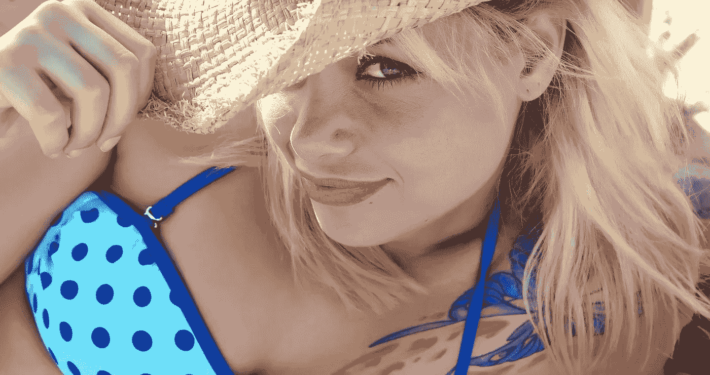

在本文中，我将向您展示一种简单的方法来推理图像分类神经网络模型所做的预测。我已经为您提供了代码来重新创建我的发现，但是您不需要阅读代码来理解这篇文章(希望如此)。

你应该从这篇文章中得到的想法是，你想对神经模型“看到”什么或“它在看哪里”有一些了解，这样你就可以更有信心地相信它做出的预测。

## 基础知识

让我们回顾一下，在一个超高的水平上回顾一下基础知识。可以训练一个卷积神经网络模型，根据图像中的内容对图像进行分类，我们用准确度、精确度、召回率等指标来衡量这个图像分类器的性能。这些模型非常标准，你基本上可以下载一个预先训练好的神经网络模型(例如 [inception-V4](https://arxiv.org/abs/1602.07261) 、 [VGG19](https://www.kaggle.com/keras/vgg19/home) 、 [mobilenet](https://arxiv.org/abs/1704.04861) 等等)。如果您想要识别的类(事物)不在预训练模型识别的内容列表中，那么您通常可以通过使用预训练模型的大部分权重和连接来重新训练预训练神经网络模型以识别新内容。这叫做迁移学习。

所以，基本上，我们有一堆模型，它们接受图像，吐出标签。但是我为什么要相信这些模型呢？让我们来看看这些模型中的一个使用什么信息来进行预测。这种方法也可以用来测试许多其他模型，包括定制模型。

## 信任但核实

我们在[的真实世界 AI 问题](https://www.theverge.com/2019/1/28/18194816/ai-artificial-intelligence-issue)中很好地提到了 [The Verge](http://theverge.com) 谈论这些图像分类系统如何可能出错，如果你不考虑它们正在做的事情的细节([全文在此](https://www.theverge.com/2019/1/30/18202474/tumblr-porn-ai-nudity-artificial-intelligence-machine-learning))。

神经网络可以学习从训练数据的错误部分进行预测。这是我们试图通过验证模型预测的基础来消除的问题。如果您想要建立一个分类器模型来区分[狼和狗](https://hackernoon.com/dogs-wolves-data-science-and-why-machines-must-learn-like-humans-do-41c43bc7f982)，您想要通过查看背景中的雪(狼)和玩具(狗)来确保该模型没有作弊。我们想知道哪些像素参与了预测。我们不希望雪中的狗被视为狼。**把这种方法想象成人工智能(AI)** 的测试 - **驱动开发** ( **TDD** ) **。我们首先定义一个测试(来自某个显而易见的类的一些图片)，然后对照这个图片检查模型，看看模型是否使用我们认为相关的信息做了我们想要它做的事情。然而，我们并没有写测试用例，而是用我们的眼睛来观察这个测试用例，看看发生了什么。**

我的文章的最初版本使用了一张[黛米·罗斯](https://www.instagram.com/demirosemawby/?hl=en)的图片，因为为什么不呢...但新版本使用了库存照片比基尼模型，因为版权和合理使用法正在粉碎创意世界。好的。发泄完了，又回到文章:**我们就用**[**deep shap**](https://github.com/slundberg/shap)**来看看**[**-16**](https://www.researchgate.net/figure/A-schematic-of-the-VGG-16-Deep-Convolutional-Neural-Network-DCNN-architecture-trained_fig2_319952138)**(其中使用了** [**imagenet 类标签**](https://gist.github.com/yrevar/942d3a0ac09ec9e5eb3a) **)如何解读一张图片。**

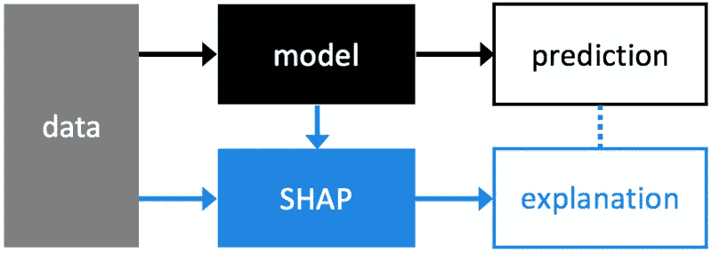

Shap builds an explanation for the model prediction using information about the dataset, and the activations in the model itself (source: [the shap github repo](https://github.com/slundberg/shap))

## 真实的例子

以下是本文代码的链接，您可以直接将其放入 Google Collab:

 [## dcshapiro/funWithShap

### 检查 deepSHAP 如何在 VGG-16 上工作(探索预言的原因)- dcshapiro/funWithShap

github.com](https://github.com/dcshapiro/funWithShap/) 

代码的第一部分安装 deepSHAP 并运行其中一个示例的一部分，以显示该库工作正常。接下来，我们查看输入图像的形状(224，224，3 ),并看到 VGG-16 模型接受高度和宽度为 224 的正方形图像，具有 3 个颜色通道(红色、绿色和蓝色)。

我们现在抓取比基尼模特的图像，并将其裁剪为 224×224×3 的正确尺寸。

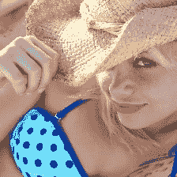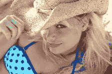

The image on the left was cropped to the right shape/size, using the image on the right as a starting point.

既然 cv2 决定为恶，对颜色通道使用 [BGR 编码](http://answers.opencv.org/question/188664/colour-conversion-from-bgr-to-rgb-in-cv2-is-slower-than-on-python/)，那么就有一个将 RGB 颜色数据切换为 BGR 颜色数据的编码步骤。

既然预处理已经完成，让我们开始工作吧。模型在这张图片中看到了哪些类(类别)？哪些像素有助于或有损于这些分类意见？

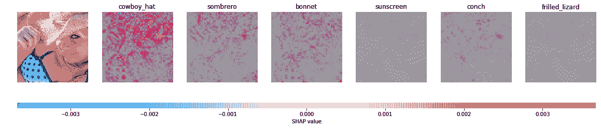

From left to right: The input image, the strongest prediction (cowboy_hat), followed by the second strongest prediction (sombrero), and so on. The scale on the bottom of the image shows relative positive or negative strength (the SHAP value). In each prediction image, the contribution of each pixel to the prediction is shown.

显然，在预测“cowboy_hat”时查看上面的图像，牛仔帽使用帽子中的像素来做出决定。那很好。它还使用了泳衣的几个像素，但让我们更深入地挖掘一下。为什么不用白色、黑色或随机噪声遮挡图像的一部分，看看这如何改变预测。

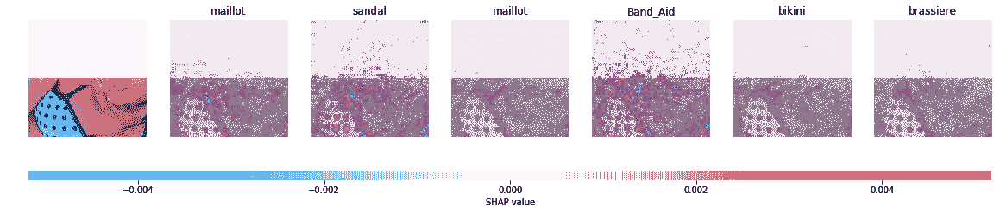

Prediction explanation when the top half of the image is whited out.

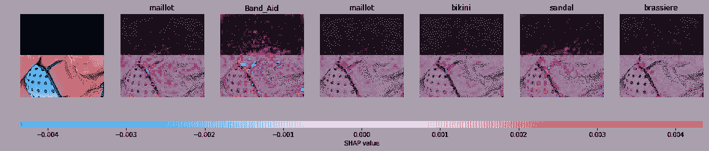

Prediction explanation the when top half of the image is blacked out.

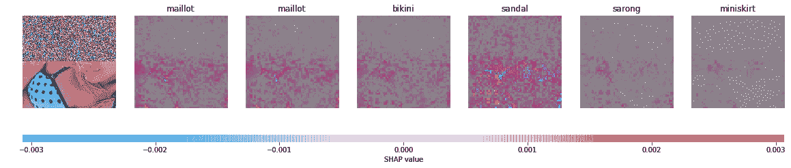

Prediction explanation when the top half of the image is filled with random noise pixel values.

我们来思考一下上面的结果。首先，很高兴看到顶级预测(模型看到的)对我们使用的屏蔽类型(白色、黑色或噪声)不敏感。这表明模型关心真实的数据。此外，无关掩蔽区域对决策的贡献非常小，只有少数例外(创可贴和凉鞋)。此外，根据我们对人类的期望，预测的类 maillot 是正确的。“maillot”是个有趣的词。我得去查一下。它的发音更像“my-yo”而不是“mail-lot”，根据谷歌的说法，它是“一件女式泳衣”很高兴知道。比基尼在这里也很有意义。其余的类都与图像相关，这也是一个好现象。注意凉鞋也在里面。我猜沙滩装会让模特想起穿凉鞋的照片。或者胸罩上的斑点图案看起来像凉鞋？也许纱笼和超短裙经常伴随着皮肤，我们看到触发那些标签的像素是女孩脸上的皮肤和胸罩肩带附近的肩部区域。

好吧！所以我们到了图像的上半部分。让我们做同样的掩蔽工作，看看会发生什么:

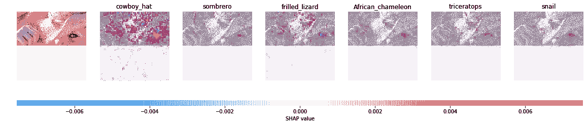

Prediction explanation when the bottom half of the image is whited out.

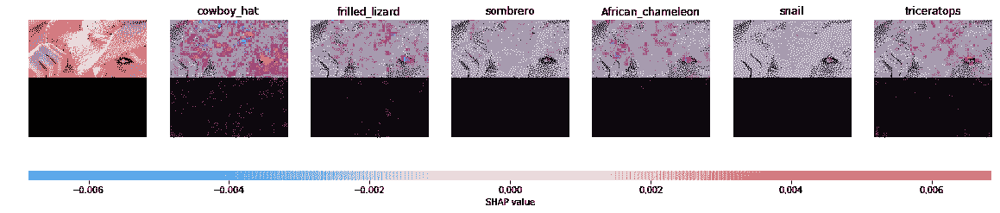

Prediction explanation when the bottom half of the image is blacked out.

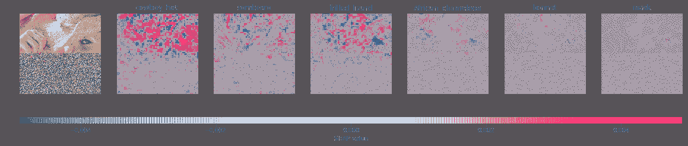

Prediction explanation when the bottom half of the image is filled with random noise pixel values.

我们看到顶级预测类 cowboy_hat 是有道理的。图像中有一顶帽子，脸部(尤其是眼睛)的像素大概有助于网络知道帽子在一个头上。

## 结论

在本文中，您了解了一种简单的方法来推理图像分类神经网络模型所做的预测。这只是神奇的形状库的一个应用。我们研究了输入图像中的哪些像素有助于神经网络模型进行预测。我们看到，图像的掩蔽(分块)部分会改变预测，但模型的顶部预测不会根据掩蔽的类型而改变。重要的是，我们观察到各种预测中涉及的像素位置是有意义的。欢迎您使用这种方法来验证和询问您自己的神经网络模型。

如果你喜欢这篇文章，那么看看我过去最常读的一些文章，比如“[如何给一个人工智能项目定价](https://medium.com/towards-data-science/how-to-price-an-ai-project-f7270cb630a4)”和“[如何聘请人工智能顾问](https://medium.com/towards-data-science/why-hire-an-ai-consultant-50e155e17b39)”嘿，[加入我们的时事通讯](http://eepurl.com/gdKMVv)！

下次见！

——丹尼尔
[Lemay.ai](https://lemay.ai)
[丹尼尔@lemay.ai](mailto:daniel@lemay.ai)