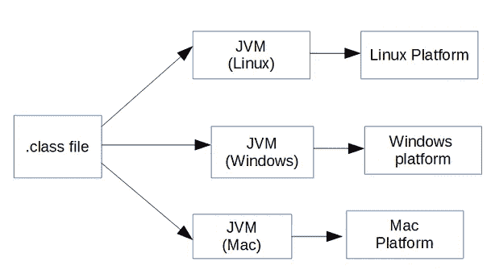
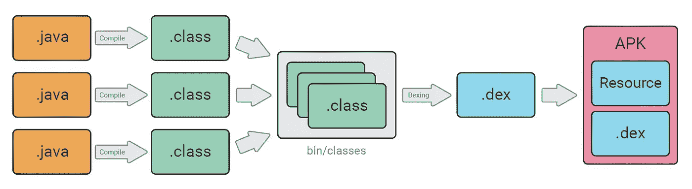
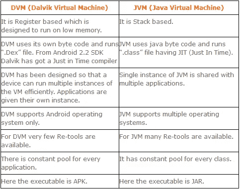

# JVM 与 DVM

> 原文：<https://towardsdatascience.com/jvm-vs-dvm-b257229d18a2?source=collection_archive---------16----------------------->

## 在本文中，我们将看到 Java 虚拟机和 Dalvik 虚拟机之间的区别

Photo by [patricia serna](https://unsplash.com/@sernarial?utm_source=unsplash&utm_medium=referral&utm_content=creditCopyText) on [Unsplash](https://unsplash.com/s/photos/inch-tape?utm_source=unsplash&utm_medium=referral&utm_content=creditCopyText)

七年前，当我学习 Java 编程时，我曾经向我自己和朋友询问过许多关于这种奇妙语言的问题，但是有一个问题在我没有找到满意答案之前，大部分时间都是突然出现的。问题是为什么 java 字节码可以在任何机器或平台上运行，它与其他代码有什么不同？。这个问题的答案在当时对我来说并不容易，因为我刚刚起步。

因此，在本指南中，我将回答以下问题

*   JVM 与 DVM
*   Android OS 为什么用 DVM 而不是 JVM？

# Java 虚拟机

一个 **Java 虚拟机** ( **JVM** )是 Java 程序和运行 Java 代码的平台之间的抽象层。JVM 是平台相关的，不同的实现可用于特定的平台。

例如，如果您有一个`Hello.java`类，当您运行这个类文件时，javac 编译器会将您的源代码转换为`bytecode`并创建`Hello.class`文件，这意味着`javac`编译器不会像其他编译器那样将 Java 代码直接转换为机器码。字节码是中间代码，这意味着人类不能理解这种代码，并且这种代码不依赖于机器/平台。因为字节码是一种中间代码，所以你可以把它交给任何人在任何平台上运行，这就是为什么我们称 Java 应用程序为 WORA(编写一次，在任何地方运行)。

Image credit to [netjs](https://netjs.blogspot.com/2015/05/what-are-jvm-jre-and-jdk-in-java.html)

从上图可以看出，一旦你有了。类文件准备好了，你就可以把这个文件给任何平台，它会把它转换成本机代码。

# 达尔维克虚拟机

**Dalvik 虚拟机(DVM)** 是执行 android 应用程序的虚拟机。因为手机的一切都非常有限，无论是电池寿命、处理能力还是内存等等。它已经过优化，可以适应低功率设备。

Image Credit to [Tam H. Doan](https://medium.com/u/671f3a7f82?source=post_page-----b257229d18a2--------------------------------)

从上图中可以看出，除了最后两步，一切都和 JVM 一样。Dex 编译器将类文件转换成。在 Dalvik 虚拟机上运行的 dex 文件。多个类文件被转换成一个 dex 文件。

# JVM 与 DVM

在 android 中使用 DVM 的主要原因之一是因为它遵循基于寄存器的模型，并且比基于堆栈的模型快得多，而 JVM 遵循基于堆栈的模型，后者占用大量内存并且比 DVM 慢。

有一些主要的区别，让我们来看看

Credit to [aatul.me](https://aatul.me/2013/04/17/dvm-vs-jvm/)

# Android OS 为什么用 DVM 而不是 JVM？

Google 不选择 JVM 而选择 DVM 有几个原因，所以让我们一个一个地理解它们。

*   尽管 JVM 是免费的，但它是在 GPL 许可下的，这对 Android 是不利的，因为大多数 Android 是在 Apache 许可下的。
*   JVM 是为桌面设计的，对于嵌入式设备来说太重了。
*   与 JVM 相比，DVM 占用的内存更少，运行和加载速度更快。

——**俄亥俄州立大学**

# 结论

JVM 将基于字节码工作，DVM 将基于优化的字节码工作，它针对移动平台进行了优化，因为移动设备具有更少的内存、低进程和低功耗，这就是它使用 linux 内核的原因。

我希望你喜欢读这篇文章，你也可以访问我的 [**网站**](http://thehimanshuverma.com/) ，在那里我会定期发布文章。

[**订阅**](https://mailchi.mp/b08da935e5d9/himanshuverma) 我的邮件列表，以便在您的收件箱中直接获得我的文章，并且不要忘记关注我自己在 Medium 上发表的文章[**The Code Monster**](https://medium.com/the-code-monster)来完善您的技术知识。

# 了解你的作者

希曼舒·维尔马毕业于印度勒克瑙的 APJ 阿卜杜勒·卡拉姆大学博士。他是 Android & IOS 开发人员、机器学习和数据科学学习者、金融顾问和博客作者。