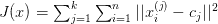

# K-means:完全介绍

> 原文：<https://towardsdatascience.com/k-means-a-complete-introduction-1702af9cd8c?source=collection_archive---------10----------------------->

K-means 是一种无监督聚类算法，旨在将未标记的数据划分为特定数量(即“*K”*)的不同分组。换句话说，k-means 找到共享重要特征的观察值，并将它们一起分类到聚类中。一个好的聚类解决方案是找到这样的聚类，使得每个聚类内的观察值比聚类本身更相似。

这种自动数据分组非常有用的例子数不胜数。例如，考虑为投放市场的一系列全新产品创建在线广告活动的情况。虽然我们可以向所有人展示单一的通用广告，但更好的方法是将所有人分成具有共同特征和兴趣的人群，向每个人群展示定制的广告。K-means 是一种算法，它在大数据集中找到这些分组，而手动完成这些分组是不可行的。

算法背后的直觉实际上非常简单。首先，我们为 *k* (集群的数量)选择一个值，并为每个集群随机选择一个初始的*质心*(中心坐标)。然后，我们采用两步流程:

1.  分配步骤-将每个观察值分配到其最近的中心。
2.  更新步骤-将质心更新为其各自观察的中心。

我们一遍又一遍地重复这两个步骤，直到集群中没有进一步的变化。此时，算法已经收敛，我们可以检索我们的最终聚类。

The K-means algorithm in action

# 进一步的细节

在继续下一步之前，值得后退一步来明确我们所说的*好的*集群解决方案的含义。我们到底将什么定义为可能的最佳集群解决方案？考虑以下对同一个质心的两种可能的观测分配的可视化。

Which data points should be assigned to this centroid?

很明显，第一个赋值优于第二个，但是对于 k-means 算法，我们如何量化这一点呢？解决方法是考虑连接每个观察到的潜在中心的红色虚线。如果我们比较好的赋值和坏的赋值的这些行的平均长度，很明显前者会产生一个小得多的值。这是我们的目标！在我们可能选择的无限多个可能的聚类中心中，我们正在寻找使这些线的总和最小化的一个，或者更正式地说是*误差平方和(SSE)* 。用数学术语来说，对于 xᵢ ∈ {x₁，x₂，…，xm 的一组观察值，我们希望找到质心 *C* 以最小化:

其中，由于我们已将质心定义为其各自观测值的中心，我们可以计算:

这个等式给出了单个质心 *C* 的误差平方和，但实际上我们希望最小化所有质心*cⱼ∈{c₁，c₂，…，ck}对所有*观测值 xᵢ ∈ {x₁，x₂，…，xn}的误差平方和。因此，k 均值的目标是最小化*误差平方和(SST)* 目标函数:**

虽然随着数据的增长，检查每个可能的聚类解决方案变得不可行(NP-hard)，但 k-means 在许多实际应用中倾向于找到足够好的解决方案。

到目前为止我们忽略的一个问题是选择集群的数量。偶尔我们会从一开始就知道 k，也许我们的在线广告活动已经预算了正好五个独特的广告，需要正好五个聚类，但是更多的时候我们不知道数据集中聚类的最佳数量。选择 k 没有完美的解决方案，但是一种流行的启发式方法被称为肘法。这包括对一系列的 *k* 值应用 k 均值，并在所谓的*样板图*中绘制出相对于 SST 的 *k* 的选择。然而，请注意，随着我们增加聚类的数量，SST 将总是下降(考虑当我们设置聚类的数量等于观测的数量时 SST 会发生什么)，因此我们正在寻找添加更多聚类不再提供 SST 的*显著*下降的点。换句话说，我们希望在碎石图中找到一个拐点，在此拐点之后，增加 *k* 不再能改善我们的整体解决方案。

Finding “the *elbow”* where adding more clusters no longer improves our solution

k-means 的最后一个关键方面回到了这个概念*收敛*。我们之前提到过，k-means 算法不一定会收敛到*全局最小值*，而是可能会收敛到*局部最小值*(即 k-means 不能保证找到*最佳*解)。事实上，根据我们为初始质心选择的值，我们可能会得到不同的结果。

由于我们只对给定选择的 *k，*的最佳聚类解决方案感兴趣，因此该问题的常见解决方案是多次运行 k-means，每次使用不同的随机初始质心，并且只使用最佳解决方案。换句话说，总是运行 k-means 多次，以确保我们找到接近全局最小值的解决方案。

# 进一步的考虑

到目前为止，我们已经讨论了 k-means 聚类方法的具体细节，本节将介绍对原始算法的一些扩展。

K-均值算法的一个问题是它对异常值的敏感性。由于质心是作为聚类中观察值的平均值来计算的，因此数据集中的极值会严重破坏聚类解决方案。K-medoids 是克服这个问题的流行方法。顾名思义，这种替代算法使用*球心*而不是质心作为聚类的中心点，这仅仅意味着聚类的中心必须是该聚类中的一个观测值。

In this case, the medoid is a more representative centre than the centroid

这可以比作取一组数字的中间值而不是平均值，同样的，中间值对极值不太敏感。使用 medoid 需要调整常规 k-means 算法的更新步骤。更新阶段现在变成了一个*交换阶段*，在这个阶段，我们贪婪地考虑将当前的 medoid 与集群中的其他观测值进行交换，并检查这种交换是否会改进整个集群解决方案。

**分类数据** —我们应该承认的 k-means 算法的一个局限性是它要求数据是数值型的。性别等分类变量对 k-means 没有意义。一群男女的意思是什么？我们还能对部分甚至完全分类的数据进行聚类吗？

完全分类数据的解决方案被称为 *k-modes。*这种方法非常类似于 k-means，但是以一个聚类的*模式*为中心，然后使用一种新的度量来计算每个观察值与其聚类中心之间的距离。该距离度量比较观察值 *X* 和聚类模式 *Z* 之间每个属性的相异度，并对这些值求和。与几乎与 *Z* 相同的观测值相比，与 *Z* 具有许多不同属性的观测值将采用更高的相异度值。具体来说，对于观察值 *X* 和质心 *Z* 的属性，相异度计算如下:

相异度通过频率进行加权，该频率试图说明属性内值分布的不平衡，因此 *n* 是聚类中的观察总数，而 *n* ⁽ʳ⁾是聚类中采用相关值 *n* 的观察总数。K-modes 然后以与 k-means 相同的方式使用这种相异度作为距离的度量来分配和更新聚类。

最后，对于分类数据和数值数据的混合数据，我们可以应用 k 原型算法，它本质上是 k 均值和 k 模式的混合。我们的聚类中心现在被称为*原型*，正如我们在这一点上可能猜到的，简单地对数字属性应用 k-means 距离度量，对分类属性应用 k-modes 相异度度量，将两者结合起来作为相异度的总体度量。有了这个设置，我们可以再次应用相同的旧的分配-更新方法。

**聚类验证**—k-means 等无监督方法的一个缺点是，没有明显的方法来评估我们得到的解决方案。我们得到的解是否充分地抓住了集群结构？数据中是否存在任何聚类？当然，有时我们可以绘制数据并观察结果，但这仅在二维中有效，而且聚类通常只会在更高维中变得有趣(如果我们已经可以看到数据中的聚类，为什么还要麻烦 k-means)。

一种流行的方法是检查集群解决方案的稳定性。这种方法背后的基本原理是，如果数据中真的存在聚类，那么当我们比较来自该数据的多个样本时，它们应该表现出相似的聚类解决方案。在下面的例子中，我们采用了两个数据集，一个显然包含三个聚类，另一个只是均匀随机放置的观察值。我们从每个样本中抽取若干 *bootstrap 样本*(替换样本)，并对每个样本应用 k-means。在结构化数据中，k-means 反复找到相似的解决方案，然而在非结构化数据中，聚类更加不一致。这种稳定性差异可以通过比较聚类平均值的位置或使用更多的技术统计数据(如连续样本的平均轮廓宽度)来更严格地量化。

**模糊 C-means**—K-means 的另一个我们尚未解决的限制可以归因于*硬聚类*和*软聚类之间的差异。* K-means 是一种*硬聚类*方法，这意味着每个观察值都被划分到一个单独的聚类中，而没有关于我们在该任务中有多自信的信息。实际上，如果观测值大约在两个质心的中间，将这种不确定性编码到输出中会很有用。*软聚类*通过给我们一个观察值属于每个质心而不是一个分类的概率估计，解决了这个问题。当然，我们仍然可以将每个观察值分配给提供最高值的质心，但现在我们有了一个对该决策的置信度估计，允许我们区分正好在某个簇质心旁边的观察值和那些更模糊的观察值。模糊 C 均值采用这种*软聚类*方法。

那么模糊 C-means 和原来的 K-means 算法有什么不同呢？幸运的是，这种调整根本没有改变我们的方法，相反，它只是包括了所谓的*模糊化器*项*w*t16】ᵢⱼᵐ(用 *m* 简单地说就是一个超参数)来包含我们在集群 *j* 中的成员确定性 *X* ᵢ的权重。这意味着我们希望最小化的模糊 C 均值目标函数由下式给出:

在哪里

并且应用这些新的等式，我们重复在原始 K-means 中采用的完全相同的分配和更新方法。

**R 实施**

做得好，一路走到了最后，[在 twitter 上关注我](https://twitter.com/Jeffaresalan)以了解未来的帖子。所有的观想都是我自己的。