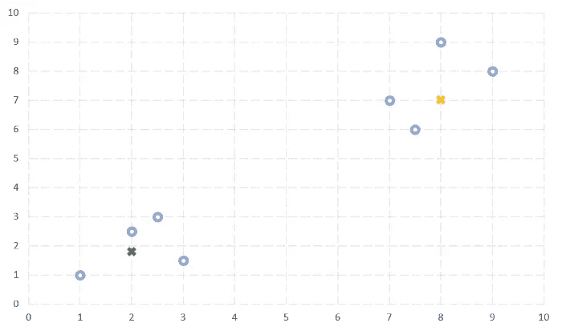
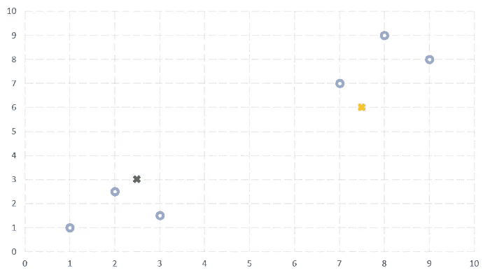
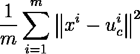
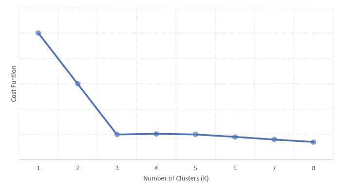
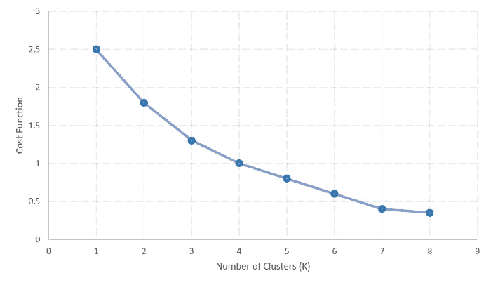

# k 均值聚类

> 原文：<https://towardsdatascience.com/k-means-clustering-13430ff3461d?source=collection_archive---------11----------------------->

## 更简单直观的解释。

K-means 是最简单的无监督学习算法之一。该算法遵循一种简单易行的方法，将给定的数据集分组为一定数量的相关子集，称为**簇**。这个想法是找到 **K** 个中心，称为**簇质心** *，*一个对应一个**簇**，因此得名 K-均值聚类*。*当看到一个新示例时，该算法根据距离度量(如欧几里德距离)报告该示例所属的最接近的聚类。

The dataset used for illustration. The dataset consists of 8 points — those 8 points are plotted as blue circles in the graph below.



The diagram is a typical illustration of clustering, with **K=2 clusters** and their **cluster centroids** shown evidently with a green and a yellow cross respectively. The circles correspond to the dataset and the crosses correspond to the cluster centroids.

为了更好地理解，让我们考虑一个例子——假设一个社交网站想要找到具有相似兴趣的人群，并向他们投放相关广告。解决这个问题的一种方法是通过聚类，该公司可以使用喜欢的页面、分享的帖子和登记的位置等特征来建立数据集，并通过聚类算法来运行它，以识别相关的群体。不过需要注意的一点是，数据集是未标记的。

```
A note on the notation. x_{i} means x subscript i, x_{^th} means x superscript th and x_{^th}{i} means x superscript th and subscript i.
```

# 算法

K 均值聚类算法从初始化步骤开始，称为**随机初始化**步骤。该步骤的目标是为每个 K-聚类随机选择一个质心， *u_{i} i* ∈ {1，2，3…K}。



For the sake of simplicity only 8 data points have been considered. Out of these 8 points two points, drawn as a cross have been randomly chosen as cluster centroids illustrating **random initialisation step**.

然后使用迭代算法将这 K 个质心收敛到最优值。迭代的每一步都执行以下两步—

*   集群分配
*   移动质心

**聚类分配**步骤遍历数据集中的每个示例 *x_{^i}* ，并基于距离度量(比如欧几里德距离)将其分配给其最近的聚类质心。对于下面讨论的例子，可以说——给定一个例子，聚类分配步骤根据该例子离聚类质心的距离将其分配给一种颜色，绿色或黄色。

Cluster Assignment Step

**移动质心**步骤通过取分配给相同聚类质心的样本的平均值来计算新的聚类质心。或者，用黄色和绿色着色的所有点的平均值给出聚类质心的新值。为了清楚起见，这是负责随机初始化的群集质心收敛到最佳值的步骤。

Move Centroid Step.

该算法一直持续到收敛，也就是说，直到两次后续迭代没有给出几乎相同的聚类质心值。

# 改进随机初始化

如前所述，该算法从随机初始化步骤开始，但随机初始化可能会导致算法陷入局部最优。

一种提高我们以更好的聚类质心值结束的几率的方法是多次执行随机初始化步骤，并选择一组值，该组值导致由下式给出的**失真成本函数**的最小值—



||a-b|| implies the Euclidean distance between vectors **a** and **b**. Interpret u_{^i}{c} as — cluster centroid of the cluster, to which example x_{^i} has been assigned. Concretely, u_{^ 3}{2} means, the third example is closest to the 2nd cluster centroid.

上面的成本函数正在计算每个训练示例 *x_{^i}* 和它被分配到的集群 *u_{^i}{c}.之间的平方距离的平均值*平方是为了完全避免欧几里德距离引起的平方根。显然，较小的成本函数值对应于较好的初始化。

这种技术对于 K≤10 的值有效，但是已经观察到，对于较大的 K 值，它不会产生显著的差异。对于较大的 K 值，K-means 算法将几乎收敛到可接受的聚类质心值。此外，这种优化随机初始化步骤的方法计算量很大。

# 选择 K 的值

到目前为止，您一定已经对 K-means 聚类算法有了直观的了解，但还有一个方面需要处理，即参数 K。让我们看看如何知道数据集需要划分的聚类数。

**肘形法**可用于寻找 K 的最佳值。该方法根据失真成本函数值绘制聚类数，并在图形向外弯曲或急转弯处选择 K 值。



Elbow method : The optimal value of K is 3 from the above graph as graph elbows out at 3.

但实际上这种方法用得不多，因为当绘制真实世界的数据时，图形通常没有一个显著的拐点来选择 k 值。



Elbow method : Real world plot where it is hard to point out any elbow.

不幸的是，没有自动选取 K 值的方法。大多数情况下，参数 K 的值是通过查看可视化来手动选取的。