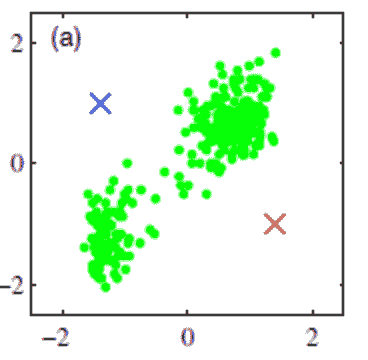
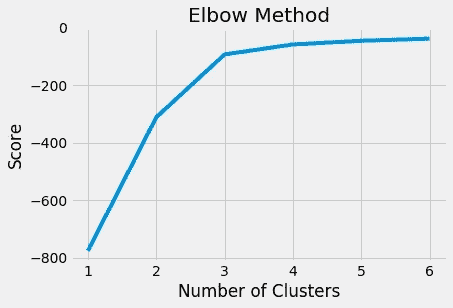
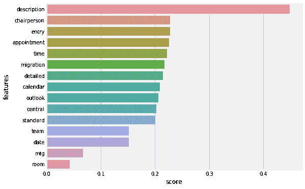
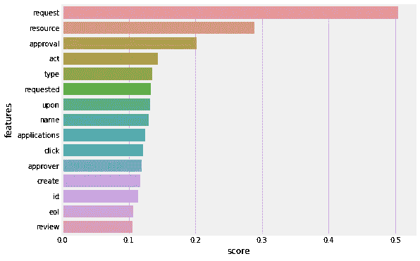

# k 均值聚类

> 原文：<https://towardsdatascience.com/k-means-clustering-8e1e64c1561c?source=collection_archive---------2----------------------->


Source: Pixabay

## 使用无监督学习理解文本数据

***、客户细分、文档分类、房价估算、欺诈检测*** 。这些只是集群的一些实际应用。这种算法还有许多其他的使用案例，但是今天我们将把 K-means 应用于文本数据。特别是，我们将从头开始实现该算法，并将其应用于安然电子邮件数据集，并展示这种技术如何成为总结大量文本并揭示有用见解的非常有用的方法，否则这些见解可能是不可行的。

那么 K-means 到底是什么？嗯，它是一种无监督的学习算法(意味着没有目标标签)，允许您在数据中识别相似的数据点组或聚类。为了了解它为什么有用，想象一下上面提到的一个用例，客户细分。使用这种算法的公司可以根据客户的特点将他们分成不同的组。这可能是一种非常有用的方式，可以进行有针对性的广告或提供个性化折扣或促销等可能推动收入增长的东西。对于我们的用例，它可以帮助我们快速洞察和解释文本数据。当我们有大量的数据时，这是非常有用的，并且对于某些人来说手动浏览它是不实际的。

作为一名经济学家，我能够用这种方法来分析一次公众咨询，其中很多回答都是定性的。利用我的机器学习知识，我能够创建有用的见解并对数据有所了解，同时为我的同事避免了相当多的手动工作，这很好。

## 更正式地说

同样，K 均值的问题可以被认为是将数据分组为 K 个聚类，其中对聚类的分配是基于到质心的某种相似性或距离度量(稍后将详细介绍)。那么我们如何做到这一点呢？好吧，让我们首先概述一下所涉及的步骤。

1.  ***我们随机初始化 K 个起始质心。每个数据点被分配到其最近的质心。***
2.  ***质心被重新计算为分配给相应聚类的数据点的平均值。***
3.  ***重复步骤 1 和 2，直到我们触发停止标准。***

现在你可能想知道我们在优化什么，答案通常是欧几里得距离或者欧几里得距离的平方更精确。数据点被分配给最接近它们的聚类，或者换句话说，最小化该平方距离的聚类。我们可以更正式地把它写成:


K means Cost Function

***J*** 就是每个数据点到它所分配的聚类的平方距离之和。其中 ***r*** 是指示函数，如果数据点(x_n)被分配给聚类(k ),则等于 1，否则等于 0。这是一个非常简单的算法，对吗？如果还不完全清楚，不要担心。一旦我们将它可视化并编码，它应该更容易理解。

## k 表示可视化

我一直热衷于使用视觉辅助工具来解释主题，这通常有助于我对各种算法实际发生的事情有更深的直觉。所以让我们看看每次迭代后 K 的意思是什么。



K mean Algorithm, Source: Bishop

正如你所看到的，上图显示了 K 值的作用。我们已经定义了 k = 2，所以我们在每次迭代时将数据分配给两个集群中的一个。图(a)对应于随机初始化质心。在(b)中，我们将数据点分配给它们最近的聚类，在图 c 中，我们分配新的质心作为每个聚类中数据的平均值。这一直持续到我们达到停止标准(最小化我们的成本函数 J 或预定义的迭代次数)。希望上面的解释和可视化能让你很好的理解 K 的意思。接下来，我们将在 ***Python 中实现这个算法。***

## 数据集和代码

正如我之前提到的，我们将使用文本数据，特别是，我们将查看在 [Kaggle](https://www.kaggle.com/wcukierski/enron-email-dataset) 上提供的安然电子邮件数据集。对于那些不知道围绕安然的故事/丑闻的人，我建议看看房间里最聪明的人。这是一部关于这个主题的特别好的纪录片。

## 只有一个问题

我们能不能只给我们的算法一堆文本数据，然后期待任何事情发生？很遗憾，不行。算法很难理解文本数据，所以我们需要将数据转换成模型可以理解的东西。计算机非常擅长理解数字，所以我们试试看怎么样。如果我们将每封电子邮件中的文本表示为一个数字向量，那么我们的算法将能够理解这一点并据此进行处理。我们要做的是使用**术语频率-逆文档频率或 TF-IDF 将每封电子邮件正文中的文本转换为数字向量。**我不会太详细地解释这是什么，因为我在之前的[帖子](/building-an-etl-pipeline-in-python-f96845089635)中已经解释过，但本质上它使我们能够计算每封电子邮件中的单词相对于该电子邮件中的内容以及相对于数据集中所有电子邮件的重要性。更多关于 TF-IDF 的信息请点击[这里](https://en.wikipedia.org/wiki/Tf%E2%80%93idf)。

好了，我们需要做的第一件事是导入所需的库和数据集。我应该提到，我试图在 Kaggle 内核中使用完整的数据集，这是一个挑战。我遇到了一些内核故障，所以我最终使用了大约 70%的完整数据集，运行时没有任何问题。请注意，我没有把代码的数据清理部分放在帖子里，因为我们关注的是 K 均值算法。对于那些感兴趣的人来说，完整的代码可以在我的 Kaggle 内核上找到，链接在文章的最后。像往常一样，我们导入将要使用的库，并读入数据集。

在我们做了一点文本清理之后，例如转换成小写，删除无用的单词和 HTML，我们可以继续使用 TF-IDF，这在 sklearn 中非常简单。

运行这段代码后，我们可以使用下面的 get_feature_names()方法先睹为快。

```
pd.DataFrame(tf_idf_array, columns=tf_idf_vectorizor.get_feature_names()).head()
```

现在我们需要考虑我们的 K 意味着类将会是什么样子。嗯，我们需要实现一些方法，这些方法对应于我上面概述的步骤。我们将实现以下 5 个方法，这将有助于我们把算法分成可管理的部分。

*   ***初始化 _ 质心***
*   ***assign _ clusters***
*   ***更新 _ 质心***
*   ***fit_kmeans***
*   ***预测***

上面的代码定义了我们的 Kmeans 类，init 和 initialise _ centroids 方法。我们希望我们的类接受一些参数，比如聚类的数量、迭代的次数以及我们需要的可重复性的种子。设置种子是一个重要的步骤，因为我们在算法开始时随机初始化我们的质心。如果我们没有设置种子，那么每次运行算法时，我们可能会收敛到不同的聚类集。初始化 _ 质心方法简单地选择 k 个随机数据点，并将它们设置为初始聚类中心，以开始算法。

我们现在需要编写将数据点分配给特定聚类的方法，并更新聚类中心。请记住，我们根据到中心聚类的欧几里德距离将数据分配给聚类。我们使用 sklearn 的**成对距离**方法，该方法简化了我们的计算，并返回到每个聚类中心的距离。argmin 函数确定到每个聚类的距离最小的索引，从而允许我们为该索引分配正确的聚类标签。现在，为了完成算法的一次迭代，我们只需要将质心更新为分配给特定聚类的所有数据点的平均值。

接下来的两个方法也很重要。**预测**方法基本上基于我们的算法为每个数据点返回相应的预测聚类标签。下面代码片段中的最后一个方法通过调用我们之前定义的函数来适应我们的模型。好了，这就是我们的 k-means 类。现在，我们只需在运行我们的算法时，计算出要选择的最佳聚类数。

## 最佳聚类数

当使用 K-means 时，我们需要做的事情之一是确保我们选择了最佳的聚类数。太少，我们可能会把有显著差异的数据分组在一起。太多的聚类，我们将只是过度拟合数据，我们的结果将不会概括得很好。为了回答这个问题，我们将使用 ***肘法*** ，这是这项任务中常用的技术。它包括使用不同数量的聚类来估计模型，并使用 sklearn 的评分方法来计算每个所选数量的聚类的 ***组内平方和*** 的负值。请注意，这只是我们上面的目标函数的负值。我们选择这样一个数字，在这个数字上增加更多的聚类只会略微增加分数。绘制的结果看起来明显像一个肘部(或者在这种情况下是颠倒的肘部)。群集数量的最佳选择是肘部形成的位置，在我们的示例中为 3，我们可以从下图中看到这一点。(我们也可能用 4 个集群进行实验，但对于此实施，我们将使用 3 个集群)



Optimal Number of Clusters

## 我的实现

在这篇文章的这一部分，我们将实现刚刚用 Python 编写的算法。为了以图形方式查看我们的聚类，我们将使用 ***PCA*** 来降低我们的特征矩阵的维度，以便我们可以以二维方式绘制它。也就是说，我们选择两个组件，并使用 PCA 类的 fit_transform()方法转换我们的 tf_idf_array。然后我们创建一个 Kmeans 类的实例，根据上面的分析选择 3 个集群。现在只需要调用 fit_kmeans()和 predict()方法将我们的数据点放入集群中。因为我们已经将阵列投影到一个 2-d 空间中，所以我们可以很容易地使用散点图来显示它和聚类中心。

我们可以在这里看到三个非常不同的集群，紫色集群的分离度特别大，这表明电子邮件的内容有很大的不同。但是，大部分数据都包含在绿色集群中。


Figure 2: My Implementation Clustering Results

## SK-Learn 实现

作为一种感觉检查，我们将使用 sklearn 重新进行这个估计。在现实世界中，我非常怀疑你会从零开始实现它，因为它并不是真正需要的。然而，这是一个非常有用的方法，可以具体地理解 k-means 是如何工作的，因此绝对值得亲自去做。我们可以看到，sklearn 使估计变得简单得多，如果我们绘制结果，两个图形看起来非常相似。这是令人放心的，并使我们自己的代码不太可能有错误。尽管星团的颜色因为某种原因发生了变化？？


Figure 3: sklearn Clustering Results

## 检查每个聚类中的顶部单词

在这一部分，我们将快速浏览一下我们得到的结果。我们主要感兴趣的是看每个词群中的词之间是否有任何共性或者任何突出的特定词。换句话说，我们能在每个集群中识别主题吗？如果我们可以，那么这是一种非常强大的方式来获得对电子邮件内容的总体感觉，并可以指导我们希望做的任何进一步分析，最好的部分是我们不必阅读 35，000 封电子邮件。我们可以使用下面的方法来查看每个聚类中的顶部单词，该方法仅识别每个聚类中具有最高平均 tf_idf 分数的特征。

下面是对应于每个聚类中前 15 个单词的三个图，按照 TF-IDF 测量的相对重要性排序。


Figure 3: Cluster 0



Figure 4: Cluster 1



Figure 5: Cluster 2

好吧，那么这些数字想告诉我们什么呢？这里有什么有趣的特色吗？总的来说， ***集群 0*** 似乎有不少可能相当重要的人的名字。我们可以立即开始查看来自莎莉、约翰和埃里克的电子邮件，看看是否有什么有趣的内容。 ***集群 1*** 似乎一般是关于具有主席、日历和时间等特征的会议。同样，这对于缩小我们想要进一步检查的电子邮件的范围非常有用。 ***Cluster 2*** 似乎有很多词语暗示这些电子邮件来自请求东西的人。虽然从表面上看，这并不立即有趣，但也值得进一步研究。下面是 Kmeans 类的完整 Python 代码。

## Kmeans 类的完整代码

## 一些需要记住的事情

现在应该很清楚，k-means 是一个简单而强大的算法，它对于分析中可能出现的许多不同类型的问题非常有用。也就是说，对于你的特定问题来说，它可能并不总是最好的选择，如果你要使用它，你需要知道算法的一些假设。大概 k-means 最大的假设和限制就是它假设 ***簇是球形的。*如果事实并非如此，那么 k-means 可能不是最佳解决方案。k-means 算法的另一个限制是数据点被 ***【硬分配】*** 到一个聚类。换句话说，数据点要么在集群中，要么不在集群中。当然，我们对某些数据点在一个集群中比其他数据点更有信心？如果我们能以某种方式将这种信心融入到我们的结果中，不是更好吗？**

幸运的是，我们可以使用另一种技术来解决这些问题。我们可以使用一种叫做 ***高斯混合建模或者***GMM 的算法。这样做的好处是，我们以软分配结束，即每个数据点以一定的概率属于每个聚类。除此之外，GMM 还对聚类的方差做出了限制性稍小的假设。缺点是这是一个更复杂的算法，但这是我想在另一篇文章中进一步讨论的。

好了，就这样了，伙计们，感谢阅读。希望这已经让你很好地理解了 K 均值以及如何在 Python 中完全实现它。我们可以在代码中实现一些额外的功能，如 ***智能初始化(k-means++)*** 或算法的更好的**收敛计算**，但我在这里没有做这些。你们试一下怎么样？如果你想了解良好的编码实践，我认为一个很好的起点是 sklearn 的 GitHub。已经实现了大量的算法，并且它们都经过了数据科学社区的尝试和测试，所以我鼓励人们看一看，并尝试自己实现其中的一些算法。这是一种很好的学习方式。

***链接到 Kaggle 内核:***[https://www . ka ggle . com/d foly 1/k-means-clustering-from-scratch](https://www.kaggle.com/dfoly1/k-means-clustering-from-scratch)

***来源:***[*Christopher m . Bishop 2006，模式识别与机器学习*](https://www.amazon.co.uk/gp/product/0387310738/ref=as_li_tl?ie=UTF8&camp=1634&creative=6738&creativeASIN=0387310738&linkCode=as2&tag=mediumdannyf1-21&linkId=9fde0d314e134f9c89a46f9264704c98)

***来源:*** [机器学习的贝叶斯方法](https://click.linksynergy.com/link?id=z2stMJEP3T4&offerid=759505.11503135374&type=2&murl=https%3A%2F%2Fwww.coursera.org%2Flearn%2Fbayesian-methods-in-machine-learning)

*注意:这篇文章中的一些链接是附属链接*