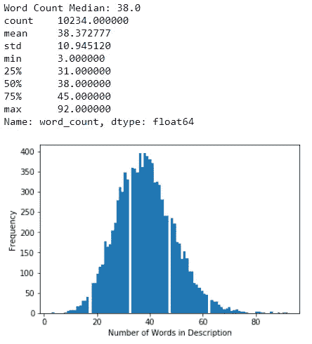
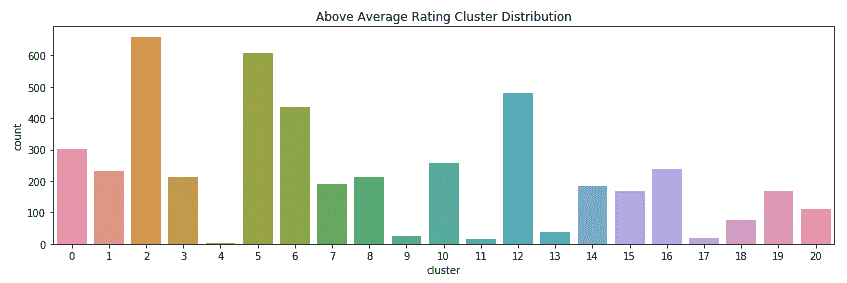

# K-Means 使用 Scikit-Learn & NLTK 对 Chardonnay 评论进行聚类

> 原文：<https://towardsdatascience.com/k-means-clustering-chardonnay-reviews-using-scikit-learn-nltk-9df3c59527f3?source=collection_archive---------17----------------------->


霞多丽是世界上最受欢迎的白葡萄酒。这种葡萄很容易种植，它以复杂和适应不同的技术和口味而闻名。例如，昨晚我尝了一种甜味的未发酵的夏敦埃酒。霞多丽到底有多受欢迎？正如 [2018 年加州葡萄种植面积报告](https://www.nass.usda.gov/Statistics_by_State/California/Publications/Specialty_and_Other_Releases/Grapes/Acreage/2019/201904grpacSUMMARY2018Crop.pdf)所述，在 176，092 英亩专用于白葡萄酒的总面积中，霞多丽消耗了一半以上，为 93，148 英亩！下一个最高的品种是法国科隆巴德，消耗 18246 英亩；相比之下微不足道。那是许多葡萄！


S 因为我熟悉 kaggle 上的[葡萄酒评论数据集，所以我决定加载一个笔记本来分析夏敦埃酒。](https://www.kaggle.com/zynicide/wine-reviews)

> 聚类能帮助我们确定描述和评级之间的关系吗？

在本文中，我将展示如何使用 [Scikit-Learn](https://scikit-learn.org/stable/) 和[自然语言工具包](https://www.nltk.org/)来处理、分析和聚类 Chardonnay 数据。通过使用这些技术，我希望能看到评分高于平均水平的葡萄酒评论和评分低于平均水平的葡萄酒评论在主题或话题上是否有所不同。

# 导入依赖项和数据

因为这篇文章结合了几种技术来分析 Chardonnay 评论，所以我们有相当多的东西要导入。此外，[我对数据集](/generating-wine-recommendations-using-the-universal-sentence-encoder-d086edd13d00)做了一些初步清理，删除了重复和空值，并将其存储在 SQLite 数据库中:

```
#import dependencies
import pandas as pd
import numpy as np
import matplotlib.pyplot as plt
import seaborn as sns
import refrom sklearn import preprocessing, decomposition, model_selection, metrics, pipeline
from sklearn.feature_extraction.text import TfidfVectorizer, CountVectorizer
from sklearn.cluster import KMeansimport nltk
from nltk.stem.wordnet import WordNetLemmatizer
from nltk.corpus import stopwordsimport sqlite3
from sqlite3 import Error#force output to display the full description
pd.set_option('display.max_colwidth', -1)#connect to database file
conn = sqlite3.connect('db\wine_data.sqlite')
c = conn.cursor()#create dataframe from sql query
df = pd.read_sql("Select country, description, rating, price, title, variety from wine_data where variety = 'Chardonnay'", conn)#display the top 3 rows
df.head(3)
```


# 特征工程和分析

从一开始，我就知道我想添加几个特性:首先，我将添加字数统计列来存储每个描述中的字数。其次，我将添加一个二进制字段来表示葡萄酒的评级是否高于平均水平。在我添加这些功能之前，我需要做一些分析来找到平均评级。

## 分析字数

分析字数可以帮助您决定是否要缩减数据集。例如，查看数据，我们看到一篇葡萄酒评论的最小字数是 3 个词。查看少于 15 个单词的评论，平均评分是 82 分，范围是 80-100 分。这告诉我，简短的评论可能与较低的评级有关。同样，当我观察分布的另一端时，我注意到较长的评论可能与较高的评级相关。

> 简短的评论可能与较低的评级相关联。更长的评论可能与更高的评级相关联。

```
#add a column for the word count
df['word_count'] = df['description'].apply(lambda x: len(str(x).split(" ")))print("Word Count Median: " + str(df['word_count'].median()))
print(df['word_count'].describe())x = df['word_count']
n_bins = 95plt.hist(x, bins=n_bins)
plt.xlabel('Number of Words in Description')
plt.ylabel('Frequency')
plt.show()
```



```
#word counts less than 15
wc15 = df.loc[df['word_count'] < 15]
print(wc15.rating.median())
print(wc15.rating.describe())#word counts greater than 70
wc70 = df.loc[df['word_count'] > 70]
print(wc70.rating.median())
print(wc70.rating.describe())#plot the counts
plt.figure(figsize=(14,4))
sns.countplot(x ='rating', data = wc70).set_title("Rating Counts")
```

数据可以可视化，帮助我们看到字数和评分之间的关系。


Rating Counts where Word_Count < 15


Rating Counts where Word_Count > 70

## 分析评级

因为我想看看描述是否可以用来区分葡萄酒是否高于平均评级，所以我必须找到平均评级。熊猫*描述*功能使统计数据的查找变得简单。看数据，我们得到的平均评分是 88。使用 list comprehension 很容易将二进制值列添加到数据框中。如果评分大于 88，我们的新列将为 1。如果等级为 88 或更低，值将为 0，因为葡萄酒并不比平均水平好。

> 如果评分大于 88，我们的新列将为 1。如果等级为 88 或更低，值将为 0，因为葡萄酒并不比平均水平好。

```
print("Number of Unique Ratings: " + str(len(df['rating'].unique())))print("Rating Median: " + str(df['rating'].median()))
print(df['rating'].describe())plt.figure(figsize=(14,4))
sns.countplot(x='rating', data=df).set_title("Rating Counts")
plt.show()#add column to flag records with rating greater than 88
df['above_avg'] = [1 if rating > 88 else 0 for rating in df['rating']]
```


Distribution of Chardonnay Ratings

# 自然语言处理

在对数据进行聚类之前，我使用了几种 NLP 技术，比如删除停用词、标点符号和特殊字符，以及对文本进行规范化。处理完文本后，我将使用 [Scikit-Learn tf-idf 矢量器](https://scikit-learn.org/stable/modules/generated/sklearn.feature_extraction.text.TfidfVectorizer.html)对文本进行矢量化。

## 清理文本

在聚类之前，我想删除停用词。停用词是常见的词，如“the”和“of”将它们从描述中移除可以突出更相关的常用词。我通过词频来判断是否应该将额外的词添加到停用词表中。此外，我使用[正则表达式](https://en.wikipedia.org/wiki/Regular_expression)清理描述，删除标点符号、标签和特殊字符，然后对单词进行词汇化，将单词简化为词根形式，同时保持它是一个真实的单词。词条满足是一种规范化文本的技术:

```
#create a list of stop words
stop_words = set(stopwords.words("english"))#show how many words are in the list of stop words
print(len(stop_words))
#179#construct a new list to store the cleaned text
clean_desc = []
for w in range(len(df.description)):
    desc = df['description'][w].lower()

    #remove punctuation
    desc = re.sub('[^a-zA-Z]', ' ', desc)

    #remove tags
    desc = re.sub("&lt;/?.*?&gt;"," &lt;&gt; ",desc)

    #remove special characters and digits
    desc = re.sub("(\\d|\\W)+"," ",desc)

    split_text = desc.split()

    #Lemmatisation
    lem = WordNetLemmatizer()
    split_text = [lem.lemmatize(word) for word in split_text if not word in stop_words and len(word) >2] 
    split_text = " ".join(split_text)
    clean_desc.append(split_text)
```

## 使用 TF-IDF 对文本进行矢量化

tfidf vector 将文本转换成一个[向量空间](https://en.wikipedia.org/wiki/Vector_space_model)。为了简化概念，假设你有两个句子:

> 狗是白色的，猫是黑色的

将句子转换为向量空间模型会以这样的方式转换它们，即查看所有句子中的单词，然后用数字表示句子中的单词。例如，如果单词在句子中，它就是 1。如果该单词不在句子中，则用 0 表示:

> 狗是白色的猫是黑色的狗是白色的猫是黑色的

[TF-IDF](https://en.wikipedia.org/wiki/Tf%E2%80%93idf) 代表**词频-逆文档频率**。这是一种对单词值进行加权而不是简单计数的方法。它用于确定一个单词对集合文档中的文本有多重要。该功能对于搜索引擎和文本挖掘等信息检索非常有用。Scikit-Learn 中的[tfidf 矢量器将一组原始文档转换成 TF-IDF 特征矩阵。它使用 *fit_transform* 方法返回矩阵。](https://scikit-learn.org/stable/modules/generated/sklearn.feature_extraction.text.TfidfVectorizer.html)

```
#TF-IDF vectorizer
tfv = TfidfVectorizer(stop_words = stop_words, ngram_range = (1,1))#transform
vec_text = tfv.fit_transform(clean_desc)#returns a list of words.
words = tfv.get_feature_names()
```

## 基于 K-均值聚类的主题抽取

[K-means 聚类](https://en.wikipedia.org/wiki/K-means_clustering)是一种流行的无监督学习算法，可用于通过将相似的评论分组在一起并产生常用词列表来提取主题。我将试着把数据分成 21 组(n_clusters = 21 ),看看我是否能发现在高评分中常见的主题和在低评分中常见的主题。 [Scikit-Learn 使 k-means 的应用变得简单](https://scikit-learn.org/stable/modules/generated/sklearn.cluster.KMeans.html#sklearn.cluster.KMeans)。

```
#setup kmeans clustering
kmeans = KMeans(n_clusters = 21, n_init = 17, n_jobs = -1, tol = 0.01, max_iter = 200)#fit the data 
kmeans.fit(vec_text)#this loop transforms the numbers back into words
common_words = kmeans.cluster_centers_.argsort()[:,-1:-11:-1]
for num, centroid in enumerate(common_words):
    print(str(num) + ' : ' + ', '.join(words[word] for word in centroid))
```


# 将结果可视化

使用热图，我可以看到评级是如何聚集的。我还可以看到高于平均水平的评级与低于平均水平或低于平均水平的评级相比是否聚集在一起。

```
#add the cluster label to the data frame
df['cluster'] = kmeans.labels_clusters = df.groupby(['cluster', 'rating']).size()fig, ax1 = plt.subplots(figsize = (26, 15))
sns.heatmap(clusters.unstack(level = 'rating'), ax = ax1, cmap = 'Reds')ax1.set_xlabel('rating').set_size(18)
ax1.set_ylabel('cluster').set_size(18)clusters = df.groupby(['cluster', 'above_avg']).size()
fig2, ax2 = plt.subplots(figsize = (30, 15))
sns.heatmap(clusters.unstack(level = 'above_avg'), ax = ax2, cmap="Reds")ax2.set_xlabel('Above Average Rating').set_size(18)
ax2.set_ylabel('Cluster').set_size(18)
```


我可以通过分割数据框和绘制聚类数来查看分布情况！

```
#create dataframe of reviews not above average
not_above = df.loc[df['above_avg'] == 0]
not_above.describe()#create data frame of reviews above average
above_avg = df.loc[df['above_avg'] == 1]
above_avg.describe()#plot the counts
plt.figure(figsize=(14,4))
sns.countplot(x='cluster', data=not_above).set_title("Rating Counts")
plt.show()plt.figure(figsize=(14,4))
sns.countplot(x='cluster', data=above_avg).set_title("Rating Counts")
plt.show()
```


Not Above stats v.s. Above Average stats



# 最后的想法和笔记本

观察可视化结果，他们显示高于平均水平的评分更多地集中在 5、6 和 12。这意味着这些聚类中的单词在高于平均评级的葡萄酒评论中被普遍使用。需要更深入地查看聚类中的单词，因为仅查看前 10 个单词时很难区分显著差异。例如,“苹果”、“香气”和“味道”等词出现在几个分组中，这使得人们很难理解不同的主题。此外，有不同的算法可能在主题建模方面表现更好。

[潜在狄利克雷分配(LDA)](https://en.wikipedia.org/wiki/Latent_Dirichlet_allocation) 是另一种流行的无监督学习算法，用于主题建模，其性能优于 K-means。希望我能有机会探索 LDA 并比较我的结果。

你可以从我的 github repo 下载我的笔记本:

[](https://github.com/bendgame/kmeansChardonnay) [## bendgame/kmeansChardonnay

### 此时您不能执行该操作。您已使用另一个标签页或窗口登录。您已在另一个选项卡中注销，或者…

github.com](https://github.com/bendgame/kmeansChardonnay) 

# 谢谢大家！

*   *如果你喜欢这个，* [*跟我上 Medium*](https://medium.com/@erickleppen) *了解更多*
*   [*通过订阅*](https://erickleppen.medium.com/membership) 获得完全访问权限并帮助支持我的内容
*   *我们来连线一下*[*LinkedIn*](https://www.linkedin.com/in/erickleppen01/)
*   *用 Python 分析数据？查看我的* [*网站*](https://pythondashboards.com/)

[**—埃里克·克莱本**](http://pythondashboards.com/)