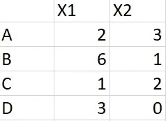
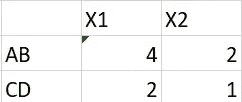
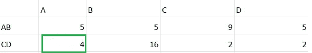
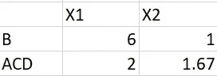
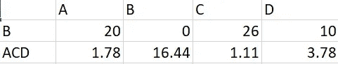
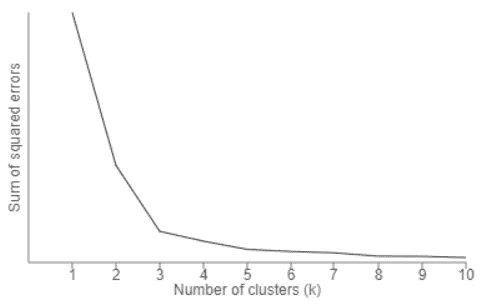

# k-均值聚类与数学

> 原文：<https://towardsdatascience.com/k-means-clustering-for-beginners-2dc7b2994a4?source=collection_archive---------1----------------------->

## 用于数据分析的常见无监督学习技术

Photo by [Perry Grone](https://unsplash.com/@perrygrone?utm_source=unsplash&utm_medium=referral&utm_content=creditCopyText) on [Unsplash](https://unsplash.com/s/photos/group?utm_source=unsplash&utm_medium=referral&utm_content=creditCopyText)

当我们处理大量数据时，将数据分成逻辑组并进行分析是有意义的。我们可以在 K-Means 等算法的帮助下，使用聚类将数据分组。

在这篇文章中，我将尝试解决

a.使聚集

b.k-均值和算法的工作原理。

c.选择正确的 K 值

# 使聚集

将对象组织成组的过程，使得同一组中的数据点与同一组中的数据点相似。聚类是对象的集合，其中这些对象与另一个聚类相似和不相似。

# k 均值

K-Means 聚类是一种无监督学习。该算法的主要目标是在数据中寻找组，组的数量由 K 表示。这是一个迭代过程，其中每个数据点基于特征相似性被分配到 K 个组中的一个。

# 算法

K-Means 算法从 K 个质心的初始估计开始，这些质心是从数据集中随机选择的。该算法在两个步骤*分配数据点*和*更新质心之间迭代。*

## 数据分配

在该步骤中，基于平方欧几里德距离，将数据点分配给其最近的质心。让我们假设一个以 c 为质心的聚类，并根据 c，x 之间的距离将数据点 x 分配给该聚类。还有一些其他的距离度量，如曼哈顿、雅克卡和余弦，它们是根据适当的数据类型使用的。

## 质心更新

通过取分配给特定聚类的所有数据点的平均值来重新计算质心。

image by [George Seif](https://towardsdatascience.com/@george.seif94?source=post_page-----a36d136ef68----------------------)

让我们用下面的例子来完成上面的步骤。

1.  考虑如下 4 个数据点 A、B、C、D

Observations

2.选择两个质心 AB 和 CD，计算如下

> AB =，B 的平均值
> 
> CD =、D 的平均值

Two centroids AB, CD

3.计算所有数据点到质心 AB，CD 的平方欧几里得距离。例如，A(2，3)和 AB (4，2)之间的距离可以由 s =(2–4)+(3–2)给出。

A is very near to CD than AB

4.如果我们在图中观察，突出显示的(A，CD)之间的*距离是 4，小于(AB，A)的距离 5。由于点 A 靠近 CD，我们可以将 A 移动到 CD 簇。*

5.到目前为止已经形成了两个集群，让我们像步骤 2 一样重新计算质心，即 B，ACD。

> ACD =、C、D 的平均值
> 
> B = B

New centroids B, ACD

6.我们知道 K-Means 是迭代过程，现在我们必须计算所有点(A，B，C，D)到新质心(B，ACD)的距离，类似于步骤 3。

Clusters B, ACD

7.在上图中，我们可以看到各自的聚类值最小，即 A 离聚类 B 太远而离聚类 ACD 近。所有数据点根据它们的最小距离被分配到聚类(B，ACD)。迭代过程到此结束。

8.总之，我们从两个质心开始，以两个集群结束，K=2。

# 选择 K

选择 K 值的一种方法是肘法。在此方法中，我们将对 K 值范围(K= 1 到 10)运行 K 均值聚类，并计算误差平方和(SSE)。SSE 计算为数据点与其聚类质心之间的平均距离。

然后为每个 K 的 SSE 值绘制一个折线图，如果折线图看起来像一只手臂，那么手臂上的肘部就是最佳的 K 值。

Choose the Best K

*希望你喜欢！！请对任何疑问或建议发表评论。*