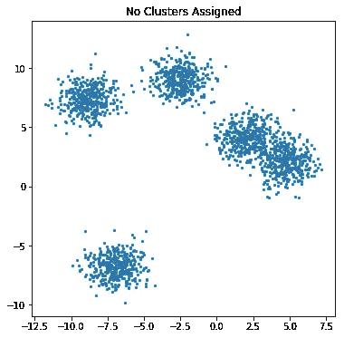
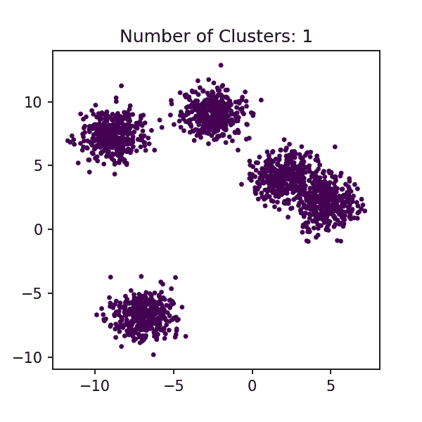
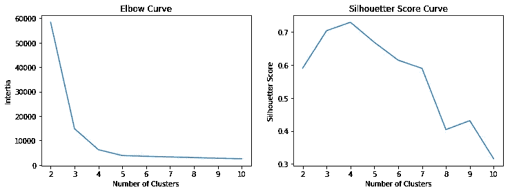

# 用于无监督机器学习的 k-均值聚类

> 原文：<https://towardsdatascience.com/k-means-clustering-for-unsupervised-machine-learning-afd96fbd37ac?source=collection_archive---------10----------------------->

## 无监督学习的 Pythonic 指南


Photo by [Ramón Salinero](https://unsplash.com/@donramxn?utm_source=medium&utm_medium=referral) on [Unsplash](https://unsplash.com?utm_source=medium&utm_medium=referral)

与人类历史上的任何其他技术不同，人工智能(AI)和机器学习(ML)彻底改变了我们生活的方方面面，并扰乱了我们做生意的方式。这种破坏给专业人士和企业带来了许多挑战。在本文中，我将介绍一种最常用的机器学习方法， **K-Means。**

## **首先:**到底什么是机器学习(ML)？！这是一种新的模式吗？

机器学习是一种科学方法，它利用统计方法和机器的计算能力将数据转换为人类或机器本身可以用来采取特定行动的智慧。*“它是* [*人工智能*](https://www.sas.com/en_us/insights/analytics/what-is-artificial-intelligence.html) *的一个分支，基于系统可以从数据中学习、识别模式并在最少人工干预的情况下做出决策的想法。”* [*(SaS)*](https://www.sas.com/en_us/insights/analytics/machine-learning.html)

如果你认为人工智能是一种新的范式，你应该知道机器学习这个名字是亚瑟·塞缪尔在 1959 年创造的。然而，这发生在 20 世纪 50 年代艾伦·图灵的一个提议之后，他用“机器能思考吗？”机器能做我们(作为思维实体)能做的事情吗？，或者换句话说，“机器能学习吗？”

所以，ML 已经存在半个世纪了。然而，随着最近机器计算能力的进步，以及我们正在生成、收集和存储的大量数据，ML 已经成为许多行业的下一个大事件。

## 机器学习的主要领域有哪些？

ML 中有许多字段，但我们可以将三个主要字段命名为:

**监督学习(SL):** SL 是使用一组输入(预测器)和期望输出(目标)来建立和训练 ML 模型。许多回归(简单或多元)或分类模型都属于这一类。

**无监督学习(UL):** 当目标未知时，使用 UL，目标是推断数据中的模式或趋势，从而做出决策，或者有时将问题转化为 SL 问题(也称为*迁移学习，TL* )。这篇文章的重点是 UL 聚类，特别是 K-Means 方法。

[**强化学习(RL)**](https://en.wikipedia.org/wiki/Reinforcement_learning) **:** 这种范式比 SL 和 UL 更复杂，然而[这篇文章提供了 RL](https://www.oreilly.com/ideas/reinforcement-learning-explained) 的一个简单而技术性的定义。一般来说，RL 关注的是“主体”(例如模型)如何在环境中采取行动，并且在每个步骤中试图最大化回报(例如优化函数)。RL 的一个很好的例子是使用遗传算法和蛮力的路由优化(在后面的文章中会有更多的介绍)。

阿卜杜勒·瓦希德的下图很好地展示了曼梯·里的这些主要领域。


From [https://www.slideshare.net/awahid/big-data-and-machine-learning-for-businesses](https://www.slideshare.net/awahid/big-data-and-machine-learning-for-businesses), Credit: [Abdul Wahid](https://www.slideshare.net/awahid?utm_campaign=profiletracking&utm_medium=sssite&utm_source=ssslideview)

## k-均值聚类，已定义

***k*-均值聚类**是一种来自信号处理的方法，目的是将观测值放入 *k* 个聚类中，其中每个观测值属于一个具有最近均值的聚类。这些簇在数学上也被称为 [Voronoi 细胞](https://en.wikipedia.org/wiki/Voronoi_cell)。

在进入 Python 代码的细节之前，让我们看一下 K-Means 聚类的基础。

## K-Means 如何对观察值进行聚类？

聚类算法的主要输入是聚类的数量(这里称为 *k* )。 *k* 决定集群机制，以及集群如何形成。在你知道哪一个应该属于一个聚类之前，想出聚类的数量可能是具有挑战性的，尤其是因为你正在处理一个无监督的学习问题。

还有其他无监督学习方法来确定 K-Means 聚类方法的正确聚类数，包括 [***分层聚类*** ，](https://en.wikipedia.org/wiki/Hierarchical_clustering)，但我们在本文中不涉及该主题。我们的假设是您知道集群的数量，或者对集群的正确数量有一个大致的概念。最好的方法是进行几次试错，以找到最佳的聚类数。

一旦知道了聚类的数量，就有三种不同的方法来指定聚类中心:

*   手动，
*   随机地，而且
*   “*k-在 SKLearn 中的意思是++*

后者以一种智能的方式为 k-mean 聚类选择初始聚类中心以加速收敛。[你可以在这里找到更多。](https://scikit-learn.org/stable/modules/generated/sklearn.cluster.KMeans.html)

应当注意，初始聚类中心对最终聚类结果没有任何影响，原因将在下面解释。给定初始聚类中心，该算法重复以下步骤，直到它收敛:


Illustration of K-Means Algorithm, Wikipedia Creative Commons, credit: [Chire](https://commons.wikimedia.org/wiki/User:Chire)

*   **分配步骤**:将每个观察值分配给其平均值具有最小平方[欧几里德距离](https://en.wikipedia.org/wiki/Euclidean_distance)的组，这是直观的“最近”平均值。
*   **更新步骤**:计算新聚类中观测值的新均值([质心](https://en.wikipedia.org/wiki/Centroids))。
*   **检查收敛:**当分配不再改变时，算法假定收敛。

需要记住的一点是，K-Means 几乎总是收敛的，但不能保证找到最优解，因为它在局部最小值处终止循环，可能不会达到全局最小状态。

好吧！算法说够了。让我们进入令人兴奋的部分，也就是 Python 代码。

## 关于 K-均值数据缩放的注记

由于 K-Means 基于数据点到聚类中心的距离工作，因此将数据缩放到相同的比例对于结果的准确性至关重要。

## Python 中的 K-Means

为此，我们将使用 **SciKit Learn** 库。你可以在这里阅读 K-Means 聚类包的文档。

让我们先导入包。

```
import numpy as np
import matplotlib.pyplot as pltfrom sklearn.cluster import KMeans
from sklearn.datasets import make_blobs
```

为了说明这个算法是如何工作的，我们将使用`sklearn.datasets.`中的`make_blob`包。下面的代码片段将生成 5 个集群。在我们的聚类中，我们将不使用聚类名称(y)。

```
# Create 5 blobs of 2,000 random data
n_samples = 2000
random_state = 42
X, y = make_blobs(n_samples=n_samples, 
                  random_state=random_state, 
                  centers=5)
```

让我们可视化集群，看看他们在哪里。

```
# Plot the random blub dataplt.figure(figsize=(6, 6))plt.scatter(X[:, 0], X[:, 1], s=5)
plt.title(f"No Clusters Assigned")
```



观察这些斑点，我们可以看到我们有三个不同的“区域”，由 5 个斑点组成:

*   左下角有一个斑点，
*   在左上区域中有两个彼此大致邻近的斑点，并且
*   在中间右区有两个几乎重叠的斑点。

让我们看看 K-Means 聚类如何处理这个问题。我们将查看不同的集群编号，从 1 到 10。下面提供了代码，生成的图形放在下面的动画中。

```
# Plot the data and color code based on clusters# changing the number of clusters 
for i in range(1,11):
    plt.figure(figsize=(6, 6))

    # Predicting the clusters
    y_pred = KMeans(n_clusters=i, random_state=random_state).fit_predict(X)# plotting the clusters
    plt.scatter(X[:, 0], X[:, 1], c=y_pred, s=5)
    plt.title(f"Number of Clusters: {i}")plt.show();
```



动画情节是用`Image.Io`包制作的。有关这方面的更多信息，请参考 [Johannes Huessy](https://medium.com/u/87e07c82677a?source=post_page-----afd96fbd37ac--------------------------------) 博客([点击此处](https://medium.com/swlh/animating-visualizations-in-python-with-matplotlib-and-imageio-10a14c571e81))。

## 评估 K-Means 聚类算法

所以你已经完成了聚类，但是这个聚类有多好，你如何衡量算法的性能？

**惯性:**我们在上一节中讨论了一个度量，即到聚类中心的距离的类内平方和。这就是所谓的 ***惯性*** 。该算法旨在选择使**、**惯性最小化的质心，其中**、**可以被识别为内部一致性聚类如何的度量。

您可以使用下面的代码来获得集群的`inertia`分数:

```
km = KMeans(n_clusters=i, random_state=random_state)
km.fit(X)
km.inertia_
```

下面的代码计算了我们之前所做的 10 个不同聚类数的`inertia`分数，并将它们保存在一个列表中，我们将使用该列表进行绘制(稍后将详细介绍)。惯性分数对聚类数的作图称为“ ***肘形曲线*** ”。

**剪影评分:**剪影评分是基于聚类*(聚类中的点相对于彼此有多近)和 ***分离*** (聚类相对于彼此有多远)**的组合。***

*剪影得分在-1(聚类差)和+1(聚类优)之间。*

*惯性*

```
*# Calculating the inertia and silhouette_score¶inertia = []
sil = []# changing the number of clusters 
for k in range(2,11):

    km = KMeans(n_clusters=k, random_state=random_state)
    km.fit(X)
    y_pred = km.predict(X)

    inertia.append((k, km.inertia_))
    sil.append((k, silhouette_score(X, y_pred)))*
```

*现在我们有了惯性和轮廓分数，让我们绘制它们并评估聚类算法的性能。*

```
*fig, ax = plt.subplots(1,2, figsize=(12,4))# Plotting Elbow Curve
x_iner = [x[0] for x in inertia]
y_iner  = [x[1] for x in inertia]
ax[0].plot(x_iner, y_iner)
ax[0].set_xlabel('Number of Clusters')
ax[0].set_ylabel('Intertia')
ax[0].set_title('Elbow Curve')# Plotting Silhouetter Score
x_sil = [x[0] for x in sil]
y_sil  = [x[1] for x in sil]
ax[1].plot(x_sil, y_sil)
ax[1].set_xlabel('Number of Clusters')
ax[1].set_ylabel('Silhouetter Score')
ax[1].set_title('Silhouetter Score Curve')*
```

**

*你可以看到，当你增加集群的数量时，惯性得分总是下降。然而，肘曲线可以告诉你以上 4 个集群，惯性的变化并不显著。现在，让我们看看轮廓曲线。您可以看到，最大得分发生在 4 个聚类处(轮廓得分越高，聚类越好)。*

*将肘部曲线与轮廓得分曲线结合起来，可以提供对 K-Means 性能的宝贵见解。*

## *K 均值的其他用例*

*K-Means 方法有很多用例，从图像矢量化到文本文档聚类。你可以在这里找到一些例子。*

*我希望您发现本指南有助于理解使用 Python 的 SkLearn 包的 K-Means 聚类方法。请继续关注更多类似的话题！*

****尼克·米奈博士*** *(* [*领英简介*](https://www.linkedin.com/in/nickminaie/) *)是一位资深顾问和富有远见的数据科学家，代表了领导技能、世界级数据科学专业知识、商业敏锐度和领导组织变革能力的独特组合。他的使命是推进人工智能(AI)和机器学习在行业中的实践。**