# 如何在 BigQuery ML 中做好 k-Means 聚类初始化

> 原文：<https://towardsdatascience.com/k-means-clustering-in-bigquery-now-does-better-initialization-3d7e7567bad3?source=collection_archive---------24----------------------->

## 使用并行 k-Means++初始化选项

BigQuery ML 支持无监督学习—您可以应用 k-Means 算法将您的数据分组到聚类中。正如我在之前的博客文章中所描述的，你可以使用聚类来理解你的数据，以便做出数据驱动的决策。在 BigQuery 中，现在有一个更好的初始化算法可用于 k-Means，在这篇博客中，我将解释这个新的初始化算法做什么，以及为什么它是有益的。

## BigQuery 中的 k-均值聚类

但首先，让我们从如何在 BigQuery ML 中使用 k-Means 开始。举个例子，让我们使用爱荷华州的公共酒类销售数据集，并根据 2018 年的销售特征对商店进行聚类。首先，我们使用以下方法提取每个商店的数据:

```
SELECT 
 store_number
 , AVG(SAFE_DIVIDE(state_bottle_retail - state_bottle_cost, state_bottle_cost)) AS profitability
 , SUM(bottles_sold) AS bottles_sold
 , SUM(sale_dollars) AS sale_dollars
 , SUM(volume_sold_liters) AS volume_sold
FROM `bigquery-public-data`.iowa_liquor_sales.sales
WHERE EXTRACT(YEAR from date) = 2018
GROUP BY store_number
```

这给了我们这样的数据:

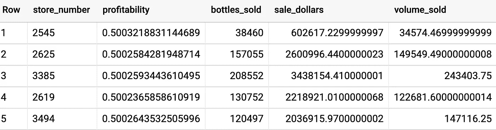

Sales characteristics of liquor stores in Iowa

要基于商店对这些数据进行聚类，我们只需创建一个模型，注意从功能列表中排除 store_number:

```
CREATE OR REPLACE MODEL demos.iowa_store_clusters
OPTIONS(model_type='kmeans', num_clusters=4, standardize_features = true) ASWITH data AS (
SELECT 
 store_number
 , AVG(SAFE_DIVIDE(state_bottle_retail - state_bottle_cost, state_bottle_cost)) AS profitability
 , SUM(bottles_sold) AS bottles_sold
 , SUM(sale_dollars) AS sale_dollars
 , SUM(volume_sold_liters) AS volume_sold
FROM `bigquery-public-data.iowa_liquor_sales.sales`
WHERE EXTRACT(YEAR from date) = 2018
GROUP BY store_number
)SELECT * EXCEPT(store_number) FROM data
```

在选项中，我指定了所需的聚类数，并告诉算法标准化这些特征。这一点很重要，因为我们的功能范围变化很大(从盈利能力的 0–1 到销售额的 10E6)。默认情况下，BigQuery ML 对 k-Means 输入特性进行了标准化，但是加倍确保没有坏处！！

BigQuery 控制台中的 evaluation 选项卡向我们显示了生成的集群(您的结果可能会有所不同，原因我将在本文后面解释):

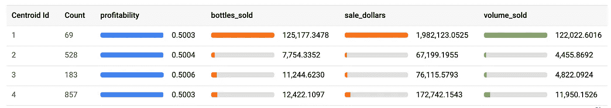

The four types of liquor stores in Iowa

集群之间的盈利能力没有变化(也许州法律规定了价格？).很明显，就销售额而言，集群#1 是高销量集群，集群#4 是下一层商店。分类#2 和分类#3 似乎具有相似的销售量，但是分类#3 中的销售包括较小的瓶子(因此，销售了更多的瓶子),这导致了更大的销售额。

该培训耗时约 30 秒，分七次迭代完成:

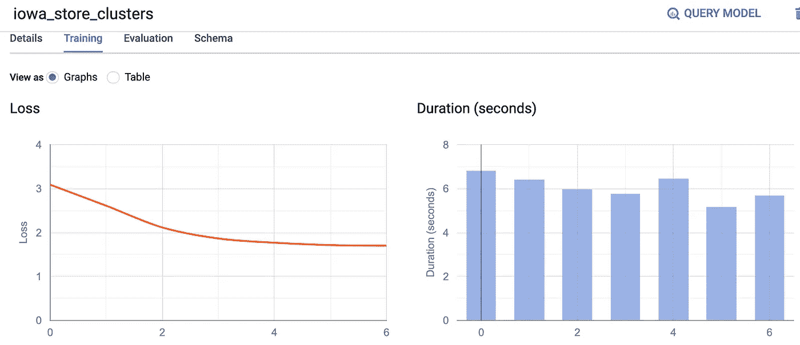

## 重复…

只是笑一笑，让我试着再做一次查询。这一次，大约花了一分钟:

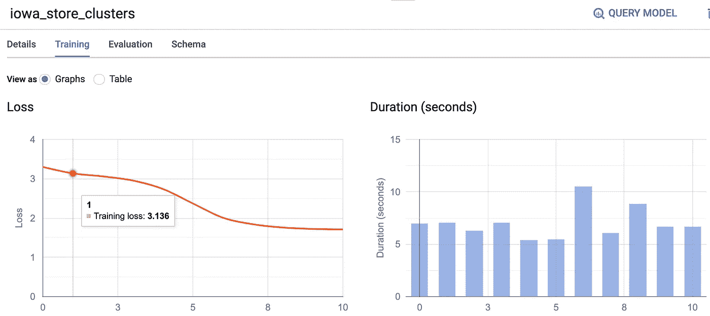

结果有所不同，不如以前好:

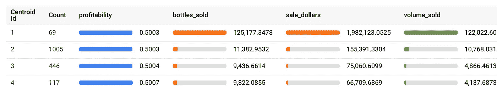

原因是 K-Means 默认的初始化方法是在随机的起始点播种聚类。你得到的聚类质量取决于起点，在这种情况下，起点不如以前好。

## 为什么我们需要更好的初始化

具体来说，随机初始化会导致两个问题。如果初始种子恰好很好(见下面的绿框)，收敛会很快。但是如果起点碰巧是坏的(见下面的红框)，收敛可能需要更长的时间。

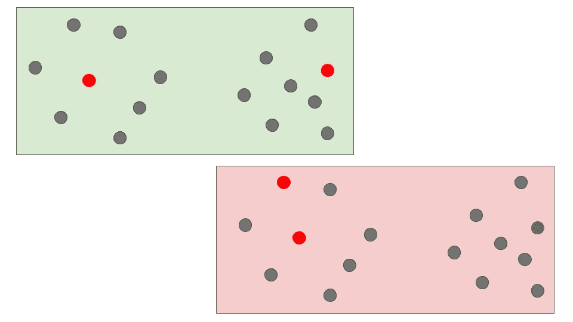

Convergence time depends on the starting point

其次，K-Means 很可能会陷入局部最小值，永远找不到好的解决方案(见下文，其中左上的聚类分成两个，右下的两个聚类合并成一个):

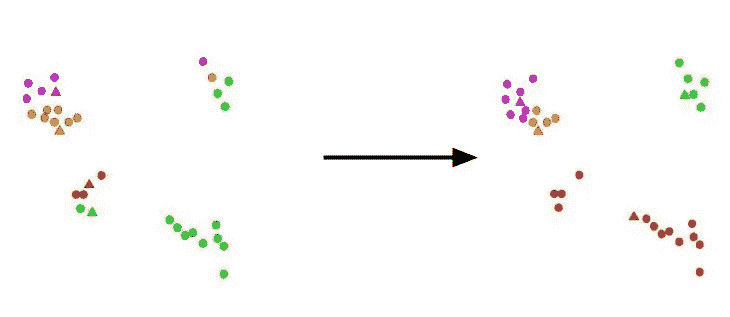

Bad initialization can also lead to k-Means being trapped in a local minimum

已经有很多关于如何分配初始起始种子的研究，使得它们以一种导致快速收敛并且不导致陷入局部最小值的方式覆盖输入空间。

## k-表示++的意思

BigQuery 现在实现了并行 k-Means++算法。简单来说，算法首先选择一个种子点。然后，为了选择下一个种子点，它对这些点进行随机采样，距离现有种子点越远的点被选择的概率越高。其中 k-Means++简单地选择第一个这样的随机采样点(因此需要 k 遍数据)，并行 k-Means++将这种选择并行化，基于加权函数对所选的点进行聚类，并在单次拍摄中完成这一操作。由 k-Means++选择的种子点(以及并行的 k-Means++)可以证明是接近最优的。

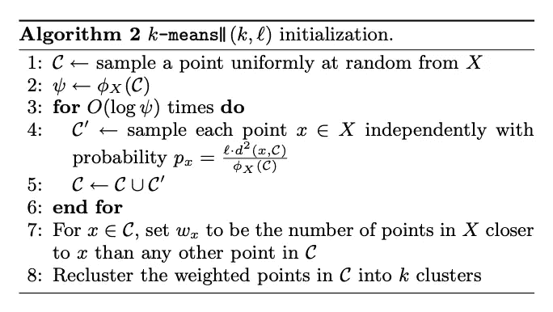

The parallel k-Means++ algorithm that you can tell BigQuery ML to use. The algorithm (and screenshot) is from a paper by Bahmani et. al: [https://theory.stanford.edu/~sergei/papers/vldb12-kmpar.pdf](https://theory.stanford.edu/~sergei/papers/vldb12-kmpar.pdf)

虽然初始化需要更长的时间，但收敛通常更快，结果也更好。在爱荷华商店数据上尝试:

```
CREATE OR REPLACE MODEL demos.iowa_store_clusters
OPTIONS(model_type='kmeans', 
        num_clusters = 4,
        **kmeans_init_method = 'KMEANS++',**
        standardize_features = true) ASWITH data AS (
SELECT 
 store_number
 , AVG(SAFE_DIVIDE(state_bottle_retail - state_bottle_cost, state_bottle_cost)) AS profitability
 , SUM(bottles_sold) AS bottles_sold
 , SUM(sale_dollars) AS sale_dollars
 , SUM(volume_sold_liters) AS volume_sold
FROM `bigquery-public-data.iowa_liquor_sales.sales`
WHERE EXTRACT(YEAR from date) = 2018
GROUP BY store_number
)SELECT * EXCEPT(store_number) FROM data
```

## 真的更好

我只用了三次迭代就实现了融合:

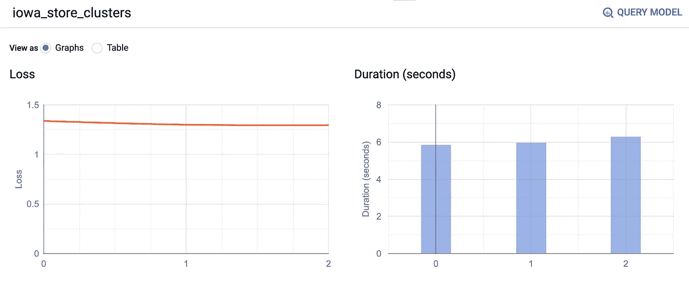

With k-Means++, convergence is twice as fast.

产生的集群甚至比我们之前的集群更好:

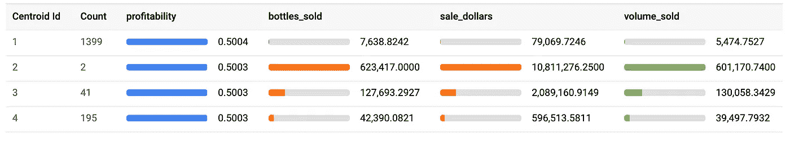

The four clusters now

请注意，在所有考虑的要素上，聚类之间的差异有多大，以及两个异常值存储是如何被划分到一个单独的聚类中的，无论它们是否影响其他聚类的聚类均值。这也体现在戴维斯-波尔丁指数中(现在是 0.6，而以前是 1.1)。

这也是相当可重复的——当我再次尝试时，我得到了类似的(不确切，因为随机种子)结果:

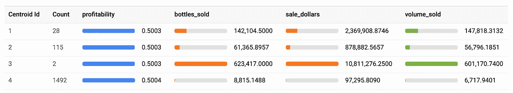

Similar results when I ran it again.

底线:使用**k means _ init _ method = ' k means++ '**。尽情享受吧！

[*甲尚刘*](https://u.osu.edu/jiashangliu/) *(我母校的博士生！)在谷歌实习时，与吴家勋和邓一起实现了这个功能。实习生在谷歌做出惊人的工作—* [*申请*](https://careers.google.com/students/engineering-and-technical-internships/) *！*

*感谢 Jiaxun Wu 向我指出 BigQuery ML 的这一改进，并提供了两个初始化图，感谢 Amir Hormati 和 Abhishek Kashyap 审阅本文。*