# SAS 中的 k-均值聚类

> 原文：<https://towardsdatascience.com/k-means-clustering-in-sas-9d19efd4fb1b?source=collection_archive---------2----------------------->

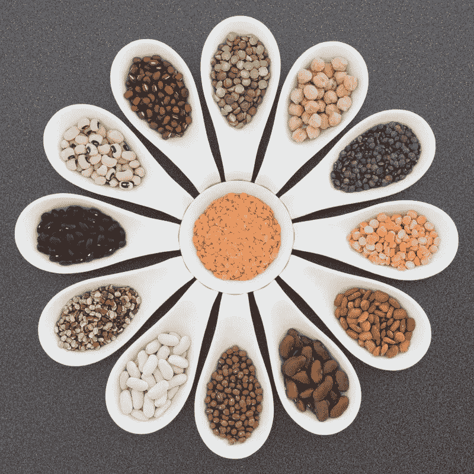

**什么是聚类？**

> **“**聚类是将数据集分成由相似数据点组成的组的过程”。聚类是一种无监督的机器学习，当您有未标记的数据时使用。

让我们理解在真实的场景中，

坐在餐馆里的一群食客。让我们假设餐馆里的两张桌子叫做 T1 和 T2。表 T1 中的人可能彼此相关，或者可能是一组家庭成员或同事或任何其他人。


Group of diners

同样，T2 餐桌上的人们可能是彼此相关的，或者可能是一组同事或任何东西。但是，当比较坐在 T1 桌的人和坐在 T2 桌的人时，他们是完全不同的，彼此没有任何联系。

集群也以同样的方式工作。一个群集中的数据点与另一个群集中的数据点完全不同。同一聚类中的所有点要么相同，要么彼此相关。

另一个很好的例子是网飞电影推荐。


Netflix movie recommendation

网飞根据用户的观看历史推荐电影。无论人们看什么；与之相关的类似电影也会上映。聚类算法生成所有这些推荐列表。

聚类可用于分割和许多其他应用。它有不同的技术。K -Means 聚类是最流行、最简单和最有趣的算法之一。

# **什么是 K 均值聚类？**

K-Means 是一种聚类算法，其主要目标是将相似的元素或数据点分组到一个聚类中。**K-means 中的“K”代表簇的个数。**

**K-means 聚类步骤:**

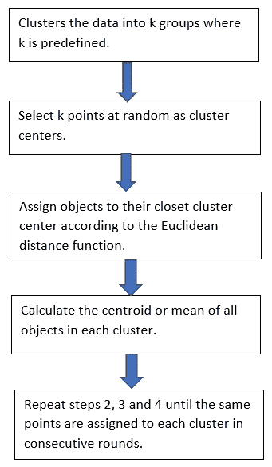

距离度量将确定两个元素之间的相似性，并且它将影响聚类的形状。通常，欧几里德距离将用于 K-均值聚类

欧几里得距离是“普通的”直线。它是欧几里得空间中两点之间的距离。

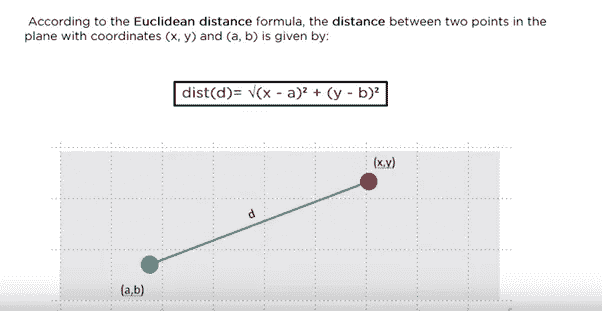

**K-Means 算法是如何工作的？**

我们来看两个数据点。假设 K =2。然后，它将在数据中的任意位置取两个随机质心，并以此为基础在中间画一条线。一个质心用红色表示，另一个用黄色表示。那么所有数据都指向分类为黄色的黄色质心。所有数据都指向分类为红色的红色质心。这是第一个迭代步骤。

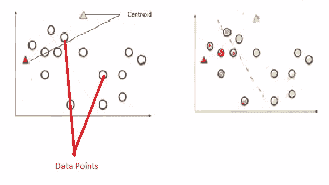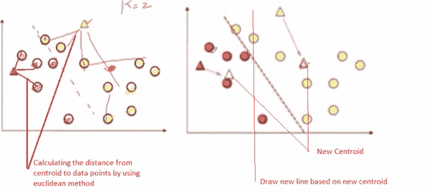

下一步，使用欧几里德方法计算从质心到数据点的距离。并且通过计算所有点的平均值，红色和黄色质心点都移动到新点中。

同样，它在新的质心点之间绘制一条新的线。自动地，所有落向红色质心的点将被识别为红色组，而黄色质心将被识别为黄色组。

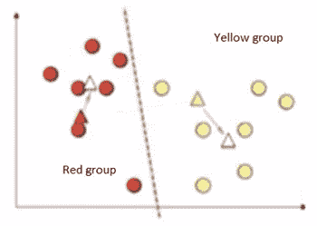

同样的步骤将重复新的点，它将计算新的质心。我们可以清楚地看到数据点已经被移动到不同的组中。

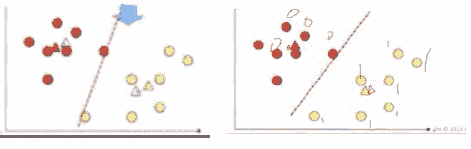

它继续下去，直到质心运动变得几乎可以忽略不计。然后，它变成集群 1 和集群 2。这里，输出 Y 标签将给出 0 和 1。0 表示聚类 1，1 表示聚类 2。如果是三个集群，那么它给出 0，1，2。

# **SAS 中的 K-均值聚类**

让我们看一个著名的虹膜数据集。使用 proc 方法检查数据集

```
/* Checking the contents of the datasets */**proc** **means** data=work.iris N Nmiss mean median max min;**run**;
```

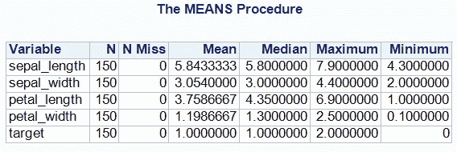

它有 150 个观察值和 5 个变量。未检测到缺失值或异常值。我们将只使用四个变量，即萼片长度、萼片宽度、花瓣长度和花瓣宽度。“cm”中的数据集。“Target”变量可以删除，因为它是一个类别变量。

关于鸢尾花数据集的小介绍。这是一个多元数据集，由英国[统计学家](https://en.wikipedia.org/wiki/Statistician)和[生物学家](https://en.wikipedia.org/wiki/Biologist) [罗纳德·费雪](https://en.wikipedia.org/wiki/Ronald_Fisher)在 1936 年为他的研究论文引入。下图是关于萼片和花瓣的。

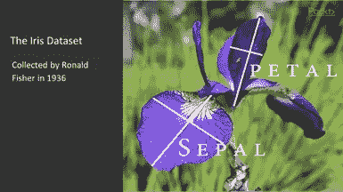

在分析数据集之前先了解它会很有意思。

```
/* Dropping the variable target and stored the dataset in the name of IRIS1 */**data** iris1; set work.iris; drop target;**run**;
```

在运行聚类分析之前，我们需要将所有的分析变量(实数变量)标准化到平均值为零，标准差为一(转换为 z 分数)。在这里，我们的数据集已经标准化了。

```
/* Perfoming Cluster Analysis */ods graphics on;**proc** **cluster** data = iris1 method = centroid ccc print=**15** outtree=Tree;var sepal_length--petal_width;**run**;ods graphics off;
```

**METHOD = >** 规范决定了过程使用的聚类方法。这里，我们使用的是质心方法。

CCC——立方聚类准则——有助于找出最佳聚类点。

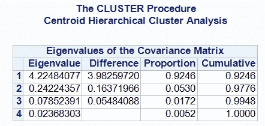

需要找出最佳的集群。

前三个特征值约占总方差的 99.48%，因此，建议采用三个聚类。但是，可以在 ccc 图中交叉检查。

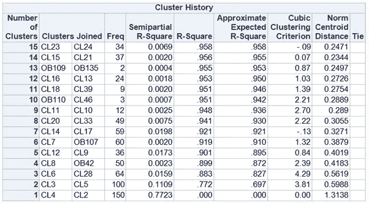

如果我们从集群历史中看到，有 15 个观察值(如我们在代码中给出的= 15)

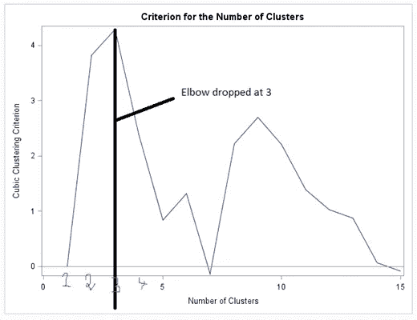

从上面的 CCC 图可以看出，肘在三点下降了。因此，最佳聚类将是 3。**“在 Python 中的 Elbow 方法中可以找到最佳聚类”**

为了将 150 个观察值中的每个观察值分成三组，我们可以使用 proc tree。ncl = 3(我们的最佳聚类是 3)。

```
/* Retaining 3 clusters */**proc** **tree** noprint ncl=**3** out=out;copy sepal_length--petal_width;**run**;
```

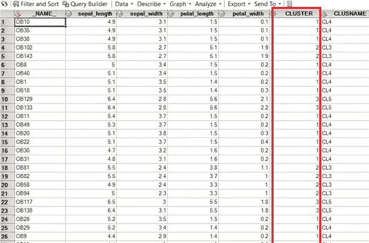

150 次观察分为三组。

使用 proc candisc 和 proc sgplot 创建散点图

```
/* To create a Scatterplot */**proc** **candisc** out = can;class cluster;var petal_width: sepal_length:;**run**;**proc** **sgplot** data = can;title "Cluster Analysis for IRIS datasets";scatter y = can2 x = can1 / group = cluster;**run**;
```

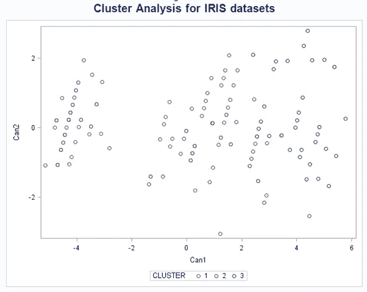

我们可以看到，我们的分析清楚地分为三类。聚类 1 是蓝色的，聚类 2 是红色的，聚类 3 是绿色的。

**K-means 聚类的优缺点**

**优势:**

1)实际上工作良好，即使一些假设被打破。

2)简单，易于实现。

3)易于解释聚类结果。

4)在计算成本方面快速有效。

**劣势:**

1)均匀效应通常产生具有相对均匀大小的聚类，即使输入数据具有不同的聚类大小。

2)不同的密度对于集群可能效果不佳。

3)对异常值敏感。

4) K 值需要在 K-means 聚类之前知道。

我的 GIT 里有完整的 SAS 代码【https://github.com/sdhilip200/IRIS-datasets 

如果您发现任何错误或需要改进的地方，请不吝赐教。