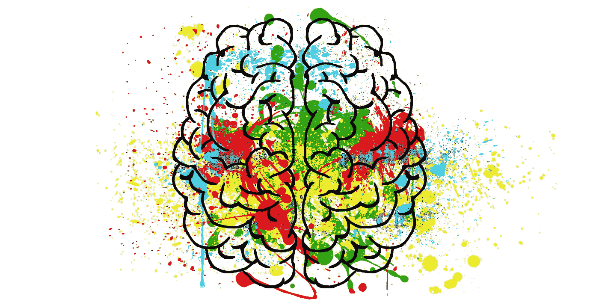

# k-均值聚类:推荐系统的无监督学习

> 原文：<https://towardsdatascience.com/k-means-clustering-unsupervised-learning-for-recommender-systems-397d3790f90f?source=collection_archive---------7----------------------->



Your brain on Unsupervised Learning. Source: [Pixabay](https://pixabay.com/illustrations/brain-mind-psychology-idea-hearts-2062048/).

在一般人工智能的意义上，无监督学习被称为最接近“实际”人工智能的东西，K-Means 聚类是其最简单但最强大的应用之一。

我在这里不是要讨论这些说法是真是假，因为我既不是专家也不是哲学家。然而，我会说，我经常惊讶于无监督学习技术，即使是最基本的，在数据中捕捉模式的能力有多强，而我本以为只有人才能发现这些模式。

今天我们将在我自己收集的数据集上应用无监督学习。这是一个专业魔术的数据库:我从[mtgtop8.com 爬上来的聚会平台，](https://mtgtop8.com/)如果你喜欢魔术，这是一个很棒的网站:聚会。

我[从几年的比赛中收集了](http://www.datastuff.tech/programming/how-to-scrape-the-web-using-python-with-scrapy-spiders/)MTG top 8 数据，它们都可以在[这个 GitHub 库](https://github.com/StrikingLoo/mtgProject)中使用。

如果你不喜欢这个游戏，或者甚至你从来没有玩过它，**不要担心**:它不会太碍事，因为我将解释 K-means 聚类的理论方面，并向你展示如何使用 [Dask](http://www.datastuff.tech/data-analysis/how-to-run-parallel-data-analysis-in-python-using-dask-dataframes/) 来应用它。如果你喜欢这个游戏，那么你会喜欢这些例子的。

# k 均值聚类

我们今天要研究的算法叫做“K 均值聚类”。如果我们事先不知道如何分离数据，它提供了一种表征和分类数据的方法。

# 为什么我们需要无监督学习？

我说的无监督学习是什么意思？假设你有一组猫和狗的照片。你可以训练一个[监督机器学习](http://www.datastuff.tech/machine-learning/autoencoder-deep-learning-tensorflow-eager-api-keras/)模型来将图片分类。

然而，想象一下，你有一个庞大而复杂的数据集，里面有你不太了解的东西。例如，你可能有关于不同行星产生的光谱的数据，并且正在寻找一种方法将它们分类。

再举一个例子，您可能有来自许多不同生物的大量遗传数据，并希望以直观的方式定义哪些属于同一属或科。

或者，在我们的情况下，我们可能有 777 种不同的魔法:收集牌，使用 600 多种不同的卡片(是的，专业元不是*那么*多样化)，并希望训练一个机器学习模型，以便它了解哪些卡片可以很好地配合，哪些不能。

现在想象你必须做这个任务，你不知道如何玩这个游戏。如果有人发明了一种算法，将看起来相似的数据聚集在一起，而无需您提供“相似”的定义，这不是很好吗？这就是聚类，尤其是 k-means 聚类的意义所在。

现在完成了，我希望你有动力，因为是时候用一些理论弄脏我们的手了。

# K-Means 聚类是如何工作的？

K-Means 聚类接收一个单一的超参数: *k，*，它指定了我们想要将我们的数据分成多少个聚类。

集群不一定有相同数量的实例。然而，它们应该各自表征我们数据的一个特定子集。我们将如何实现这一目标？让我们来了解一下！

首先，这个算法的输入需要是一组向量。也就是说，你的所有特征都应该是数字的，并且顺序相同。如果您有任何分类特征，我的建议是使用 one-hot encode:将每个分类变量转换成一个 n 元素的向量:每个可能的类别一个，除了给定类别的一个，所有的都设置为 0。

该算法将启动 k 个随机“质心”，即由数据集元素的维度定义的空间中的点，然后它将:

1.  将每个元素指定给最靠近它的质心。
2.  将质心重新映射到位于分配给它的所有元素的平均值上的点。
3.  重复步骤 1 和 2，直到满足收敛(或停止条件，如对给定的 N 进行 N 次迭代)。

最后，每个元素将被分配给 k 个簇中的一个，使得同一簇中的所有元素都离它最近。

# K-均值聚类的应用

像许多其他非监督学习算法一样，K-means 聚类如果用作一种为[监督机器学习](/xgboost-predicting-life-expectancy-with-supervised-learning-1f61e0222f5f)算法(例如，分类器)生成输入的方式，可以创造奇迹。

输入可以是给定实例属于哪个聚类的一次性编码，或者到每个聚类质心的 k 个距离。

然而，对于这个项目，我们将开发的是一个(有点初级的)推荐系统，给定一个实例，它将返回出现在同一个集群中的元素。

# 在 Python 中使用 Dask 的 K-means 聚类

定义了这个项目的概念后，现在让我们开始实践部分。代码可以在 Jupyter 笔记本的这个库上找到。

# 处理数据

我按照以下格式存储 MtgTop8 资料:

```
N card name
M another card name
```

777 年不同*。txt* 文件，其中每行指一张牌，第一个空格前的数字是该副牌中该牌的幻影数。

为了将它们转换成更易于管理的格式——我将为每副牌使用一个元组列表(Int，String)，每个元组一张牌——我们将这样做:

这是现在一副牌的样子。

```
[(4, 'Ancient Ziggurat'),   (4, 'Cavern of Souls'),   (4, 'Horizon Canopy'),   (1, 'Plains'),   (2, 'Seachrome Coast'),   (4, 'Unclaimed Territory'),   (4, 'Champion of the Parish'),   (1, 'Dark Confidant') ...]
```

其中每个元组代表一张牌(没错，那些都是真实的牌名)，以及出现的次数。

因为我们希望将每一副牌映射到一个向量，所以直观地说

*   将它们转换成一个列表，整个数据集中每个不同的卡片都有一个元素。
*   将每个组件设置为相应牌的幻影数(所有组件对应于未出现在该副牌中的牌设置为 0)。

要做到这一点，让我们得到所有卡片组中出现的所有不同的卡片。

现在，让我们利用新发现的关于卡片名称的知识，把所有的卡片都变成美丽的、可消费的载体。

现在我们所有的牌都可以很容易地输入 Dask 的 K-Means 聚类算法，我们可以玩输出。

我们可以只使用“二进制”向量，如果卡片出现在卡片组中，则将分量设置为 1，如果没有出现，则设置为 0。我们以后也可以尝试一下，看看我们是否也能得到好的结果。

# 应用 K-均值聚类

既然我们的数据都被整齐地映射到向量空间，实际上使用 Dask 的 K-means 聚类是非常简单的。

其中最重要的部分是 *n_clusters* 参数，我把它任意设置为 8。

在现实生活中，你可能想尝试不同的价值观。对于这个特殊的情况，我知道 MtG 有 5 种不同的“颜色”的卡片。为了防止算法只根据颜色对卡片进行聚类(反正它根本没有这样做)，我选择了一个大于 5 的数字。

该算法将标签作为 Dask 数组返回。我以后可能会写一篇关于如何使用它们的文章，但是现在我不想处理所有这些。此外，MtgTop8 数据集足够小，这并不重要，所以我决定将其转换回整数列表。告我吧。

# 探索性分析:让我们看看我们得到了什么

起初我想检查结果是否有意义。这是我第一次在这个数据集上使用 K-means 聚类，我想确保它学到了一些有价值的东西。所以我只是检查了每组牌中哪些牌最常用。至少对我来说，结果是令人震惊的。以下是我所做的检查。

如果您对结果感兴趣，我强烈建议您从 GitHub 项目下载笔记本并使用它，它真的很有趣！我只是不想将我的 M:tG 发现与本教程混在一起，这样那些对数据科学感兴趣但对游戏不感兴趣的读者就不会感到无聊。

# 使用 K-均值聚类的卡片推荐

现在我们已经完成了健全性检查，我们可以继续对我们生成的所有标签进行实际应用了。

我们可以有许多方法来解决推荐问题:给定一张牌，推荐与之相配的其他牌，除了这些牌出现在哪副牌中之外，不使用任何关于这些牌的数据(也就是说，不要作弊，不要询问更多关于这些牌的数据，如颜色、价格或专家的意见)。

请思考一下，您将如何使用聚类数据来生成建议？我相信你能想出一些主意。

如果你想出的不是我要做的，请在评论里告诉我！如果是团队合作，创意会更有趣，我真的很想看看我亲爱的读者们能想出什么。

最后，我是这样做的:

如你所见，对于这部分，我省略了一张牌在给定的牌组中出现的次数，只看了一张牌在给定的牌组中出现的相对次数。

然后，我返回具有最相似的相对幻影(由欧几里德距离定义)的牌。

如果你是一个魔术:收集玩家，尝试一下这段代码，看看结果，它会给出很好的(虽然有点保守)建议！

# 结论

K-Means 聚类允许我们在不真正了解一个领域的情况下接近它，并得出结论，甚至围绕它设计有用的应用程序。

它让我们通过学习数据中的潜在模式来做到这一点，只要求我们以正确的格式给它数据。

我鼓励您使用这里的代码，尝试使用不同的数据集创建自己的推荐系统，或者解决一些其他问题。如果有，请给我看看你的结果！我想看看你能想出什么。

将来，我想用非专业的套牌做同样的分析。这样，我可以为休闲玩家(比如我)制作一个推荐引擎。我认为如果它能与几乎任何卡一起工作，而不仅仅是 642，那将会很酷。

*你可以在我的* [*个人网站*](http://strikingloo.github.io/wiki) *中看到我正在做的事情以及我最近的文章和笔记。*

快乐编码。

*原载于 2019 年 4 月 3 日*[*www . data stuff . tech*](http://www.datastuff.tech/machine-learning/k-means-clustering-unsupervised-learning-for-recommender-systems/)*。*