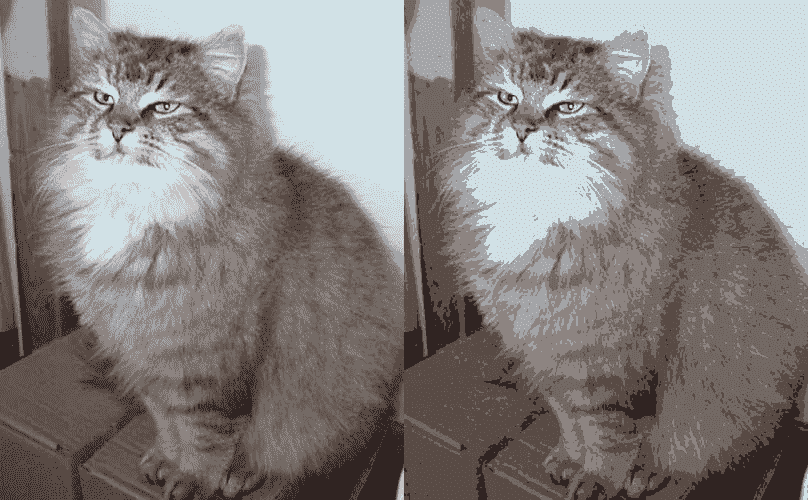
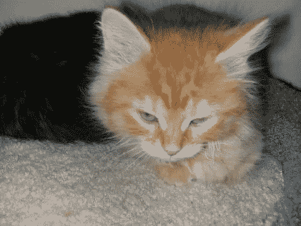
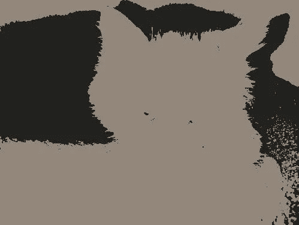
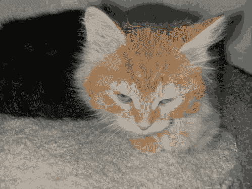
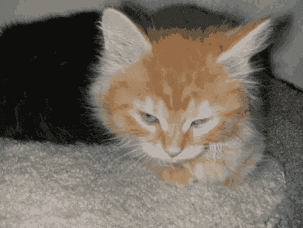
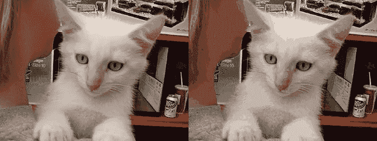

# k 表示用 Dask(猫图片的图像过滤器)聚类

> 原文：<https://towardsdatascience.com/k-means-clustering-with-dask-image-filters-for-cat-pictures-78284a3e83f6?source=collection_archive---------18----------------------->

300+ colors to 24 colors.

对图像应用滤镜对任何人来说都不是新概念。我们拍了一张照片，对它做了一些修改，现在它看起来更酷了。但是人工智能从何而来？让我们用 K 表示 Python 中的聚类来尝试一下**无监督机器学习**的有趣用法。

我以前写过关于 **K 表示聚类**的文章，所以这次我假设你**对算法**很熟悉。如果你不是，这是我写的的[深度介绍。](http://www.datastuff.tech/machine-learning/k-means-clustering-unsupervised-learning-for-recommender-systems/)

我还用自动编码器尝试过**图像压缩**(嗯，重建)，获得了不同程度的成功。

然而这一次，我的目标是**不重建**最佳可能的图像，而只是看看**用最少可能的颜色重建一张图片**的效果。

我不想让图片看起来尽可能地与原始图片相似，我只想让我们看着它说“真漂亮！”。

那么我们如何做到这一点呢？很高兴你问了。

# 如何用 K 均值聚类做图像滤波

首先，记住一个**图像**只是一个像素的**向量总是好的。每个像素是一个由 0 到 255(无符号字节)之间的三个整数值组成的元组，表示该像素颜色的 RGB 值。**

我们希望使用 K 均值聚类来找到最能表征图像的 *k* **颜色**。这只是意味着我们可以将每个**像素**视为一个**单个数据点**(在三维空间中)，并对它们进行聚类。

所以首先，我们想用 Python 把一个图像转换成一个像素矢量。我们是这样做的。

作为题外话，我不认为 *vector_of_pixels* 函数需要使用 Python 列表。我确信一定有什么方法可以让**变平一个 numpy 数组**，我就是找不到任何方法(至少没有一个方法能按照我想要的顺序做到)。如果你能想到任何方法，请在评论中告诉我！

下一步是**将模型**拟合到图像，这样**将像素**聚集成 *k* 颜色。然后，只需要给图像中的每个位置分配相应的聚类颜色。

例如，也许我们的图片只有三种颜色:两种红色和一种绿色。如果我们把它分成两类，所有的红色像素会变成不同的红色(聚集在一起)，其他的会变成绿色。

但是解释得够多了，让我们来看看程序的运行吧！像往常一样，你可以用任何你想要的图片自由地运行它，这里是带有代码的 [GitHub 库](https://github.com/StrikingLoo/K-means-image-compression)。

# 结果呢

我们将把滤镜应用到小猫的照片上，这些照片取自令人惊叹的“猫狗大战” [kaggle 数据集](https://www.kaggle.com/c/dogs-vs-cats)。

我们从一张猫的图片开始，对 *k* 应用不同值的滤镜。下面是原图:

首先，我们来看看这张图原本有多少种颜色。

仅用一行 *numpy* ，我们就能计算出一个像素在这张图片上的唯一值。特别是这幅图像有 **243 种不同的颜色**，尽管它总共有 **166167 个像素**。

现在，让我们来看看仅将其聚类为 2、5 和 10 种不同颜色的结果。

只有两种颜色，它所做的只是标记最暗和最亮的区域。然而，如果你是一个艺术家，正在画一些黑白的东西(比如用墨水),并且想看看你的参考资料的轮廓是什么样的，这可能是有用的。

With only 5 different colors, the cat is already recognizable!

The 10 colors picture may look a bit trippy, but it represents the original’s content pretty clearly.

你注意到一个趋势了吗？我们添加的每种颜色都有递减的回报。拥有 2 种颜色和拥有 5 种颜色之间的差别，远远大于 5 和 10 之间的差别。然而，对于 10 色，平面区域更小，我们有更多的粒度。转向 15 色和 24 色！

虽然很明显这是一张经过过滤的图片，用 24 种颜色(原始数量的 10%)我们已经足够好地表现了猫的细节。

继续看另一张图:这是原图(256 种不同的颜色)，这是压缩图(还是 24 种颜色)。

有趣的是，“压缩”图像重 18KB，未压缩图像重 16KB。我真的不知道这是为什么，因为压缩机是非常复杂的动物，但很乐意在评论中阅读你的理论。

# 结论

我们能够只用原始图像的 10%的颜色来制作新图像，这些图像看起来与原始图像非常相似。由于 K 均值聚类，我们还得到了一些看起来很酷的过滤器。您还能想到其他有趣的集群应用吗？你认为其他聚类技术会产生更有趣的结果吗？

如果你想回答这些问题中的任何一个，请随时通过 [Twitter](http://twitter.com/strikingloo) 、 [Medium](http://medium.com/@strikingloo) 或 [Dev.to](http://www.dev.to/strikingloo) 联系我。

你有兴趣在数据科学领域开始职业生涯吗？你想成为一名出色的机器学习专家吗？来看看我的推荐阅读清单:[《帮助你提升数据科学家水平的 3 本机器学习书籍》](http://www.datastuff.tech/data-science/3-machine-learning-books-that-helped-me-level-up-as-a-data-scientist/)。其中一个实际上教会了我我所知道的 K 的意思是聚类。

*原载于 2019 年 6 月 2 日*[*http://www . data stuff . tech*](http://www.datastuff.tech/machine-learning/k-means-clustering-with-dask-editing-pictures-of-kittens/)*。*