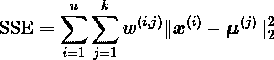
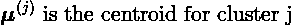

# 使用 scikit-learn 的 K-Means 聚类

> 原文：<https://towardsdatascience.com/k-means-clustering-with-scikit-learn-6b47a369a83c?source=collection_archive---------0----------------------->

了解流行的 k-means 聚类算法背后的基础知识和数学知识，以及如何在`scikit-learn`中实现它！

**聚类**(或**聚类分析**)是一种技术，它允许我们找到相似对象的组，这些对象彼此之间的相关性比其他组中的对象更大。面向业务的集群应用程序的示例包括按不同主题对文档、音乐和电影进行分组，或者基于共同的购买行为来寻找具有相似兴趣的客户，以此作为推荐引擎的基础。

在本教程中，我们将了解最流行的聚类算法之一， **k-means** ，它在学术界和工业界都有广泛的应用。我们将涵盖:

*   k-均值聚类的基本概念
*   k-means 算法背后的数学
*   k-means 的优缺点
*   如何使用`scikit-learn`在样本数据集上实现算法
*   如何可视化集群
*   如何用肘法选择最佳的 *k*

我们开始吧！

> *本教程改编自 Next Tech 的* ***Python 机器学习*** *系列的* Part 3 *，带你从 0 到 100 用 Python 进行机器学习和深度学习算法。它包括一个浏览器内沙盒环境，预装了所有必要的软件和库，以及使用公共数据集的项目。你可以在这里***免费上手！**

# *K-均值聚类的基础*

*正如我们将看到的，与其他聚类算法相比，k-means 算法非常容易实现，并且计算效率非常高，这可能是它受欢迎的原因。k-means 算法属于**基于原型聚类**的范畴。*

*基于原型的聚类是指每个聚类由一个原型表示，该原型可以是具有连续特征的相似点的**形心** ( *平均值*)，也可以是分类特征的**形心**(最具*代表性的*或最频繁出现的点)。*

*虽然 k-means 非常善于识别具有球形形状的聚类，但是这种聚类算法的一个缺点是我们必须先验地指定聚类的数量 *k* 。对 *k* 的不适当选择会导致较差的聚类性能——我们将在本教程的后面讨论如何选择 *k* 。*

*尽管 k-means 聚类可以应用于更高维度的数据，但是为了可视化的目的，我们将使用一个简单的二维数据集来完成下面的示例。*

*你可以通过使用 Next Tech [沙箱](https://c.next.tech/2HLYRt2)跟随本教程中的代码，沙箱已经预装了所有必要的库，或者如果你愿意，你可以在你自己的本地环境中运行代码片段。*

*一旦你的沙盒加载完毕，让我们从`scikit-learn`导入玩具数据集并可视化数据点:*

**

*我们刚刚创建的数据集由 150 个随机生成的点组成，这些点大致分为三个密度较高的区域，通过二维散点图进行可视化。*

*在聚类的实际应用中，我们没有关于这些样本的任何基本事实类别信息(作为经验证据而不是推断提供的信息)；否则，它将属于监督学习的范畴。因此，我们的目标是根据样本的特征相似性对样本进行分组，这可以通过使用 k-means 算法来实现，k-means 算法可以概括为以下四个步骤:*

1.  *从样本点中随机选取 *k 个*形心作为初始聚类中心。*
2.  *将每个样本分配到最近的质心 *μ^(j)，j ∈ {1，…，k}。**
3.  *将质心移动到指定给它的样本的中心。*
4.  *重复第 2 步和第 3 步，直到聚类分配不变或达到用户定义的容差或最大迭代次数。*

*现在，下一个问题是*我们如何测量对象之间的相似性*？我们可以将相似度定义为距离的反义词，一种常用的对具有连续特征的样本进行聚类的距离是 *m* 维空间中两点 ***x*** 和 ***y*** 之间的**平方欧氏距离**:*

**

*注意，在前面的等式中，索引 *j* 是指样本点 ***x*** 和 ***y*** 的第 *j* 维(特征列)。我们将使用上标 *i* 和 *j* 分别指代样本索引和集群索引。*

*基于这种欧几里德距离度量，我们可以将 k-means 算法描述为一个简单的优化问题，一种用于最小化组内**误差平方和** ( **SSE** )的迭代方法，有时也称为**组** **惯性**:*

**

*这里，*

**

*和*

**

*请注意，当我们使用欧几里德距离度量将 k-means 应用于真实世界的数据时，我们希望确保在相同的尺度上测量特征，并在必要时应用 *z* 分数标准化或最小-最大缩放。*

# *使用`scikit-learn`的 k-均值聚类*

*现在我们已经了解了 k-means 算法是如何工作的，让我们使用来自`scikit-learn`的`cluster`模块的`KMeans`类将它应用于我们的样本数据集:*

*使用前面的代码，我们将期望的集群数量设置为`3`。我们设置`n_init=10`使用不同的随机质心独立运行 k-means 聚类算法 10 次，以选择最终模型作为 SSE 最低的模型。通过`max_iter`参数，我们指定每次运行的最大迭代次数(这里是`300`)。*

*注意，如果在达到最大迭代次数之前收敛，那么`scikit-learn`中的 k-means 实现会提前停止。然而，对于特定的运行，k-means 可能不会达到收敛，如果我们为`max_iter`选择相对较大的值，这可能会有问题(计算开销)。*

*处理收敛问题的一种方法是为`tol`选择更大的值，T10 是一个参数，它控制关于组内平方和误差变化的容限，以表明收敛。在前面的代码中，我们选择了公差`1e-04` (= 0.0001)。*

*k-means 的一个问题是一个或多个聚类可能是空的。然而，在`scikit-learn`中的当前 k-means 实现中考虑到了这个问题。如果一个聚类是空的，该算法将搜索离空聚类的质心最远的样本。然后，它会将质心重新分配到这个最远的点。*

*既然我们已经预测了聚类标签`y_km`，让我们将 k-means 在数据集中识别的聚类与聚类质心一起可视化。这些存储在适合的`KMeans`对象的`cluster_centers_`属性下:*

**

*在生成的散点图中，我们可以看到 k-means 将三个质心放置在每个球体的中心，对于给定的数据集，这看起来是一个合理的分组。*

# *肘法*

*虽然 k-means 在这个玩具数据集上工作得很好，但重要的是要重申，k-means 的一个缺点是，在我们知道最优的 *k* 是什么之前，我们必须指定聚类的数量 *k* 。在现实世界的应用程序中，要选择的聚类数量可能并不总是那么明显，尤其是当我们处理无法可视化的高维数据集时。*

***肘方法**是一个有用的图形工具，可以估计给定任务的最佳集群数量 *k* 。直观地，我们可以说，如果 *k* 增加，组内 SSE(**失真**)将减少。这是因为样本将更接近它们被分配到的质心。*

*肘方法背后的思想是确定失真开始下降最快的 *k* 的值，如果我们绘制不同的 *k* 值的失真，这将变得更加清楚:*

**

*正如我们在结果图中看到的，肘部位于 *k* = 3 处，这证明 *k* = 3 确实是这个数据集的一个好选择。*

*我希望你喜欢这个关于 k-means 算法的教程！我们探讨了 k-means 算法背后的基本概念和数学，如何实现 k-means，以及如何选择最佳数量的聚类， *k* 。*

*如果您想了解更多，Next Tech 的 **Python 机器学习(第三部分)**课程将进一步探索聚类算法和技术，例如:*

*   ***剪影图**，另一种用于选择最优 *k 的方法**
*   ***k-means++** ，k-means 的一个变种，通过对初始聚类中心更巧妙的播种来改善聚类结果。*
*   *其他类别的聚类算法，如**分层**和**基于密度的聚类**，不需要我们预先指定聚类的数量或假设我们的数据集中的球形结构。*

*本课程还探讨了回归分析、情感分析以及如何将动态机器学习模型部署到 web 应用程序中。这里可以开始[！](https://c.next.tech/2VsyVXb)*