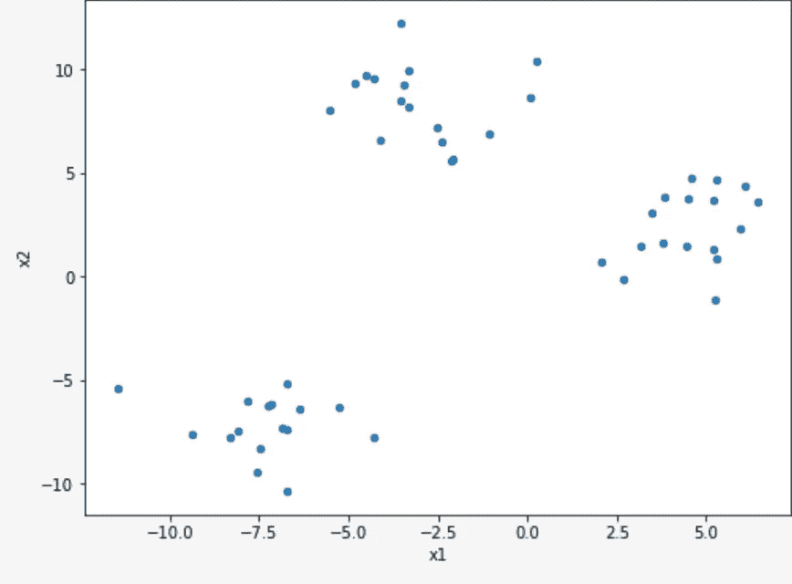
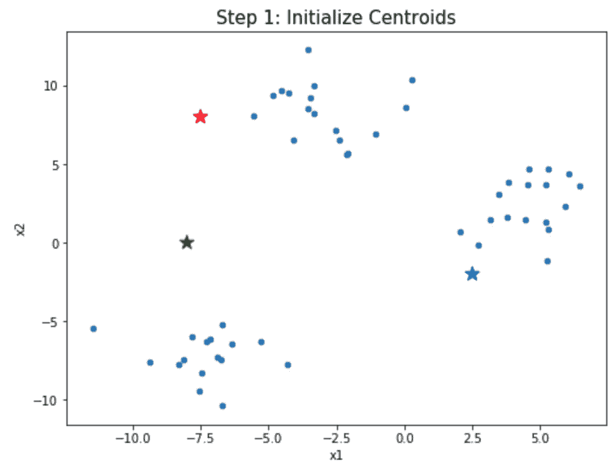

# 基于 K-均值的实用聚类

> 原文：<https://towardsdatascience.com/k-means-practical-1ab126e52f58?source=collection_archive---------10----------------------->

在数据科学领域，无监督学习通常被视为有点“非传统”，尤其是当需要经验证明的结果时。然而，K-Means 聚类具有持久的流行性，因为它使用起来相对简单，还因为它是一种强大的(尽管有时)探索性数据分析工具。

正如我在上一篇[文章](https://medium.com/@hbblais/classification-clustering-and-you-fbf35cc8400f?source=friends_link&sk=840dfaaa604803521bca4762423905d0)中承诺的，我将在下面介绍一些简单的 K 均值聚类的基础知识！

无监督学习与聚类的比较综述；


与本博客中的其他实际例子相反，明眼人会注意到我们没有“真实的”、可测试的数据可以比较！当不存在测试案例时，K-means (KM)和其他无监督学习算法最有帮助——我们将继续假设数据集的可测试数据不存在或已被排除在考虑范围之外。
我们开始吧！

# K-均值聚类理论；

K-Means 聚类只是聚类算法家族中的一个分支，我们将在这里暂时忽略它。KM 是这个家族中最受欢迎的成员之一，因为它相当简单，易于可视化，并且使用概念上简单的度量标准。具体来说，KM 算法寻求围绕“质心”点对数据观察进行聚类。在我们进入质心之前，先看一下聚类前的样本数据图:



Pre-Clustered Data

正如您所看到的，有三组明显不同的数据，几乎可以肯定地代表了基本数据的趋势，我们在这一点上可能知道，也可能不知道。本例中使用的数据非常简洁，因为我们将在 Python 3 环境中用下面的单元格生成它。如果你愿意，继续复制这段代码；

```
### Building k-means example, step by step!#### Made sure to import and/or download the following libraries:from sklearn.datasets import make_blobs   # tool to create our sample data
import matplotlib.pylab as plt            # standard plotting
import pandas as pd, numpy as np %matplotlib inline                        # very handy 'magic' commandfigsize=(8, 6)colors = ["r", "b", "g"]
columns = ["x1", "x2", "color"] # We'll work with a managable sample of 50 observations in 3 distinct clusters.  You can follow these specifications in the arguments below: 
X, color = make_blobs(n_samples=50, random_state=42, centers=3, cluster_std=1.75)# setting the colors we'll use in a little while
X = map(lambda x: (x[0][0], x[0][1], colors[x[1]]), zip(X, color))# Starting centroid points.  These can be arbitrary, but it helps to give intelligently-designated starting points:
centroids = pd.DataFrame([(-8, 0, "g"), (-7.5, 8, "r"), (2.5, -2, "b")], columns=columns)# Training points
gaus_df = pd.DataFrame(list(X), columns=columns)
```

现在，通过下面的代码，我们可以将颜色应用到我们的数据中，并使其更加清晰地可视化！

```
ax = gaus_df.plot(kind="scatter", x="x1", y="x2", figsize=figsize)
ax.set_title("Begin: Load Data Points", fontsize=15)
```



继续运行该单元格，您应该会生成右边的简单图形！

请注意，数据本身仍然是单色的，我们创建的彩色质心都有点，嗯，没有从它们似乎相关的集群中分离出来。

正如我前面提到的，K-Means 聚类就是要最小化数据观察值和它们的质心之间的均方距离(MSD)。在某些情况下(就像在这个例子中)，我们甚至会在这里使用纯欧氏距离作为度量，因此 K-Means 有时会与 K 最近邻分类模型混淆，但这两种算法的操作有点不同。

非常重要的是，KM 将迭代地从它们的起始位置“行走”所选择的质心，朝向使从数据到最近的或最相似的质心的 MSD 最小化的质心。作为参考，我将在这里包含一个代码来生成欧几里得距离的可视检查:

```
import numpy as np
import pandas as pd
from sklearn.metrics import euclidean_distances
from sklearn.datasets.samples_generator import make_blobs
import matplotlib.pyplot as plt%matplotlib inlineX = np.array([[2, -1], [-2, 2]])plt.figure(figsize=(12, 7))
for i, (x, y) in enumerate(X):
    plt.scatter(y, x)
    plt.text(y + .05, x -.05, "$X_%d$" % (i+1), size=22)

plt.plot(X[0], X[1], "g--")
plt.text(.5, .5, "$\sqrt{\sum_{i=1}^N (x_{1i} - x_{2i})^2}$", size=25)
plt.title("Euclidean Distance Between $x_1$ and $x_2$", size=15)
```


当 KM 在数据中循环移动质心时，它学会识别你我在初始数据图中可以直观看到的不同簇！这是一个非常简单的例子，所以 KM 收敛到一个很好的、不同的集群只需要很少的工作。查看下面的示例图，一步一步地展示这一过程:


Step 1: Initializing Centroids

我们已经检查了上面的单元格，但是我将再次包括它，以浏览 K-Means 的逻辑流程

这里，我们的质心是“任意”选择的，因此它们可以应用于观察数据的聚类


Step 2: Calculating Centroid Point-Distances (Euclidean)

在右边，注意每个质心是如何考虑每个数据点的。当在非常大的数据集上运行时，这个算法在计算上可能有点昂贵！


Step 3: Assigning Data Points to Nearest Centroid

就编码而言，这是我们的新领域。我们将在下面回顾如何产生这种结果，但是现在只需观察数据是如何被整齐地分成不同的组的！

此外，请注意，质心没有移动，这适用于简单数据，但对于更复杂的数据，需要更多的步骤。


Step 3 — Onwards: Repeat Step 2 and 3 until Convergence

在这里，我们通过步骤 2 和 3(上面)循环，直到数据收敛！这只是意味着质心将逐渐在图上移动，直到它们从自身到最近的数据点的总 MSD 最小！


Output

一旦实现了融合，我们就有了清晰的数据集群！这些聚类将共享原始数据中的特征，其中一些特征从数据帧本身来看可能并不明显。

现在，让我们从头到尾看一个实际的例子:

# 应用的 K 均值:

首先，我们将生成一些样本数据:

```
%matplotlib inlinefrom sklearn.cluster import KMeans, k_means
from sklearn.metrics import silhouette_score
from sklearn.datasets.samples_generator import make_blobsimport numpy as np
import pandas as pdimport seaborn as sns
import matplotlib.pyplot as plt
import matplotlibmatplotlib.style.use('ggplot')# # Let's make some more blobs to test K-Means on
X, color = make_blobs(n_samples=100, random_state=29, centers=3, cluster_std=1.5)
df = pd.DataFrame(X, columns=["x1", "x2"])
df['color'] = color
df.head()
```


Sample of Generated Data

使用 Matplotlib 绘制数据:

```
# Plot the scatter -- we need to code the previous cell to get "df"
ax = df.plot(kind="scatter", x="x1", y="x2", figsize=(12,6), s=50)
plt.xlabel("$X_1$", fontsize=18)
plt.ylabel("$X_2$", fontsize=18)
ax.tick_params(axis='both', which='major', labelsize=18)
```


Neat Clusters from make_blobs

现在我们可以进入有趣的部分了；用 Sklearn 的软件包拟合数据:

```
## Take note that the latest version of Kmeans my behave slightly different.  
kmeans = KMeans(n_clusters=3)
model = kmeans.fit(df[['x1', 'x2']])# Now, we can get the predicted model labels, or Centroids, in the form of an array:
model.cluster_centers_
```

现在，我们将这些标签附加到数据框上，用于将来的绘图，并将质心分配给它们自己的数据框:

```
# attach predicted cluster to original points
df['predicted'] = model.labels_# Create a dataframe for cluster_centers (centroids)
centroids = pd.DataFrame(model.cluster_centers_, columns=["x1", "x2"])
```

这应该生成一个基本的，但示范性的，K-均值聚类图！

```
from matplotlib import pyplot as pltplt.figure(figsize=(7,7))## Plot scatter by cluster / color, and centroids
colors = ["red", "green", "blue"]
df['color'] = df['predicted'].map(lambda p: colors[p])ax = df.plot(    
    kind="scatter", 
    x="x1", y="x2",
    figsize=(10,8),
    c = df['color']
)centroids.plot(
    kind="scatter", 
    x="x1", y="x2", 
    marker="*", c=["r", "g", "b"], s=550,
    ax=ax
)
```


Final Plot of Distinct Clusters

这是对 K-Means 聚类的简单概述！请注意，许多异常和错误标记的数据点很可能出现在不太完美的真实数据中，但这应该可以帮助您入门。特别要注意“whispy”数据，或者沿 X、Y 或两个轴聚集成细长簇的数据，这个简单的模型无法区分这些种类的簇，只能找到最近的点进行簇分配，从而导致一些交叉污染！我将在以后继续举例说明如何避免这种情况。感谢阅读！