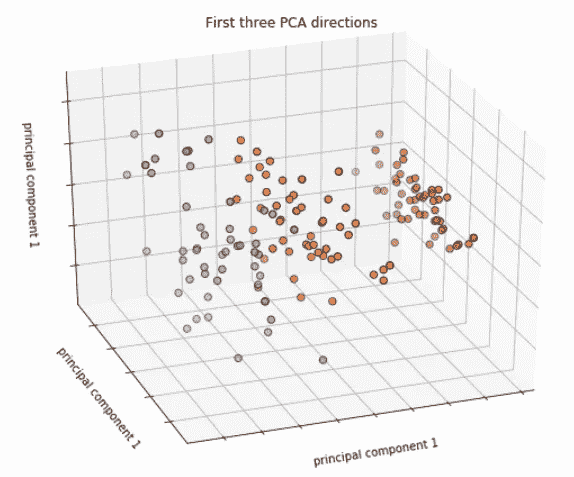
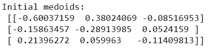

# Iris 数据集上的 K-Medoids 聚类

> 原文：<https://towardsdatascience.com/k-medoids-clustering-on-iris-data-set-1931bf781e05?source=collection_archive---------1----------------------->

几乎在任何机器学习课程中， **K-Means Clustering** 将是第一批引入无监督学习的算法之一。由于这一点，它比它的表亲 **K-Medoids 集群**更受欢迎。如果你谷歌一下“k-means”，会弹出 14.9 亿个结果。对“k-medoids”这样做，只有 23.1 万个结果返回。

当我在一次期末考试中被要求实现 k-medoids 聚类算法时，这就是我的挣扎。这花了一段时间，但我设法做到了。因此，为了帮助 k-medoid 的概念看到更多的行动，我决定将我构建和实现的算法放在这里，这一次，基于“臭名昭著”的虹膜数据集。

# **简介**

k-means 和 k-medoids 算法都是分区的，这涉及到将数据集分成组。K-means 旨在最小化每个聚类中心位置的总平方误差。这些中心位置被称为质心。另一方面，k-medoids 试图最小化被标记为在聚类中的对象和被指定为该聚类的代表的对象之一之间的不相似性的总和。这些代表被称为水母。

与 k-means 算法相反，k-medoids 从集合中的数据点选择 medoids，k-means 算法认为质心是中心的平均位置，可能不是集合中的数据点。

# **数据准备**

我们将使用来自 **sklearn** 库中的**虹膜数据集**的副本。为了演示算法，我将跳过将数据集分为训练集和测试集的步骤，而是使用一个数据集来训练和拟合模型。

下面是萼片长度、宽度的测量数据；3 种不同类型的鸢尾的花瓣长度和宽度:['setosa '，' versicolor '，' virginica']，标记为[0，1，2]:

我有一个习惯，当数据在不同的列上时，我会针对这些类型的问题缩放数据。因为没有丢失数据，所以让我们继续缩放。我使用了同一个库 **sklearn** 的 **MinMaxScaler** 类。以下是换算后的数据:

有 4 个特征对于聚类模型的可视化和拟合可能不理想，因为它们中的一些可能高度相关。因此，我们将采用主成分分析(PCA)将 4 维数据转换为 3 维数据，同时保持那些预测值的显著性，这些预测值具有来自 **sklearn** 的 **PCA** 类。降维后的数据如下:

我们最终可以在三维平面上看到这些:

# **实施**

我们首先开始看相异度函数。有很多选择但是在这里，我们将使用常见的 [**闵可夫斯基距离**](https://en.wikipedia.org/wiki/Minkowski_distance) **函数**的给定顺序。我们将要实现的算法叫做**Medoids(PAM)**算法(Kaufman 和 Rousseeuw 1990)。可以总结如下:

1.  **初始化**:随机选择𝑚数据点的𝑘作为 medoids
2.  **赋值**:根据闵可夫斯基距离将每个数据点关联到最近的 medoid
3.  **更新**:对于每个 medoid 𝑗和每个与𝑗关联的数据点𝑖，交换𝑗和𝑖，并计算配置的总成本(即𝑖与所有与𝑗).关联的数据点的平均相异度选择配置成本最低的 medoid 𝑗。在第 2 步和第 3 步之间重复，直到分配**没有变化**。

在下面的代码中，使用我们通常的“数据矩阵”约定会很方便，也就是说，在数据矩阵𝑋中，每一行𝑥̂是𝑚的一个观测值，每一列𝑥是𝑓的一个特征。

**1。Medoid 初始化**

为了开始算法，我们需要一个初始猜测。让我们从数据中随机选择𝑘观测值。在这种情况下，𝑘 = 3，代表 3 种不同类型的虹膜。

接下来，我们将创建一个函数 init_medoids(X，k ),以便它随机选择给定观测值的𝑘作为 medoids。它应该返回一个大小为𝑘×𝑑的 NumPy 数组，其中𝑑是 x 的列数

从数据点初始化 3 个随机 medoids 后，我们有:

**2。计算距离**

实现计算距离矩阵的函数，𝑆 = (s_𝑖𝑗)使得 s_𝑖𝑗 = 𝑑^ 𝑝_𝑖𝑗是从𝑥_𝑖点到𝜇_𝑖.的𝑝阶的闵可夫斯基距离它应该返回一个 NumPy 矩阵𝑆与形状(𝑚,𝑘).

𝑝^𝑡ℎ命令𝑥和𝜇两点之间的闵可夫斯基距离由下式给出:

因此，对于矩阵𝑆的元素，

闵可夫斯基距离通常与𝑝1 或 2 一起使用，分别对应于 [**曼哈顿距离**](https://en.wikipedia.org/wiki/Taxicab_geometry) 和 [**欧几里德距离**](https://en.wikipedia.org/wiki/Euclidean_distance) 。我们将在计算中使用欧几里得距离。

基于此，矩阵 S 的前 5 个元素是:

**3。集群分配**

现在，我们构建一个作用于距离矩阵 S 的函数，使用最小距离为每个点分配 0，1，2 的“聚类标签”,以找到“最相似”的 medoid。

也就是说，对于由行索引𝑖指示的每个点，如果𝑠_𝑖𝑗是点𝑖的最小距离，则索引𝑗是𝑖的聚类标签。换句话说，该函数应该返回长度为𝑚的一维数组𝑦，如下所示:

然后，我们获得第一次迭代的数据点的标签:

**4。交换测试**

在此步骤中，对于每个 medoid 𝑗和与𝑗关联的每个数据点𝑖，交换𝑗和𝑖，并计算配置的总成本(即𝑖与∑𝑠_𝑖𝑗所有数据点的平均差异)，如**步骤 3** 所示。选择配置成本最低的 medoid 𝑗。

也就是说，对于每个聚类，搜索该聚类中的任何点是否降低了平均相异系数。选择降低该系数最大的点作为该聚类的新 medoid。

最后，我们还需要一个函数来检查 medoid 是否已经“移动”，给定 med oid 值的两个实例。这是检查 medoids 是否不再移动以及迭代是否应该停止的函数。

**4。将所有这些放在一起**

当我们组合上述所有函数时，我们本质上组合了 K-Medoids 算法的步骤。

通过对我们拥有的数据点运行该函数，最终的 medoids 被发现为:

每个数据点的聚类标签是:

通过考虑“不精确”匹配，上面的 K-Medoids 算法正确标记了 94.7%的数据点。这只是为了演示算法如何工作，这个数字没有太大意义，因为我们没有将数据分成训练集和测试集。

