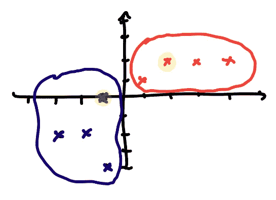
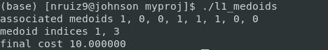

# 使用 ATS 的 K-Medoids 聚类:释放模板的力量

> 原文：<https://towardsdatascience.com/k-medoids-clustering-using-ats-unleashing-the-power-of-templates-56cd7ab944bf?source=collection_archive---------14----------------------->

 [## natanielruiz/ats-kmedoids

### 使用模板在 ATS 中实现 k-medoids。为 natanielruiz/ats-kmedoids 的发展作出贡献。

github.com](https://github.com/natanielruiz/ats-kmedoids) 

(您可以在上面找到所有相关的代码)

k-medoids 聚类是一种经典的聚类机器学习算法。它是 k-means 算法的一种推广。唯一的区别是聚类中心只能是数据集的元素之一，这产生了一种可以使用任何类型的距离函数的算法，而 k-means 只能使用 L2 范数证明收敛。

当我在*波斯顿大学*学习 *CS520 编程语言*课程，并与 ATS 编程语言的创始人 Xi 教授一起工作时，我意识到 ATS 是处理这种算法的天然选择。事实上，**模板**允许 k-medoids 的一个非常通用的实现。在实现了模板函数之后，要在数据集上运行它，剩下的唯一需要实现的就是**距离函数**。这意味着以这种方式编写的算法可以在用户希望的任何数据集上工作，假设用户可以在数据集中的点之间实现良好定义的距离函数。

让我们一步一步地展示这是如何工作的。

Import all necessary libraries — the mylib function which defines the mylist type is included in the GitHub repo

The outline of the k-medoids algorithm

在解析和理解了 k-medoids 算法之后，我们可以看到我们必须实现几个模板函数。但是首先让我们定义一些方便的数据类型。注意，这些数据类型有一个内部数据类型**“a”**，它将在实现距离函数时定义。这意味着我们的代码是完全通用的——允许任何有限长度和任何类型(例如整数、双精度、浮点、字符)的数据集点。

point(a) is a list of type a and pointlst(a) is a dataset of points of type

接下来我们定义大家伙。我们 k-medoid 算法的模板。KMedoidsTrain 接收数据集 p 和聚类数，施展魔法，输出最终配置的 **medoids、聚类**和 **cost** 。

We define templates for the k-medoids training function and the k-medoids loop function

我们定义了一些模板来

*   初始化 medoids
*   将数据集中的点与最近的 medoid 相关联
*   查找特定点的 medoid
*   给定 medoid 索引列表，查找 med oid 的坐标
*   用 medoid *i* 替换数据集中的点 *j*

也有一些模板来计算成本和距离。

在这一点上，我们可以问:这些函数中的哪一个可以被完整地定义并应用于我们想要解决的任何聚类问题？

实际上，请**停止滚动**，我们来玩个游戏。请回答这个问题:每当我们想改变距离度量的定义时，我们必须定义哪些函数？(答案在下面)

.

.

.

.

.

.

.

.

答案只有**距离**功能。也许您认为成本函数也需要针对每个问题单独实现，但事实并非如此。成本函数应该基本上计算所有点和它们的中面之间的距离，并将这些距离相加-它取决于距离函数，并且可以独立编码。

所有这些都是好消息。一套函数实现可以解决你想解决的任何问题。您只需要为数据集定义一个距离函数。

实际上，让我们看看这是如何工作的。让我们实现 costf 函数，该函数在给定点 p、中面和聚类的数据集的情况下，给出了这些点和它们的中面之间的所有距离的总和。

通常在 ATS 中，我们使用递归来计算这个结果，并使用一个辅助函数 costf_aux 来计算这个结果。请记住，在这种情况下，我们有 medoids，它是包含 medoids 的 ndis 的列表(数据集中的哪些点是 medoids ),我们使用 lookup_medoids 函数获得的 medoid _ pts 是包含 medoids 的坐标的列表。

在辅助成本函数中，我们使用模式匹配(case+ p of)遍历数据集 **p** 。当数据集已经被迭代通过时，我们输出累加器 res。当我们仍然迭代通过数据集时，我们获得点 p1 所属的聚类，我们获得对应于该聚类的 medoid 坐标 m，然后使用仍然未指定的距离函数简单地计算距离。

下面我们来快速看一下 lookup_medoids。它只是一个辅助函数，接受数据集和 medoid 索引，并为我们提供 medoid 坐标。你不希望在不必要的时候到处传递 medoid 坐标！

让我们回到算法上。

KMedoidsTrain 接受数据集 *p* 和*数量的簇*，使用辅助函数 KMedoidsTrainIter 给我们结果。

代码非常简单明了。但是如果您需要一些帮助来解析它，步骤如下:

如果聚类没有完成:

*   将 medoid j 换成点 I
*   获取所有点的新聚类
*   获取下一次迭代的索引(I，j，step )(我使用下面的帮助函数使代码更整洁)

*   如果新成本低于旧成本，则使用新的 medoids！如果不是，继续用旧的。

相当简单！

如何初始化 medoids？只需使用辅助函数获取数据集的“n_cluster”个第一元素。抓取随机元素会更好，但这仍然是初始化算法的有效方式。

for loops are for beginners

好的，最后，我们如何将数据集中的每个点与其对应的 medoid 关联起来？首先，我们定义一个函数来为一个特定的点 p1 找到相应的 medoid。然后我们用它在 associate_points 函数中寻找所有对应的 medoids。

Simple recursion with pattern matching where, at each step, we compare the distance to the old medoid to the distance to the new medoid. If the distance is lesser then the new medoid is carried on!

Here we are basically finding the medoids for all points in the dataset. A simple recurrence.

还有一件事。我们如何把 medoid i 换成 j 点？使用 mylib 中的一个可以在 GitHub 上查找的函数:)

我们开始有趣的部分了！

让我们定义一个新文件 l2_medoids.dats，并将最后一个文件命名为 clustering.dats

导入包含模板函数定义的前一个文件。还要导入 C 库调用平方根函数。

ATS can call external C functions to do math

我们有一个像这样的数据集。我们希望使用 **k-medoids 算法**和 **L2 距离函数**进行聚类(使用 **2 个聚类**)。你能看到结果会是什么吗？

好吧，有趣的部分。定义两点之间的距离函数。请记住，到目前为止，点是未指定长度和未指定类型 a 的列表。非常一般！现在我们实际上告诉编译器，我们正在处理类型为 **double 的点。我们还告诉编译器如何计算数据集的距离。**

Recurrence through the point coordinates. d = sqrt((p1 — p2) ** 2)

是时候在同一个文件中定义 L2 距离的 k-medoids 函数了。

还有一个与上面画的 2D 例子相对应的小例子！让我们看看我们是否做对了。

使用 ATS 编译器“patscc”编译所有这些内容。咻没有错误！ATS 是一种强类型语言，许多潜在的错误会在编译时被清除。调试时，编译器捕获了我的大部分实现错误，因为有些函数没有被输入正确的类型。大多数情况下，运行时错误将是越界错误，尽管使用高级 ATS 编程(如定理证明)甚至可以在编译时捕获这些错误。

所有这些特点使 ATS 成为一种有趣的编程语言。

**无论如何，让我们运行代码**

我们有相关的几何图列表、最终几何图以及最终配置的成本函数。让我们画出最终状态，看看是否正确。

Two clusters in red and blue. The highlighted points are the cluster medoids.

完美！如果您想在数据集上使用这些代码，请随意。请记住，您只需实现距离函数，就万事俱备了。

就这么简单。作为告别，让我们定义一下 L1 距离，它可以用在同样的问题上。

L1 distance function

Different results. Makes sense!

Same clusters, different medoids!