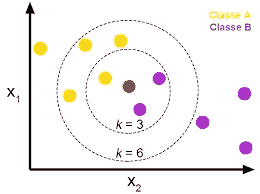
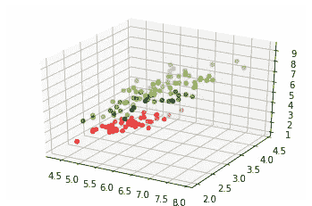

# Python 中从头开始的 k 近邻分类器

> 原文：<https://towardsdatascience.com/k-nearest-neighbor-classifier-from-scratch-in-python-698e3de97063?source=collection_archive---------10----------------------->


“让我看看谁是你的朋友，我就能知道你是谁？”

k-最近邻分类器的概念几乎不能被更简单地描述。这是一句老话，在许多语言和许多文化中都可以找到。圣经中的其他话也提到:“与智慧人同行的，必得智慧；与愚昧人作伴的，必受伤害”(箴言 13:20)

这意味着 k-最近邻分类器的概念是我们日常生活和判断的一部分:想象你遇到一群人，他们都非常年轻，时尚和爱运动。他们谈论他们的朋友本，谁没有和他们在一起。那么，你对本的想象是怎样的？没错，你认为他年轻、时尚、富有运动精神。

如果你知道本住在一个人们投保守党票的社区，而且平均年收入超过 20 万美元？他的两个邻居年收入甚至超过 30 万美元？你觉得本怎么样？最有可能的是，你不认为他是一个失败者，你可能会怀疑他也是一个保守派？

最近邻分类背后的原理在于找到距离新样本最近的训练样本的预定数量，即“k”，该新样本必须被分类。新样本的标签将根据这些邻居来定义。k-最近邻分类器对于必须确定的邻居数量具有固定的用户定义常数。还有基于半径的邻居学习算法，该算法基于点的局部密度具有不同数量的邻居，所有样本都在固定半径内。一般来说，距离可以是任何度量单位:标准欧几里得距离是最常见的选择。基于邻居的方法被称为非一般化机器学习方法，因为它们只是“记住”所有的训练数据。可以通过未知样本的最近邻的多数投票来计算分类。

**现在让我们从数学角度来看:**

与其他分类方法相比，k-最近邻分类器(k-NN)直接在学习的样本上工作，而不是创建规则。

**最近邻算法:**

给定一组类别{c1，c2，…cn}也称为类，例如{“男性”，“女性”}。还有一个由带标签的实例组成的学习集 LSLS。

分类的任务在于给一个任意的实例指定一个类别。如果实例 oo 是 LSLS 的一个元素，将使用实例的标签。

现在，我们来看看 oo 不在 LSLS 的情况:

oo 与 LSLS 的所有实例相比较。距离度量用于比较。我们确定 oo 的 kk 个最近邻居，即具有最小距离的项目。kk 是用户定义的常数，是一个正整数，通常很小。

最常见的 LSLS 类将被分配给实例 oo。如果 k = 1，那么该对象被简单地分配给该单个最近邻的类。

k-最近邻分类器的算法是所有机器学习算法中最简单的。k-NN 是一种基于实例的学习，或称惰性学习，在这种学习中，当我们进行实际的分类时，只对函数进行局部近似，并执行所有的计算。



在我们真正开始编写最近邻分类器之前，我们需要考虑数据，即学习集。我们将使用 sklearn 模块的数据集提供的“iris”数据集。

数据集由来自三种鸢尾的每一种的 50 个样本组成

*   鸢尾，
*   北美鸢尾和
*   杂色鸢尾。


测量每个样本的四个特征:萼片和花瓣的长度和宽度，以厘米为单位。

```
import numpy as np
from sklearn import datasets

iris = datasets.load_iris()
iris_data = iris.data
iris_labels = iris.target
print(iris_data[0], iris_data[79], iris_data[100])
print(iris_labels[0], iris_labels[79], iris_labels[100])
```

**这是预期的输出:**

```
[5.1 3.5 1.4 0.2] [5.7 2.6 3.5 1\. ] [6.3 3.3 6\.  2.5]
0 1 2
```

我们从上面的集合中创建一个学习集。我们使用 np.random 中的排列来随机拆分数据。

```
np.random.seed(42)
indices = np.random.permutation(len(iris_data))
n_training_samples = 12
learnset_data = iris_data[indices[:-n_training_samples]]
learnset_labels = iris_labels[indices[:-n_training_samples]]
testset_data = iris_data[indices[-n_training_samples:]]
testset_labels = iris_labels[indices[-n_training_samples:]]
print(learnset_data[:4], learnset_labels[:4])
print(testset_data[:4], testset_labels[:4]) 
```

**输出:**

```
[[6.1 2.8 4.7 1.2]
 [5.7 3.8 1.7 0.3]
 [7.7 2.6 6.9 2.3]
 [6\.  2.9 4.5 1.5]] [1 0 2 1]
[[5.7 2.8 4.1 1.3]
 [6.5 3\.  5.5 1.8]
 [6.3 2.3 4.4 1.3]
 [6.4 2.9 4.3 1.3]] [1 2 1 1]
```

下面的代码只是可视化我们的 learnset 的数据所必需的。我们的数据由每个 iris 项目的四个值组成，因此我们将通过对第三和第四个值求和来将数据减少到三个值。这样，我们能够在三维空间中描述数据:

```
# following line is only necessary, if you use ipython notebook!!!
%matplotlib inline 

import matplotlib.pyplot as plt
from mpl_toolkits.mplot3d import Axes3D

X = []
for iclass in range(3):
    X.append([[], [], []])
    for i in range(len(learnset_data)):
        if learnset_labels[i] == iclass:
            X[iclass][0].append(learnset_data[i][0])
            X[iclass][1].append(learnset_data[i][1])
            X[iclass][2].append(sum(learnset_data[i][2:]))

colours = ("r", "g", "y")

fig = plt.figure()
ax = fig.add_subplot(111, projection='3d')

for iclass in range(3):
       ax.scatter(X[iclass][0], X[iclass][1], X[iclass][2], c=colours[iclass])
plt.show()
```



## 确定邻居

为了确定两个实例之间的相似性，我们需要一个距离函数。在我们的例子中，欧几里德距离是理想的:

```
def distance(instance1, instance2):
    # just in case, if the instances are lists or tuples:
    instance1 = np.array(instance1) 
    instance2 = np.array(instance2)

    return np.linalg.norm(instance1 - instance2)

print(distance([3, 5], [1, 1]))
print(distance(learnset_data[3], learnset_data[44]))4.47213595499958
3.4190641994557516
```

函数“get_neighbors”返回一个包含“k”个邻居的列表，这些邻居离实例“test_instance”最近:

```
def get_neighbors(training_set, 
                  labels, 
                  test_instance, 
                  k, 
                  distance=distance):
    """
    get_neighors calculates a list of the k nearest neighbors
    of an instance 'test_instance'.
    The list neighbors contains 3-tuples with  
    (index, dist, label)
    where 
    index    is the index from the training_set, 
    dist     is the distance between the test_instance and the 
             instance training_set[index]
    distance is a reference to a function used to calculate the 
             distances
    """
    distances = []
    for index in range(len(training_set)):
        dist = distance(test_instance, training_set[index])
        distances.append((training_set[index], dist, labels[index]))
    distances.sort(key=lambda x: x[1])
    neighbors = distances[:k]
    return(neighbors)
```

我们将使用虹膜样本测试该功能:

```
for i in range(5):
    neighbors = get_neighbors(learnset_data, 
                              learnset_labels, 
                              testset_data[i], 
                              3, 
                              distance=distance)
    print(i, 
          testset_data[i], 
          testset_labels[i], 
          neighbors)
```

输出:

```
0 [5.7 2.8 4.1 1.3] 1 [(array([5.7, 2.9, 4.2, 1.3]), 0.14142135623730995, 1), (array([5.6, 2.7, 4.2, 1.3]), 0.17320508075688815, 1), (array([5.6, 3\. , 4.1, 1.3]), 0.22360679774997935, 1)]
1 [6.5 3\.  5.5 1.8] 2 [(array([6.4, 3.1, 5.5, 1.8]), 0.1414213562373093, 2), (array([6.3, 2.9, 5.6, 1.8]), 0.24494897427831783, 2), (array([6.5, 3\. , 5.2, 2\. ]), 0.3605551275463988, 2)]
2 [6.3 2.3 4.4 1.3] 1 [(array([6.2, 2.2, 4.5, 1.5]), 0.2645751311064586, 1), (array([6.3, 2.5, 4.9, 1.5]), 0.574456264653803, 1), (array([6\. , 2.2, 4\. , 1\. ]), 0.5916079783099617, 1)]
3 [6.4 2.9 4.3 1.3] 1 [(array([6.2, 2.9, 4.3, 1.3]), 0.20000000000000018, 1), (array([6.6, 3\. , 4.4, 1.4]), 0.2645751311064587, 1), (array([6.6, 2.9, 4.6, 1.3]), 0.3605551275463984, 1)]
4 [5.6 2.8 4.9 2\. ] 2 [(array([5.8, 2.7, 5.1, 1.9]), 0.3162277660168375, 2), (array([5.8, 2.7, 5.1, 1.9]), 0.3162277660168375, 2), (array([5.7, 2.5, 5\. , 2\. ]), 0.33166247903553986, 2)]
```

## 投票以获得单一结果

我们现在要写一个投票函数。这个函数使用集合中的类“Counter”来计算实例列表中类的数量。这个实例列表当然是邻居。函数“vote”返回最常见的类:

```
from collections import Counter

def vote(neighbors):
    class_counter = Counter()
    for neighbor in neighbors:
        class_counter[neighbor[2]] += 1
    return class_counter.most_common(1)[0][0]
```

我们将在训练样本上测试“投票”:

```
for i in range(n_training_samples):
    neighbors = get_neighbors(learnset_data, 
                              learnset_labels, 
                              testset_data[i], 
                              3, 
                              distance=distance)
    print("index: ", i, 
          ", result of vote: ", vote(neighbors), 
          ", label: ", testset_labels[i], 
          ", data: ", testset_data[i])
```

…

```
index:  0 , result of vote:  1 , label:  1 , data:  [5.7 2.8 4.1 1.3]
index:  1 , result of vote:  2 , label:  2 , data:  [6.5 3\.  5.5 1.8]
index:  2 , result of vote:  1 , label:  1 , data:  [6.3 2.3 4.4 1.3]
index:  3 , result of vote:  1 , label:  1 , data:  [6.4 2.9 4.3 1.3]
index:  4 , result of vote:  2 , label:  2 , data:  [5.6 2.8 4.9 2\. ]
index:  5 , result of vote:  2 , label:  2 , data:  [5.9 3\.  5.1 1.8]
index:  6 , result of vote:  0 , label:  0 , data:  [5.4 3.4 1.7 0.2]
index:  7 , result of vote:  1 , label:  1 , data:  [6.1 2.8 4\.  1.3]
index:  8 , result of vote:  1 , label:  2 , data:  [4.9 2.5 4.5 1.7]
index:  9 , result of vote:  0 , label:  0 , data:  [5.8 4\.  1.2 0.2]
index:  10 , result of vote:  1 , label:  1 , data:  [5.8 2.6 4\.  1.2]
index:  11 , result of vote:  2 , label:  2 , data:  [7.1 3\.  5.9 2.1]
```

我们可以看到，除了索引为 8 的项目之外，预测与标注的结果一致。

“vote_prob”是一个类似于“vote”的函数，但它返回类名和该类的概率:

```
def vote_prob(neighbors):
    class_counter = Counter()
    for neighbor in neighbors:
        class_counter[neighbor[2]] += 1
    labels, votes = zip(*class_counter.most_common())
    winner = class_counter.most_common(1)[0][0]
    votes4winner = class_counter.most_common(1)[0][1]
    return(winner, votes4winner/sum(votes))
```

…

```
for i in range(n_training_samples):
    neighbors = get_neighbors(learnset_data, 
                              learnset_labels, 
                              testset_data[i], 
                              5, 
                              distance=distance)
    print("index: ", i, 
          ", vote_prob: ", vote_prob(neighbors), 
          ", label: ", testset_labels[i], 
          ", data: ", testset_data[i])
```

…

```
index:  0 , vote_prob:  (1, 1.0) , label:  1 , data:  [5.7 2.8 4.1 1.3]
index:  1 , vote_prob:  (2, 1.0) , label:  2 , data:  [6.5 3\.  5.5 1.8]
index:  2 , vote_prob:  (1, 1.0) , label:  1 , data:  [6.3 2.3 4.4 1.3]
index:  3 , vote_prob:  (1, 1.0) , label:  1 , data:  [6.4 2.9 4.3 1.3]
index:  4 , vote_prob:  (2, 1.0) , label:  2 , data:  [5.6 2.8 4.9 2\. ]
index:  5 , vote_prob:  (2, 0.8) , label:  2 , data:  [5.9 3\.  5.1 1.8]
index:  6 , vote_prob:  (0, 1.0) , label:  0 , data:  [5.4 3.4 1.7 0.2]
index:  7 , vote_prob:  (1, 1.0) , label:  1 , data:  [6.1 2.8 4\.  1.3]
index:  8 , vote_prob:  (1, 1.0) , label:  2 , data:  [4.9 2.5 4.5 1.7]
index:  9 , vote_prob:  (0, 1.0) , label:  0 , data:  [5.8 4\.  1.2 0.2]
index:  10 , vote_prob:  (1, 1.0) , label:  1 , data:  [5.8 2.6 4\.  1.2]
index:  11 , vote_prob:  (2, 1.0) , label:  2 , data:  [7.1 3\.  5.9 2.1]
```

# 摘要

在本教程中，您了解了如何使用 Python 从头开始实现 k 近邻算法。

具体来说，您学到了:

*   如何逐步编写 k-最近邻算法的代码？
*   如何在真实数据集上计算 k 近邻？
*   如何使用 k 近邻对新数据进行预测？

记住你可以在我的 github 库[这里](https://gist.github.com/Yassine-Hamdaoui/f84257b914b9eec491a69f425c2764d0)找到完整的工作代码。

**感谢**的阅读，我很乐意讨论你可能有的任何问题或纠正:)如果你想讨论机器学习或其他任何问题，请在 [LinkedIn](https://www.linkedin.com/in/yassine-hamdaoui/) 上找到我。