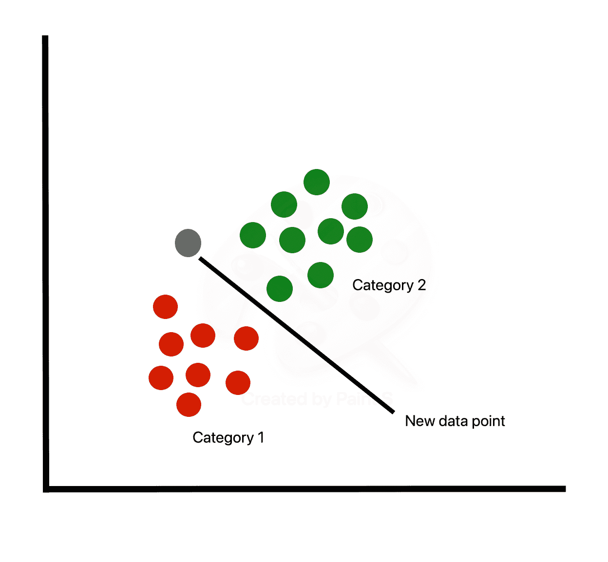
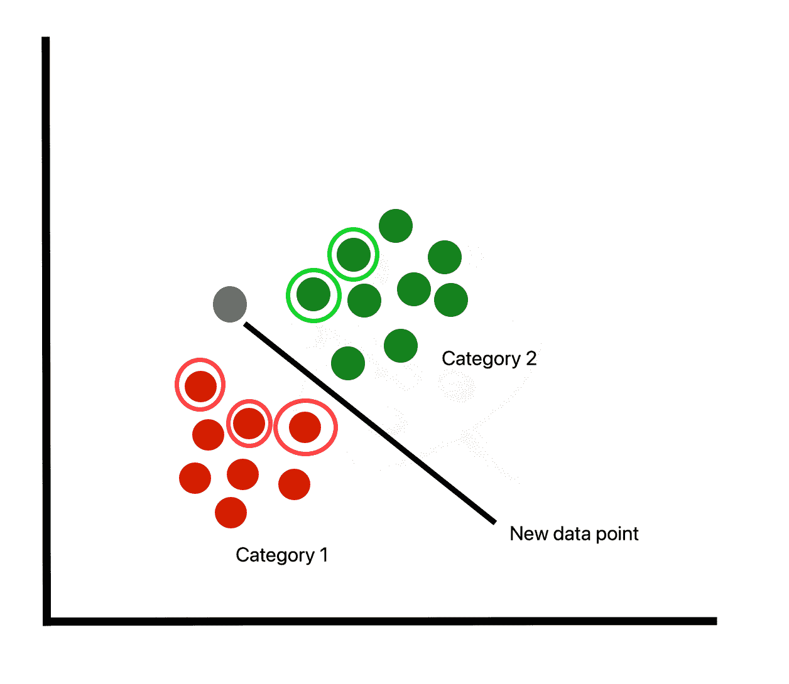
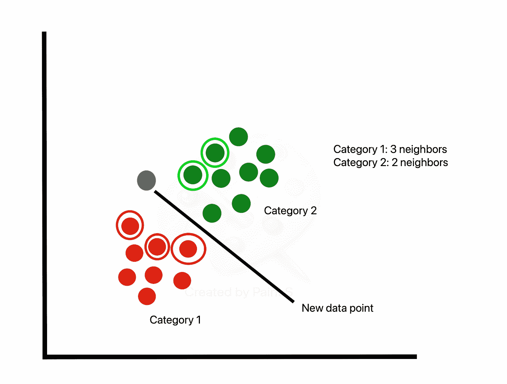
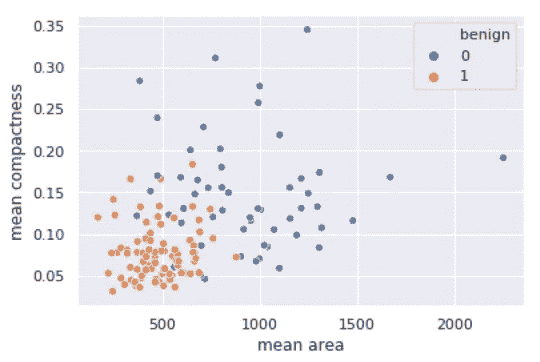
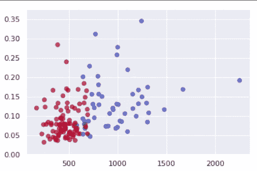
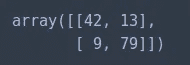

# Python 中的 k 近邻算法

> 原文：<https://towardsdatascience.com/k-nearest-neighbor-python-2fccc47d2a55?source=collection_archive---------1----------------------->


[https://www.pexels.com/photo/photo-of-woman-standing-in-front-of-blackboard-5212320/](https://www.pexels.com/photo/photo-of-woman-standing-in-front-of-blackboard-5212320/)

k 近邻，简称 KNN，是最简单的机器学习算法之一，被广泛应用于各种机构。KNN 是一个**非参数的，懒惰的**学习算法。当我们说一种技术是非参数化的，这意味着它不对底层数据做任何假设。换句话说，它根据与其他数据点的接近程度进行选择，而不管数值代表什么特征。成为一个懒惰的学习算法暗示着几乎没有训练阶段。因此，当新数据点出现时，我们可以立即对其进行分类。

# KNN 的一些利弊

**优点**:

*   没有关于数据的假设
*   简单的算法—易于理解
*   可用于分类和回归

**缺点**:

*   高内存要求-所有训练数据都必须存在于内存中，以便计算最近的 K 个邻居
*   对不相关的特征敏感
*   对数据规模敏感，因为我们正在计算到最近的 K 个点的距离

# 算法

1.  为 **K** 选择一个值(即 5)。



2.根据新数据点的欧氏距离，取其最近的 K 个邻居。



3.在这些相邻点中，计算每个类别中的数据点数量，并将新数据点分配到您计算的相邻点最多的类别。



# 密码

让我们看看如何使用 Python 中的 K 近邻算法对数据进行分类。在本教程中，我们将使用来自`sklearn.datasets`模块的乳腺癌数据集。我们需要从导入过程库开始。

```
import numpy as np
import pandas as pd
from matplotlib import pyplot as plt
from sklearn.datasets import load_breast_cancer
from sklearn.metrics import confusion_matrix
from sklearn.neighbors import KNeighborsClassifier
from sklearn.model_selection import train_test_split
import seaborn as sns
sns.set()
```

该数据集将肿瘤分为两类(恶性和良性)，包含大约 30 个特征。在现实世界中，你可以查看相关性，并选择在确定肿瘤是否为恶性时起最大作用的特征子集。然而，为了简单起见，我们将随机选择几个。我们必须对分类数据进行编码，以便模型对其进行解释(即恶性= `0`和良性= `1`)。

```
breast_cancer = load_breast_cancer()
X = pd.DataFrame(breast_cancer.data, columns=breast_cancer.feature_names)
X = X[['mean area', 'mean compactness']]
y = pd.Categorical.from_codes(breast_cancer.target, breast_cancer.target_names)
y = pd.get_dummies(y, drop_first=True)
```

正如在另一个教程中提到的，构建模型的目的是用未定义的标签对新数据进行分类。因此，我们需要将数据放在一边，以验证我们的模型在分类数据方面是否做得很好。默认情况下，`train_test_split`在原始数据集中留出 25%的样本进行测试。

```
X_train, X_test, y_train, y_test = train_test_split(X, y, random_state=1)
```

`sklearn`库在 Python 之上提供了一个抽象层。因此，为了利用 KNN 算法，创建一个`KNeighborsClassifier`的实例就足够了。默认情况下，`KNeighborsClassifier`会寻找 **5** 最近的邻居。我们必须明确地告诉分类器使用欧几里德距离来确定相邻点之间的接近度。

```
knn = KNeighborsClassifier(n_neighbors=5, metric='euclidean')
knn.fit(X_train, y_train)
```

使用我们新训练的模型，我们根据肿瘤的平均密度和面积来预测肿瘤是否是良性的。

```
y_pred = knn.predict(X_test)
```

我们直观地将我们的模型做出的预测与测试集中的样本进行比较。

```
sns.scatterplot(
    x='mean area',
    y='mean compactness',
    hue='benign',
    data=X_test.join(y_test, how='outer')
)
```



```
plt.scatter(
    X_test['mean area'],
    X_test['mean compactness'],
    c=y_pred,
    cmap='coolwarm',
    alpha=0.7
)
```



评估我们模型的另一种方法是计算混淆矩阵。混淆矩阵对角线上的数字对应于正确的预测，而其他数字意味着假阳性和假阴性。

```
confusion_matrix(y_test, y_pred)
```



给定我们的混淆矩阵，我们的模型具有 121/143 = 84.6%的准确度。

# 结论

当新数据可用时，K 最近邻算法不需要任何额外的训练。相反，它根据某种距离度量来确定 K 个最近的点(样本必须驻留在存储器中)。然后，它查看每个邻居的目标标签，并将新发现的数据点放入与大多数数据点相同的类别中。鉴于 KNN 计算距离，我们必须扩展我们的数据。此外，由于 KNN 忽略了潜在的特征，我们有责任过滤掉任何被认为不相关的特征。