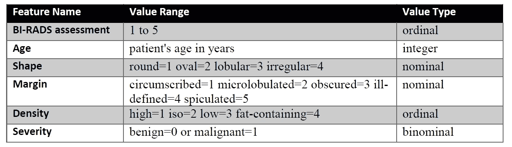
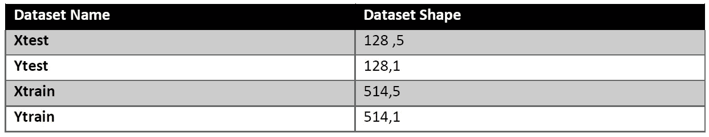

# k 近邻法:预测乳腺 x 线肿块病变的严重程度

> 原文：<https://towardsdatascience.com/k-nearest-neighbour-predicting-the-severity-of-a-mammographic-mass-lesion-9d897a8f5893?source=collection_archive---------30----------------------->

## “通过立即更换临床医生，[该算法]将允许我们实际上加快对潜在威胁生命的情况的及时诊断。”雷切尔·卡尔卡特博士。


Feature Image Source: iStock.com/Aleutie

本文阐述了理解 k-最近邻和调整超参数所需的基本背景。

**基于实例的学习**(也称为**基于记忆的学习**)是一个学习算法家族，它不是执行数据点的泛化，而是试图将新的问题实例(测试数据)与提供的数据点(训练数据)进行比较。

基于实例的学习算法的最简单形式之一是**最近邻(NN)算法**。简而言之，最近邻算法倾向于基于问题空间中数据点的最近邻来对测试数据点进行分类。最近邻算法的主要缺点之一是对噪声非常敏感。现在，最近邻算法的一个广泛使用的扩展是**k-最近邻(k-NN)算法**。与 k-最近邻中的最近邻不同，我们倾向于寻找测试数据点的 k-最近邻，并且在这些 k-最近邻中的多数投票预测测试数据点的类别。深入挖掘 k-NN 的最佳帖子之一是 Onel Harrison 的[关于 K-最近邻算法的机器学习基础](/machine-learning-basics-with-the-k-nearest-neighbors-algorithm-6a6e71d01761)。

# 问题陈述

乳房 x 线照相术是目前乳腺癌筛查最有效的方法。然而，从乳房 x 光片判读得到的乳房活检的低阳性预测值导致大约 70%的不必要活检具有良性结果。为了减少大量不必要的乳腺活检，近年来已经提出了几种计算机辅助诊断(CAD)系统。这些系统帮助医生决定对乳房 x 线照片中看到的可疑病变进行乳房活检，或者改为进行实用的机器学习短期随访检查。

我们能否找到 k-NN 系统的最佳变体，用于根据 BI-RADS 属性和患者年龄预测乳腺 x 线肿块病变的严重程度(良性或恶性)?

# 特征信息

有 5 个数字特征和一个二元目标类，如下所述:



Features in Mammographic Dataset

# 数据分为—测试和训练集:

创建了四个数据集，每个测试和训练有两个，因此一个数据集中有要素，另一个数据集中有目标变量。



Train and Test Distribution of dataset

# 用于评估的 k-NN 变量和超参数:

通过改变距离矩阵来创建 k-NN 变体。改变距离矩阵也引入了许多与该距离相关的超参数。

## 使用的 k-NN 变体在下面描述

1.  **欧氏距离:**这是最常见的距离度量，它度量的是两点之间的直线距离。下面提供了计算到数据点 **p** 和 **q** 的欧几里德距离的数学公式:


Formula to compute Euclidean distance

欧几里德距离的代码:

```
def calculateDistances(compArray, queryArray):
 “””
 Computes Euclidean distance-
 :param compArray: takes in 2d array i.e. training dataset 
 :param queryArray: takes in 1d array i.e. instance of test dataset
 :return: sqrtArray :distance between the querry point and each point in training dataset
 sortedIndex : sorted index based on the distance between the querry point and each point in training dataset
 “””
 subArray =np.subtract(compArray,queryArray)
 powArray = subArray**2
 sumArray = np.sum(powArray,axis =1)
 sqrtArray = np.sqrt(sumArray)
 #sorts index of array based on respective location value
 sortedIndex = np.argsort(sqrtArray)
 return sqrtArray,sortedIndex
```

2.**曼哈顿距离:**第二种最常见的距离度量是曼哈顿距离，它测量平行于每个轴的距离，而不是像欧几里德距离中观察到的那样对角距离。下面提供了计算到数据点 **p** 和 **q** 的曼哈顿距离的数学公式:


Formula to compute Manhattan distance

曼哈顿距离代码:

```
def calculateManhattanDistances(compArray, queryArray):
 “””
 Computes Manhattan distance-
 :param compArray: takes in 2d array i.e. training dataset 
 :param queryArray: takes in 1d array i.e. instance of test dataset
 :return: sumArray :distance between the querry point and each point in training dataset
 sortedIndex : sorted index based on the distance between the querry point and each point in training dataset
 “””
 subArray =np.subtract(compArray,queryArray)
 subArray= np.absolute(subArray)
 sumArray = np.sum(subArray,axis =1)
 #sorts index of array based on respective location value
 sortedIndex = np.argsort(sumArray)
 return sumArray,sortedIndex
```

3.**闵可夫斯基距离:**闵可夫斯基距离提供了一个一般化的公式，以找到适用于不同问题域的复杂距离度量。下面提供了计算到数据点 **p** 和 **q** 的闵可夫斯基距离的数学公式:


Formula to compute Minkowski distance

对于上面的等式，如果' **a'** 被认为是 1，我们将得到曼哈顿距离，如果' **a'** 被认为是 2，我们将得到欧几里德距离。

闵可夫斯基距离代码:

```
def calculateMinkowskiDistances(compArray, queryArray, alpha):
 “””
 Computes Euclidean distance-
 :param compArray: takes in 2d array i.e. training dataset 
 :param queryArray: takes in 1d array i.e. instance of test dataset
 :param alpha: this value allow us to play with multiple values in which 1 =manhattan distance and 2= euclidean distance
 :return: sqrtArray :distance between the querry point and each point in training dataset
 sortedIndex : sorted index based on the distance between the querry point and each point in training dataset
 “””
 subArray =np.subtract(compArray,queryArray)
 np.absolute(subArray)
 powArray = subArray**alpha
 sumArray = np.sum(powArray,axis =1)
 sqrtArray = np.power(sumArray, (1./float(alpha)))
 #sorts index of array based on respective location value
 sortedIndex = np.argsort(sqrtArray)
 return sqrtArray,sortedIndex
```

4.**加权欧氏距离:**上述距离度量的最大缺点是没有考虑 k 近邻之间的距离有多远或多近，导致 k-NN 模型的误分类。在距离加权 k-NN 中，来自每个邻居的投票被累积，并且基于最近邻居到测试数据点的距离来计算它们对投票的贡献，因此更近的邻居点对类的预测影响更大。计算到数据点 **x** 和 **y** 的加权欧几里德距离的数学公式如下:


Formula to compute Weighted Euclidean distance

加权欧几里德距离的代码:

```
def getWtPrediction(computedListValue, k, n): 
 “””
 This functions helps in generating prediction for each test data point-
 :param computedListValue: takes in list in which distance of that respective test point to all training datapoint are available
 :param k: It is hyper parameter which decides how many nearest neighbour should be kept in consideration while doing prediction.
 :param n: It is another hyper-parameter which decides the power to the inverse distance.
 :return: ndComputedList : which contains prediction based on the given input
 “””
 ndComputedList= np.array(computedListValue)
 ndComputedList.sort(axis=1)
 ndComputedList= ndComputedList[:, :k]
 ndComputedList = 1/pow(ndComputedList,n)
 ndComputedList = np.sum(ndComputedList, axis =1) 
 return ndComputedList
```

## 下面提供了基于距离度量的与每个 k-NN 变量相关联的超参数:

1.  **欧氏距离:** ' **k** '表示数据集中聚类的个数。


Hyper-parameter for k-NN with Euclidean distance

2.**曼哈顿距离:** ' **k** '表示数据集中的聚类数。


Hyper-parameter for k-NN with Manhattan distance

3.**闵可夫斯基距离:** ' **k** '表示数据集中聚类的数量。 **alpha** 表示调节距离测量的整数。


Hyper-parameter for k-NN with Minkowski distance

4.**加权欧氏距离:** ' **k** 表示数据集中聚类的个数。 **n** 表示基于它们之间的距离的最近邻居的贡献。


Hyper-parameter for k-NN with Weighted Euclidean distance

# k-NN 变体和超参数观察:

如上所述，针对超参数评估 k-NN 变体。对于一个以上的超参数，该测试发展为结合来自 sklearn 库的 ParameterGrid，以进行网格搜索优化。下面，我们将展示不同距离测量和精度所涉及的超参数。

1.  基于欧氏距离的 k-NN；

因为在使用欧几里德距离时只有一个超参数。因此**‘k’**相对于精度的散点图如下所示:


k-Value V/S Accuracy for Euclidean distance based k-NN

2.基于曼哈顿距离的 k-NN；

因为在使用曼哈顿距离时只有一个超参数。因此**‘k’**相对于精度的散点图如下所示:


k-Value V/S Accuracy for Manhattan distance based k-NN

3.基于闵可夫斯基距离的 k-NN；

因为在使用闵可夫斯基距离时有两个超参数。因此**‘k’**和**‘alpha’**关于精度的散点图如下所示:


k-Value V/S Accuracy for Minkowski distance based k-NN


alpha-Value V/S Accuracy for Minkowski distance based k-NN

4.基于加权欧氏距离的 k-NN；

因为在使用闵可夫斯基距离时有两个超参数。因此**‘k’**和**‘n’**关于精度的散点图如下所示:


k-Value V/S Accuracy for Minkowski distance based k-NN


n-Value V/S Accuracy for Minkowski distance based k-NN

# k-NN 变体总体观察:

k-NN 变体的最佳性能在本节中进行评估。


Distance Matrix and Accuracy

在条形图上显示相同的内容:


Distance Matrix and Accuracy

# 结论:

通过上述观察，可以推断出**基于加权欧几里德距离的矩阵**在根据 BI-RADS 属性和患者年龄预测乳房 x 线摄影肿块病变的严重程度(良性或恶性)方面非常有效

# **参考文献:**

[**实用机器学习**](https://courses.cit.ie/index.cfm/page/module/moduleId/index.cfm/page/module/code/index.cfm?message=module%20not%20found) **课程来自 CIT:**

**链接到数据集:**[https://archive.ics.uci.edu/ml/datasets/Mammographic+Mass](https://archive.ics.uci.edu/ml/datasets/Mammographic+Mass)

**代码链接:**[https://github . com/praveenjoshi 01/cork-institute-of-technology-Practical-Machine-Learning/blob/master/Predicting % 20 the % 20 severity % 20 of % 20a % 20 mamo graphic % 20 mass % 20](https://github.com/praveenjoshi01/cork-institute-of-technology-Practical-Machine-Learning/blob/master/Predicting%20the%20severity%20of%20a%20mammographic%20mass%20lesion/Predicting%20the%20severity%20of%20a%20mammographic%20mass%20lesion.py)