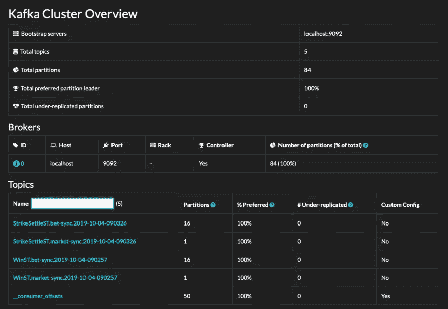
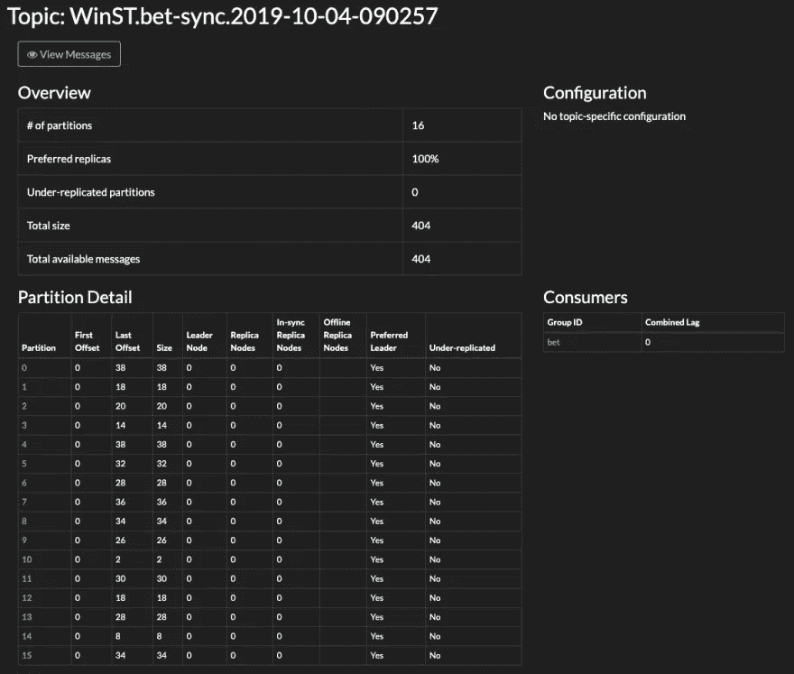
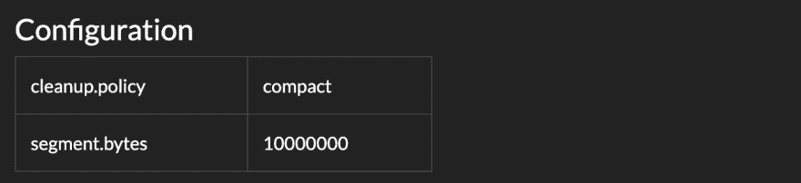
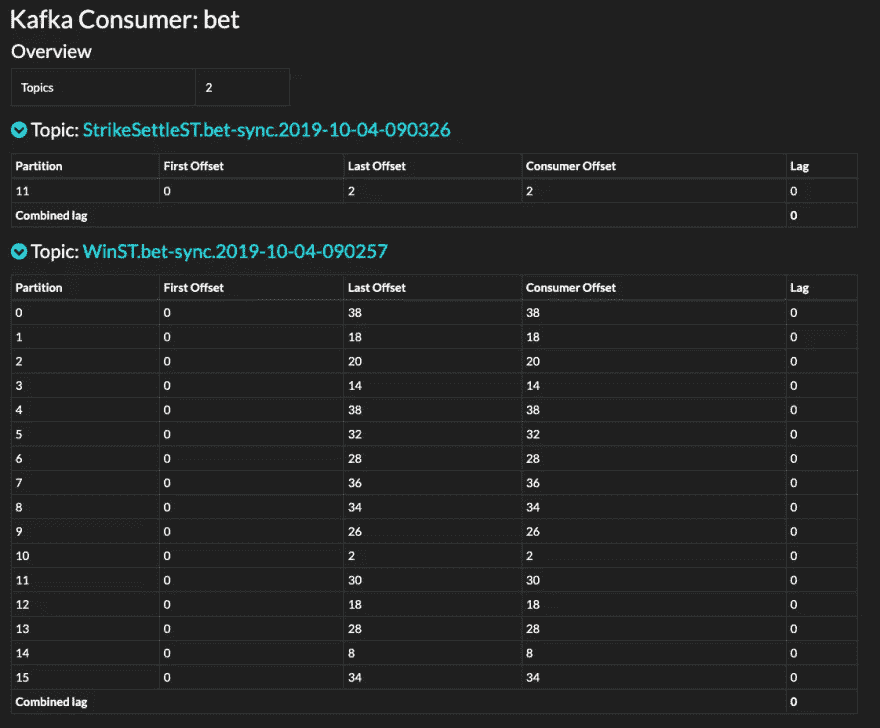
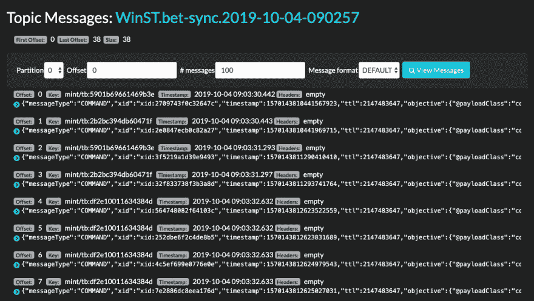
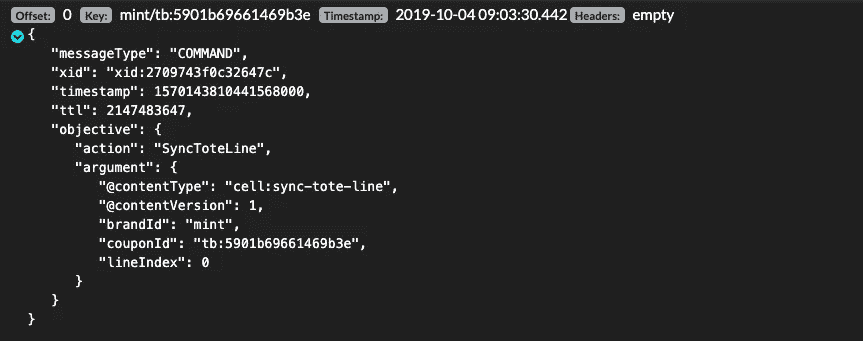

# 卡夫多普

> 原文：<https://towardsdatascience.com/kafdrop-e869e5490d62?source=collection_archive---------8----------------------->


## 一个开源的 Kafka UI

作为一个信息平台，Kafka 无需介绍。自成立以来，它几乎重写了关于事件流的书籍，并促进了现在家喻户晓的设计模式的采用——微服务、事件源和 CQRS。

作为天赐之物，它几乎逃脱了臭名昭著的缺乏工具的惩罚。你很难找到一个开发人员没有看过内置的 CLI 工具，捧着他们的脸说:*“就是这个吗？开什么玩笑？”*

# 外面有什么

随着 Kafka 的流行，一些商业供应商抓住机会通过提供他们自己的工具来赚钱也就不足为奇了。*卡夫卡工具*、*兰多普、*和*卡德克*就是一些例子，但它们都是仅供个人使用的，除非你愿意付费。(这并不是说你不应该这样做，*恰恰相反*，但这不是重点。)在商业环境中的任何非平凡使用都将违反其许可条款。在家里用它们做教程或个人项目是一回事；当你在没有适当许可的情况下使用商业工具时，你是在让你的雇主面临诉讼的风险，是在拿你的职业生涯玩俄罗斯轮盘赌。

但是*开源*呢？

说到 Kafka 主题查看器和 web UIs，首选的*开源*工具是 [Kafdrop](https://github.com/obsidiandynamics/kafdrop) 。在撰写本文时，Docker pulls 已经达到 80 万，享受到这种采用水平的 Kafka 工具并不多。这背后有一个原因:Kafdrop 做了一项惊人的工作，填补了 Kafka 的可观察性工具中的明显空白，解决了社区已经指出太久的问题。

Kafdrop 是一个 Apache 2.0 许可项目，就像 Apache Kafka 本身一样。所以不会花你一分钱。如果你还没有使用过它，你可能应该使用它。所以让我们深入了解一下。

# 它能做什么？

*   **查看 Kafka brokers** —主题和分区分配，以及控制器状态
*   **查看主题** —分区计数、复制状态和自定义配置
*   **浏览消息** — JSON、纯文本和 Avro 编码
*   **查看消费者群体** —每个分区的停放偏移量、组合偏移量和每个分区的延迟偏移量
*   **创建新主题**
*   **查看 ACL**

# 入门指南

Kafdrop web UI 项目托管在 GitHub 上:

[](https://github.com/obsidiandynamics/kafdrop) [## obsidiandynamics/kafdrop

### Kafdrop 是一个用于查看 Kafka 主题和浏览消费群体的 web UI。该工具显示如下信息…](https://github.com/obsidiandynamics/kafdrop) 

你有几个选择。你可以通过[克隆库](https://github.com/obsidiandynamics/kafdrop)并从源代码开始构建来显示一点勇气。这是一个 Java (JDK 11) Spring Boot 项目，只要安装了 JDK，就可以用一个 Maven 命令来构建它。如果你想走这条路，回购的`README.md`文件将引导你通过这些步骤。现在，让我们采取简单的方法——Docker。(我当然会。)

# 启动 Kafdrop

Docker 图片[托管在 DockerHub](https://hub.docker.com/r/obsidiandynamics/kafdrop) 上。图像标有 [Kafdrop 发布号](https://github.com/obsidiandynamics/kafdrop/releases)。标签指向最新的稳定版本。

要在前台启动容器，请运行以下命令:

```
docker run -it --rm -p 9000:9000 \
    -e KAFKA_BROKERCONNECT=<host:port,host:port> \
    obsidiandynamics/kafdrop
```

必须将`KAFKA_BROKERCONNECT`环境变量设置为代理的引导列表。

就是这样。我们应该开始运作了。一旦启动，您可以通过导航到 [localhost:9000](http://localhost:9000/) 来启动 Kafka web UI。

> ***注意:*** *上面的例子假设一个通过明文 TCP 套接字的认证连接。如果您的集群配置为使用身份验证和/或传输层加密，请咨询* `*README.md*` *了解连接选项。为 SASL/SSL 锁定集群配置 Kafdrop 实际上非常容易。*

# 在卡夫卡的沙盒中奔跑

没有卡夫卡经纪人吗？别担心。只需使用下面的`docker-compose.yaml`文件来调出一个 *Kafka + Kafdrop* 栈:

```
version: "2"
services:
  kafdrop:
    image: obsidiandynamics/kafdrop
    restart: "no"
    ports:
      - "9000:9000"
    environment:
      KAFKA_BROKERCONNECT: "kafka:29092"
    depends_on:
      - "kafka"
  kafka:
    image: obsidiandynamics/kafka
    restart: "no"
    ports:
      - "2181:2181"
      - "9092:9092"
    environment:
      KAFKA_LISTENERS: "INTERNAL://:29092,EXTERNAL://:9092"
      KAFKA_ADVERTISED_LISTENERS: "INTERNAL://kafka:29092,EXTERNAL://localhost:9092"
      KAFKA_LISTENER_SECURITY_PROTOCOL_MAP: "INTERNAL:PLAINTEXT,EXTERNAL:PLAINTEXT"
      KAFKA_INTER_BROKER_LISTENER_NAME: "INTERNAL"
```

现在用`docker-compose up`启动堆栈。一旦启动，浏览到 [localhost:9000](http://localhost:9000/) 。

# 浏览 Kafka Web 用户界面

# 浏览集群

**集群概述**屏幕是网络用户界面的登录页面。



您可以看到集群的整体布局——组成集群的各个代理、它们的地址和一些关键的代理统计信息——它们是否是控制器以及每个代理拥有的分区数量。后者非常重要——随着集群规模和主题数量(以及分区数量)的增长，您通常希望看到分区在集群中的大致水平分布。

接下来是主题列表，在大多数情况下，这就是你在这里的真正目的。任何合理规模的基于微服务的生态系统可能有数百个，如果不是数千个主题的话。如你所料，这个列表是可搜索的。每个主题旁边显示的统计数据相当单调。值得注意的是*复制不足的*列。本质上，它告诉我们落后于主分区的分区副本的数量。零是个好数字。任何其他情况都表示需要立即关注的代理或网络问题。

> ***注:*** *Kafdrop 是发现探索工具；它不是实时监控工具。当出现问题时，你应该通知你的经纪人并发出警报。*

# 列出主题

点击列表上的主题，进入**主题概述**屏幕。



屏幕分为四个部分。

在左上角，有一个主题 stats 的摘要—这是一个方便的视图，与您在集群概述中看到的没有什么不同。

在右上角，您可以查看自定义配置。在上面的例子中，主题运行一个股票标准配置，所以没有什么可看的。如果配置被覆盖，您会看到一组自定义值，如下例所示。



左下部分列举了分区。分区索引是链接—点击将显示主题中的前 100 条消息。

该部分显示了几个有趣的参数:

*   **分区 ID** :分区在其包含主题内的从零开始的索引。
*   **第一个偏移量**:分区中最早消息的偏移量。如果分区为空，则第一个偏移量与高水位线相同。
*   **Last offset** :分区的高水位线，是将分配给下一个发布的消息的偏移量。
*   **大小**:分区中消息的数量。
*   **Leader Node** :当前充当 Leader 的代理节点的 ID。
*   **副本节点**:持有分区副本的所有代理节点的 id。这包括领导者 ID。
*   **同步复制节点**:同步复制节点的 id，包括首节点。
*   **离线副本节点**:当前离线的副本节点的 id。在正常情况下，这应该是一个空集。
*   **首选首领**:当前首领节点是否恰好是首选首领节点。
*   **复制不足**:分区是否复制不足，即至少有一个副本与主分区不同步。

右下方的消费者部分列出了消费者组名称以及它们的总延迟(所有单个分区延迟的总和)。

# 查看消费者群体

点击主题 Overview 上的消费者组，进入**消费者视图**。该屏幕提供了单个消费者群体的全面细分。



视图按主题划分。对于每个主题，单独的表列出了基础分区。针对每个分区，我们可以看到提交的偏移量，我们可以将它与第一个和最后一个偏移量进行比较，以了解我们的使用者是如何跟踪的。方便的是，Kafdrop 显示每个分区的计算滞后，它聚集在每个主题表的页脚。

> ***注:*** *有些量的滞后在所难免。对于发布的每条消息，在发布点和消费点之间总会有一段时间。在 Kafka 中，这个时间通常是几十或几百毫秒，取决于生产者和消费者客户端选项、网络配置、代理 I/O 能力、页面缓存的大小和无数其他因素。你需要注意的是增长滞后——表明消费者要么跟不上，要么已经完全停滞。在后一种情况下，您还会注意到，即使在生成器空闲时，滞后也没有被耗尽。这是你需要从 Kafdrop 切换到你最喜欢的调试器的时候。*

# 查看邮件

**消息视图**屏幕是梦寐以求的主题查看器，很可能就是它把你带到了这里。您可以通过以下两种方式之一进入邮件视图:

1.  点击主题概览屏幕上的**查看消息**按钮。
2.  单击主题概述中的单个分区链接。



这正是您所期望的——一个按时间顺序排列的消息列表(或者用 Kafka 的说法是*记录*)。

每个条目都方便地显示了偏移量、记录键(如果设置了的话)、发布的时间戳以及生产者可能添加的任何头。

凯卓的袖子里还有一个小把戏。如果消息碰巧是有效的 JSON 文档，主题查看器可以很好地格式化它。单击消息左侧的绿色箭头将其展开。



# 最后

使用 Kafka 的次数越多，您就越会发现并欣赏它的真正潜力——不仅仅是作为一个多功能的事件流平台，而是作为一个通用的消息中间件，允许您从异步、松散耦合的服务组装复杂的业务系统。

与过去更成熟的 MQ 经纪人相比，您总是会经历一项最近才进入主流的技术所带来的挫折。令人欣慰的是，开源社区并没有停滞不前，而是产生了一个不断发展的生态系统，为我们继续工作提供了必要的文档和工具。作为回报，我们至少可以偶尔提出一个 pull 请求，或者回答一个或三个 StackOverflow 问题。

这篇文章对你有用吗？我很想听到你的反馈，所以不要退缩！如果你对卡夫卡或者事件流感兴趣，或者只是有什么疑问， [*在 Twitter 上关注我*](https://twitter.com/i/user/562466177) *。*