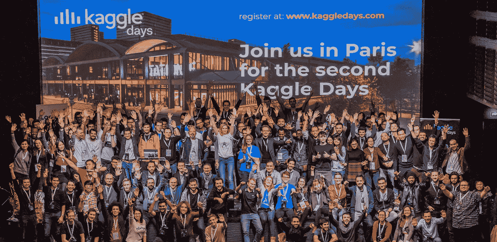
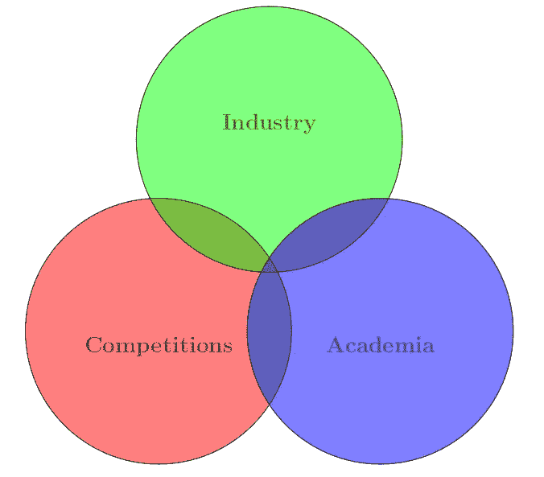
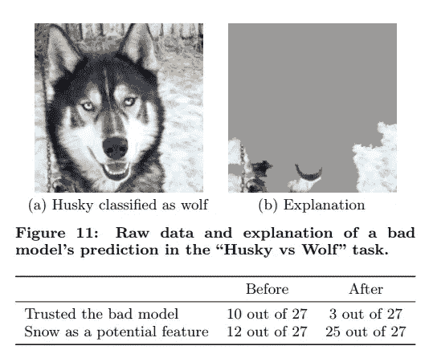
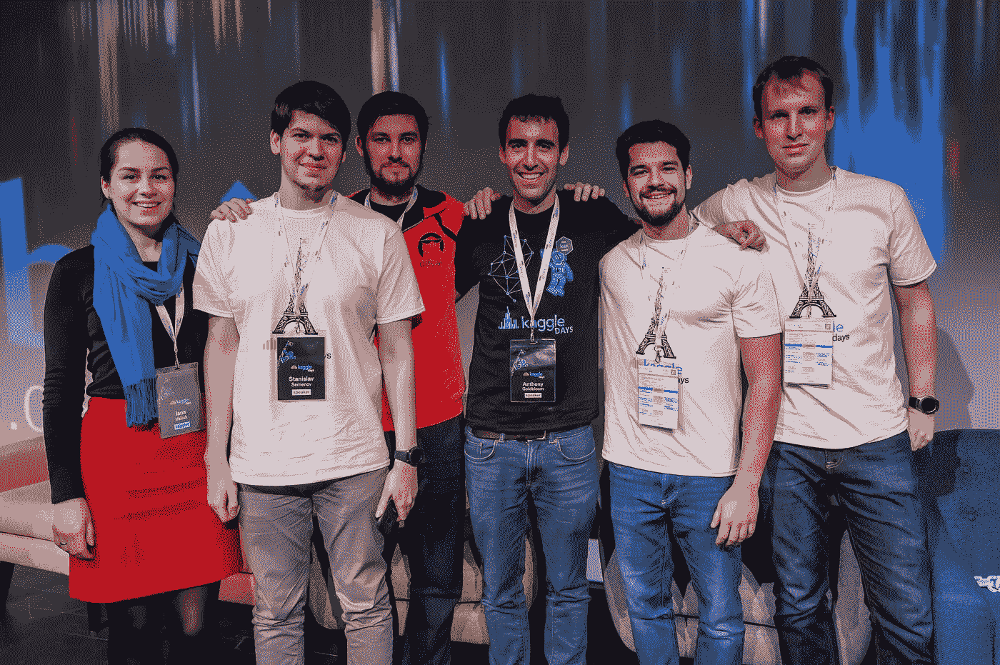

# 巴黎 2019 年 Kaggle Days

> 原文：<https://towardsdatascience.com/kaggle-days-2019-in-paris-8e2844c86198?source=collection_archive---------11----------------------->

Kaggle Days 是数据科学家和 ka ggler 的第一个全球线下活动系列。这样的盛会为创建和构建数据科学社区提供了机会。2018 年，首次在华沙举办的名为 Kaggle Days 的活动取得了成功。100 多名参与者在生动的演示和研讨会中向 Kaggle 大师学习。对许多人来说，亮点是有史以来第一次 Kaggle 线下比赛，一整天的现场挑战。

第二个 Kaggle Days 发生在巴黎。参与者数量增加了一倍:从 400 多个应用程序中选择了大约 200 名数据科学家、Kagglers 和对机器学习感兴趣的人。标准的讲座、研讨会和竞赛项目被一些新的形式所丰富，如头脑风暴会议和有经验的导师的咨询。

# 参与者的动机

可以将当前的数据科学和机器学习分为 3 大类:商业、学术和竞赛(见下图)。每个领域都有自己的目标和目的:企业努力实现利润最大化，研究人员努力增加高质量出版物的数量，竞争对手努力实现最高职位竞争数量的最大化。每个领域对数据科学和机器学习的“适当”方法都有自己的理解:例如，为分数增加 1%而进行几层下注是机器学习竞赛的常见做法，但通常是生产中部署的禁忌；科学上没有新颖性的方法可能不会在期刊上发表，但可以很容易地应用于学术或工业。

3 major Data Science and Machine Learning fields (picture from Vladimir Iglovikov’s [blog post](https://habr.com/ru/post/318518/))

然而，电流场是紧密相连的，尽管它们在空间中不是独立存在的。思想、方法和技巧可以通过一些改变从一个领域转移到另一个领域，以达到最佳效果。大概 Kaggle，这个举办各种机器学习比赛的地方，就是在这个意义上检验思想和方法的最佳场所之一。

每个参与者都希望在比赛中在排行榜上获得尽可能高的分数。这需要想出各种各样的想法，然后测试它们。当然，绝大多数的想法不会是好的，但是剩下的那些可以提高你的分数的想法是非常有价值的。竞赛结束后，您可以在工作、做研究或参加各种竞赛时使用这些想法。因此，Kaggle 是一个在 DS 和 ML 领域选择可行的想法和方法的平台。最近发表了一篇很棒的[关于如何正确“养殖”Kaggle 的文章。](/how-to-farm-kaggle-in-the-right-way-b27f781b78da)

Kaggle Days 是一个顶级 kag gler 通常分享他们对某些任务的愿景的地方，这些任务已经在比赛、生产和研究中得到验证。对我来说，这是一个很好的机会来看看同样的问题，但从他们的角度来看。所以，我利用这个机会学习了一些新的东西。

# 第一天

第一天是讲座和研讨会。很难讲清楚每场演讲的每一个细节，因此，我决定提到其中最有趣的三个，并对它们补充一些想法。

## “超越特征工程和超参数优化”，作者江泽龙·普吉特

江泽龙讲述了他在 Kaggle 和工作期间解决数据科学问题的方法。他从一个简单的想法开始:许多数据科学家不太重视探索性数据分析(EDA)，这是结果不佳和得分低的一个原因。EDA 的目标是在数据中发现一些隐藏的模式，这可能会导致对特征工程的见解，但不是绘制花哨的图形和可视化。伟大的 EDA 提出问题，然后提供问题的答案。如果你不熟悉 EDA，一定要读一读 Cole Nussbaumer Knaflic 写的关于当前主题的最伟大的书《用数据讲故事》。我强烈推荐看一看一个简短的摘要:用两种语言写的:英语、俄语和 T2 语。

关于特性工程和选择的另一个展示点是:创建一个小的特性数量，而不是大的，但是要让它有意义。总的想法很简单:问问你自己，在当前任务中什么是真正重要的特性，你如何利用现有的数据来创建它。就我而言，我认为当前的方法在应用于商业问题时要好得多，因为它允许有意识地选择要收集的数据。有时，新数据收集并不需要太多的努力，但它在很大程度上影响模型的质量。

但是创造好的特性的最好方法是什么呢？我们可以通过检查以前类似任务的比赛来找到特征工程的灵感，以便找到最重要的特征并将相同的逻辑应用于给定的问题。另一种方法是使用问题领域知识。在这种情况下，我们可能会受到我们对问题的理解方式的限制，因此，没有能力找到新的模式。此外，数据科学家并不总是任务领域的专家。在这种情况下，关于当前主题的论文和文章可能会有所帮助。

**结论**:开始创建有意义的 EDA，它提出问题，然后试图利用可用数据回答这些问题。从“使用数据时我们可以创建什么功能？”的角度来思考思维模式的转变到“当前任务中有哪些好的特性，在使用给定数据时如何创建它们？如果我们不能，我们如何获得相关数据？”。

## Alberto Danese 的“ML 可解释性”和 Konstantin Lopukhin 的“图像和文本的可解释神经网络”

这两个讲座有许多共同之处，因此，我决定把它们结合在一起。两场讲座都在谈论一个常见的现代数据科学主题——模型的可解释性——模型以人类可以理解的方式呈现预测的能力。根据 2018 年 6 月 [O'Reilly 的调查](https://www.datanami.com/2018/08/07/its-still-early-days-for-machine-learning-adoption/)，11400 名数据专家中约有一半(49%)表示他们处于机器学习的探索阶段，尚未将任何机器学习模型部署到生产中。65%的受访者表示，可解释性和透明度是他们的模型构建清单的一部分，相比之下，48%的受访者表示遵从，45%的受访者表示确保用户对数据和模型的控制。

因此，我们可以得出结论，在选择是否部署模型时，模型的决策方式实现是重要的。在这样的分析过程中，我们想要回答几个简单的问题:这个模型是否偏向于某些特性？它能对新数据进行很好的归纳吗？我们能相信它的预测吗？通常，我们将所有可用的数据分成训练、验证和测试部分，以便回答这些问题。然后，我们在训练部分训练我们的模型，在验证数据集上调整超参数，并通过测试数据获得我们的管道分数。我们假设测试部分与我们在模型使用过程中得到的数据相似，因此测试部分的分数是可靠的。

然而，《T2》中描述的“哈士奇大战狼”实验，我为什么要相信你解释任何分类器的预测，向我们展示了这种方法的一些局限性。在当前的实验中，卷积神经网络被训练成在有偏差的数据集上对哈士奇/狼进行分类——狼的图片总是包含雪。作者没有提供这样的分类准确性，但我假设它在训练和测试部分都很高，因此上述模型评估方法会给我们体面的分数，因此我们可以部署该模型。

向参与者展示了分类解释-免费图片，并询问了三个问题:

1.  你相信这种算法在现实世界中能很好地工作吗？
2.  你为什么这么想？
3.  你认为算法如何区分这些狼和哈士奇的照片？

在他们回答之后，会展示预测解释图片(见下图),参与者会被问同样的三个问题。正如您所料，对模型的整体信任度显著下降。

“Husky vs Wolf” experiment results ([“Why Should I Trust You?” Explaining the Predictions of Any Classifier](https://arxiv.org/abs/1602.04938))

这个实验过于简单，但我们仍然可以得出几个结论，我认为最重要的结论如下:我们可以从模型的预测实现中找到机器学习管道的“弱点”。在与这些点合作后，我们的管道质量将会提高。例如，我们可能会发现数据中的偏差，用没有雪的狼的图片丰富我们的数据集，或者删除图片背景。

**结论**:理解模型的预测可以通过消除“弱点”来增加机器学习管道的良好性。

## 斯坦尼斯拉夫·谢苗诺夫的《机器学习的技巧和诀窍》

Stanislav 的演示结合了他多年参加机器学习竞赛的经验，形成了独特的技巧列表。在我看来，最有趣的是最后一条，它显示了任务重组的重要性，我们可以利用我们的优势。

任务来自[希腊媒体监督多标签分类](https://www.kaggle.com/c/wise-2014)。在当前的竞争中，我们必须为印刷媒体文章选择合适的标签。每篇文章可以有几个标签(例如体育、英格兰、足球)。主题数量事先是未知的，可能是一个、两个甚至五十个主题，度量标准会惩罚我们选择太少或太多的主题。那么我们应该如何选择呢？

解决这一挑战的可能方法是选择具有较高概率的恒定主题数，或者选择概率大于某个阈值的主题。第一种情况下的主题数量和第二种情况下的阈值是超参数，可以使用验证数据集进行优化。然而，让我们从另一个角度来看这个问题。我们将在术语中表述相同的问题，这将允许我们在使用数据驱动的方法时解决它。

对于每篇文章，我们可以预测训练部分的某些主题可能性(进行折叠预测)。此外，我们知道基本事实——实际的主题数量。我们可以为每个示例计算一个最佳阈值，并将其用作附加后处理模型的目标。

我们用术语来表述这个问题，这允许我们在使用数据驱动的方法时解决它。在这种情况下，我们的目标是精心制作一些基本事实标签(给定文章的实际主题数量或最佳概率阈值)和描述每篇文章的特征(文章特征、输出主题概率的统计数据等)。

**结论**:如果你在任务上停滞不前，尝试以某种方式重新制定它，允许生成特征和地面实况目标，然后使用机器学习工具解决它。

# 第二天

第二天组织了 11 小时的 ka ggle-like 比赛。路易威登提供了这项任务——根据前 7 天销售的各种信息(销售数量、价格、社交网络的情绪分析、经济因素、照片、网站数据)预测未来三个月的产品销售数量(各种商品:包、鞋、皮带等)。为我们提供了产品的培训数据和目标，这些数据和目标在 2017 年发布，测试期包含 2018 年发布的产品。

Similar to Data Scientists free time :)

由于导师会议，整个比赛流程非常有趣和愉快。每个参与者都可以和有经验的棋手(大师、特级大师)一对一交谈，并问任何问题。我没有错过这个机会，并询问他们关于在比赛和实际工作中突出工程的想法；此外，我从经验丰富的大师那里收到了关于我的比赛进程的非常有建设性的反馈。

最终，我在 77 支队伍中获得了第 22 名，这是一个不错的成绩。其中一名获胜者公布了他们的方法——[对过度拟合说是](https://blog.doit-intl.com/say-yes-to-overfitting-3ee4a23d33d4)。

希望在接下来的几天里我会改进它。

From left to right: Yana Pleskova, Stanislav Semenov (former top 1 in Kaggle rankings), Denis Vorotyntsev (author of this blog post), Anthony Goldbloom (CEO of Kaggle), Pavel Pleskov (currently top 5 in Kaggle rankings), Pavel Ostyakov (currently top 4 in Kaggle rankings)