# Kaggle For 初学者:入门

> 原文：<https://towardsdatascience.com/kaggle-for-beginners-getting-started-75decb43c0c0?source=collection_archive---------22----------------------->

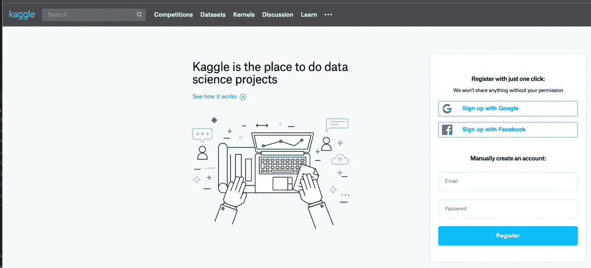

> 本文的目的是帮助你开始使用 [Kaggle](https://www.kaggle.com/) 并加入世界上最大的机器学习和数据科学社区。

# 那么 Kaggle 是什么？

正如他们所说，Kaggle 是“数据科学的家园”。这是通过动手的数据科学和机器学习项目学习和拓展技能的最佳场所。

你还在等什么？[前往 Kaggle](https://www.kaggle.com/) ，点击一下就可以注册🏃。

# Kaggle 上的编程语言

> **Python** 和 **R** 都在 Kaggle 上很受欢迎，你可以使用其中任何一个进行 kaggle 比赛。

# 卡格尔服务公司

## 1.[机器学习竞赛](https://www.kaggle.com/competitions)

这就是 kaggle 出名的原因。找到你觉得有趣的问题，比赛构建最好的算法。

## 卡格尔比赛的常见类型

你可以在 kaggle 上按类别搜索比赛，我会告诉你如何获得新手“入门”比赛的列表，这些比赛总是可用的，没有截止日期😃。

*   **特色比赛**大概是 Kaggle 最为人熟知的比赛类型。它们通常由公司、组织甚至政府赞助。他们提供高达 100 万美元的奖金。
*   **研究竞赛**的特色问题比特色竞赛问题更具实验性。由于他们的实验性质，他们通常不提供奖励或积分。
*   **入门竞赛**的结构类似于特色竞赛，但它们没有奖金池。它们具有更简单的数据集、大量的教程，并且没有截止日期——这正是新手需要开始的！😃。入门竞赛的一个例子是:

[泰坦尼克号:机器从灾难中学习](https://www.kaggle.com/c/titanic)——预测泰坦尼克号上的幸存者

*   **游乐场竞赛**是一种“为了好玩”的 Kaggle 竞赛，比入门难度高一步。奖品从荣誉到小额现金不等。操场竞赛的一个例子是:

[狗对猫](https://www.kaggle.com/c/dogs-vs-cats)——创造一种算法来区分狗和猫

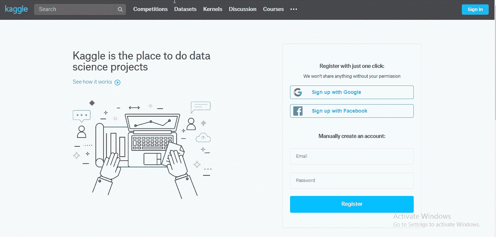

how to find getting started competitions

## Kaggle 竞争环境

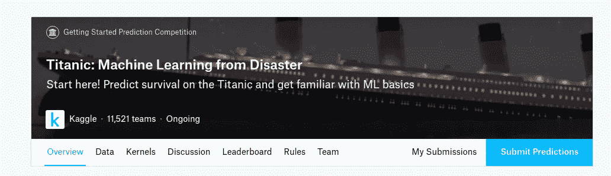

kaggle competition environment

下面是选项卡的快速浏览

*   **概述:**问题的简要描述、评估标准、奖品和时间表。
*   **数据:**是你可以下载和了解比赛中使用的数据的地方。您将使用一个训练集来训练模型，并使用一个测试集来进行预测。在大多数情况下，数据或其子集也可以在内核中访问。
*   **内核:**你和其他竞争对手以前做过的工作。回顾流行的内核可以激发更多的想法。您可以通读其他脚本和笔记本，然后复制代码(称为“Fork”)进行编辑和运行。
*   **讨论:**另一个有用的资源，你可以在这里找到来自比赛主持人和其他参赛者的对话。这是一个提问和学习他人答案的好地方。
*   **排行榜:**每场比赛都有公开排行榜和私人排行榜。注意，排行榜是非常不同的。**公共排行榜**根据提交数据的代表性样本提供公开可见的提交分数。该排行榜在整个比赛过程中都可以看到。虽然它给你一个好主意，但它并不总是反映谁会赢谁会输。**私人排行榜**才是真正重要的。它根据参与者看不到的数据跟踪模型性能。因此，私人排行榜对谁的模型最好，以及谁将成为比赛的赢家和输家有最终决定权。比赛结束才算。
*   **规则:**包含管理您参与赞助商竞赛的规则。开始前阅读规则是非常重要的。
*   **团队:**您可以在此选项卡上执行许多不同的团队相关操作。
*   **我的参赛作品:**查看您之前的参赛作品，选择最终参赛作品。
*   **提交预测:**要提交新预测，请使用“提交预测”按钮。这将打开一个允许您上传提交文件的模式。

## 2.[数据集](https://www.kaggle.com/datasets)

Kaggle 数据集是发现、探索和分析开放数据的最佳场所。您可以找到许多不同类型和大小的有趣数据集，您可以免费下载并提高您的技能。

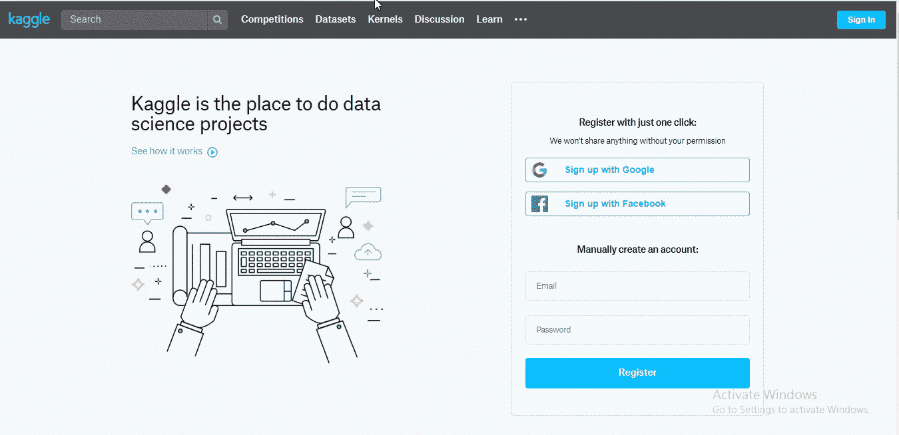

how to choose a dataset

## 3. [Kaggle 学习课程](https://www.kaggle.com/learn)

Jupyter 笔记本中教授的免费微课，帮助您提高当前技能。

## 4.[讨论:](https://www.kaggle.com/discussion)

一个向 Kaggle 社区的数千名数据科学家提问和寻求建议的地方。

共有六个通用站点论坛:

*   [**Kaggle 论坛**](https://www.kaggle.com/general) :针对 Kaggle 社区的事件和话题
*   [**入门**](https://www.kaggle.com/getting-started) :新手提问讨论的第一站
*   [**产品反馈**](https://www.kaggle.com/product-feedback) :告诉 kaggle 你喜欢什么，讨厌什么，或者希望什么
*   [**问题&答案**](https://www.kaggle.com/questions-and-answers) :其他数据科学家的技术建议
*   [**数据集**](https://www.kaggle.com/data) :开放数据的请求和讨论
*   [**学习**](https://www.kaggle.com/learn-forum) :与 [**相关的问题、答案、请求 Kaggle 学习课程**](https://www.kaggle.com/learn)

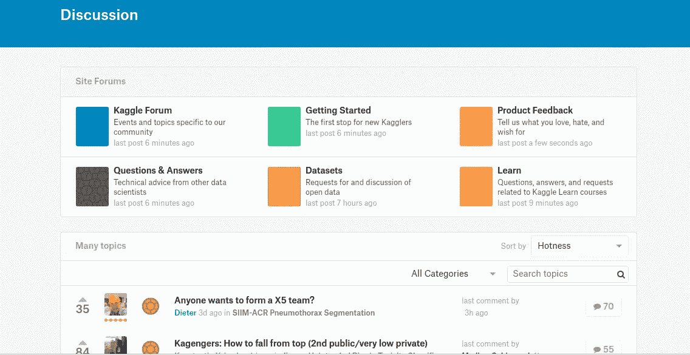

Types of Kaggle discussions

## 5.[内核](https://www.kaggle.com/kernels)

Kaggle 内核本质上是浏览器中的 Jupyter 笔记本。这些内核完全免费运行(你甚至可以添加一个 GPU)。这意味着您可以省去设置本地环境的麻烦。它们还允许您共享 Python 或 r 中的代码和分析。它们还可以用于参加 Kaggle 比赛和完成 kaggle 学习课程。探索和阅读其他 Kagglers 的代码是学习新技术和参与社区的好方法。

## 选择一个数据集，然后点击几下就可以旋转出一个新的内核

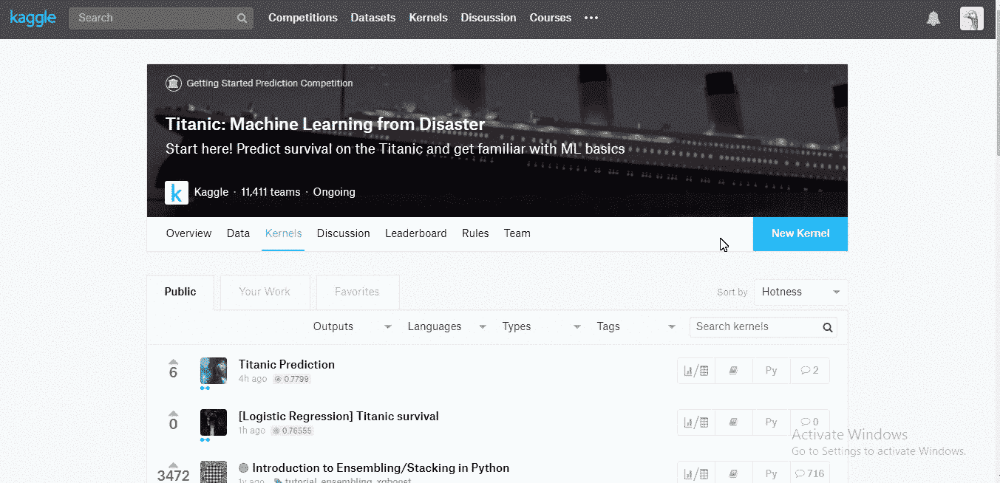

Click the Kernel tab of the competition then click new kernel

## Kaggle 内核环境

以下是如何打开 GPU、更改内核语言、公开内核、添加合作者以及安装未预装的包，因为 kaggle 内核预装了最流行的 python 和 R 包😃。

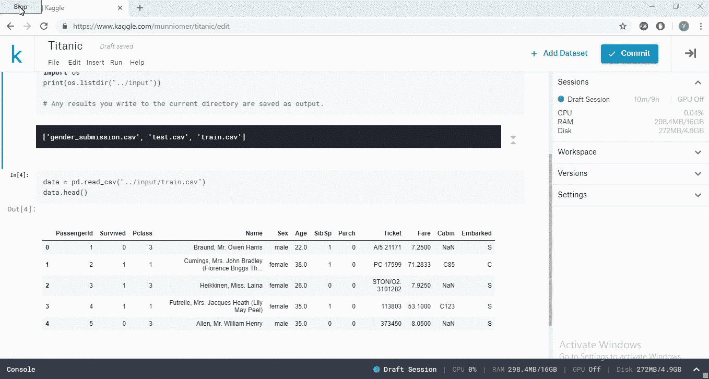

Remember kaggle’s run time limitly is currently 9 hours

**向内核添加数据集**

您可以从您的计算机、kaggle 竞赛或其他 ka ggler 的公共内核向您的内核加载额外的数据集。

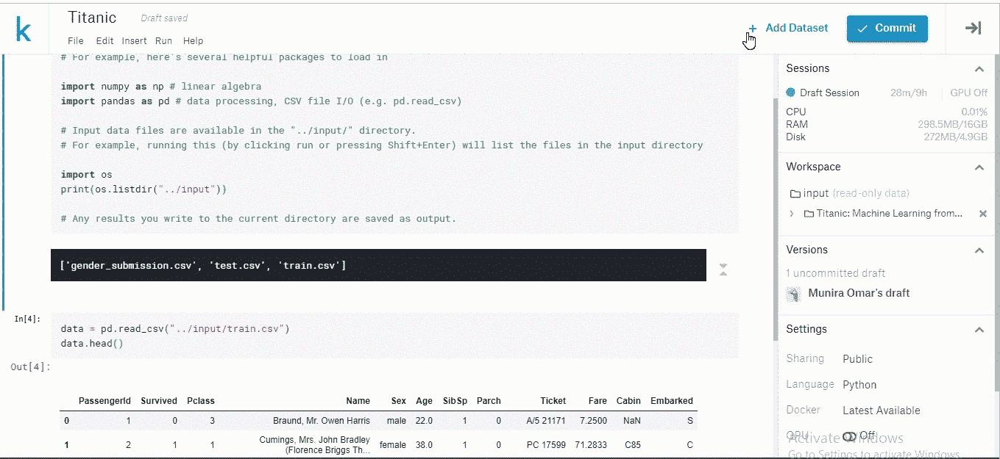

## 内核版本

当您提交并运行内核时，它会运行您的所有代码，并将其保存为一个稳定的版本，供您以后参考。然而，你的代码总是保存你去😃。

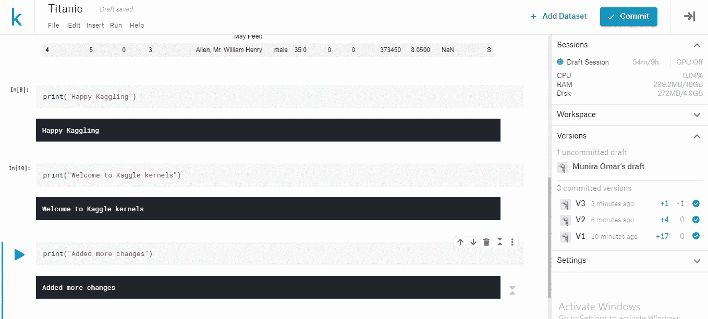

Committing a kernel

## 分叉 Kaggle 内核

您可以从其他用户那里复制并构建现有的内核😃。

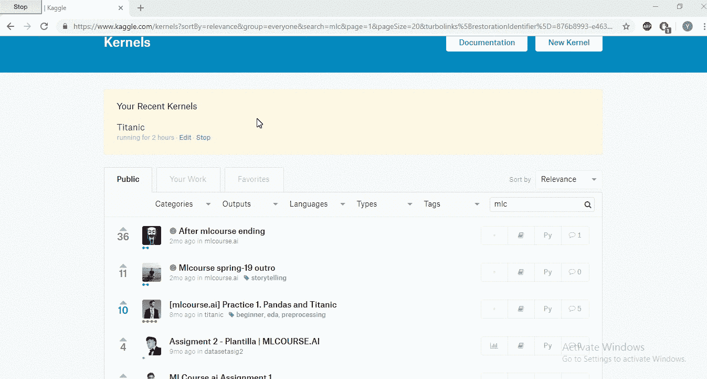

Don’t forget to vote for kernels you liked

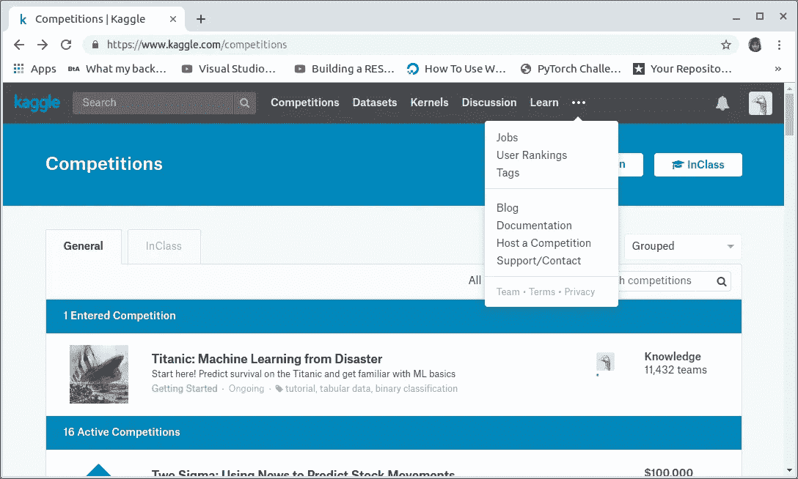

Click the three dots to learn about what else Kaggle has to offer you 😃

你一路赶到这里？！感谢阅读。😆

# 恭喜你！你现在是卡格勒了👏🎉。

如果您有任何问题或意见，请在下面留下您的反馈，或者您可以随时通过 [Twitter](https://twitter.com/munniomer) 联系我。在那之前，下一篇文章再见！✋.

# 参考

 [## 如何使用 Kaggle

### 编辑描述

www.kaggle.com](https://www.kaggle.com/docs)