# Kaggle 内核初学者指南—循序渐进教程

> 原文：<https://towardsdatascience.com/kaggle-kernels-for-beginners-a-step-by-step-guide-3db6b1cd7606?source=collection_archive---------4----------------------->

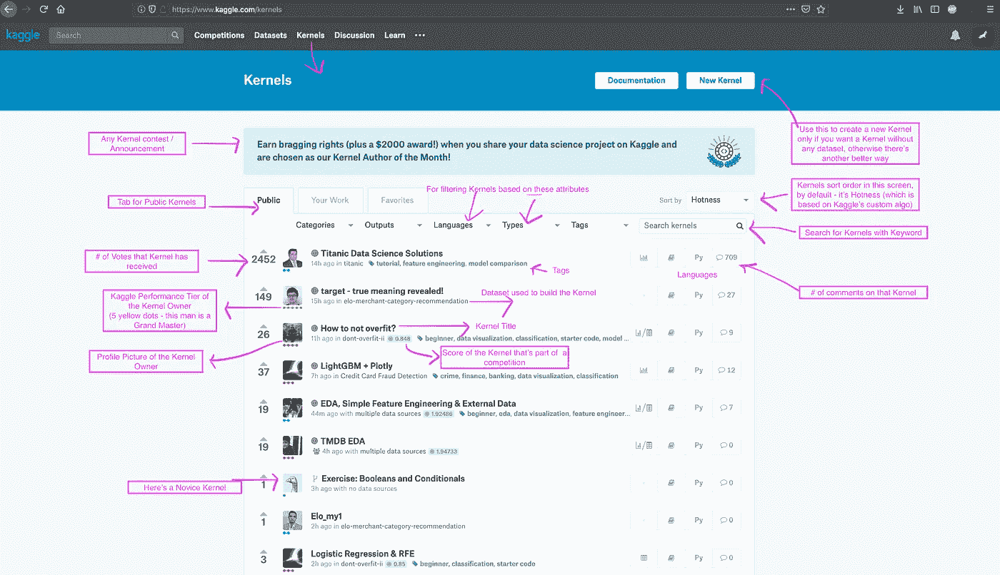

不久前，我写了一篇名为“[用 Kaggle 内核展示你的数据科学技能](/show-off-your-data-science-skills-with-kaggle-kernels-762403618c5)”的文章，后来我意识到，尽管这篇文章很好地说明了 Kaggle 内核对于数据科学家来说是一个强大的投资组合，但它并没有说明一个完全的初学者如何开始使用 Kaggle 内核。

> 这是一次尝试，握住一个完全初学者的手，带他们走过 Kaggle 内核的世界——让他们开始。

# [享受 78%的 DataCamp 折扣](https://datacamp.pxf.io/c/2888696/1240322/13294?u=https%3A%2F%2Fpromo.datacamp.com)

## 在 Kaggle 上注册—【https://www.kaggle.com/ 

如果你没有 Kaggle 账号，第一步是在 Kaggle 上注册。你可以使用你的谷歌账户或脸书账户创建新的 Kaggle 账户并登录。如果以上都不是，您可以输入您的电子邮件 id 和您的首选密码，并创建您的新帐户。

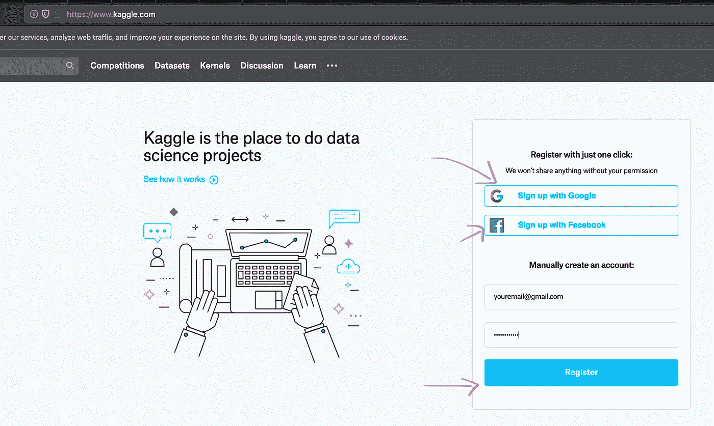

Kaggle Registration Page

## 登录 Kaggle

如果您已经有了一个帐户或者刚刚创建了一个帐户，请单击页面右上角的**登录**按钮启动登录过程。同样，你可以选择用你创建账户时输入的用户名和密码登录谷歌/脸书/雅虎或者最后一个。

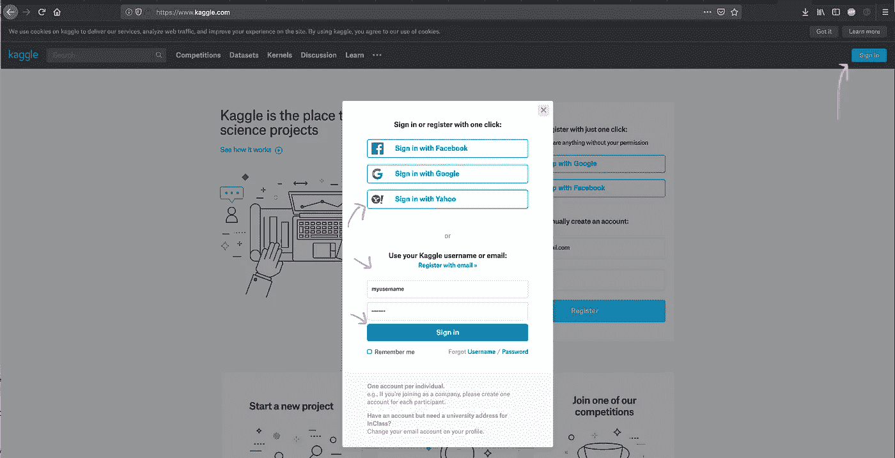

Kaggle Login/Signin Screen

**Kaggle 仪表盘**

登录后，您将被带到 Kaggle 仪表盘。(只是欢迎页面，不知道还能叫什么，所以叫它仪表板)。

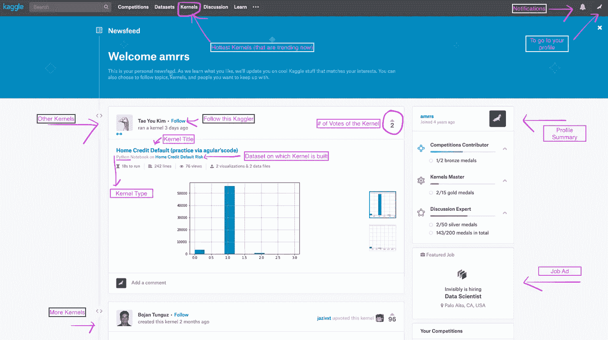

这是您登录后立即出现的登录页面(如果您从[https://www.kaggle.com/](https://www.kaggle.com/)登录)。它有许多组成部分，其中有几个:

*   Kaggle 最近更新或推荐给您的 Kaggle 内核提要
*   个人资料摘要(右侧边栏的第一个)
*   招聘广告(右侧栏)
*   您的竞争对手(右侧栏—向下滚动后)
*   您的内核(右侧栏—向下滚动后)

我们接下来要去的地方是导航栏中顶部的*内核*按钮。

## Kaggle 内核列表(最热门):

一旦我们在 Kaggle 旅程的任何地方点击顶部内核按钮，我们就会进入这个屏幕。

这是每个人都试图看到他们的内核的屏幕，因为这就像是内核的首页，这意味着如果它出现在这里，你的内核更有可能获得更多的可见性。内核页面的默认排序顺序是**热度**，这是基于 Kaggle 的秘密酱算法，以保持显示相关的内核，但它也有其他选项(排序)，如新，大多数投票等。Kaggle 也使用这个页面来宣传是否有任何内核竞争正在发生/将要发生。

当我们在这里时，内核竞赛是 Kaggle 竞赛，它不属于竞赛层，因为竞赛的性质是输出是 Kaggle 内核，并且更经常地专注于讲故事。《为好的数据科学》就是这样一系列核心竞赛之一，数据科学家/卡格勒希望利用数据科学帮助解决一个社会问题。为了更好地理解它，你应该看看内核大师 [**希瓦姆·班萨尔**](https://www.kaggle.com/shivamb) 的内核，他已经养成了多次赢得它们的习惯。

## Kaggle 内核—新的/创建的:

现在，我们已经理解了 Kaggle 内核的元，我们可以直接进入新内核的创建。创建 Kaggle 内核有两种主要方法:

1.  从 Kaggle 内核(首页)使用新的内核按钮
2.  使用新内核按钮从数据集页面

**方法#1:从 Kaggle 内核(首页)使用新内核按钮**

正如你在上面的截图中所看到的，点击内核页面中的新内核按钮可以创建一个新的内核。如果您正在尝试练习自己的东西或计划输入自己的数据集，这种方法很好。如果你想为 Kaggle 上已经存在的数据集创建一个内核，这种方法是不可取的(在我看来)。

**方法#2:使用新内核按钮从数据集页面**

这是创建新内核最常用的方法之一(至少对我来说)。您可以打开您感兴趣的数据集的数据集页面(就像下面截图中的那个)，然后在那里单击新建内核按钮。这种方法的优点是，与方法#1 不同，在方法#2 中，创建内核的 Kaggle 数据集附带在内核中(默认情况下),从而使向内核输入数据集这一枯燥的过程变得更加容易、快速和简单。

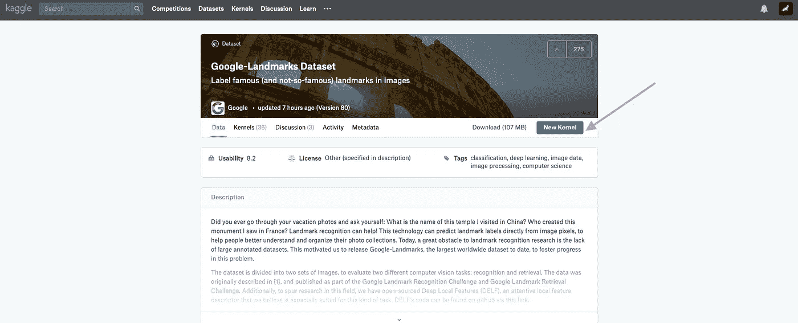

[https://www.kaggle.com/google/google-landmarks-dataset](https://www.kaggle.com/google/google-landmarks-dataset)

## Kaggle 内核—内核类型:

不管方法#1 还是#2，一旦你点击了新的内核，你将会看到这个模态屏幕来选择你想要创建的 Kaggle 内核的类型。

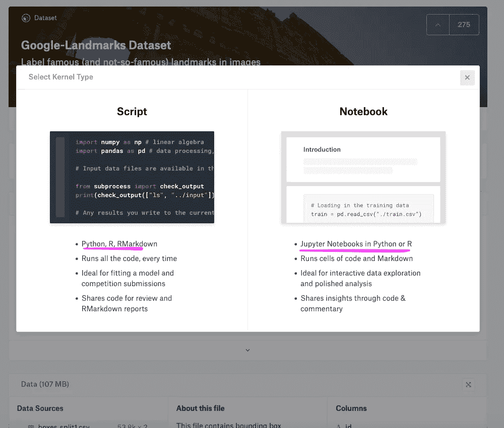

大体上分为两类——1 .剧本 vs . 2。笔记本。

众所周知，笔记本(基于单元格的布局)就是 Jupyter 笔记本，脚本就是你可能要编写的代码——py charm 或 Sublime Text 或 RStudio。此外，对于 R 用户来说，该脚本是 RMarkdown 的内核类型——这是从 R 以编程方式生成报告的一种很好的方式。

总结一下内核的类型:

*   **脚本**
    * Python
    * R
    * RMarkdown
*   **笔记本
    *** Python ***** R

## Kaggle 内核—内核语言:

第二级内核语言选择只发生在第一级内核类型选择之后。

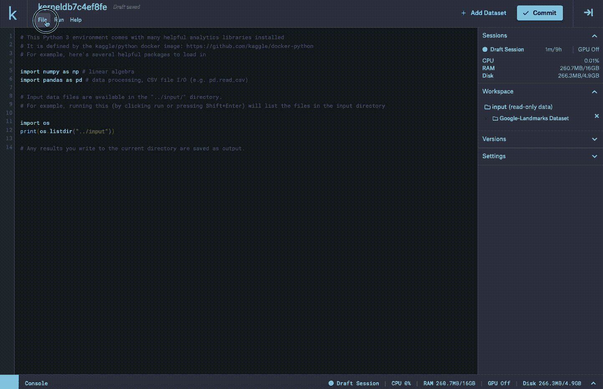

如上面脚本类型的 Kaggle 内核的 GIF 图所示，内核的语言可以通过进入设置，然后选择所需的语言——R/Py/RMarkdown 来更改。相同的设置还提供了使内核共享公开的选项(除非公开，否则默认情况下是私有的)。如果你正在做你的大学作业或者自学，而你不想公开代码，那么通常使用私有内核。私有内核也被 Kaggler 使用，他们参与竞争以利用 ka ggle 的计算能力，但不透露他们的代码/方法。

## 笔记本内核:

类似于上面的 GIF，在选择了内核类型*脚本*的地方，也可以选择*笔记本*来创建笔记本内核。

## RMarkdown 内核—(内核类型:脚本> RMarkdown)

RMarkdown 结合使用 R 和 Markdown 来生成嵌入了交互式可视化的分析报告。虽然这是解释 RMarkdown 的最简单的方式，但它的用途和潜力远远超出了定义。

幸运的是，Kaggle 内核脚本支持 Rmarkdown，这意味着它可以帮助创建交互式文档和更多在基于笔记本的场景中不可能实现的内容。这是一个由 Saba Tavoosi 在 Kaggle 内核上构建的成熟的交互式仪表盘，它不仅展示了 Kaggle 内核在构建机器学习模型方面的潜力，也展示了以最佳形式进行交互式讲故事的潜力。如果你有兴趣学习[如何使用 flexdashboard](https://bit.ly/2S2LSGS) 构建仪表盘，请查看本课程。

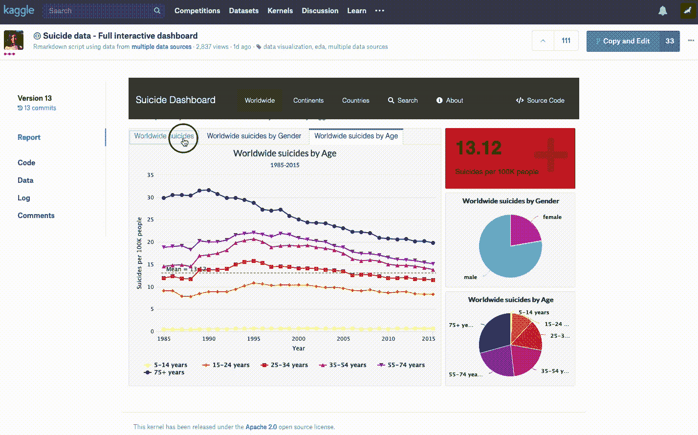

Kernel Courtesy: Saba Tavoosi

## 复制和编辑(以前称为分叉)

类似于 Github 中的 **Fork** 选项，如果你想获取一个现有的 Kaggle 内核并在你自己的空间中使用它——修改或赋予你自己的风格——你需要使用右上角的蓝色按钮`Copy and Edit`。事实上，在 Kaggle 竞赛赛道上的许多机器学习竞赛中，许多高分公共内核通常是`forks of forks forks`，其中一个 Kaggler 会改进其他 Kaggler 已经建立的模型，并将其作为公共内核提供。

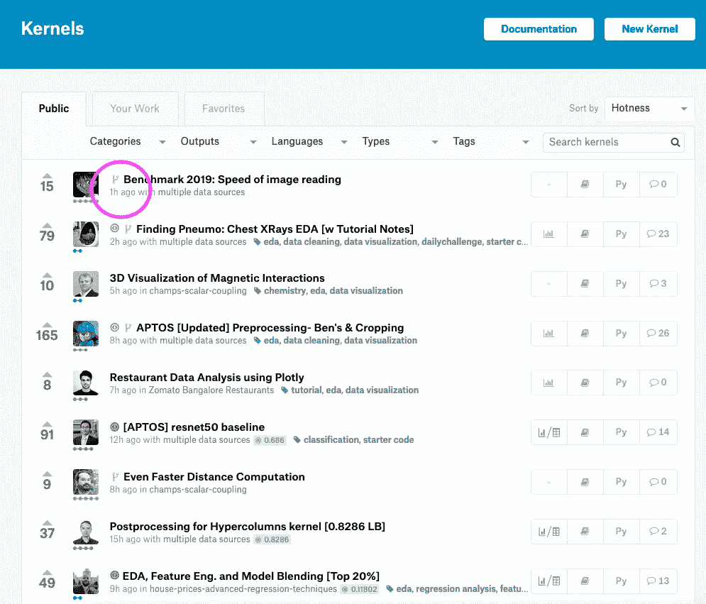

Marked Symbol denotes a Forked / Copied and Edited Kernel

## 公共/私有内核

正如我们在前面另一节中看到的，Kaggle 内核的访问设置可以是公共的，也可以是私有的。公共内核(顾名思义)对每个人(包括 ka ggler 和非 ka ggler)都是可用的和可见的。私有内核只对拥有者(创建者)和与拥有者共享内核的人开放。公共内核也可以建立在私有数据集上。比方说，这是一场机器学习比赛，你已经用一些第三方数据做了一些特征工程，你不想在比赛期间透露这些数据。这是一个典型的场景，Kagglers 通常将他们的数据集保持私有，但将内核设为公共，这样其他人就可以看到他们的方法并从中学习。

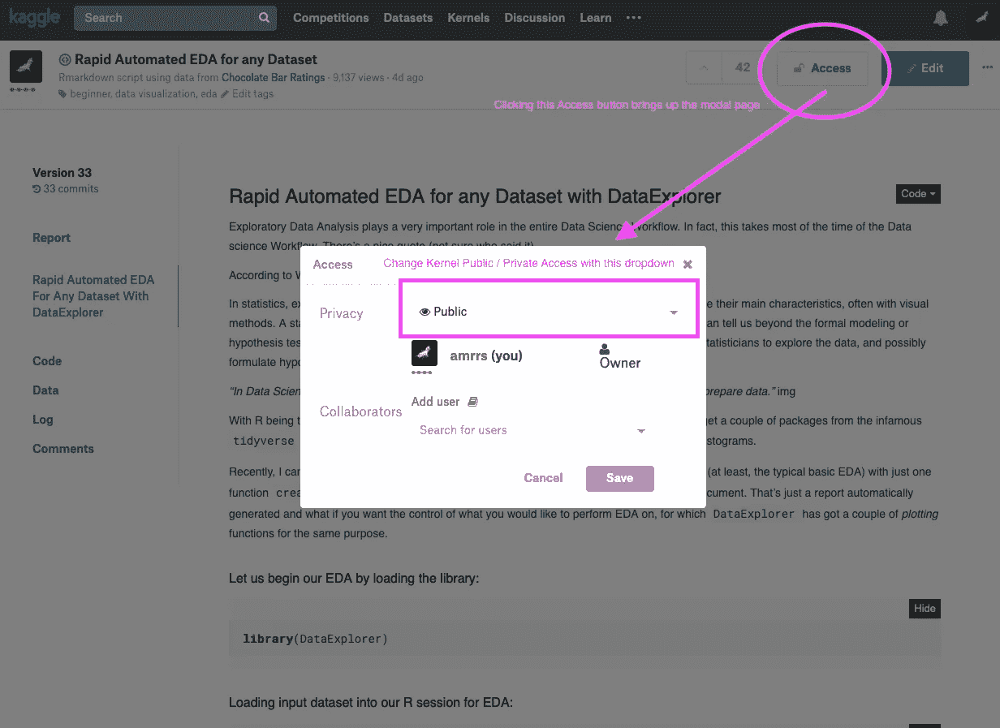

上面的屏幕截图展示了如何将现有内核的访问设置更改为私有或公共。默认情况下，所有新创建的内核都是私有的(在撰写本文时)，如果需要，所有者可以将其更改为公共的。

# TL；DR——如何创建新的 Kaggle 内核

如果上面的一切乍看起来有点太沉重而难以理解，这一节将帮助你创建你的第一个 Kaggle 内核。

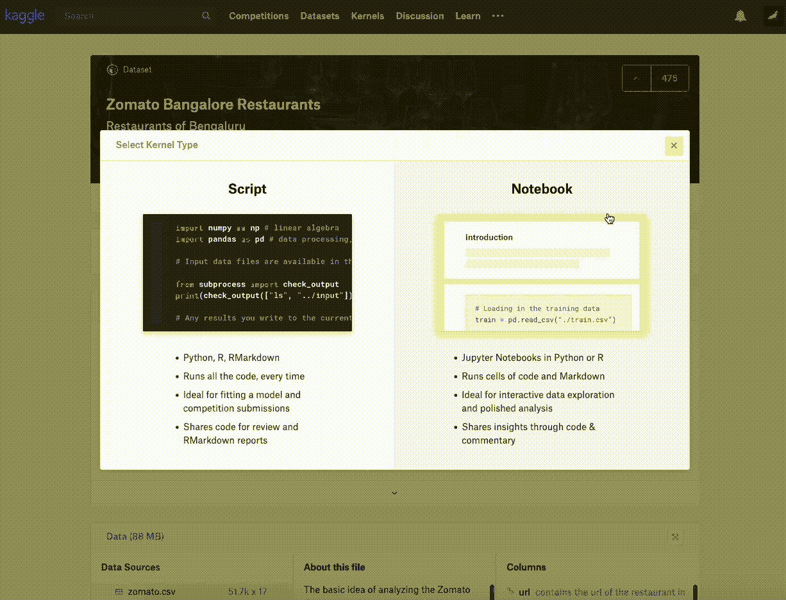

步骤:

1.  使用您的凭证登录 Kaggle
2.  转到任何公共 Kaggle 数据集
3.  点击右上角的**新内核**(蓝色按钮)
4.  选择您感兴趣的笔记本/脚本
5.  如果 Python 是您选择的语言，请保持原样，如果是 R，则转到右侧的**设置**并单击展开项目，您可以看到语言旁边的 **Python** ，您可以单击该语言以更改为 **R**
6.  转到屏幕的编辑器部分/窗格(左侧),开始编写漂亮的代码(上面的 GIF 也说明了如何使用创建内核的数据集)
7.  一旦您的代码完成，点击右上角的**提交**(蓝色按钮)
8.  如果您的内核执行成功(没有任何错误)，公开您的内核(通过编辑内核**设置>共享(公共)**或者通过再次打开内核并点击顶部的**访问**按钮)
9.  在这个阶段，你的第一个 Kaggle 内核必须准备好通过你的网络与你的朋友分享！

查看此 [Kaggle 视频](https://www.kaggle.com/static/video/homepage_landingvideo.mp4)寻求帮助。

# **结局**

对于许多 ka ggler 来说，竞赛赛道是他们的乐趣所在，但对我来说，Kaggle Kernels 赛道是我的事情，它为我们提供了完成*全栈数据科学之旅*的巨大潜力，从数据准备到数据可视化——从机器学习建模到讲故事。希望你也会喜欢。祝你的 Kaggle 内核之旅好运。

*在我的 Kaggle 个人资料* *查看我的* [*Kaggle 内核，并在*](https://www.kaggle.com/nulldata/kernels) [*我的 Linkedin 个人资料*](https://www.linkedin.com/in/amrrs/) *与我分享您的反馈。本教程使用的视频/gif/截图可在*[*my github*](https://github.com/amrrs/kaggle-kernel-guide-rsc)*上获得。*