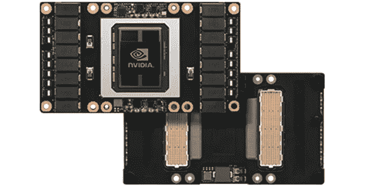

# ka ggle vs . Colab face off——哪个免费 GPU 提供商是 Tops？

> 原文：<https://towardsdatascience.com/kaggle-vs-colab-faceoff-which-free-gpu-provider-is-tops-d4f0cd625029?source=collection_archive---------4----------------------->

## 规格，UX，以及 fastai 和混合精度训练的深度学习实验

谷歌有两款产品可以让你在云中免费使用 GPU:Colab 和 Kaggle。如果你对深度学习和人工智能感兴趣，它们会非常棒。本文的目标是帮助您更好地选择何时使用哪个平台。

Kaggle 刚刚获得了 Nvida 特斯拉 P100 图形处理器的速度提升。🚀然而，正如我们将在计算机视觉实验中看到的，Colab 的混合精度训练有助于缩小速度差距。* * 2019 年 4 月 25 日更新— Colab 现在有了 Nvidia T4s。对于混合精度来说，它们真的很快。另外，随着硬件的改进，我不打算继续更新这篇文章。😄**

在本文中，我们将向您展示如何比较硬件规格和探索 UX 的差异。我们还将把计算机视觉任务的训练时间与迁移学习、混合精度训练、学习速率退火和测试时间增加进行比较。

我们开始吧！👍

Twin peaks Colab and Kaggle, side by side in the Google range

Kaggle 和 Colab 是相当相似的产品。卡格尔和科拉布

*   提供免费的 GPU
*   在浏览器中提供 Jupyter 笔记本——尽管有他们自己独特的风格
*   旨在促进机器学习的合作。
*   是谷歌的产品
*   并不完美，但在许多情况下非常有用——尤其是当你开始深度学习的时候。😄
*   不要提供关于他们硬件规格的大量信息

最后一点我们一会儿会深入探讨。不幸的是，当你使用他们的环境时，Kaggle 和 Colab 都不会告诉你确切的规格。确实存在的文件往往已经过时(见[此处](https://www.kaggle.com/docs/kernels#technical-specifications)截至 2019 年 3 月 11 日)。此外，屏幕上的小部件讲述了一些故事，但与我发掘的不同。我将向您展示常见的 profiler 命令，您可以使用这些命令来查看您的环境规格。

首先，简单介绍一下 GPU 的背景——如果这是老一套的话👒对你来说，请随意跳过前面。

# 什么是 GPU？

GPU 是[图形处理单元](https://en.wikipedia.org/wiki/Graphics_processing_unit)的简称。GPU 是专门的芯片，最初是为了加速视频游戏的图形而开发的。他们快速地做许多矩阵计算。对于深度学习应用来说，这是一个非常方便的特性。有趣的事实:出于同样的原因，GPU 也是加密货币挖掘的首选工具。

Nvidia P100 GPU

# 为什么要用 GPU？

使用具有足够内存的 GPU 使训练深度学习网络的速度比单独使用 CPU 快很多倍。因为在几分钟或几小时内而不是几天或几周内获得反馈要好得多，所以如果你对深度学习感兴趣，你会想要使用 GPU。毫无疑问。😃

# 规范

截至 2019 年 3 月初，Kaggle 已经将其 GPU 芯片从 [Nvidia Tesla K80](https://www.nvidia.com/en-gb/data-center/tesla-k80/) 升级为 [Nvidia Telsa P100](https://www.nvidia.com/en-us/data-center/tesla-p100/) 。Colab 还是给你一个 K80。关于 Nvida 芯片类型的简要讨论，请参见我的文章比较云 GPU 提供商[这里](/maximize-your-gpu-dollars-a9133f4e546a)。

有很多不同的方法可以找到你的硬件信息。两个有用的命令是用于 GPU 信息的`!nvidia-smi`和用于 CPU 信息的`!cat /proc/cpuinfo`。即使你想用 GPU 训练你的模型，你也仍然需要一个 CPU 来进行深度学习。

每当您在 Jupyter 笔记本代码行的开头使用感叹号时，您都在运行一个 bash 命令。[这是我写的关于 *bash* 命令](https://medium.com/me/stats/post/52c4b2ea34b7)的文章，包括`cat`，如果你想知道更多关于它们的信息。

请看[这张谷歌表](https://docs.google.com/spreadsheets/d/1YBNlI9QxQTiPBOhsSyNg6EOO9LH2M3zF7ar88SeFQRk/edit?usp=sharing)中我在下面的快照中编辑的规格。

内存和磁盘空间很难衡量。一旦 Colab 和 Kaggle 安装了他们的软件并启动了他们的程序，总数就无法得到了。下面是对`!cat /proc/meminfo` profiler 命令与 Colab 和 Kaggle 小部件之间内存差异的分析。

*Total* 是总内存。*可用*是在没有额外运行进程的情况下启动后观察到的可用内存量。您可以看到，分析的数量很接近，但是与 Colab 和 Kaggle 小部件中显示的数量不完全一致。

Mouseover in Colab

Kaggle Sidebar

这里有一个 [Kaggle 内核](https://www.kaggle.com/discdiver/profiling-your-gpu-runtime)，这里有一个 [Colab 笔记本](https://colab.research.google.com/drive/1LcfjGimVz1EHB9EAS7y-9f6UyLemdE16)，上面有命令，所以你可以在你自己的环境中查看规格。确保首先启用 GPU 运行时，如本文末尾所示。

请注意，来自命令分析器的 GPU 规格将以兆字节为单位返回，这与兆字节几乎相同，但不完全相同。兆字节可以通过谷歌搜索转换成兆字节——只需输入标记的数量进行转换。谷歌无处不在——不是吗？😄

Kaggle 小部件显示的磁盘空间也比我们看到的报告少得多。Kaggle 可以限制您在当前工作环境中可以使用的磁盘空间，而不管理论上有多少可用空间。

Kaggle 在他们的[文档](https://www.kaggle.com/docs/kernels#technical-specifications)中声明你有 9 个小时的执行时间。然而，内核环境在屏幕右侧的小部件中显示每个会话最多 6 小时。注意，重启内核会重启时钟。Kaggle 还会在 60 分钟不活动后重新启动您的会话。

Colab 给你 12 小时的执行时间，但是如果你空闲超过 90 分钟，它也会把你踢出去。

让我们来看看最重要的问题:在这些平台上进行一些深度学习需要多长时间！

# 计算机视觉速度比较

我在一个深度学习图像分类任务上对比了 Kaggle 和 Colab。目标是预测一张图片是猫还是狗。该数据集由 25，000 张图片组成，猫和狗的数量相等。该数据集被分成 23，000 个用于训练的图像和 2，000 个用于验证的图像。数据集可以在 Kaggle [这里](https://www.kaggle.com/lingjin525/dogs-and-cats-fastai)获得。

Cat and dog images from the dataset

我使用 FastAI 库构建了一个卷积神经网络，并使用 ResNet30 的迁移学习对其进行了训练。该模型使用了几个技巧进行训练，包括数据扩充和学习速率退火。对测试集的预测是通过增加测试时间来实现的。代码改编自[这个 FastAI 的例子](https://github.com/fastai/fastai/blob/master/examples/dogs_cats.ipynb)。

Kaggle 内核可以在这里[访问](https://www.kaggle.com/discdiver/cloud-provider-comparison-mar-2019?scriptVersionId=11552126)，Colab 笔记本可以在这里[访问](https://colab.research.google.com/drive/1a06S46-APxNXhI3USnSYYkAR9H4VcZzE)。批量大小设置为 16，FastAI 版本为 1.0.48。对 FastAI 的内置分析器报告的几个训练阶段和一个预测阶段的时间进行求和。

Note that the y-axis does not start at 0.

在所有情况下，验证集的准确性都超过 99%。三次迭代的平均时间在 Kaggle 上是 11:17，在 Colab 上是 19:54。Kaggle 运行时环境比 Colab 环境快 40%。

## 批量

为了在 Kaggle 中成功运行图像分类，我不得不将批量大小从 64 个图像减少到 16 个。较大批量的错误似乎是由 Docker 容器中的共享内存设置得太低引起的。有趣的是，我在 2018 年末向谷歌 Colab 提出了这个确切的[问题——他们在一周内就解决了这个问题。截至 2019 年 3 月中旬，Kaggle](https://github.com/googlecolab/colabtools/issues/329) 的同一[问题仍未解决。](https://github.com/Kaggle/docker-python/issues/377)

接下来，我用上面在 Colab 上使用的相同代码运行了两次迭代，但是将批处理大小改为 256。这一变化导致平均运行时间为 18:38。Colab 中批处理大小为 64 的两个额外迭代导致平均时间为 18:14。因此，Colab 降低了批量大于 16 的时间。

尽管如此，较小的批量在这个任务中并不是一个大问题。各种各样的批量参数通常都很有效——关于讨论，请参见[这篇论文](https://arxiv.org/abs/1804.07612)、[这篇文章](https://machinelearningmastery.com/how-to-control-the-speed-and-stability-of-training-neural-networks-with-gradient-descent-batch-size/)和[这篇 SO 回答](https://stats.stackexchange.com/questions/164876/tradeoff-batch-size-vs-number-of-iterations-to-train-a-neural-network)。

当我在批量大小为 256 的 Colab 上训练模型时，出现了一个警告，说我正在使用我的 11.17 GB GPU RAM 的大部分。见下文。

这个警告很好，但是由于上面讨论的分析练习，我了解了 Gibibytes 和 Gigabytes 之间的区别。我们之前看到 Colab GPUs 拥有 11.17 千兆字节(12 千兆字节)的 RAM。因此，与警告所说的相反，我们实际上有 12gb 的 RAM 可以使用。尽管如此，如果内存不足，那就是内存不足。😃因此，对于这些图像大小、默认的工作线程数和 32 位精度数，看起来批处理大小 256 是最大值。

## 混合精确训练

然后，我尝试了混合精度训练，以减少训练时间。混合精度训练意味着在计算中尽可能使用 16 位精度数，而不是 32 位精度数。Nvidia [声称](https://devblogs.nvidia.com/mixed-precision-programming-cuda-8/)使用 16 位精度可以产生两倍于 P100 的吞吐量。

点击了解混合精度 FastAI 模块[。请注意，在使用测试时间增强进行预测之前，您需要将 FastAI 学习者对象切换到 32 位模式，因为 *torch.stack* 还不支持半精度。](https://docs.fast.ai/callbacks.fp16.html)

通过在 Colab 上使用混合精度训练，我能够在批量为 16 的情况下实现 16:37 的平均完成时间。我测试了两次。所以我们在减少时间。

然而，混合精度训练将 Kaggle 上的总时间增加了一分半钟，达到 12:47！其他规格没有变化。所有地方的验证集准确率都保持在 99%以上。

Note that the y-axis does not start at 0.

我发现 Kaggle 的默认包包括稍微老一点的 torch 和 torchvision 版本。将软件包更新到 Colab 使用的最新版本对培训时间没有影响。总的来说，我注意到 Colab 上的默认包比 Kaggle 上的更新更快。

上面提到的硬件差异似乎不太可能导致 Kaggle 上观察到的性能下降。观察到的唯一软件差异是 Kaggle 运行 CUDA 9.2.148 和 cuDNN 7.4.1，而 Colab 运行 CUDA 10.0.130 和 cuDNN 7.5.0。

CUDA 是 Nvidia 的 API，可以直接访问 GPU 的虚拟指令集。cuDNN 是 Nvidia 基于 CUDA 构建的深度学习原语库。据英伟达的[这篇文章](https://devblogs.nvidia.com/mixed-precision-programming-cuda-8/)称，Kaggle 的软件应该能提升 P100 的速度。然而，正如在 [cuDNN 更改注释](https://docs.nvidia.com/deeplearning/sdk/cudnn-release-notes/rel_750.html#rel_750)中看到的，阻止加速的 bug 会定期被发现并修复。

还得等 Kaggle 升级 CUDA 和 cuDNN，看看混合精度训练是不是变快了。目前，如果使用 Kaggle，我仍然鼓励你尝试混合精确训练，但它可能不会给你带来速度提升。如果使用 Colab，混合精度训练应该与批量相对较小的 CNN 一起工作。

让我们看看使用 Colab 和 Kaggle 的其他方面。

# UX

谷歌是一家希望你为你的 GPU 付费的企业，所以不应该指望它免费赠送农场。🐖

Colab 和 Kaggle 有令人沮丧和缓慢的方面。例如，两个运行时断开连接的频率比我们希望的要高。然后，您需要在重启时重新运行您的笔记本。😦

在过去，甚至不能保证你会得到一个 GPU 运行时。看起来他们现在总是有空。如果您发现没有，请在 Twitter @discdiver 上告诉我。

让我们来看看科 lab 和 Kaggle 的优缺点。

# 科拉布

## 赞成的意见

*   可以将笔记本保存到 Google Drive。
*   您可以向笔记本单元格添加注释。
*   与 [GitHub](https://github.com/) 的良好集成——你可以直接将笔记本保存到 GitHub repos。
*   Colab 有免费的 TPU。TPU 类似于 GPU，只是速度更快。TPU 是谷歌自己定制的芯片。不幸的是，TPUs 与 py torch,[还不能顺利工作，尽管](https://cloud.google.com/blog/products/ai-machine-learning/introducing-pytorch-across-google-cloud)计划集成两者。如果实验是用 TensorFlow 而不是 FastAI/PyTorch 编写的，那么使用 TPU 的 Colab 可能会比使用 GPU 的 Kaggle 更快。

## 骗局

*   在 Colab 中，一些用户的共享内存限制很低。似乎至少有一个用户的问题已经解决(此处讨论[为](https://stackoverflow.com/questions/48750199/google-colaboratory-misleading-information-about-its-gpu-only-5-ram-available))。
*   使用 Google Drive 有点痛苦。您必须验证每个会话。此外，你不能很容易地解压驱动器中的文件。
*   键盘快捷键和普通的 Jupyter 笔记本有不同的绑定。如果你想知道这种情况是否会改变，下面是 GitHub 的第[期](https://github.com/googlecolab/colabtools/issues/75)。

现在我们来看看 Kaggle 的利弊。

# 卡格尔

## 赞成的意见

*   Kaggle 社区非常适合学习和展示你的技能。
*   把你的工作交给 Kaggle 会创造一段美好的历史。
*   许多 Jupyter 笔记本的键盘快捷键完全可以转移到 Kaggle 环境中。
*   Kaggle 有许多数据集可以导入。

## 骗局

*   Kaggle 通常会自动保存你的工作，但如果你不提交，然后重新加载你的页面，你可能会发现你失去了一切。这不好玩。😦
*   如上所述，Docker 容器中的 PyTorch 共享内存在 Kaggle 中较低。当批量大于 16 张图像时，这导致图像分类任务的`RuntimeError: DataLoader worker (pid 41) is killed by signal: Bus error.`。
*   Kaggle 内核通常看起来有点滞后。

我不知道有其他云提供商提供免费的 GPU 时间(除了入门学分)，所以这次讨论并不是对谷歌的批评。感谢免费的 GPU，谷歌！👍如果你知道其他人有免费的(不仅仅是介绍性的)GPU 资源，请告诉我。

# 结论

Colab 和 Kaggle 都是在云中开始深度学习的绝佳资源。我发现自己在使用这两个平台。你甚至可以在两者之间下载和上传笔记本。😄

看到 Colab 和 Kaggle 增加更多的资源令人兴奋。在我们研究的图像分类任务中，使用 P100 GPU，Kaggle 在训练和预测方面肯定比 Colab GPU 更快。如果你正在运行一个密集的 PyTorch 项目，并希望提高速度，那么在 Kaggle 上开发它是值得的。

如果你想更灵活地调整批量大小，你可以使用 Colab。使用 Colab，您还可以将您的模型和数据保存到 Google Drive，尽管这个过程可能会有点令人沮丧。如果您使用 TensorFlow，您可能希望在 Colab 上使用 TPUs。

如果你需要更多的能力或更多的时间来运行更长时间的进程，我之前的实验表明谷歌云平台是最具成本效益的云解决方案。

我希望您发现 Colab 和 Kaggle 的这一比较很有用。如果你有，请分享到你最喜欢的社交媒体频道，这样其他人也可以找到它。👏

我撰写关于 Python、开发运营、数据科学和其他技术主题的文章。如果你对这些感兴趣，请查看并跟随我[到这里](https://medium.com/@jeffhale)。

快乐深度学习！

Head down either path you like 😄