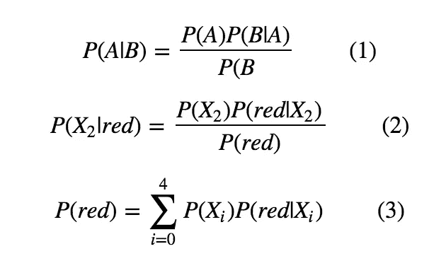
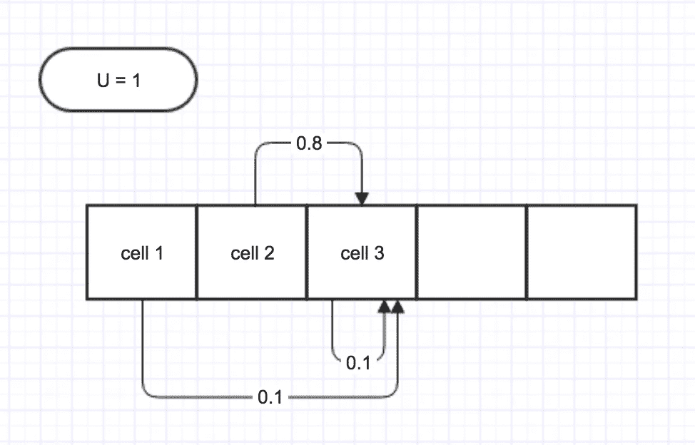

# 卡尔曼滤波器(1)——基础知识

> 原文：<https://towardsdatascience.com/kalman-filter-1-the-basics-68f89deb2613?source=collection_archive---------27----------------------->

## 自动驾驶汽车本地化的基础知识

我试图学习卡尔曼滤波器，一种结合你的猜测和一些不确定的测量值并做出更好的估计的方法，并发现没有这样容易理解的话题。但是后来，我遇到了这个[课程](https://classroom.udacity.com/courses/cs373)，它从最基本的方面介绍了这个想法。所以在这篇文章中，我将按照课程中的结构，简单介绍一下自动驾驶汽车定位的基础知识，这也是卡尔曼滤波器的起点。


# 问题设置

在自动驾驶汽车定位中，通常有两个组成部分— **第一个是运动**，当汽车踩下油门时，我们肯定可以估计(猜测)它可以走多远，第二个是测量，安装在汽车上的传感器能够检测环境并测量它的位置。*现在问题来了，我们的估计(猜测)和传感器测量都可能不准确，结合这两个不确定的因素，我们是否仍然能够对汽车的位置做出猜测，甚至做出更好的猜测？*

答案是肯定的，让我们来看一个具体的例子，看看如何用基本的统计学来解决这个问题:

# 感觉

假设我们的汽车行驶在一维世界中，那里只有 5 个网格和 2 种不同的颜色——绿色和红色。一开始，我们的汽车有相等的概率停留在 5 个网格中的任何一个，它也有一个传感器`Z`，它检测世界的颜色，然而，传感器并不总是正确的，当传感器说网格是`red`时，我们给`red`一个较高的权重`pHit = 0.6`，给`green`一个较低的权重`pMiss = 0.2`(这里我们使用权重，事实上当加起来是 1 时，它可以归一化为概率)。现在的问题是，当我们的传感器`Z = red`，我们的车的位置的概率是多少？

解决方案很简单，我们的传感器看到的网格是`red`，所以它更有可能在第二个和第三个单元格中。对于红细胞，我们给出较高的权重，绿色细胞给出较低的权重:

最终概率需要归一化，以便加起来等于 1。运行这个程序，我们得到的结果是:

```
array([0.11111111, 0.33333333, 0.33333333, 0.11111111, 0.11111111])
```

显然，第二个和第三个单元比其余单元具有更高的概率。

事实上，其背后的统计数据是贝叶斯法则:



以`cell 2(X_2)`中的概率为例，结合公式(2)和(3)，可以很容易地计算出概率为:

```
0.2*0.6 / (0.2*(0.2+0.6+0.6+0.2+0.2))
```

分母是一个规格化器，对于上面代码中对应于`sum(combine_prob)`的每个单元格都是一样的。

现在我们能够在感知环境后计算后验概率，让我们移动汽车，看看它如何影响定位。

# 移动

在这个水平的 5 格世界中，我们的汽车能够以定义为`U`的步数左右移动。然而，它可能不准确地移动到不期望的单元，并且移动概率具有如下分布:

它有 0.8 的几率正确移动，0.1 的几率比原计划多移动一步，0.1 的几率短移动一步。现在的问题是给一个先验分布`p`(每个单元格内的概率)，走一步`U`后验概率`q`是多少？

让我们看一个例子:



假设我们的车被指示移动 1 步，那么在 3 号单元格落地的概率是多少？

我们反过来考虑问题:移动 1 步后，汽车会在什么场景下降落在 3 号单元格？它可以从小区 2 以概率 0.3 正确移动，从小区 3 以概率 0.1 下冲，从小区 1 以概率 0.1 上冲。

这里的统计称为总概率:


到达`X_j`的概率等于从每个可能的小区`X_i`开始的概率之和乘以从`X_i`移动到`X_j`的概率。

注意这里的`U`大于单元总数`n`，汽车将循环回到步骤`U % n`。

# 结合在一起

现在我们有了两个最重要的部分——感知和移动，我们的车已经准备好移动了。过程如下:汽车感知环境→移动→感知环境→移动，…

在本例中，我们的汽车从均匀分布开始，有 2 次连续测量`red`和`green`，每次移动 1 步。我们得到最终概率:

```
[0.21157, 0.15157, 0.08105, 0.1684, 0.3873]
```

所以经过一系列步骤后，它最有可能以 0.3873 的概率落在最后一个单元格。

**参考**:

1.  [https://classroom.udacity.com/courses/cs373](https://classroom.udacity.com/courses/cs373)