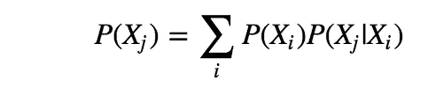

# 卡尔曼滤波器(2) —网格世界定位

> 原文：<https://towardsdatascience.com/kalman-filter-2-grid-world-localisation-93674dc750c6?source=collection_archive---------19----------------------->

## 将基础知识应用于二维空间

在上一篇[文章](/kalman-filter-1-the-basics-68f89deb2613)中，我们应用了基本的贝叶斯规则和全概率来定位一维世界中的一辆移动的汽车。让我们加强我们的理解，并将它们应用到二维世界中。

# 问题设置

考虑一个二维世界，机器人只能向左、向右、向上或向下移动。它不能斜向移动。此外，对于这个任务，机器人永远不会越过它的目的地广场；它要么运动，要么保持静止。

对于每个运动，它遵循:

并且测量和运动被设置为:

该设置表示，在这个 3x3 的世界中，有两种不同的颜色——绿色和红色。机器人在每个单元中以相等的概率开始，测量值为`R`，传感器有概率`0.8`是正确的。然后机器人做一个动作`[0, 0]`，保持静止，这个动作有一个概率`1.0`被正确执行。问题是机器人在每个细胞中的当前概率是多少？

# 履行

## 初始化

最初，每个单元具有相等的概率:

## 感觉

基于传感器的测量值(测量概率)和初始概率(先验概率)，应用贝叶斯规则，我们可以得到后验概率。

## 移动

在运动中，我们应用全概率，



也就是说，每个单元的概率等于它来自的单元的概率和转移概率的乘积。

这里的情况更简单，因为机器人只能移动或保持静止(`(i, j)`是当前小区，`(i-U[0], j-U[1])`是它移动的小区)。

## 本土化

现在让我们组装零件:

相应地，我们得到的结果是:

```
[[0.06666667 0.06666667 0.06666667]
 [0.06666667 0.26666667 0.26666667]
 [0.06666667 0.06666667 0.06666667]]
```

所以在测量和动作之后，机器人最有可能待在牢房`(1, 1) or (1, 2)`。

更多完整的测试，请点击查看[的完整实现。](https://github.com/MJeremy2017/Machine-Learning-Models/blob/master/Localisation/localization.ipynb)

**参考**:

1.  [https://classroom.udacity.com/courses/cs373](https://classroom.udacity.com/courses/cs373)