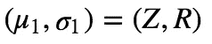

# 卡尔曼滤波器(3)——连续状态空间中的定位

> 原文：<https://towardsdatascience.com/kalman-filter-3-localisation-in-continuous-state-space-1c979f6bde5b?source=collection_archive---------33----------------------->

## 将高斯分布应用于连续状态空间

在过去的[会议](/kalman-filter-2-grid-world-localisation-93674dc750c6)中，我们尝试在网格世界中进行定位，在网格世界中，我们的机器人有不同的概率位于不同的单元中。总之，状态空间是离散的。为了将问题设置推广到连续状态空间，我们将到达卡尔曼滤波器的核心。

在我们讨论卡尔曼滤波器的任何细节之前，请记住我们在这里[学到的东西](/kalman-filter-1-the-basics-68f89deb2613)，卡尔曼滤波器总是有两个步骤:

1.  **传感(测量)**:基于机器人所看到的，更新后验分布
2.  **移动(预测)**:估计机器人移动后的新位置

以下是的结构:

1.  扩展到连续状态空间的想法
2.  用高斯分布实现 sense(测量)
3.  用高斯分布实现移动(预测)
4.  结合在一起
5.  多维卡尔曼滤波器

# 原则

在离散世界中，每个状态都有一个单独的概率，其总和为 1，将其扩展到连续状态空间的关键是找到一个连续的分布，而在卡尔曼滤波器中，该分布是高斯分布。


这就是说，无论是步进测量还是预测，我们对机器人位置的估计总是符合高斯分布。高斯的两个参数分别代表:

1.  `μ`:机器人位置最可能的估计
2.  `σ`:检测器和预测的不精确等造成的我们估计的不确定性。

任务是在一系列测量和预测之后，找到最终的高斯分布参数`μ`和`σ`。让我们把它分成两部分。

# 测量(感觉)

在测量阶段，我们根据机器人的传感器更新我们的信念。假设`X`是位置`Z`是测量(机器人观察到的)，我们正在解决的问题是:


我们之前的信念是`p(X)`，但是我们的传感器看到的分布`p(Z|X)`不同，现在我们正在尝试计算我们的后验分布`p(X|Z)`，这是给定的我们所看到的(`Z`)，我们现在的最佳估计是什么？

请记住，这里所有的分布都是高斯分布，为了得到后验分布，我们只需要应用贝叶斯规则，即将这两个分布相乘:


以上是更新分布的参数。注意`σ_new`比`σ`和`γ`都小！这告诉我们，倍增后不确定性降低了，这符合我们的知识，即传感实际上是获取信息和降低不确定性。实施将是:

# 预测(移动)

移动是直接向前的加法。初始分布`N(μ, σ)`，移动不确定度`U``γ^2`，移动后的分布为`N(μ+U, σ^2+γ^2)`，即均值加`U`，不确定度加`γ^2`。

注意，通过进行不确定的运动，方差(不确定性)增加，这与减少方差(不确定性)的测量相反。

# 1D 卡尔曼滤波器

现在结合测量和预测，我们得到:

在这个例子中，我们设置了初始位置`mu = 0`和不确定度`sig = 10000`，这意味着我们对机器人的初始位置非常不确定。经过几轮迭代，我们得到了结果:


我们看到，通过进行第一次测量，不确定性立即下降到`3.998`，它小于初始方差和测量方差。最后，我们用方差`4.0058`预测我们的机器人在位置`10.9999`着陆。

# 多维卡尔曼滤波器

在上面的例子中，我们只有一个变量，即位置`p`。现在让我们考虑第二个变速`v`，然后我们的任务将是得到`x = (p, v)`和不确定矩阵`P = cov(x)`的最终估计。

## 预言；预测；预告

在预测阶段，假设我们有以下关系:


from [reference](https://www.bzarg.com/p/how-a-kalman-filter-works-in-pictures/)

给定速度和时间`t`，我们可以得到下一个位置，我们假设的速度保持不变。然后我们得到了它的矩阵形式:


这里`F`称为状态转移矩阵，`P`为协方差矩阵，`μ`为外部运动矢量(比如有加速度或踏板油门)。

## 尺寸

测量也是一样，有一个测量转移矩阵`H`。以最简单的形式，让我们假设`H = (1, 0)`和，

```
 μ_0 = Hx = (1, 0)(p, v)^T = p
```

这就是说，我们的测量只能测量机器人的位置，而看不到速度。现在问题变成我们有两个高斯分布，一个是(先验分布):


第二个是(测量分布):



看起来很熟悉我们之前的例子，对吧？现在我们需要将这两个分布组合成后验分布。这里涉及到一系列的推导(一个精彩的解释[这里](https://www.bzarg.com/p/how-a-kalman-filter-works-in-pictures/)，我把结果放在这里:


现在让我们将它们结合在一起，得到最终的卡尔曼滤波函数:

完整的实现，请点击查看[。](https://github.com/MJeremy2017/Machine-Learning-Models/blob/master/Localisation/kalman-filter.ipynb)

**参考**:

1.  [https://classroom.udacity.com/courses/cs373](https://classroom.udacity.com/courses/cs373)
2.  [https://www . bzarg . com/p/how-a-Kalman-filter-works-in-pictures/](https://www.bzarg.com/p/how-a-kalman-filter-works-in-pictures/)