# 分类策略的美丽视觉模型解读——卡纳达语 MNIST 数字识别

> 原文：<https://towardsdatascience.com/kannada-visual-model-952cc6ec3a72?source=collection_archive---------28----------------------->

## 此处为副标题

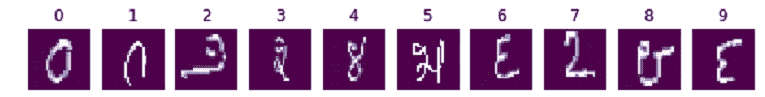

Kannada handwritten digits

卡纳达语 MNIST 数据集是一个很棒的近期作品([细节在此](https://arxiv.org/abs/1908.01242))，我很高兴它也对公众开放。我相信很快这里的社区就会在这个数据集上发布最先进的准确性数据。所以，我在做一些不同的事情。

相反，我们将尝试可视化，尝试看到模型所看到的，逐个像素地评估事物。我们的目标是可解释性。在本文中，我将从“最简单的”、最容易解释的算法开始。希望我会在后面的文章中公布其他建模技术的结果。

**重申并澄清:我不会专注于获得最佳表现。相反，我将着重于可视化输出，理解模型的意义，并理解它失败的地方和原因。当模型运行得不太好时，评估哪个更有趣。:)**

# 可视化数字数据

## 函数绘制一个随机数字及其标签

```
def plot_random_digit():
    random_index = np.random.randint(0,X_train.shape[0])
    plt.imshow(X_train[random_index], cmap='BuPu_r')
    plt.title(y_train[random_index])
    plt.axis("Off")plt.figure(figsize=[2,2])
plot_random_digit()
```

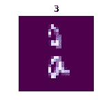

A random Kannada digit plotted as image

## 一口气看 50 个样本

```
plt.figure(figsize=[10,6])
for i **in** range(50):
    plt.subplot(5, 10, i+1)
    plt.axis('Off')
    if i < 10:
        plt.title(y_train[i])
    plt.imshow(X_train[i], cmap='BuPu_r')
```

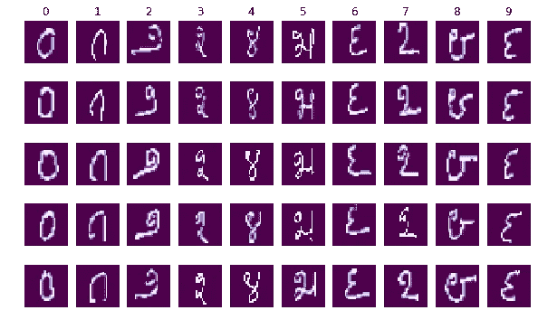

作为一个不擅长阅读卡纳达文字的人，对我来说这些符号看起来有些相似

*   第三和第七条
*   第 6 和第 9 条

在开始时，我期望这些预测者在这两对之间会有些混淆。尽管这不一定是真的——也许我们的模型能比我更好地识别数字。

# 重塑数据集以构建预测模型

个别例子是 28 X 28。对于 scikit learn 中的大多数预测建模方法，我们需要将示例展平为 1D 数组。
我们将使用 numpy 数组的整形方法。

```
X_train_reshape = X_train.reshape(X_train.shape[0], 784)
X_test_reshape = X_test.reshape(X_test.shape[0], 784)
```

# 建立和理解逻辑回归模型

让我们为我们的多类分类问题建立一个逻辑回归模型。

**请再次注意，我们不会关注获得最佳性能，而是关注如何理解模型所学的内容。**

逻辑回归模型将很容易和有趣地分析系数，以了解模型学到了什么。
在 SciKit-learn 中，可以通过多种方式制定多类分类。他们是-

*   一对休息
*   多项式

**1。一人 vs 其余:**

也称为一对一，这种策略包括为每个类安装一个分类器。对于每个分类器，该类与所有其他类相匹配。这种方法的一个优点是它的可解释性。

因为每个类仅由一个分类器表示，所以可以通过检查相应的分类器来获得关于该类的知识。这是多类分类最常用的策略，也是一个公平的默认选择。

对于我们的例子，这意味着构建 10 个不同的分类器。

在这里了解更多:
[https://sci kit-learn . org/stable/modules/generated/sk learn . multi class . onevsrestclassifier . html](https://scikit-learn.org/stable/modules/generated/sklearn.multiclass.OneVsRestClassifier.html)

**2。多项式:**

在此策略中，我们使用线性预测器对看到给定输出的概率的对数进行建模。
对于`multinomial`，最小化的损失是整个概率分布的多项式损失拟合。softmax 函数用于查找每个类别的预测概率。

在这里阅读更多相关内容:
[https://en . Wikipedia . org/wiki/Multinomial _ logistic _ regression # As _ a _ log-linear _ model](https://en.wikipedia.org/wiki/Multinomial_logistic_regression#As_a_log-linear_model)

**注意**:这种区别很重要，需要你为模型解释不同的系数。

# 首先，让我们使用 One vs. Rest 方案来构建我们的模型

```
from sklearn.linear_model import LogisticRegression
lr1 = LogisticRegression(solver="liblinear", multi_class="ovr")

*# Fitting on first 10000 records for faster training* 
lr1.fit(X_train_reshape[:10000], y_train[:10000])
```

## 评估列车组的性能

模型对训练数据的预测

```
from sklearn.metrics import confusion_matrix, accuracy_score, classification_report
y_train_pred = lr1.predict(X_train_reshape[:10000])cm = confusion_matrix(y_train[:10000], y_train_pred[:10000])

plt.figure(figsize=[7,6])
sns.heatmap(cm, cmap="Reds", annot=True, fmt='.0f')
plt.show()
```

## 那可是非常高的训练准确率！过度拟合？

还有，看起来模型是**不是**在 3 和 7，6 和 9 之间非常混淆，至少在火车布景上不是。

# 错误分析:检查错误分类的案例

为了便于索引，我们将转换到熊猫系列，隔离错误分类的案例，绘制一些示例。

## 11 例分类错误

*   研究一些案例
*   选择 9 个随机案例——我们将绘制数字，以及真实和预测的标签

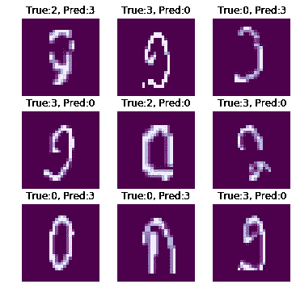

The mis-classified cases

你能看出为什么这个模型是混乱的吗？让我们看看模型在测试集上表现如何。

## 测试集上的混淆矩阵

对测试数据进行预测，并绘制混淆矩阵。

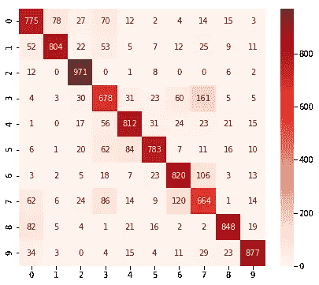

Confusion Matrix on test set — smells like over-fitting

## 看着混乱矩阵和分类报告-

3、7 的回忆最少—模型明显混淆了它们。同样，4 和 5 之间也有混淆。还有，很多 0 被误认为 1 和 3。

好吧！所以看起来在测试集上性能急剧下降。很有可能我们在列车上过度适应了。

我们承认这一模式可以改进。

但是，我们现在先不要担心这个。**让我们关注理解模型所学内容的方式。**

# 模型解释

## 了解每个像素的贡献

我们现在学习的每个像素的系数都是基于一对静止方案的。

让我们继续分析我们的 OVR 模型的系数。

系数 lr1.coef_ 的形状。“形状”是(10。784)，即每个标签有 784 个系数——每个数字的每个像素有 784 个系数！

正系数意味着该像素上的高值增加了该标签的机会，**与所有其他类**相比。因此，系数告诉我们这个像素如何将这个标签与所有其他标签区分开来。

## 提取像素系数并绘制在标签 0 的热图上

```
plt.figure(figsize=[3,3])
coefs = lr1.coef_[0].reshape(28,28)
plt.imshow(coefs,cmap="RdYlGn",vmin=-np.max(coefs),vmax=np.max(coefs)) *#setting mid point to 0*
plt.show()
```

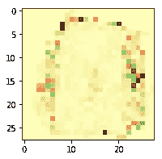

Heatmap for 0 — OVR

我用了一种不同的颜色来区分正负符号。

在上图中，绿色像素是正值像素。图像告诉我们，某些像素中的值有助于将数字归类为 0。不出所料，中间的红色表示该范围内的值意味着该数字为零的可能性较低。黄色接近于 0，这意味着像素对区分没有任何帮助。

## **制作所有数字的像素热图**

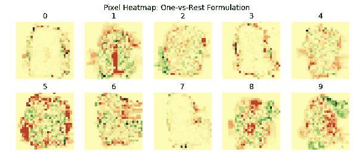

Heatmap — all digits — OVR scheme

好好看看这些热图。这将揭示模型已经学习了什么。请注意，我们有“一与其余”的公式，特别是在与其他数字的热图进行比较时。

# 现在，让我们使用多项式方案建立一个模型。

*   我们需要将`multi_class`参数指定为“多项式”
*   “liblinear”解算器不支持这一点，所以我们选择“sag”解算器。

```
lr2 = LogisticRegression(random_state=42, multi_class="multinomial", solver="sag")
lr2.fit(X_train_reshape[:10000], y_train[:10000])
```

## 在测试集上评估性能

绘制混淆矩阵


# 了解每个像素的贡献

每个标签有 784 个系数——每个像素的系数。

现在，一个正的系数意味着是什么使得这个标签成为现在这个样子！但是，如果 3 个标签在特定像素中具有相似的存在，则所有 3 个标签的系数可能具有相似的值。

## 提取像素系数并绘制在标签 0 的热图上

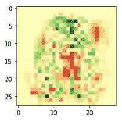

这与 OVR 模型的热图有多不同/相似？
让我们制作所有像素的热图。

## 为所有数字制作这样的像素热图

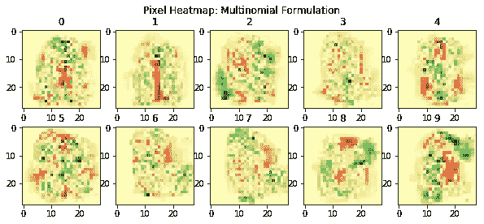

## 这些热图与每个标签的平均图像相比如何？

绘制每个数字的平均图像。

```
plt.figure(figsize=(10, 4))
for i **in** range(10):
    plt.subplot(2,5,i+1), plt.title(i)
    plt.imshow(np.mean(X_train[y_train==i],axis=0),cmap='gray')
plt.suptitle('Mean images for each digit')
```

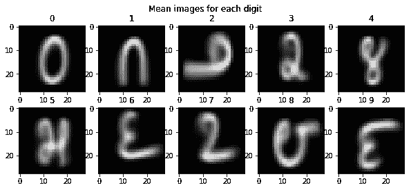

# 把它们都画在一起——好好看看。

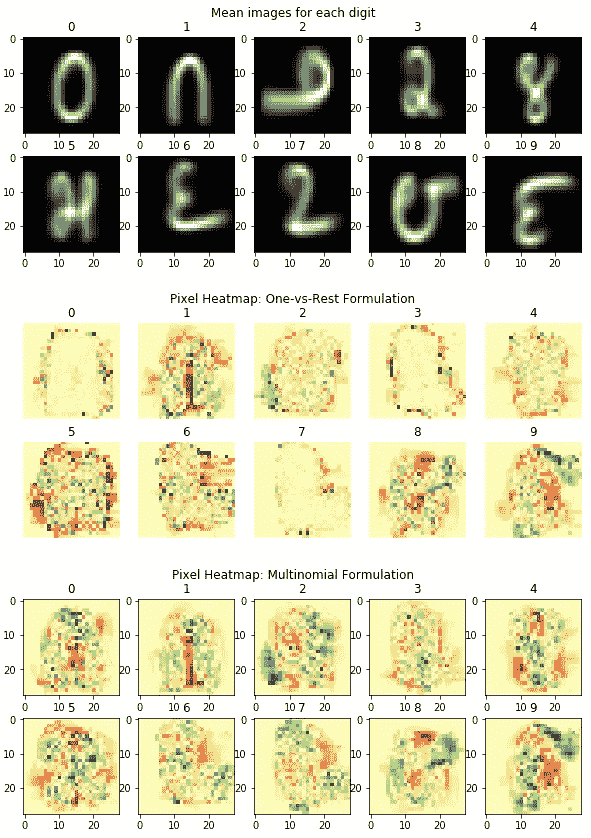

Mean images vs. OVR vs. Mutinomial

# 锻炼-

你已经看到了 OVR 方法和多项式方法的热图。你也有每个标签的平均图像。

*   将热图与平均图像进行比较和对比。
*   你认为这是怎么回事？你能试着理解每个数字的模型都学到了什么吗？
*   为什么模型在某些数字上表现不佳？热图有助于理解吗？

# 对于那些有兴趣尝试更多东西的人来说

我建议你试试下面的-

1.  使用带有正则化(ridge、lasso、elasticnet)的逻辑回归和使用交叉验证的超参数优化来减少过度拟合。
2.  利用奇异值分解/主成分分析对原始数据进行去噪和重构；接下来是一个优化的逻辑回归模型。

好了，这就是我们这里的小演示！我将很快分享更多不同建模技术的演示，解释它们的方法，以及更多使用监督和非监督技术的相同数据集的实验。

# 觉得这个有意思？请继续关注更多这样的演示。

## 请分享您的评论/意见/建议！