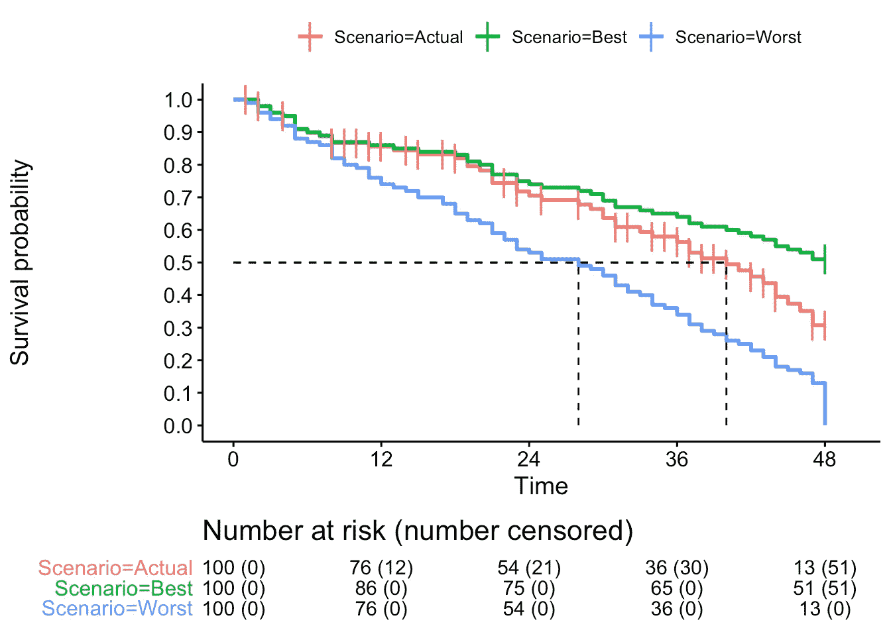

# 卡普兰·迈耶曲线:介绍

> 原文：<https://towardsdatascience.com/kaplan-meier-curves-c5768e349479?source=collection_archive---------0----------------------->

*这个帖子的代码可以在 Github* *上找到* [*。一个完全交互式的应用程序，可以调整样本大小、审查、生存收益等参数，并查看对风险比的影响……可以在*](https://rmvpaeme.github.io/KaplanMeier_intro/)[*shinyapps*](https://rubenvp.shinyapps.io/kmplotter/)*找到。*

K aplan-Meier 曲线广泛用于临床和基础研究，但在制作或解释它们时，需要注意一些重要的陷阱。在这篇短文中，我将给出一个关于卡普兰迈耶图上数据表示的基本概述。

Kaplan-Meier 估计量用于估计生存函数。这个函数的可视化表示通常被称为卡普兰-迈耶曲线，它显示了某个时间间隔内某个事件(例如，生存)的概率是多少。如果样本量足够大，曲线应该接近被调查人群的真实生存函数。

它通常在一项研究中比较两组(比如接受治疗 A 的一组和接受治疗 B 的一组)。

治疗 B 似乎比治疗 A 做得更好(中位生存时间为+/- 47 个月对 30 个月，具有显著的 p 值)。在这篇文章中，我只探讨治疗组 A，不会比较两组。

# 基本卡普兰迈耶图

让我们从创建一些基本数据开始。我们有 10 名患者参与了一项研究(所谓的“风险”)，随访时间为 10 个月。每个参与者都得到相同的待遇。

Cohort without censored data

如果我们仔细看看“跟进”和“事件类型”列:

*   后续时间可以是任何时间间隔:分钟、天、月、年。
*   事件类型 1 等于一个事件。癌症试验中的典型事件可能是死亡，但卡普兰-迈耶曲线也可以用于其他类型的研究。例如，安参加了一项虚构的抗癌新药研究，但在 4 个月后去世。
*   事件类型 0 等于右删截事件。

为了简单起见，在第一个例子中没有审查事件。

研究开始。每个月都有一名参与者体验一次活动。每发生一次事件，存活概率下降剩余曲线的 10%(=事件数除以处于危险中的人数)，直到研究结束时达到零。

# 带有删失数据的卡普兰迈耶图

让我们给前面的图表添加一些删失数据。

当关于存活时间的信息不完整时，观察值被称为删失的；最常见的形式是右删截(与左删截和区间删截相反，这里不讨论)。在研究期间没有经历感兴趣事件的患者被称为“右删截”。此人的存活时间被认为至少与研究持续时间一样长。右删截的另一个例子是当一个人在研究观察时间结束之前退出研究，并且没有经历该事件。换句话说，删失数据是一种缺失数据。

安、玛丽和伊丽莎白在研究完成前就离开了。在研究结束时，Kate 没有出现事件。与之前的“楼梯”模式相比，曲线看起来已经非常不同了。

Cohort with censored data (Ann, Mary, Elizabeth and Kate). Note that Andy experienced an event at 6.2 months instead of 7 months in the example above (and was not censored).

现在，事件、审查和卡普兰迈耶曲线上的下降之间的关系是什么？

如果我们看一下第一个有活动的参与者(约翰)，我们会发现 1 个月后我们下降了 0.1，或者说剩余高度的 10%:

如果我们再等一会儿，我们可以看到在第 5 个月，还有 6 名患者处于危险之中。两个已经有了一个事件，还有两个已经被审查。在下一个事件中，曲线下降剩余高度的 16%(而不是研究开始时的 10%)，因为处于危险中的人更少:

这种情况一直持续到研究期结束，或者直到处于危险中的患者数量达到 0。最后一滴是最大的。在最后一次下降时，曲线下降剩余高度的 50%(或总高度的 20%)。然而，仍然只有一个人经历了一次事件，与研究开始时相同(当时跌落仅为剩余(=总)高度的 10%)。这是因为在研究中只有 2 人处于危险中。

# 置信区间的重要性

特别是当只有极少数患者处于危险中时，一个删失事件的影响会对 KM 曲线的外观产生很大的影响。

在前面的情节中，似乎生存曲线在 20%的生存概率处达到平稳状态。如果我们在 Joe 和 Kate(参与者 9 和 10)之间交换审查状态，KM 曲线会发生剧烈变化，并在研究期结束时降至 0。在这种情况下(曲线 B)，所有参与者要么有一个事件，要么被审查。

The event type for Joe and Kate are reversed in scenario B

换句话说，只有一个事件标志着存活曲线达到 0 或达到稳定在 20%的平台之间的差异。

如果我们在 KM 曲线上绘制 95%的置信区间，我们也可以看到这一点。置信区间非常宽，这表明该研究的参与者非常少。此外，随着时间的推移，95%置信区间会增加，因为受审查个体的数量会增加。

# 排除审查数据:是还是不是？

## 小型数据集

我们可以模拟最好的情况(删截等于无事件)和最坏的情况(删截等于事件)，并将其与实际曲线进行比较。

The first 3 observations for every scenario (best, worst and actual)

在最好的情况下，曲线在研究结束时停止在 40%的生存概率，而在最坏的情况下，曲线下降到 0。中位存活时间也大不相同:

*   实际曲线:6.2 个月
*   最好的情况:8.1 个月
*   最坏情况:5.5 个月

## 大型数据集

如果我们增加样本量，这就更加惊人了。在模拟中，样本量从 10 个增加到 100 个，随访时间为 48 个月。在这个模拟中，40%的个体在第 0 个月和第 48 个月之间被(随机)审查。这再次表明，中位存活时间可以有很大的不同。

# 结论

*   删失数据会显著影响 KM 曲线，但在拟合模型时必须包括在内。
*   如果出现大的落差，在解释 KM 的终点时要小心，尤其是在研究接近尾声时。这通常意味着没有很多人处于危险中(并且 95% CI 区间更宽)。
*   即使没有报告或者没有显示置信区间，跌落的高度也可以告诉你有多少病人处于危险中。

*关于作者:*

*我是 Ruben Van Paemel 博士，2017 年从医学院毕业后，我开始在根特大学(医学遗传学中心)担任博士研究员，由研究基金会 Flanders 资助。我也是根特大学医院的儿科住院医师。可以在推特上关注我:*[*@ RubenVanPaemel*](http://www.twitter.com/RubenVanPaemel)

*我从事神经母细胞瘤的研究，这是一种罕见但极具破坏性的肿瘤，最常见于非常年幼的儿童。我们的团队试图了解潜在的基因改变，以提高神经母细胞瘤儿童的诊断、治疗和最终存活率。*

# 参考

*   这篇文章的灵感来自 Pancanology 给出的解释:[https://www.youtube.com/watch?v=KE1tkZmWhqU](https://www.youtube.com/watch?v=KE1tkZmWhqU)。
*   关于审查的定义:[https://www.cscu.cornell.edu/news/statnews/stnews78.pdf](https://www.cscu.cornell.edu/news/statnews/stnews78.pdf)
*   封面照片: [Unsplash](https://unsplash.com/photos/bJhT_8nbUA0)