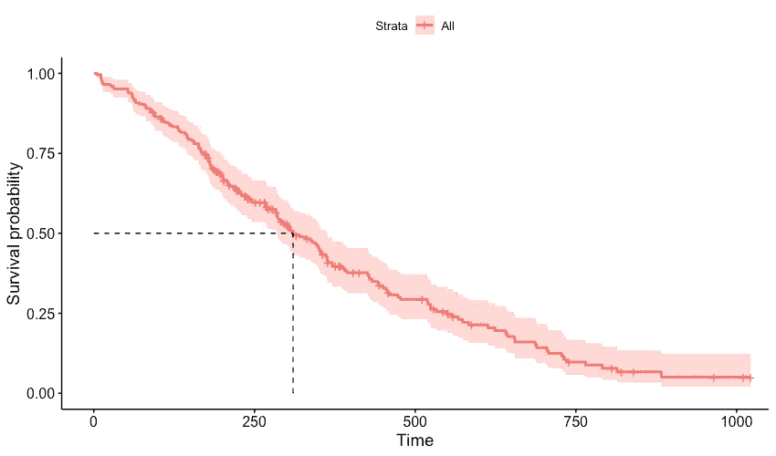
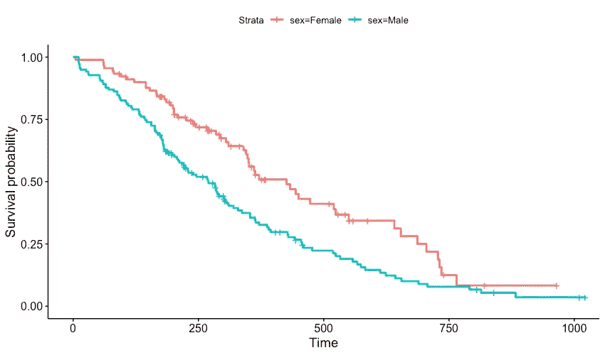
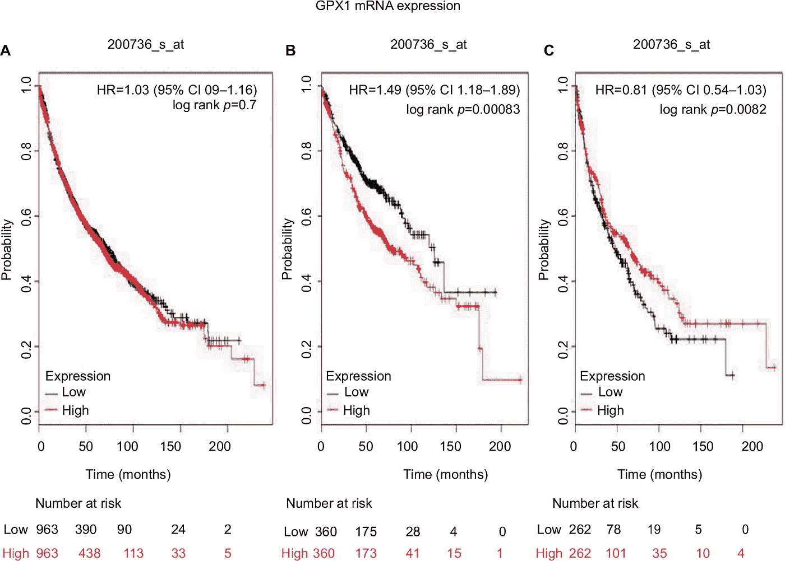
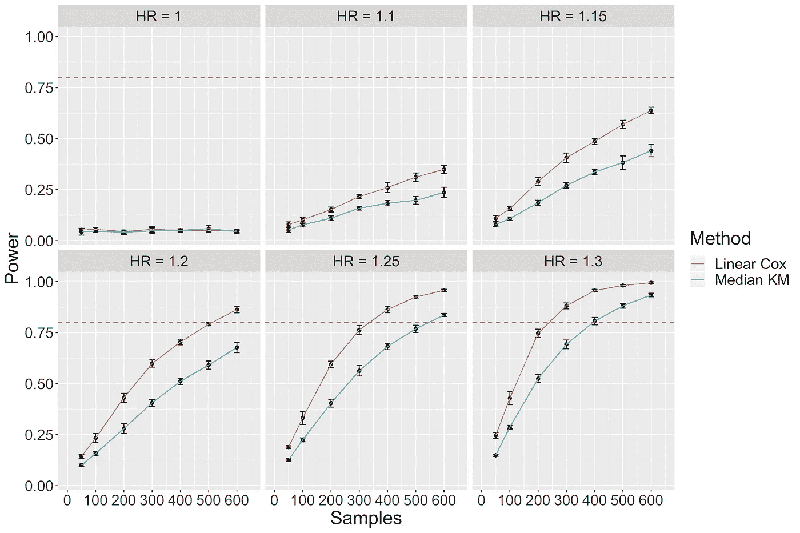
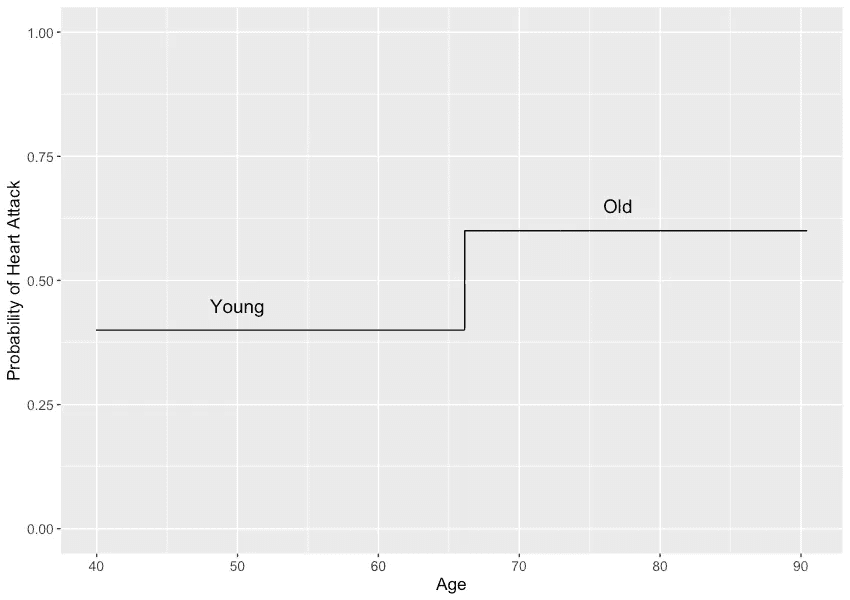
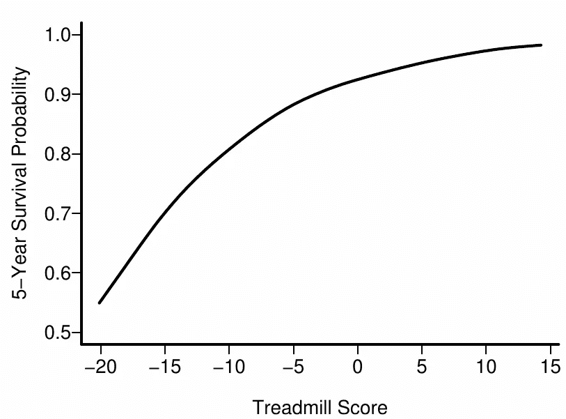
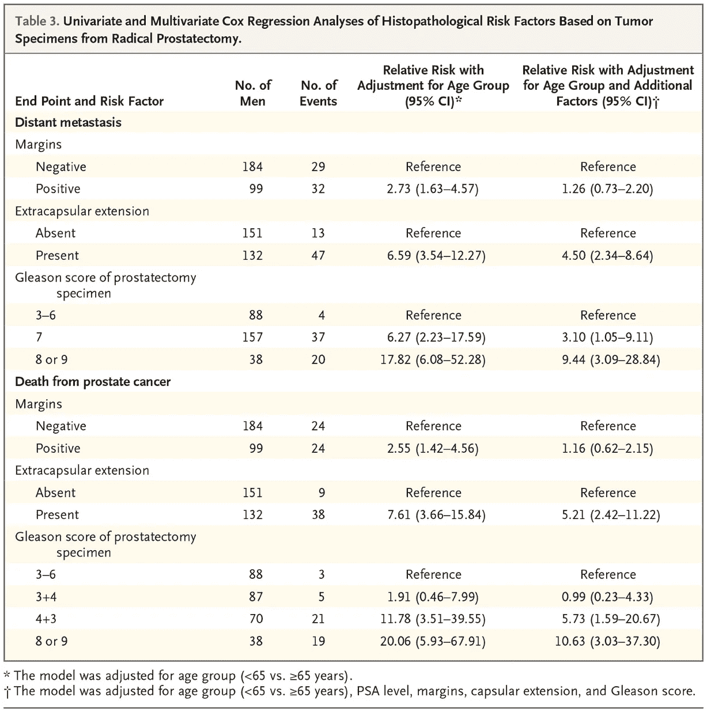

# 卡普兰·迈耶的错误

> 原文：<https://towardsdatascience.com/kaplan-meier-mistakes-48cd9e168b09?source=collection_archive---------7----------------------->

## 了解如何避免常见的生存分析错误并改善预后因素研究

Photo Credit: [Louis Reed](https://unsplash.com/photos/pwcKF7L4-no)

患者的**预后**是指未来医疗结果的风险，如手术并发症、肿瘤复发或死亡。**预后因素研究**是对可以预测患者预后的信息的研究。经验证的预后因素是转化研究的重要组成部分，转化研究用于为临床决策提供信息，对疾病机制进行假设，并对患者进行分层以获得个性化药物。

生存数据被用来研究预后因素，而**卡普兰迈耶**分析因其假定的易用性而经常被使用。不幸的是，一些研究人员误解了 Kaplan Meier 的分析，并错误地使用了它，这给他们的分析带来了统计问题，并可能导致医疗错误。

这篇文章的目标是以一种不具备深厚统计学背景的研究人员可以理解的方式强调常见的 Kaplan Meier 错误。虽然我更喜欢写如何正确分析生存数据，但这种希望几乎是不可能的。生存分析是一个复杂的领域，整个教科书都致力于这个主题。相反，我希望读完这篇文章后，你能够发现常见的错误，在你自己的研究中避免这些错误，并提高你评论预后因素研究的能力。

# 卡普兰·迈耶评论

在我们讨论卡普兰迈耶分析的问题之前，卡普兰迈耶到底是什么？Kaplan Meier 估计值是一种统计方法，用于估计一段时间内的生存概率。这一估计很重要，因为它描述了疾病的总体预后——这是帮助患者和医生讨论医疗保健计划的有用信息。卡普兰迈耶图形象化了患者存活一定时间的概率。图 1 描绘了 NCCTG 群组肺癌存活概率。中位生存期，即 50%的患者仍然存活的时间，约为 300 天。曲线两侧的浅红色带是 95%的置信区间，表明真实的生存概率可能在红色区域内。图 1 是我们在没有关于患者的任何额外信息的情况下所能做出的最全面的风险评估。它是 NCCTG 队列中所有个体的生存概率。

Figure 1\. Overall survival of NCCTG lung cancer patients. Data from the lung dataset in the R survival package. Note the median survival time is indicated by the dotted line intercepting the x-axis.

尽管图 1 很好地总结了肺癌患者的总体预后，但我们知道有许多因素导致不同的生存时间。有了额外的信息，我们可以给个体患者更准确的生存估计。NCCTG 数据集包括每个患者的性别，让我们分别估计男性和女性的生存概率，如图 2 所示。

Figure 2\. Overall survival for lung cancer patients stratified by sex.

图 2 显示女性患者比男性患者存活时间更长。您可能会注意到，图 1 中的曲线出现在图 2 中曲线的中间。这不是巧合；在没有任何患者信息的情况下，图 1 中的总体估计值平均了男性和女性的生存概率。

注意卡普兰·迈耶的解释没有提到生存差异测试。这是因为卡普兰·迈耶估计量只估计生存概率。它不会比较它们。为了对这些生存概率做出推断，我们需要**对数秩检验**。

对数秩检验是一种假设检验，用于比较两组之间的生存概率。它计算一个 p 值，表明数据和零假设之间的相容性，前提是所有的测试假设都是正确的。当我们有一个来自较大总体的数据样本，并且我们想对总体进行陈述时，假设检验是有用的。因为我们没有每个肺癌患者的测量数据，所以我们的患者样本存在不确定性。统计检验通过为关于总体的陈述提供一种证据尺度来帮助我们应对这种不确定性。尽管统计测试可以帮助我们对总体做出推断(决定)，但测试也有其局限性。众所周知，p 值很难解释，许多统计学家呼吁结束统计显著性，即如果 p 值小于 0.05，则将发现标记为显著的做法。查看《自然》杂志上的这篇[评论，了解更多关于 p 值的局限性。](https://www.nature.com/articles/d41586-019-00857-9)

现在让我们来看一个对数秩检验的简单例子。我们已经从 NCCTG 研究中收集了肺癌患者的数据，我们想对性别特异性存活率做出推断。首先，我们假设男性和女性肺癌患者之间存在生存差异。无效假设是男性和女性之间不存在生存差异。另一个假设是生存差异确实存在。然后，我们使用统计软件来计算对数秩检验的 p 值。该测试产生 0.001 的 p 值，表明在普通肺癌人群中男性和女性之间存在生存差异。

从现在开始，我将使用 Kaplan Meier 分析来表示使用 Kaplan Meier 图和对数秩检验来分析生存差异。本文的其余部分将检查研究人员在使用 Kaplan Meier 分析生存数据时所犯的错误。

# 分析连续变量

二元、分类和连续变量在医学研究中很普遍。二元变量仅由两个值组成，如治疗对不治疗。分类变量类似于二元变量，但有两个以上的选择，如安慰剂对药物 A 对药物 b。连续变量是数字变量，如年龄、基因表达、血压和肿瘤大小。这些变量可以取无限多的值，这取决于变量测量的精确程度。因为连续变量可以取无穷大的值，所以没有像二元或分类变量那样的组。

试图用 Kaplan Meier 分析来分析连续变量的研究人员会立即遇到问题:log-rank 检验只比较组间存活率。我们如何在没有任何分组的情况下分析一个变量？要使用对数秩检验，连续变量必须以某种方式分成几组。最常见的方法是将变量**二分化**,从而将值分类为低或高。**中值分界点**通常用于区分高低分组(图 3)。

Figure 3\. Adapted from [Liu et al. 2018](https://www.dovepress.com/distinct-prognostic-values-of-mrna-expression-of-glutathione-peroxidas-peer-reviewed-fulltext-article-CMAR). Patients were separated into groups of low and high mRNA expression. The initial equal number of patients in each group indicates the median was used as the cutpoint.

一些研究使用“最优”分界点将连续变量二分法。最佳分界点被定义为在组间产生最大生存间隔，产生最小 p 值的值。要确定最佳切割点，通常要检查所有可能的值，并选择产生最小 p 值的切割点。这种方法是有问题的，因为测试每个切割点会产生多重测试问题。测试这么多不同的切割点会夸大 p 值，并大大增加假阳性的机会。更糟糕的是，最佳分界点通常依赖于数据集，这意味着在一项研究中发现的分界点在其他 studies⁴⁻中不太可能相同。研究人员应该避免使用最佳分界点来二分法连续变量。

即使研究人员避免“最佳”分界点并使用中位数，二分法也会导致统计能力的损失，并对风险的分布做出错误的假设。**统计功效**是假设我们寻找的效应存在，我们的统计测试检测到它的概率。功效取决于样本数量、数据的可变性和所用的统计方法(一些方法比其他方法更有效)。高能量对于科学发现是至关重要的，因为低能量的研究常常会错过重要的结果。研究人员应该使用最大化统计能力的方法。

将连续变量二分法通过强制所有测量值采用简单的是或否值来降低功耗。使用二元变量而不是连续变量可以将检测效果所需的样本数量增加三倍。使用低统计功效的方法不仅成本高昂，而且不道德，因为需要的患者比必要的要多(图 4)。应该使用不二分法的方法，如 **Cox 回归**。

Figure 4\. Simulations comparing statistical power of median cutpoint Kaplan Meier (Median KM) and linear Cox regression (Linear Cox) to detect a continuous linear effect on survival. The dashed red line represents 80% power. HR=Hazard Ratio. Simulation details can be found [here](https://github.com/tjbencomo/kaplan-meier-problems).

两分法还对 patients⁴.的风险分布做出了错误的假设例如，考虑将年龄作为心肌梗塞(MI)的预后因素。老年通常与更大的心肌梗死风险相关。使用 65 岁的中位年龄，所有小于 65 岁的患者将被分类为年轻，而超过 65 岁的患者被分类为老年。这种二分法假定所有年轻患者都有相同的心肌梗死风险。它还假设所有老年患者都比年轻患者有相同的、更高的心肌梗死风险(图 5)。这种假设显然是错误的，因为 64 岁的人比 40 岁的人更容易患心脏病。没有理由一个 64 岁的人应该和一个 40 岁的人在同一个危险群；没有哪种生物开关在我们 65 岁时突然开启，会大幅增加我们 64 岁时患心脏病的风险。

Figure 5\. Stepwise risk function assumed by dichotomizing a continuous variable into low and high groups

虽然一些生物变量确实显示出逐步的作用机制，在达到某个值之前什么都不会发生——想想神经元中打开离子门控通道的 55mV 动作电位——但研究表明大多数生理变量并不遵循这样的 mechanisms⁹.相反，风险随着变量的变化而逐渐变化。一些变量甚至遵循非线性趋势(图 6)。像 Cox 回归这样的连续建模方法可以考虑到这些趋势，考虑到 40 岁的人与 41 岁的人而不是 64 岁的人有相似的风险。

Figure 6\. Adapted from *Regression Modeling Strategies* by Frank Harrell. Probability of survival gradually increases as the treadmill score increases. Cox regression can use nonlinear functions to model this type of relationship.

# 协变量调整

预后研究通常分析多个变量，也称为协变量。常见的情况是，研究单独分析每个变量，也分析多个变量(图 7)。单独分析每个变量是单变量分析，而一起分析多个变量被称为多变量分析。

FIgure 7\. Adapted from [Bill-Axelson et al](https://www.nejm.org/doi/full/10.1056/NEJMoa1807801). Hazard ratios for prostate cancer prognostic factors. The 4th column shows hazard ratios only adjusted for age (practically univariable), while the 5th column shows hazard ratios adjusted for multiple variables (multivariable).

这两种分析方法都很受欢迎，尽管单变量模型很少提供关于预后因素重要性⁻的信息。当多个因素影响生存率时，单变量分析会高估或低估预后效应，因为分析假设多个变量的效应归因于被分析的单个变量。这被称为**遗漏变量偏差**，解释了为什么图 7 中的单变量风险比远大于多变量风险比。需要多变量模型来调整多个预后因素，减少遗漏变量的偏倚，并理清每个变量对生存率的影响。

卡普兰迈耶是一个单变量的方法。这意味着 Kaplan Meier 的结果很容易有偏差，夸大了预后的重要性或完全错过了信号。在单变量 Cox 回归中分析单个连续标志物是单变量分析的另一个例子，会产生无信息的结果。应该使用可以调整多个变量的多变量方法，如 Cox 回归。

许多研究将声称一种新的生物标志物仅从单变量 Kaplan Meier 分析中预测。虽然生物标志物可能是预后性的，但这很难仅从单变量分析中得到证明。至少应该用 Cox 模型和其他基本预后因素来分析这个变量。像年龄和性别这样的信息通常是可以获得的，并且是许多疾病的预后信息，可以作为很好的基线变量进行调整。虽然不可能对每个潜在变量进行调整，但进行文献回顾和与临床医生交谈是识别对分析有重大影响的强预后因素的好方法。如果信号在多变量分析中仍然成立，新的生物标志物就有希望了。

# 增值价值

虽然在多变量模型中显示一个小的 p 值是提示一个标志物具有预后价值的最低限度，但是有更严格的方法来评估预后因子重要性⁴.因为许多预后因素已经存在，研究人员应该调查新的预后因素的附加值，量化新的标记改善预测的程度。

有许多方法可以量化新的预后标记物增加了多少信息。ROC 曲线下面积(AUC-ROC)、似然比检验和 r 是衡量预测性能⁻ ⁵.的常用指标虽然讨论每个指标的利弊超出了本文的范围，但是研究人员必须证明他们的新标记的附加值。

量化附加值后，评估与附加值相关的成本至关重要。并非所有的生物标志物都是相同的，一些标志物可以提供比其他标志物更多的信息。根据疾病的不同，传统的临床实验室可以提供比遗传标记或医疗记录更多的信息。重要的是要明白这些标记中的每一个都有不同的成本。像基因标记这样更昂贵的测试可能需要比更便宜的替代方法提供更多的信息来证明它们的成本。只有医生和患者才能决定增加的信息是否值得增加的成本，因此预后研究严格量化附加值是至关重要的。

# 结论

错误分析生存数据的方法有很多。研究人员应该避免将连续变量二分法，使用多变量模型，并量化新的预后标记物的附加值。遵循这些指南可以降低我们对低质量研究的容忍度，并改善未来的研究，从而改善患者护理。

如果你想了解更多关于生存分析方法的知识，比如 Cox 回归，可以看看我关于生存分析最佳实践的演讲。

# 参考

[1] R. Riley 等，预后研究策略(进展)2:预后因素研究(2013)， *PLOS 医学*

[2] A. Hingorani 等，预后研究策略(进展)4:分层医学研究(2013)， *BMJ*

[3] S. Greenland 等人，统计检验、P 值、置信区间和功效:误解指南(2016 年)，*欧洲流行病学杂志*

[4] C. Bennette 等人，反对分位数:流行病学研究中连续变量的分类及其不满意之处(2012 年)， *BMC 医学研究方法学*

[5] D. Altman，在预后因素评估中使用“最佳”切割点的危险(1994 年)， *JNCI:国家癌症研究所杂志*

[6] K. Metze，连续数据的二分法—预后因素研究中的一个陷阱(2008 年)，*病理学—研究和实践*

[7] P. Royston 等人，多元回归中的二分法连续预测值:一个坏主意(2006 年)，*医学统计学*

[8] N. Dawson 等人，统计分析中的二分法连续变量:避免实践(2012)，*医疗决策*

[9] A. Giannoni 等，连续生理变量中的最佳预后阈值真的存在吗？分析表观阈值的来源，对峰值耗氧量、射血分数和脑钠肽进行系统综述(2014)， *PLOS 一*

[10] D. Altman，将连续变量二分法中的问题(1994)，*美国流行病学杂志*

[11] D. Altman，P. Royston，将连续变量二分法的成本(2006 年)， *BMJ:英国医学杂志*

[12] K. Moons，新标记物的科学评价标准:展望(2010)，*临床化学*

[13] E. Steyerberg 等人，评估诊断和预后标志物的增量价值:综述和说明(2012 年)，*欧洲临床研究杂志*

[14] M. Pencina 等人，评估新标记物的额外预测能力:从 ROC 曲线下面积到重新分类和重新分类之后(2008 年)，*医学统计学*

[15] E. Steyerberg 等，预后研究策略(进展)3:预后模型研究(2013)， *PLOS 医学*