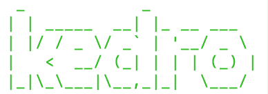
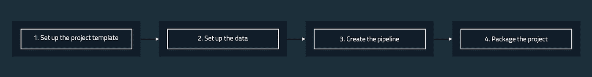
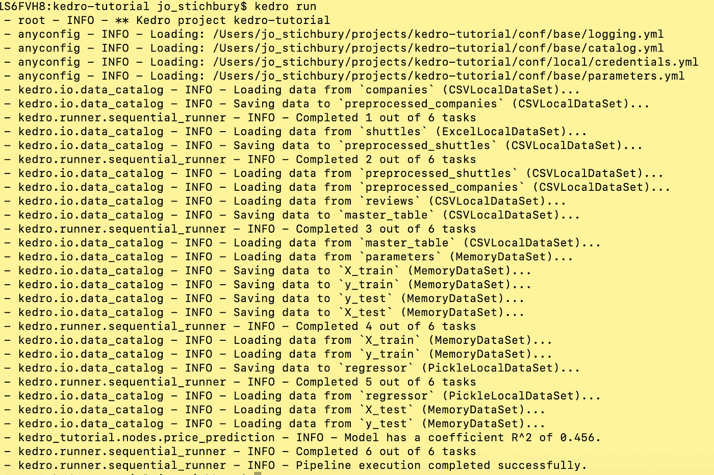

# Kedro:数据科学的新工具

> 原文：<https://towardsdatascience.com/kedro-prepare-to-pimp-your-pipeline-f8f68c263466?source=collection_archive---------6----------------------->

## 用于生产就绪数据管道的新 Python 库

*在本帖中，我将介绍* [*Kedro*](https://github.com/quantumblacklabs/kedro) *，这是一款面向数据科学家和数据工程师的全新开源工具。在简要描述了它是什么以及为什么它可能成为每个专业人员工具链的标准部分之后，我将在一个教程中描述如何使用它，您应该能够在十五分钟内完成。为未来的太空飞行系好安全带！*


*Image by* [*stan*](https://www.flickr.com/photos/36521958172@N01) *(licensed under* [*CC BY-SA 2.0*](https://creativecommons.org/licenses/by-sa/2.0/?ref=ccsearch&atype=rich)*)*

假设你是一名数据科学家，为一名为公司做出关键财务决策的高管工作。她请你提供一个特别的分析，当你这样做时，她感谢你为她的计划提供了有用的见解。太好了！

三个月后，新晋升的主管，现在是你的 CEO，要求你在下一次计划会议上重新进行分析…而你不能。代码被破坏是因为您覆盖了文件的一些关键部分，并且您不记得当时使用的确切环境。或者，代码可能是好的，但它在一个大的 Jupyter 笔记本中，所有文件路径都是硬编码的，这意味着您必须费力地检查和更改每一个新数据输入。不太好！

数据科学家对软件工程的一些日常原则并不熟悉，他们并不都有广泛的编程背景。事实上，许多数据科学家都是自学的，作为研究项目的一部分或在工作中必要时学习编程。也许，一些数据科学家会争辩说他们的代码不需要高标准，因为他们不是在生产系统上工作。

> *任何支持业务决策流程的代码都应被视为生产代码*

数据科学家可能不认为他们工作的主要产出是代码，但这并不意味着他们编写的代码不应该遵循软件工程团队期望的标准。事实上，它至少应该具有以下特征:

*   **版本化** —使用 [git](http://rogerdudler.github.io/git-guide/) 或类似的工具定期保存您的更改，无论您是独自工作还是在团队中工作。
*   **再现性** —您应该能够将一个项目转移到另一台计算机上并运行它，而不需要大量的工作或重新配置。
*   **遵循标准**——通用的项目结构、标准的编码约定和工具。
*   **文档** —自动化文档，使您的文档与您的代码保持同步。
*   模块化——代码可以很容易地执行和测试。

关于这些原则的更多细节，请看来自 [QuantumBlack](https://quantumblack.com/) 的 Thomas Huijskens 的[有用的博客文章](https://thuijskens.github.io/2018/11/13/useful-code-is-production-code/)。

# **凯卓是什么？**

Kedro 是一个开发工作流工具，允许你创建可移植的数据管道。它将软件工程最佳实践应用到您的数据科学代码中，因此它是可复制的、模块化的和有据可查的。如果你使用 Kedro，你可以更少地担心如何编写生产就绪的代码(Kedro 为你做了繁重的工作),你将标准化你的团队合作的方式，让你们所有人更有效地工作。

许多数据科学家需要执行例行的数据清理、处理和编译任务，这些任务可能不是他们最喜欢的活动，但却占了他们日常任务的很大一部分。Kedro 使得构建数据管道来自动化“繁重的工作”变得更加容易，并且减少了在这种任务上花费的时间。

Kedro 由高级分析公司 [QuantumBlack](https://www.quantumblack.com/) 创建，该公司于 2015 年被咨询巨头麦肯锡&公司收购。QuantumBlack 已经在麦肯锡的 60 多个项目中使用了 Kedro，现在决定将其开源。他们的目标是让员工、客户和第三方开发人员能够使用 Kedro 并在其上进行构建。通过根据自己的需求扩展这一开放工具，数据专业人员能够有效地完成他们的常规任务，并有可能将他们的改进分享给社区。

The team from Quantum Black explain Kedro

# **Kedro 是工作流调度器吗？**

Kedro 不像 Airflow 和 Luigi 那样是工作流调度器。Kedro 使您的数据管道原型化变得容易，而 Airflow 和 Luigi 是互补的框架，在管理部署、调度、监控和警报方面非常出色。Kedro 管道就像是制造汽车零件的机器。气流或路易吉告诉不同的机器打开或关闭，以便一起工作，生产出一辆汽车。QuantumBlack 构建了一个 Kedro-Airflow 插件，提供了更快的原型开发时间，并降低了将管道转移到两个工作流调度器的门槛。

# **我需要知道什么？**

Kedro 的文档是为初学者设计的，帮助他们开始创建自己的 Kedro 项目(Python 3.5+)。如果你只有非常基础的 Python 知识，那么你可能会发现学习曲线更具挑战性，但是忍耐一下，并遵循文档的指导。

# 与凯卓进行十五分钟的太空飞行

我简单易懂的 15 分钟教程将基于以下场景:

现在是 2160 年，太空旅游业正在蓬勃发展。在全球范围内，有数千家航天飞机公司将游客送上月球并返回。你已经能够找到三个(虚构的)数据集，包括每架航天飞机提供的便利设施、顾客评论和公司信息。您希望训练一个线性回归模型，该模型使用数据集来预测班车租赁价格。但是，在开始训练模型之前，您需要通过进行一些数据工程来准备数据，这是通过创建主表来为模型构建准备数据的过程。

# 正在设置

第一步，将 kedro pip 安装到一个新的 Python 3.5+虚拟环境中(我们推荐 [conda](https://docs.conda.io/projects/conda/en/latest/user-guide/tasks/manage-environments.html) )，并通过键入以下命令确认安装正确

```
kedro info
```

您应该会看到如下所示的 Kedro 图形:



这将另外给你你正在使用的 Kedro 版本。我在 2019 年 5 月基于版本 0.14.0 编写了本教程，由于这是一个活跃的开源项目，随着时间的推移，可能会对代码库进行更改，从而导致示例项目发生微小变化。我们将努力保持示例代码最新，虽然不是这篇博客，所以如果你发现任何不一致的地方，你应该参考 [Kedro 文档](https://kedro.readthedocs.io/)和[发布说明](https://github.com/quantumblacklabs/kedro/blob/develop/RELEASE.md)。

# Kedro 工作流程

构建 Kedro 项目时，通常会遵循标准的开发工作流程，如下图所示。在本教程中，我将走过每一个步骤。



# 设置项目模板

为了简单起见，QuantumBlack 团队已经提供了您需要的所有代码，因此您只需从其 [Github Repo](https://github.com/quantumblacklabs/kedro-examples/tree/develop/kedro-tutorial) 中克隆示例项目。在本教程中，您不需要设置项目样板。

一旦有了 Spaceflights 项目的代码，为了确保有必要的依赖项，请在 Python 3.5+虚拟环境中运行以下代码:

```
kedro install
```

# 设置数据

当可能需要引用不同位置的数据集时，Kedro 使用配置文件使项目的代码可以跨不同环境进行复制。

要为 Kedro 项目设置数据，通常需要将数据集添加到 data 文件夹中，并配置管理数据加载和保存的数据源注册表

本教程使用了航天公司往返月球的三个数据集，并使用了两种数据格式:。csv 和. xlsx .文件存储在项目目录的`data/01_raw/`文件夹中。

为了使用所提供的数据集，所有 Kedro 项目都有一个`conf/base/catalog.yml`文件，作为所使用数据集的注册表。注册数据集就像在。yml 文件，包括文件位置(路径)、给定数据集的参数、数据类型和版本。Kedro 支持一些类型的数据，如 csv，如果您查看 Spaceflights 教程的 *catalog.yml* 文件，您会看到所用数据集的以下条目:

```
companies:
  type: CSVLocalDataSet
  filepath: data/01_raw/companies.csvreviews:
  type: CSVLocalDataSet
  filepath: data/01_raw/reviews.csv
```

要检查 Kedro 是否正确加载了数据，并检查前五行数据，请打开一个终端窗口，并在 Kedro 项目目录中启动一个 IPython 会话(当您想要结束会话并继续学习本教程时，只需键入(`exit()`):

```
kedro ipython
io.load(‘companies’).head()
```

# 创建并运行管道

工作流的下一部分是从一组节点创建管道，这些节点是执行不同的单独任务的 Python 函数。在典型的项目中，项目的这一阶段包括三个步骤:

*   编写并记录您的节点函数
*   通过为每个节点指定输入和输出来构建管道
*   运行 Kedro，选择是顺序运行还是并行运行节点

# 数据工程管道

我们已经审查了 Spaceflights 项目的原始数据集，现在是时候考虑数据工程管道了，该管道在数据科学管道内处理数据并为模型做准备。这个管道预处理两个数据集，并将它们与第三个数据集合并到一个主表中。

在 nodes 文件夹内的文件 *data_engineering.py* 中，您将找到`preprocess_companies`和`preprocess_shuttles`函数(在 *pipeline.py* 中指定为管道内的节点)。每个函数接收一个数据帧并输出一个预处理数据，分别为预处理公司和预处理班车..

当 Kedro 运行数据工程管道时，它确定数据集是否在数据目录中注册(`conf/base/catalog.yml`)。如果注册了数据集，它会自动保存到指定的路径，而无需在函数本身中指定任何代码。如果数据集没有注册，Kedro 会在管道运行时将它存储在内存中，然后删除它。

在本教程中，预处理后的数据登记在`conf/base/catalog.yml`中:

```
preprocessed_companies:
  type: CSVLocalDataSet
  filepath: data/02_intermediate/preprocessed_companies.csvpreprocessed_shuttles:
  type: CSVLocalDataSet
  filepath: data/02_intermediate/preprocessed_shuttles.csv
```

选择`CSVLocalDataSet`是因为它的简单，但是你可以选择任何其他可用的数据集实现类来保存数据，例如，保存到数据库表、云存储(像 S3、Azure Blob Store 等)。)等。

*data_engineering.py* 文件还包括一个函数`create_master_table`,数据工程管道使用该函数将公司连接在一起，将数据帧传送并审核到一个主表中。

# 数据科学管道

数据科学管道构建了一个使用数据集的模型，由价格预测模型组成，该模型使用了来自 [scikit-learn](https://scikit-learn.org/stable/) 库的简单 [LinearRegression](https://scikit-learn.org/stable/modules/generated/sklearn.linear_model.LinearRegression.html) 实现。代码在`src/kedro_tutorial/nodes/price_prediction.py`文件中。

预测模型的测试大小和随机状态参数在`conf/base/parameters.yml`中指定，Kedro 在执行流水线时将它们输入到目录中。

# 合并管道

本工程的管线在 *pipeline.py* 中注明:

```
def create_pipeline(**kwargs): de_pipeline = Pipeline(
    [
      node(preprocess_companies, “companies”, “preprocessed_companies”),
      node(preprocess_shuttles, “shuttles”, “preprocessed_shuttles”),
      node(create_master_table,[“preprocessed_shuttles”, “preprocessed_companies”, “reviews”],“master_table”,),
    ],
    name=”de”,
  )ds_pipeline = Pipeline(
    [
      node(split_data,[“master_table”, “parameters”],[“X_train”, “X_test”, “y_train”, “y_test”],),
      node(train_model, [“X_train”, “y_train”], “regressor”),
      node(evaluate_model, [“regressor”, “X_test”, “y_test”], None),
    ],
    name=”ds”,
  )return de_pipeline + ds_pipeline
```

`de_pipeline`将对数据进行预处理，然后使用`create_master_table`将`preprocessed_shuttles`、`preprocessed_companies`和`reviews`组合成`master_table`数据集。然后`ds_pipeline`将创建特征，训练和评估模型。ds_pipeline 的第一个节点输出 4 个对象:`X_train`、`X_test`、`y_train`、`y_test`，这些对象随后用于训练模型，并且在最终节点中用于评估模型。

两条管线在`de_pipeline + ds_pipeline`合并在一起。添加管道的顺序并不重要，因为 Kedro 会自动检测所有节点的正确执行顺序。如果您指定了`ds_pipeline + de_pipeline`，将会产生相同的整体管道。

当您调用 kedro run 时，这两个管道都将被执行，您应该会看到类似如下的输出:



如果您在启动和运行教程代码时遇到任何问题，您应该检查您是否在 Python 3.5 环境中工作，并且已经安装了项目的所有依赖项。如果仍有问题，您应该前往 [Stack Overflow](https://stackoverflow.com/questions/tagged/kedro) 寻求社区的指导，如果您观察到的行为似乎是 Kedro 的问题，请在 [Kedro 的 Github 库](https://github.com/quantumblacklabs/private-kedro)上提出问题。

# 凯卓跑步者

有两种不同的方式来运行 Kedro 管道。您可以指定:

*   `SequentialRunner` —按顺序运行您的节点:一旦一个节点完成了它的任务，下一个节点就会开始
*   `ParallelRunner` —并行运行您的节点:独立节点能够同时运行，允许您利用多个 CPU 内核，并且当您的管道中有独立分支时，效率会更高。注意`ParallelRunner`执行任务并行化(即可以一次运行多个任务)，但不并行化任务内的计算。

默认情况下，当您调用 kedro run 时，Kedro 使用一个`SequentialRunner`。切换到使用`ParallelRunner`非常简单，只需提供一个额外的标志，如下所示:

```
kedro run — parallel
```

贯穿 Kedro 基础的教程到此结束。还有更多关于各种配置选项和优化的[文档，您可以在自己的项目中使用，例如:](https://kedro.readthedocs.io/en/latest/index.html)

*   [安装指南](https://kedro.readthedocs.io/en/latest/02_getting_started/01_prerequisites.html)
*   [本教程的加长版](https://kedro.readthedocs.io/en/latest/03_tutorial/02_tutorial_template.html)
*   [用户指南](https://kedro.readthedocs.io/en/latest/04_user_guide/01_setting_up_vscode.html)
*   [API 参考](https://kedro.readthedocs.io/en/latest/kedro.html)
*   [quantum black 的博客文章](https://medium.com/@QuantumBlack/introducing-kedro-the-open-source-library-for-production-ready-machine-learning-code-d1c6d26ce2cf)

# 欢迎投稿！

如果您开始与 Kedro 合作，并希望为 Kedro 项目提供一个示例或更改，我们将欢迎与您合作的机会。请查阅[投稿指南](https://github.com/quantumblacklabs/kedro/blob/develop/CONTRIBUTING.md)。

# 承认

Spaceflights 的例子是基于 [QuantumBlack Labs](https://github.com/quantumblacklabs) 的 Kedro 团队编写的教程(Yetunde Dada、Ivan Danov、Dmitrii Deriabin、Lorena Balan、Gordon Wrigley、Kiyohito Kunii、Nasef Khan、Richard Westenra 和 Nikolaos Tsaousis)，他们好心地让我提前获得他们的代码和文档，以便为 TowardsDataScience 制作这个[教程](https://github.com/quantumblacklabs/kedro-examples/tree/develop/kedro-tutorial)。谢谢大家！