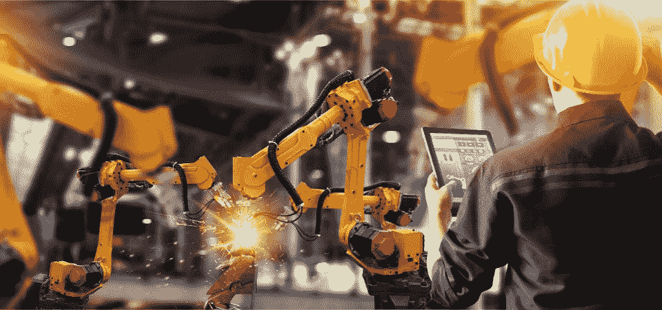

# 把机器人关在笼子里——合作机器人有多有效(和安全)？

> 原文：<https://towardsdatascience.com/keep-the-robot-in-the-cage-how-effective-and-safe-are-co-bots-623784f5e27f?source=collection_archive---------27----------------------->

Co-bots are filling a niche in industrial manufacturing between humans and caged industrial robots, but do they offer enough value when balanced against the risk of injury? IPOPBA — FREEPIK

制造机器人正在挣脱牢笼。传感器技术和人工智能现在已经发展到这样一个阶段，即**协作机器人(co-bots)** 可以在各种各样的应用中与人类一起安全地工作，包括超市、农场和医院。但是**制造业是联合机器人真正帮助**提高生产力的地方，远远超过人类和机器人单独工作的生产力。

> 然而，随着市场的扩大，企业必须做好适当的准备，以充分利用合作机器人，避免代价高昂(如果不是危险的话)的错误。

让机器人与人类近距离接触是我们技术进步的巨大进步，将使我们能够实现新的复杂程度，并最大限度地降低受伤风险，特别是在制造业。但是就像任何新的强大的技术一样，在将合作机器人融入企业之前，有一些**重要的考虑事项**。

# **生产率悖论**

与机器人一起工作是一个新概念:我们已经习惯了机器人在装配厂工作或在笼子里勤奋工作的想法，但与人类一起工作的机器人似乎仍然好得难以置信。这是因为工业机器人被专门设计成不与人类互动，这是有充分理由的:例如，2015 年，一名在大众汽车工厂安装机器人的承包商被误认为是汽车零件后，被 [*抓住并压在金属板*](https://www.independent.co.uk/news/world/europe/worker-killed-by-robot-at-volkswagen-car-factory-10359557.html) 上。虽然这样的事件并不常见，但这些机器人的预期目的(举重物、使用腐蚀性化学品、高强度焊接)要求它们在执行太危险、太精确、对旁观者有潜在危险或人类自己根本不可能完成的任务时保持隔离。然而，由于这种符合目的的设计，使机器人在人类周围安全可能实际上降低了它们有效完成工作的能力——如果我们限制合作机器人，使它们在人类周围安全，它们能像笼子里的同类一样表现吗？

SAP Industries*的联合总裁彼得·梅尔解释说:“合作机器人比传统的工业机器人更小更轻……[并且]配备了传感器，如果它感觉到有人在它的道路上，它就会指示合作机器人后退。”迈尔说，合作机器人在人类周围工作时会小心翼翼，这对我们来说是好事，但也提出了一个问题，即它们是否比工业机器人有更多好处，因为工业机器人“比合作机器人的操作精度、准确度和速度更高”。*

> *最初，联合机器人可能会更多地被无力承担传统工业机器人空间和资金的公司使用，但随着它们的智能增长和传感器技术的进一步改善，联合机器人将找到自己的优势。*

*迄今为止，将人类和机器人分开一直是我们成功的唯一衡量标准，但迈尔和其他许多人认为，“合作机器人协助人类驱动的任务的能力提高了整个过程的生产率”，因为它确保了人类不必在危险或重复的任务上浪费时间。麻省理工学院的一项研究发现， [*联合机器人将人类的闲置时间减少了 85%*](https://www.technologyreview.com/s/530696/how-human-robot-teamwork-will-upend-manufacturing/) ，他们与斯帕坦堡宝马工厂的合作发现，某些任务(如在车门内侧卷起一层保护箔)消除了人类重复性劳损的风险，而不会对装配线造成任何额外的风险。*

# ***安全第一***

*合作机器人应该被视为不同于工业机器人。合作机器人不会取代需要关在笼子里的机器人，而是最有可能致力于增加人类的劳动:正如迈尔所说，“合作机器人正在接受从烤汉堡到执行高度专业化的手术任务的一切测试。”然而，协同机器人并不完全是即插即用的:就像任何学习和适应其环境的应用程序一样，它们需要接受适当的训练，目标要适合它们的特定任务(这并不总是像听起来那么容易)。Robotiq 的首席技术官 Jean-Phillipe Jobin 建议企业仔细考虑他们如何使用合作机器人，并为他们的员工和工作环境做好适当的准备，以避免在不适当的实施上浪费时间、精力和金钱。乔宾表示，制造企业在实施合作机器人时，尤其必须问自己三个至关重要的问题:“机器人在执行什么任务，机器人系统本身在做什么，它是否安全，以及机器人在哪个空间内移动？”*

*“一旦这些问题得到回答，”乔宾说，“制造商应该对涉及的每一步进行风险评估，包括如果机器人用于多项任务，将机器人从一项活动转移到另一项活动。”这种远见不仅对从合作机器人的特殊技能中受益至关重要，而且对确保它们在人类中安全运行也至关重要。Jobin 还指出，“每个人都有独特的视角，只有当每个使用机器人的人都参与进来时，安全才是可能的”——尽管对于首席管理人员来说，准确理解联合机器人在做什么很重要，但那些直接与联合机器人一起工作的人将不可避免地受到公司联合机器人战略的最大影响。*

*这种协作的元素(名字“合作机器人”的内在特征)也是一个不总是被考虑的要点:即合作机器人被设计成与人类一起完成某些任务，并完成既不适合人类也不适合传统笼中机器人的 [*肮脏、危险和枯燥的*](https://www.researchgate.net/publication/221473137_Beyond_dirty_dangerous_and_dull_What_everyday_people_think_robots_should_do) 工作。在实施联合机器人时，乔宾强调公司需要记住联合机器人的预期目的，即“将操作员从这些任务中解放出来，让他们专注于更有价值的任务”，并认为联合机器人安全完成任务的能力“与安全措施同步增长”。*

# ***合作机器人来了(说‘嗨’)***

*联合机器人的有效性将在未来几年得到检验，并且必须被证明超越了任何合理的怀疑，联合机器人才能真正起飞。我们已经看到直接或间接与人类合作的机器人数量大幅增加( [*亚马逊*](https://www.wired.com/story/amazon-warehouse-robots/) 和 [*沃尔玛*](https://www.fastcompany.com/90395843/walmarts-robot-army-has-arrived) 最近公开涉足)，尽管过去几年头条新闻充斥着关于 [*联合机器人对就业*](https://www.ft.com/content/a0b8e562-3734-11e7-99bd-13beb0903fa3) 影响的猜测，但对联合机器人的真正考验是证明它们可以在大规模制造环境中安全工作。*

*正如乔宾所说，“曾经导致工人受伤的繁重任务现在可以由合作机器人安全高效地完成，”那些考虑将机器人带到工厂车间的人应该记住，这种增强是合作机器人的设计目的，并据此准备他们的业务。*

> *这意味着培训和咨询员工，考虑技术的每一种可能的用途，并设置合作机器人来完成任务，让员工专注于更重要的事情。*

*合作机器人可能对一些人来说仍然是一个新奇的事物，但是一旦他们的利基建立起来，制造业就可以期待液压辅助的生产力激增。*

**原载于【https://www.forbes.com】**。****