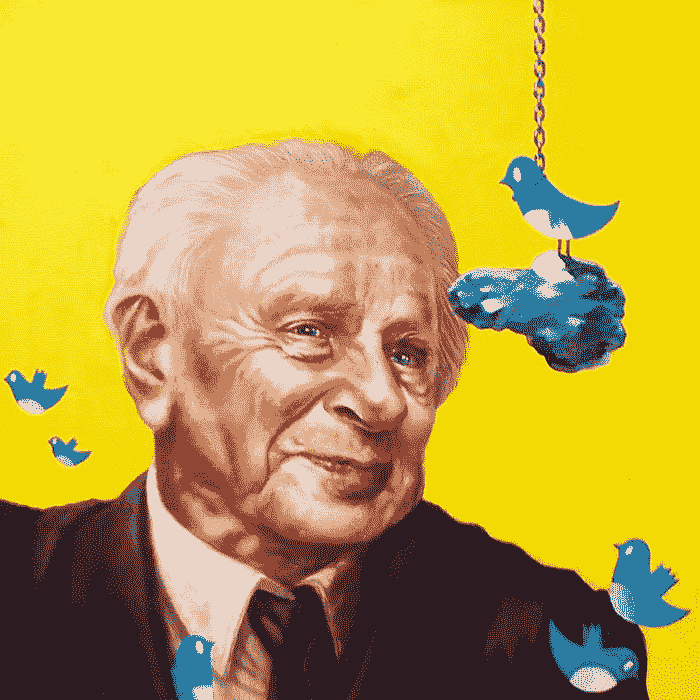
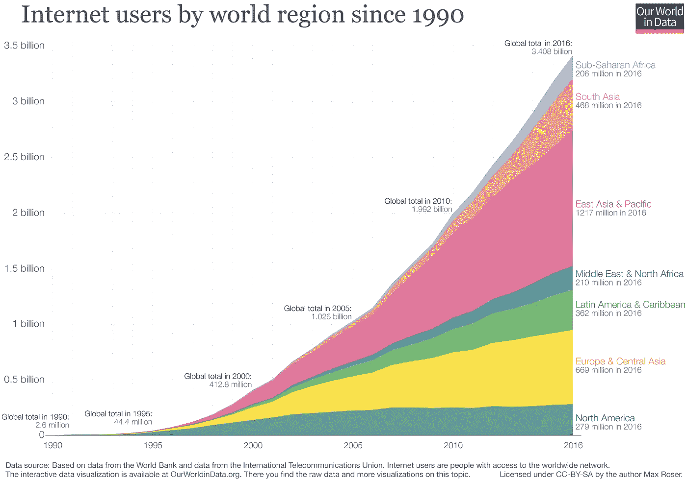
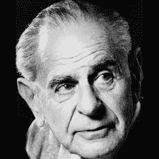

# 保持数据科学的科学性

> 原文：<https://towardsdatascience.com/keeping-data-science-scientific-c317838ab317?source=collection_archive---------31----------------------->

Oil painting by Francesco Masci.

## 卡尔·波普尔会如何看待这门最新的科学学科？

下面，我解释了丹尼尔·卡尼曼的畅销书《思考，快与慢》中最初提出的研究问题:

*肝癌发病率最高和最低的地区都在农村。为什么？*

我会在帖子的最后回到这个问题。但是现在，让我们讨论一下，从我们收集的关于我们自己的空前数量的信息中，知识会得到什么，会失去什么。

数据科学的标准定义是:“使用**科学**方法、流程、算法和系统从结构化和非结构化**数据**中提取知识和见解的多学科领域。”随着信息时代的不断发展，互联网连接和个人计算几乎无处不在。发达国家每一个 50 岁以下的人都在不停地敲击手机屏幕，在笔记本电脑上打字，享受各种数字内容，世界科技公司正在积累前所未有的海量数据。数据科学领域已经开始组织和优化这些数据，通常是为了提高数字服务的性能，如亚马逊商店产品推荐和 Spotify“每周发现”播放列表背后的算法。然而，数据科学也让我们能够在以前无法想象的水平上研究错综复杂的社会行为。随着智能扬声器进入我们的家庭，智能汽车上路，我们只会继续收集更多关于自己的信息。

Data data data (Source: Ourworldindata.org)

然而，拥有更多的数据和信息并不会自动转化为更高的知识和理解。我们将数据转化为真正洞察力的能力仍然依赖于正确运用科学方法。这绝不是保证；根据一些知识分子的说法，几十年来，社会严重依赖未经提炼的科学。

出生于奥地利的英国哲学家卡尔·波普尔(Karl Popper)以其对可证伪性、科学方法以及对归纳法的批评而闻名，他概括了这一令人警醒的思路。波普尔认为，真正的科学依赖于可被证伪的假设。科学严谨的理论在透彻的研究和逻辑检验的基础上做出假设，然后用一切可用的手段证明假设是错误的。这种类型的科学推动人类前进；正如波普尔的信徒纳西姆·尼古拉斯·塔勒布指出的，牛顿的运动理论为人类理解物理创造了奇迹，尽管几百年后被爱因斯坦证明是错误的。进步来自于发现不能被证明是错误的断言，并坚持不懈地进行实验来反驳理论。

Karl Popper

演绎和归纳之间的二分法完美地概括了波普尔等人所认为的科学的不恰当实施。在前一种情况下，我们通过从理论到假设，再到经验观察，最后拒绝假设来进行推理。另一方面，归纳法使用经验事实来发现模式，产生假设并形成理论。归纳法更难反驳，也更危险，因为正如塔勒布所说，它让我们“被随机性所愚弄”。诱导可能表面上看起来无害，但实际上有有害的副作用；当你利用历史数据建立模型，并在房价永远不会下跌的假设下运行时，你就遇到了麻烦。

波普尔追求的是社会科学家，他们创立了表面上看似革命性，但实际证明摇摇欲坠的宏大理论。这是因为这些类型的理论是不可能反驳的。例如，考虑西格蒙德·弗洛伊德关于恋母情结的理论。人们怎么可能否认孩子潜意识里对父母有性吸引力呢？你不能。因此，这是一个不科学的分析，并不比暗示上帝的存在更严格。然而，在许多情况下，不科学的理论被广泛认为是真理。主流经济学是这一现象的完美例子。这一学科的模型变得越来越复杂、数学化，并且脱离现实，在预测成功方面没有任何改进。正如统计学家内特·西尔弗(Nate Silver)所言:“经济预测正在好转的任何幻想，都应该被经济学家在金融危机爆发前犯下的可怕错误击碎。”[1]

当我们专门使用历史数据(也称为经验知识)来制定理论时，我们创建的模型平均来说非常准确，但仍然容易受到边缘情况的影响。正如在一个问题上投入更多的钱并不一定等于解决了这个问题，向我们的模型中添加更多的数据并不一定会使它们更好地反映现实世界。根据定义，模型是一种模拟，有了更多的数据，很容易过度拟合并将信号误认为噪声。但是数据的价值不在于它的整体质量，而在于我们磨练、塑造和解释数据的能力。是关于*的过程。*

一个好的数据科学家应该对科学方法有很强的理解，提出正确的问题，并对经验知识保持怀疑，特别是在建立具有严重后果的模型时。我们应该记住，“我们学的越多，知道的越少”这句话是有一定道理的；爱因斯坦的相对论可以说创造了更多关于宇宙的问题，而不是答案。

因此，如果你深入研究农村社区的社会行为，并使用数据科学来分析化学品暴露、生活方式差异、文化规范、营养模式等。我相信你可以找到一些令人信服的结果来解释为什么美国农村社区肝癌发病率最高和最低。当我第一次遇到这个研究问题时，我当然绞尽脑汁寻找这样的答案。但是 Popper 对使用你的实证分析建立一个模型来预测农村社区未来的肝癌发病率持怀疑态度。为什么？

此后不久，Kahnman 提醒读者，农村社区的人口比城市地区少，因此考虑到它们的统计分布，它们具有更高的方差和更多样的结果，导致更高和更低的癌症发病率。较小的样本量增加了随机性的影响。当没有因果关系时，人类倾向于创造故事和假设因果关系，所以我们的直觉是对事件做出“科学”的解释，即使统计规律是对小农村社区癌症发病率进一步波动的完美合理的解释。当我们开始研究点击量和点赞数提供给我们的信息宝库时，牢记机遇的作用并对经验主义保持怀疑是很重要的。

## 引用的作品

[1] N .西尔弗，*信号与噪声* (2012)。