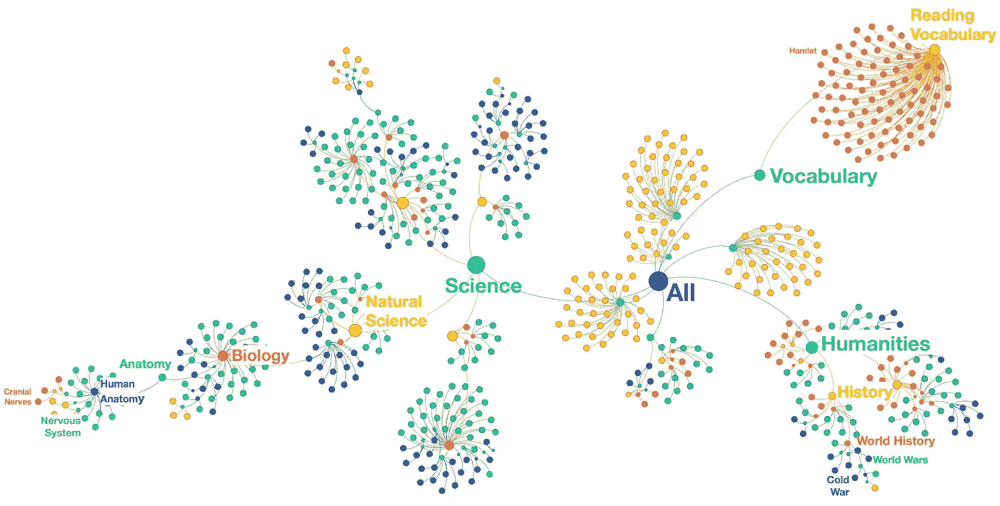
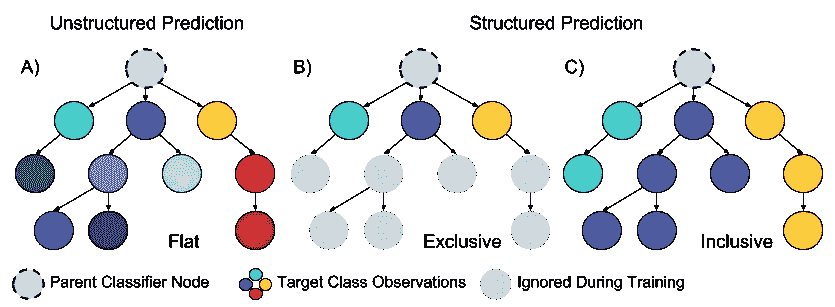
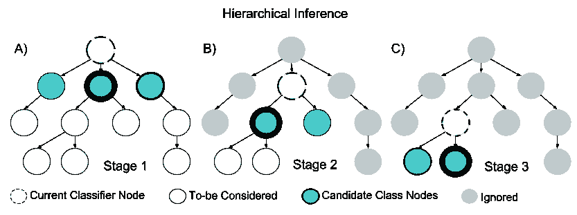
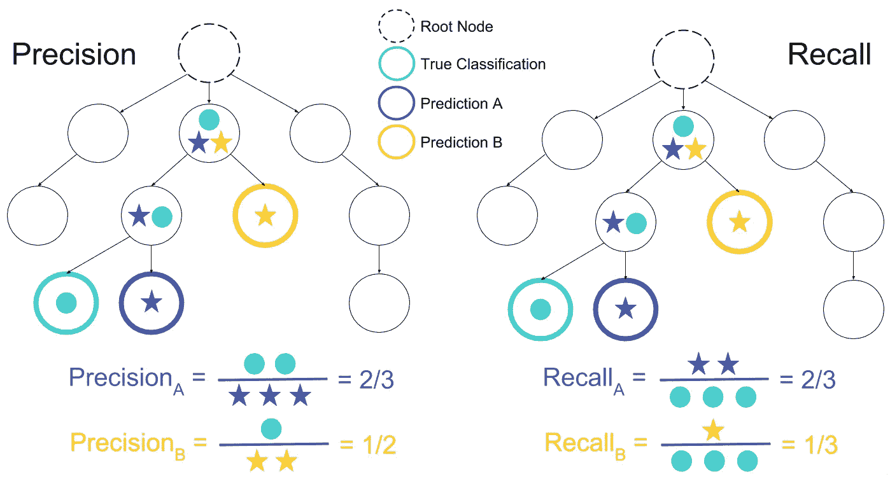
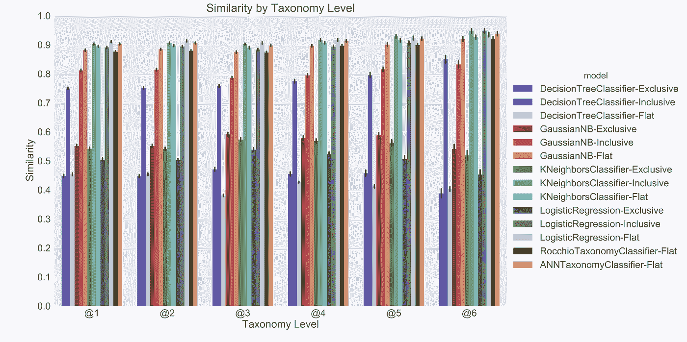
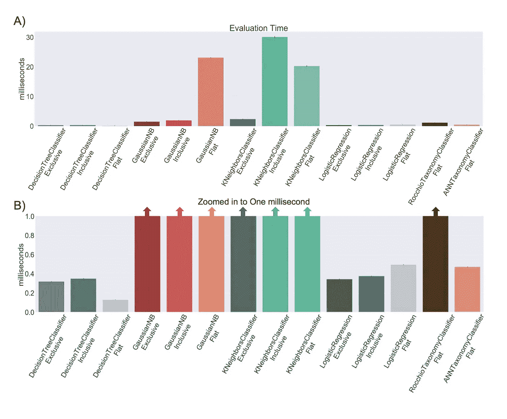
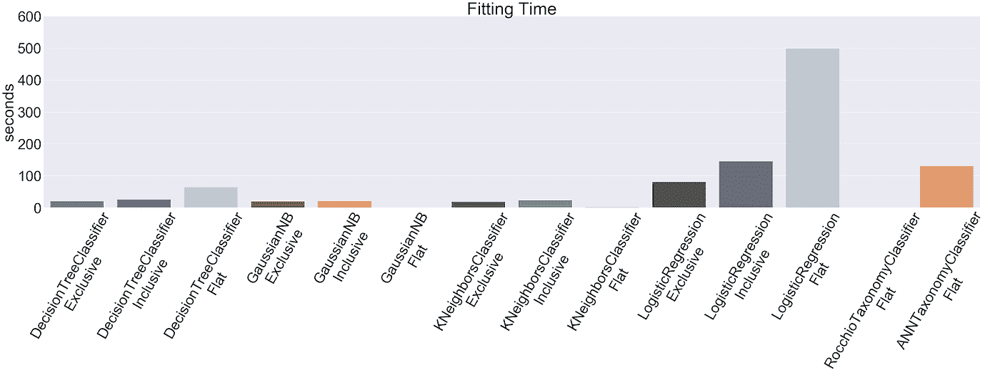
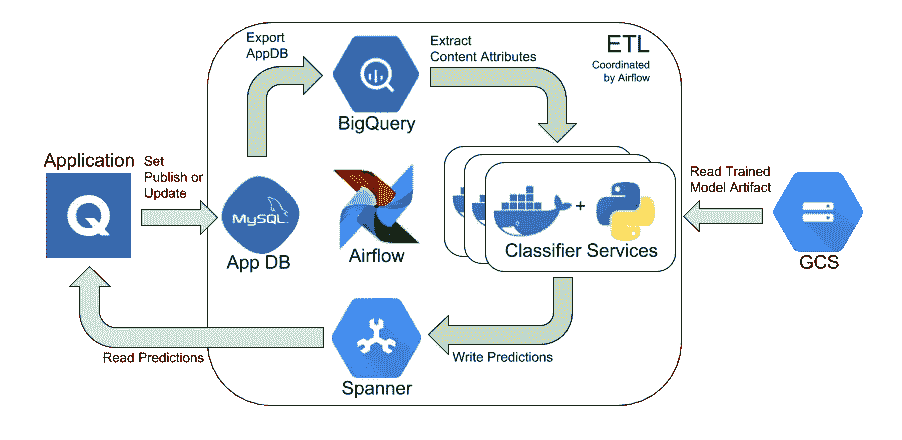

# 保持优雅:Quizlet 如何使用层次分类来标记学术主题的内容

> 原文：<https://towardsdatascience.com/keeping-it-classy-how-quizlet-uses-hierarchical-classification-to-label-content-with-academic-4e89a175ebe3?source=collection_archive---------15----------------------->

Quizlet 的社区管理的学习集目录非常庞大(3 亿个，并且还在增长),涵盖了广泛的学术主题。拥有如此大而多样的内容目录使 Quizlet 用户能够掌握世界上的任何主题，但这也产生了有趣的信息检索问题。Quizlet 的搜索、导航和个性化系统都依赖于能够将我们的内容组织成直观的学术主题。在这篇文章中，我们将讨论如何开发我们的学术主题分类，以及如何使用机器学习(ML)来自动为 Quizlet 平台上发布的每个研究集分配主题标签。

## 定义和组织学术主题

这个项目的第一步是定义构成 Quizlet 学习集目录的学术主题的组织结构。学术主题可以用多种方式定义，而且在主题应该如何组织的问题上[没有共识](https://doi.org/10.1007/s10618-010-0175-9)。经过一些研究，我们决定将我们的学术主题组织成一个层次分类树(**图 1** )。这种结构类似于著名的[系统发生树](https://en.wikipedia.org/wiki/Phylogenetic_tree)，用于组织不同生物物种之间的等级关系。我们选择这种组织结构不仅是因为它的直观性和与以前的[文献](https://en.wikipedia.org/wiki/Outline_of_academic_disciplines)的重叠，也是因为它与可用于高效搜索和信息检索的图形数据结构的一致性。

***Figure 1*, A subset of Quizlet’s Academic Subject Taxonomy**. Subjects are defined in a hierarchical tree, with each node representing increasingly specific subjects as one moves away from the root node ***All*** (subjects). Subjects were identified from a combination of pedagogical research and analysis of the content of Quizlet study sets.

为了定义构成我们的分类图的特定主题，我们从各种在线资源中汇编了定义(例如[维基百科](https://en.wikipedia.org/wiki/Outline_of_academic_disciplines)定义了从公共学术课程中派生的广泛的主题层次)。除了标准主题定义之外，我们还挖掘 Quizlet 内容，以确定平台上经常出现但标准定义中可能没有的主题(例如，*体育*或*阅读词汇*是大多数主题分类法定义中没有的常见 Quizlet 研究主题)。

**图 1** 描述了 Quizlet 使用的主题分类法的子集。该分类法包含数百个独立的主题，跨越八个层次的特性。例如，主题*冷战*将与层级中的叶节点相关联，该叶节点遵循来自层级根节点的路径:

*所有→人文→历史→世界历史→世界大战→冷战*

## 分配带有主题标签的器械包

有了主题分类法，我们接下来的任务就是给所有 Quizlet 研究集贴上最相关的主题标签。由于器械包和可用主题的数量，手工标记所有器械包是不合理的。解决像我们这样的大规模标签问题的一种常见方法是使用 ML 来构建自动标签系统。这种方法需要训练计算机算法来学习像“包含单词*线粒体*的研究集通常被分配主题标签*科学*”这样的模式。然后，我们使用经过训练的算法来预测新研究集的标签。ML 方法提供了比人工标记更好的规模、速度和一致性，但代价是实施所需的时间和技术专长。

## 构建学习数据集

为了让 ML 模型学习，我们必须为模型提供一个输入-目标对的数据集，这些数据集一致地表现出我们希望模型识别的期望模式。在我们的应用程序中，输入属性可以是研究集的标题和文本内容，目标是分配给研究集的主题标签。学习数据集需要包含每个目标值的足够观察值，以允许模式识别算法捕捉输入和目标之间的关系。根据输入-目标关系的复杂性，学习可能需要大量的观察。

我们发现，由于类别的数量以及内容和主题标签之间关系的复杂性，手动管理一个足够大的学习数据集是不可行的。然而，在训练期间，学习数据集通常分为两个子集:用于优化模型参数的*训练集*，以及用于评估最终模型在野外表现如何的*测试集*。测试集的这种支持有助于减轻被称为 [*过拟合*](https://en.wikipedia.org/wiki/Overfitting) 的现象，提高[泛化](https://en.wikipedia.org/wiki/Generalization_error)性能。然而，也证明了，只要训练集足够大(例如，在高方差模型体系中的[，在训练集中具有噪声比在测试集中问题更少。](http://www.holehouse.org/mlclass/10_Advice_for_applying_machine_learning.html)

在这一概念的指导下，我们生成了我们的学习数据集，以使我们的应用程序具有足够的大小，如下所示:我们使用[正则表达式](https://en.wikipedia.org/wiki/Regular_expression)基于研究集标题中关键模式的存在，将主题标签从我们的分类法分配给研究集，生成了一个由(~1M)“不完美”训练观察值组成的大型训练集。然后，我们手工生成一个小得多的测试集(大约 10k 个观察值),以确保得到的观察值具有准确的输入-目标对应关系，并且充分覆盖了分类法主题标签。

## 制定和培训模型

除了生成学习数据集，我们还需要为我们的自动标注应用程序制定和训练一个 ML 模型。主题标注自然是作为一个离散的分类问题提出的，其目标是估计一个函数*F*(φ(*s*))，该函数将集合φ(*s*)的输入特征值映射到一个或多个分类标签 **l** ∈ *L* 。在这种情况下，我们的候选分类标签 *L* 是我们派生的主题分类法中的主题标签。

**计算模型特征**

特征化函数φ(*s*)将输入观察值的属性转换成可以被 ML 模型的算法解释的数值。对于这项工作，φ(*s*)将集合标题和内容文本中最具信息性的单词的平均[嵌入向量](https://en.wikipedia.org/wiki/Word_embedding)与集合中出现的语言的二进制编码[连接起来。嵌入向量模型在从数百万 Quizlet 集合中采样的文本上进行训练，并捕捉这些集合中出现的单词之间的语义关系。特征变换φ(*s*)可以被解释为集合 *s* 在高维语义空间中的位置的数字表示。这个“语义位置”是 ML 学习算法用来将集合的内容与最相关的主题相关联的关键信号。](https://en.wikipedia.org/wiki/One-hot)

我们将φ(*s*)应用于我们学习数据集中的所有集合，产生用于训练多个候选 ML 模型的数字特征(即各种 *F* 函数)。下一节描述了我们在模型开发过程中尝试的各种建模方法。

**非结构化预测**

我们的应用程序的一种建模方法是简单地忽略分类法的层次结构，将分类法树中的每个节点视为一个独立的类标签。使用这个*非结构化预测*策略，我们估计一个单一的、全局的分类器，该分类器跨整个分类法预测最佳主题标签。我们也将非结构化预测称为*扁平化*方法，因为它本质上是将树形层次结构扁平化为一个节点层(**图 2A** )。

扁平策略直观、简单，并且受益于这样一个事实，即由于分类法本身是分层的，所以可以免费获得关于任何父节点的信息。此外，与我们接下来将讨论的结构化预测策略相比，扁平策略具有更简单的推理过程，并且需要更少的外来数据结构。但是，因为扁平策略提出了一个全局分类问题，它可能无法利用本地分类结构来提高决策功能的特异性。结果是，与树中较深节点相关联的高度专门化的主题可能被忽略，而优先选择不太专门化的标签，因为它们更容易与干扰物分开。

**结构化预测&分层推理**

在*结构化预测*方法下，我们使用主题分类的分层结构将一般分类任务分解为多个子问题，每个子问题专用于分类树的本地子部分。例如，如果我们想要一个区分主题*二战*和*冷战*的模型，对主题*人体解剖学*或*生物学*甚至*科学*的信息进行编码会增加不相关的信息。原则上，通过允许每个局部分类问题仅关注输入中的细微差别，将任务分解成子问题应该提高所得模型的整体特异性，这有助于它最好地区分局部类目标。

与非结构化预测的情况不同，我们不是训练单个全局分类器，而是训练多个局部分类器，一个用于树中的每个父节点。当训练每个局部分类器时，训练目标是当前节点的子节点的索引。注意，只有训练数据集中的观察值的子集将被分配与这些子节点相关联的标签。因此，我们必须划分训练数据集，以仅包括那些与本地分类器相关的观察值。当训练局部分类器时，我们使用两种策略来划分训练集:

*   *排他划分* ( **图 2B** ):这种划分策略仅使用*训练集中那些被分配了与子节点直接关联的标签的观察值。这种策略受益于对目标节点的高度特异性，代价是如果我们还包括与子节点的后代相关联的观察，则可能使用比可用数据更少的数据。*
*   *包含划分* ( **图 2C** ):使用这种策略，当前分类器节点下的每个子树都与目标子节点索引相关联。这种策略增加了与每个目标节点相关联的观察值的数量，代价是可能给局部分类问题引入噪声。

**Figure 2, Various Modeling Approaches and Training Data Partitioning Strategies.** When training a hierarchical classification system, classifiers are trained for one or more parent nodes in the associated tree hierarchy. Node color indicates the taxonomy labels used to identify target observations for the current classifier. Three possible strategies for training the hierarchical classification system are displayed. A) unstructured prediction uses Flat partitioning and fits a single, global classifier with each node in the taxonomy being considered an independent class. B) Exclusive partitioning is used for structured prediction; only those observations that are associated with the children of the current node are used to train the current parent classifier. C) Inclusive partitioning is also used for structured prediction, but also includes observations associated with each subtree under the current classifier node as being labeled as a single target class.

训练一个结构化的预测模型需要训练*N*=(*V*-*Z*)个局部分类器，其中 *V* 是分类中的顶点总数， *Z* 是叶节点数。然而，一旦每个分类器的训练数据已经被划分，所有的局部分类器就彼此独立，并且可以被并行训练。所以训练一个结构化的预测模型，实际上在实践中是相当快的。

**层次推理**

在所有局部分类器被训练之后，我们使用*分层推理*来对新的观察结果进行预测(**图 3** )。等级推理从等级的根节点开始，选择相关分类器在给定当前输入特征的情况下为其分配最大概率的子节点。在下一步中，所选子节点的分类器成为当前父分类器，并且在给定当前输入特征的情况下，选择具有最大概率的子节点，等等(**图 3B** )。重复这种逐级推理过程，直到到达树中的叶节点，或者当前目标/子集合的最大概率小于推理过程中来自前一级的子集合的最大概率(**图 3C** )。

**Figure 3, Hierarchical Inference Procedure.** Inference for a new observation is performed in a greedy, stage-wise fashion. A) The first stage starts with the root node, calculating the probability for the current observation over all candidate children nodes (Relative probability is depicted here as the thickness of the border for each candidate node). B) The candidate node with the maximum probability is then taken to be the next parent node. C) The process is repeated until either the maximum probability at the current inference stage is less than the maximum probability in the previous stage, or a leaf node is reached.

# 模型评估

现在我们有了一个框架来训练模型，这些模型可以预测我们的分层主题分类法中研究集的标签，我们需要一些方法来量化给定模型在现实世界中满足我们的应用需求的程度。一般来说，我们希望评估模型的以下属性:

*   *预测质量:*预测与现实同步的程度如何？它们准确吗？对于用户体验来说，不正确的预测至少是合理可接受的吗？重要的是每个局部分类器尽可能准确，以避免由于在树的根节点附近做出不正确的决定而可能发生的错误传播。
*   *性能:*训练模型需要多长时间？一个新的观察需要多长时间进行推理，会对用户体验产生负面影响吗？运行模型需要多少内存？

一旦我们有了评估给定模型的质量和性能的方法，我们就可以比较多个候选模型，从而为我们的应用程序确定最佳框架。下面，我们将讨论如何评估层次分类模型的质量和性能的一些细节。

**评估预测质量**

与假设二元正确/不正确结果的标准多类分类不同，等级分类可以具有不同程度的正确性。比如，把一个被贴上*冷战*标签的物品归类为*微蜂窝生物*就比贴上*二战*标签差多了。[标准分类指标](https://en.wikipedia.org/wiki/Precision_and_recall)如精确度、召回率和 F1 分数，这些都是基于二元结果的假设得出的，并不处理不同程度的正确性。

因此，在这项工作中，我们使用了这些标准指标的[层次版本](https://idalab.de/blog/data-science/hierarchical-metrics)。本质上，精确度和召回率的层次类似物考虑了分类层次中被正确或错误预测的边的*数量*，而不是基于单个原子标签进行评估(**图 4** )。

**Figure 4: Hierarchical Classification Quality Metrics:** Due to the structured nature of the hierarchical classification problem, standard classification metrics like precision and recall must be extended into hierarchical analogs. Left: Precision is defined as the ratio of the number of correct taxonomy edges predicted by the classifier to the total number of taxonomy edges predicted by the classifier. Right: Recall is defined as the ratio of the number of correct taxonomy edges predicted to the actual number of edges. A Hierarchical F1 score can be calculated as the harmonic mean of hierarchical precision and recall.

不是所有的人都会同意某一特定物品的确切标签。有人称之为*艺术史*，另一个人可能称之为*艺术欣赏。*这些主观偏见反映在我们的测试数据集中分配的标签中，并可能会对侧重于标签预测的评估指标产生偏见。因此，除了测量不同标签正确性的分级分类度量标准(**图 4** )之外，我们还试图评估预测的语义准确性。为了捕捉语义准确性，我们计算给定项目的实际和预测主题的嵌入向量之间的余弦相似性。

**评估绩效**

除了质量，我们还关心我们的应用程序所采用的任何 ML 模型的性能。因此，我们还测量给定模型的训练和评估时间。当在具有相似质量范围的竞争模型之间进行选择时，这些性能指标通常可以用作“决胜局”。

# 把所有的放在一起

既然我们有多种方法来评估给定的 ML 模型，我们可以比较各种候选模型的质量和性能，以便为我们的自动标记应用程序确定最佳框架。我们训练了 14 种不同的结构化和非结构化模型架构，使用了之前讨论的各种数据集分区策略(参见**图 2** )。体系结构的简要概述如下:

**结构化预测模型**

*   *decisiontreeclassifiereexclusive*:使用独占分区和决策树模型作为每个节点的基本分类器
*   *decisiontreeclassifierrinclusive*:与*decisiontreeclassifierrexclusive*相同，但是使用包含数据分区
*   *GaussianNBExclusive* :使用排他分区和朴素贝叶斯模型作为每个节点的基本分类器
*   *高斯非独占*:与*高斯非独占*相同，但使用非独占数据分区
*   *kneighborsclassifier Exclusive*:使用独占数据分区和 K-最近邻模型作为每个节点的基本分类器。
*   *kneighborsclassifier Inclusive*:与*kneighborsclassifier exclusive*相同，但是使用包含数据分区
*   *LogisticRegressionExclusive*:使用独占数据分区和逻辑回归作为每个节点的基本分类器。
*   *LogisticRegressionExclusive*:与*LogisticRegressionExclusive*相同，但使用包含数据分区

**非结构化预测模型**

*   *DecisionTreeFlat* :使用单个全局决策树分类器
*   *GaussianNBFlat* :使用单个全局朴素贝叶斯分类器
*   *kneighborsclassifier flat:*使用单个全局 K 近邻分类器
*   *LogisticRegressionFlat* :使用单一的全局逻辑回归分类器
*   *RocchioTaxonomyClassifierFlat*:使用单个全局 [Rocchio 分类器](https://en.wikipedia.org/wiki/Rocchio_algorithm)算法
*   *anntaxomyclassifierflat*:使用单个全局三层人工神经网络分类器

每个算法都使用相同的学习数据集进行训练和评估。我们使用五重[交叉验证](https://en.wikipedia.org/wiki/Cross-validation_(statistics))和[网格搜索](https://en.wikipedia.org/wiki/Hyperparameter_optimization)来确定每个模型架构的最佳参数。

**结果**

为了评估每个候选模型架构的标签预测质量，我们计算了测试集中所有观察值的分层 F1 分数。为了说明与分类法中更深层次相关联的分类任务通常更具体且潜在地更困难的概念，我们还对在主题分类法的前六个层次中的每一个层次上标记有类别的观察结果单独分组 F1 分数(**图 5** )。

**Figure 5, Hierarchical F1 scores for candidate model architectures**. In order to account for the notion that classification tasks associated with deeper levels in the taxonomy are more specific, we group the Hierarchical F1 for those testing set observations that are labeled at the specificity of each of the first six levels of the subject taxonomy. Error bars are the standard error estimated across all testing set observations in a group. In general structured prediction with Inclusive data partitioning performs the best, for all local classifier families.

通常，使用包含数据分区的结构化预测的体系结构性能最佳。此外，对本地分类器采用逻辑回归和 K-最近邻算法的模型提供了跨所有分类级别的最高质量的预测。有趣的是，非结构化预测模型提供了令人惊讶的好结果，尤其是对于分类中的较高级别。对于全局朴素贝叶斯模型来说尤其如此。采用独占数据分区的模型通常表现出较差的性能。这大概是由于这样的事实:当与排他和平坦划分策略相比时，排他规则减少了有效的训练集样本大小。

**图 6** 描绘了为候选模型计算的语义相似性质量度量。类似于在**图 5** 中绘制的 F1 分数，余弦相似性根据测试集观察结果进行分组，这些观察结果在分类体系的前六个级别中的每一个级别上都标有主题。

**Figure 6, Semantic similarity scores for candidate model architectures.** The cosine similarity between the actual and predicted subjects classes within a word embedding space is plotted for each model. In order to account for the notion that classification tasks associated with deeper levels in the taxonomy are more specific, we group similarities for observations that are labeled at the specificity of each of the first 6 levels of the subject taxonomy. Error bars are the standard error estimated across all testing set observations in a group.

类似于基于 F1 分数的结果，我们发现具有包容性数据划分的结构化预测模型工作得相当好。然而，非结构化模型，尤其是人工神经网络也提供具有高度语义相似性的预测。

有趣的是，平均语义相似性得分似乎随着分类法的深度而增加。这表明分类模型确实捕捉到了分类法中更深层的细微差别:因为嵌入向量的变化在分类法的更深层次上减少了，所以在更深层次上正确地分类标签平均来说给出了更高的相似性。这些结果还表明，即使主题标签可能没有被完美地预测，预测和实际标签之间的语义相似度通常相当高，表明定性的良好预测。

除了质量，我们还绘制了候选模型的评估时间(**图 7** )和试衣时间(**图 8** )。由逻辑回归分类器组成的结构化预测模型表现相当好，提供了亚毫秒级的推理时间，同时还提供了高质量的预测(**图 4 & 5** )。

**Figure 7, Evaluation time for candidate models.** Evaluation times range from sub-millisecond to tens of milliseconds. Though the K-nearest neighbor and Naive Bayes algorithms provide good quality predictions (See Figures 5 & 6), they are time-consuming to evaluate. B) Same information as A), but zoomed to evaluation times less than one millisecond.

**图 8** 显示了所有候选模型的拟合时间。试衣时间从不到一秒到几分钟不等。对于我们的应用程序来说，这些培训持续时间没有一个被认为是特别禁止的。如前所述，因为组成结构化预测模型的局部分类器可以被并行训练，并且因为每个局部分类器正被拟合到训练数据的子集，所以这些结构预测的模型拟合时间通常相当快。

**Figure 8, Training times in seconds for candidate models**.

一般来说，逻辑回归模型比其他模型族需要更长的训练时间。这是由于用于优化逻辑回归模型参数的迭代[定点算法](https://en.wikipedia.org/wiki/Logistic_regression)。当使用整个训练集时，计算复杂性尤其明显，就像使用 *LogisticRegressionFlat* 模型的情况一样，这是迄今为止训练时间最长的模型。

考虑到总体质量和性能指标，我们决定继续部署结构化预测模型，该模型使用包容性数据划分来训练本地逻辑回归分类器。我们发现结果模型提供了预测质量和评估时间的最佳折衷。

# 部署

一旦我们训练了一个适用于我们的应用程序的 ML 模型，我们需要部署一个生产框架，该框架可以用于对历史集合进行分类或重新分类(在分类法更新的情况下)，以及对新发布或更新的集合进行分类。图 9 显示了我们生产框架的概要。

**Figure 9, Overview of data flowing through Quizlet’s production subject classification deployment**. All arrows in green indicate steps that are coordinated by Apache Airflow ETL jobs. Blue arrows indicate processes not directly related to the classification computations. Application data for newly published or updated sets are written to the application database (AppDB), which is regularly copied to BigQuery. ETL jobs regularly analyze the application data using BigQuery to identify the newly published or updated sets, extract the content of these sets, and send classification requests to one or more classifier services running on Docker instances. The set subject predictions provided by classifier services are then written to Google Cloud Spanner, which used as a read-only database by the application.

在这个框架中，使用由 [Apache Airflow](https://airflow.apache.org/) 协调的 ETL 在预定的批次中执行分类(关于 Quizlet 如何使用 Airflow 的更多信息，请查看这个[帖子](https://medium.com/tech-quizlet/going-with-the-flow-how-quizlet-uses-apache-airflow-to-execute-complex-data-processing-pipelines-1ca546f8cc68))。在每个 ETL 作业中，已经从应用程序数据库(AppDB)导出到 [Google BigQuery](https://cloud.google.com/bigquery/) 的应用程序数据将被分析，以寻找新发布和更新的数据集。然后使用 BigQuery 提取这些集合的属性，并通过 [Google Kubernetes](https://cloud.google.com/kubernetes-engine/) 发送到一个或多个 [Docker 容器](https://www.docker.com/)中运行的分类器服务。每个分类器服务都使用一个先前训练过的产品分类器模型工件的副本，该工件存储在 Google Cloud storage(GCS)中。分类器服务的结果随后被写入一个 [Google Cloud Spanner](https://cloud.google.com/spanner/) 数据库表的行中，该表被应用程序用作只读数据库。

# 未来的工作

我们的主题分类系统已经生产了将近一年，我们对目前的结果很满意。也就是说总有改进空间。未来，我们计划从多方面改进我们的系统:

*   *改善学习数据集分层。*当前的训练数据集偏向于 Quizlet 平台上内容的底层分布。因此，一些常见主题在训练集中出现过多。我们通过使用数据分区在一定程度上减轻了这种偏差，但只针对结构化预测模型。我们可能会看到，增加更多的观察来解释我们目录中的稀有主题，可能会带来最大的好处。
*   *扩展输入特征空间。*当前的输入特征空间相当简单，仅表示关于集合内容的特定类型的信息，即集合的“语义位置”。在我们模型的未来迭代中，我们希望将特征空间扩展到 NLP 中更多的常见特征，以及包括使用无监督学习方法(如[潜在狄利克雷分配](https://en.wikipedia.org/wiki/Latent_Dirichlet_allocation)或[分层狄利克雷过程](https://en.wikipedia.org/wiki/Hierarchical_Dirichlet_process))导出的主题模型特征。
*   *局部分类器的特征修剪。*很可能并非输入要素的所有维度都对解决所有局部分类问题有用。如果我们发现一些特性与预测层次结构中的下一条路径无关，那么它们很可能在层次结构中也不再有用。因此，删除这些不相关的功能可以提高性能和质量。
*   *改进分层推理算法。*当子节点的预测概率小于逻辑的前一阶段中父节点的预测概率时(或者当到达叶节点时)，我们的推理的当前逻辑停止。比较从两个不同分类器返回的概率是有问题的，并且可能负面影响推理过程的质量。推理过程的未来迭代将试图减轻这些缺点。一种方法是将当前父节点索引作为每个本地分类器的候选目标之一。

## 感谢

许多击掌称赞 Quizlet 团队的所有成员，他们帮助研究和评估了这里讨论的多种 ML 方法，部署了我们的生产模型，并对这篇文章提供了深思熟虑的评论。我看着你[沙恩·穆尼](https://medium.com/@smmoonshoes)、[孙凯伦](https://medium.com/@karen_25076)、[温斯顿·黄](https://www.linkedin.com/in/winstonjhuang/)、[乔希·拉伊](https://www.linkedin.com/in/joshrai/)、[丹·克劳利](https://www.linkedin.com/in/danielcrowleysf/)、[劳拉·奥本海默](https://medium.com/@laura.oppenheimer)、[提姆·米勒](https://medium.com/@tedd4u)！