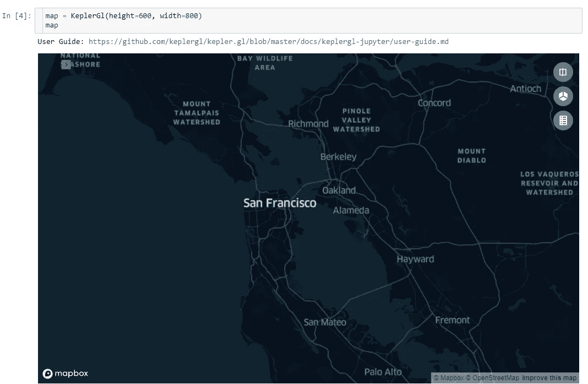

# 开普勒。GL & Jupyter 笔记本:优步开源开普勒的地理空间数据可视化。标距长度

> 原文：<https://towardsdatascience.com/kepler-gl-jupyter-notebooks-geospatial-data-visualization-with-ubers-opensource-kepler-gl-b1c2423d066f?source=collection_archive---------0----------------------->

## 在 Jupyter 笔记本中绘制地理空间数据&轻松地与开普勒的用户界面交互以调整可视化。

kepler.gl for Jupyter 是一款优秀的大地理空间数据可视化工具。将世界一流的可视化工具、易于使用的用户界面(UI)以及 python 和 Jupyter 笔记本的灵活性结合起来(下面是 3D 可视化 GIF，文章中有更多内容)。


3D building footprints

[kepler.gl](https://kepler.gl/) 是基于网络的大型地理空间数据集可视化工具，构建在 [deck.gl](http://deck.gl/) 之上。优步去年将其开源，其功能令人印象深刻。您可以轻松地拖放您的数据集，并在 web 上立即调整它，以便轻松地可视化大规模地理空间数据集。看看下面这张展示开普勒网络应用的 GIF。


Kepler.gl [Source](http://kepler.gl)

我喜欢在 Jupyter 笔记本中工作，Kepler.gl 的相同功能在 Jupyter 笔记本环境中也是可用的。在本教程中，我将重点介绍如何在笔记本中集成 [kepler.gl for Jupyter](https://github.com/keplergl/kepler.gl/blob/master/docs/keplergl-jupyter/user-guide.md) 可视化工具。

使用开普勒 Jupyter 笔记本的优点是，你既可以获得作为开普勒伟大的可视化工具的 Jupyter 笔记本的灵活性。

## 在 Kelpler Jupyter 笔记本中显示数据

我们在本教程中使用的数据集来自[纽约开放数据](https://opendata.cityofnewyork.us/)门户。都是 2018 年纽约报道的事件。

```
import pandas as pd
from keplergl import KeplerGl
import geopandas as gpddf = gpd.read_file("NYPD_complaints_2018.csv")
df.head()
```

数据集的前几行如下。事件数据、类别和事件发生地的坐标是该数据集中可用的列。


要使用开普勒绘制数据，首先需要创建一张地图。让我们只用一行代码就能做到。

```
#Create a basemap 
map = KeplerGl(height=600, width=800)#show the map
map
```

笔记本中会出现带有深色底图的默认地图。如果你愿意，你可以很容易地改变它。



Empty base map

现在，让我们将数据添加到地图中。将数据直接添加到 Kepler.gl 的最简单方法是将其转换为地理数据框架，我们可以使用 Geopandas 快速完成此操作。

```
# Create a gepdataframe
gdf = gpd.GeoDataFrame(df, geometry=gpd.points_from_xy(df.Longitude, df.Latitude))# Add data to Kepler
map.add_data(data=gdf, name=”crimes”)
```

我们将数据添加到我们创建的第一个地图中(您可以再次调用 map 来显示在下面的单元格中，但这不是必需的)。这些点出现在上面创建的底图的顶部。


Points plotted in Kepler Jupyter

地图点多，乱。让我们做一些调整。

## UI:在 Jupyter 笔记本中调整和交互地图

下面是有趣的部分，你可以用开普勒的用户界面轻松地调整可视化的类型、颜色和大小。让我们改变地图的颜色和大小(见下面的 GIF 图)。


Kepler.gl Jupyter notebook User Interface

上面我们只展示了一种可视化的方式，这通常取决于手边的数据集。不过，以下是 Kepler.gl 现在提供的功能(见下图)。您可以将您的数据可视化为点、六边形、热图、弧形或带有线数据的线，以及具有 3D 可用性的建筑物可视化。


Kepler visualisation types. [Source](https://kepler.gl/)

让我们来看看更多的数据可视化(见 GIF 下面的六边形可视化)。开普勒自动计算每个六边形并将其可视化。请从下面的地图中查看周边地区如何减少事故。


Kepler.gl Jupyter notebook 中的另一个很棒的工具是内置的时间序列动画。


Time-series animation

## 处理您的数据，可视化，永远不要离开 Jupyter 笔记本

它的美妙之处在于，你不用离开 Jupyter 笔记本就能获得开普勒的功能。假设我们对将数据聚合到社区中感兴趣。我下载了邻域文件并执行了一个简单的空间连接来计算每个邻域内有多少个事件。

我创建了一个函数来实现这一功能:空间连接、分组，然后返回地理数据框架。

```
def count_incidents_neighborhood(data, neighb):
 # spatial join and group by to get count of incidents in each poneighbourhood 
 joined = gpd.sjoin(gdf, neighb, op=”within”)
 grouped = joined.groupby(‘ntaname’).size()
 df = grouped.to_frame().reset_index()
 df.columns = [‘ntaname’, ‘count’]
 merged = Neighborhood.merge(df, on=’ntaname’, how=’outer’)
 merged[‘count’].fillna(0,inplace=True)
 merged[‘count’] = merged[‘count’].astype(int)
 return mergedmerged_gdf = count_incidents_neighborhood(gdf, Neighborhood)
```

一旦我们有了想要绘制的数据，我们就可以创建开普勒地图。让我们在一个单独的地图中这样做；我们称之为地图 2。我们添加刚刚创建的数据来可视化它。

```
map2 = KeplerGl(height=600, width=800)
# Add data to Kepler
map2.add_data(data=merged_gdf, name=”NeighborhoodCrimes”)
map2
```

这是最初的地图，你可以如何调整它。


Polygon visualisation

## 三维可视化

开普勒也有方便的三维可视化。这是一个使用旧金山开放数据构建足迹的示例。


## 装置

要安装 Keplergl Jupyter notebook，只需在终端上运行这三行代码。

```
pip install ipywidgets
pip install keplergl
jupyter nbextension install --py --sys-prefix keplergl
```

## 结论

我们已经介绍了 Kepler.gl Jupyter notebook 可视化地理空间数据的一些用例。我发现这个工具非常有用，因为它在 Jupyter notebook 中提供了令人印象深刻的功能。尝试一下，让我知道你是否尝试过。