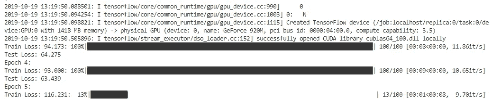

# Keras 定制训练循环

> 原文：<https://towardsdatascience.com/keras-custom-training-loop-59ce779d60fb?source=collection_archive---------11----------------------->


Amazing photo by [Dan Meyers](https://unsplash.com/@dmey503?utm_source=unsplash&utm_medium=referral&utm_content=creditCopyText) on [Unsplash](https://unsplash.com/s/photos/loop?utm_source=unsplash&utm_medium=referral&utm_content=creditCopyText)

## 如何在 Keras 引擎的底层构建一个定制的训练循环，K.function，opt.get_updates 用法和其他东西

在所有其他深度学习库中，Keras 是一个高水平的库，我们都很喜欢它。它抽象了我们同样钟爱的 [Tensorflow](https://www.tensorflow.org/) 在 GPU 上非常高效地处理数据带来的大部分痛苦。

我在工作和个人项目中使用 Keras，我非常喜欢它的 API 和建模方法。但是，当您想要做一些开箱即用的事情时，会发生什么呢？我告诉你，你偶然发现了这个框架。哪个框架？Keras 范式的框架。在 Keras 中，事情是简单而实用的，你按照步骤去做，事情就会惊人地好。但是，如果出于某种原因，你需要跳过或绕过主要路线，事情就会变得混乱。

你可能会说:*“但是 Keras 非常灵活，它有这个惊人的功能 API 来构建 daydream 迷宫模型，支持编写自定义层，强大的生成器来处理序列、图像、多处理、多输入输出、GPU 并行和……”，*我知道，事实上，我知道你知道，或者至少我期待它，否则，你不会阅读这篇文章。

但是，尽管有这种灵活性，我仍然可以指出 Keras 中一些相当令人讨厌的体验，例如具有多个输入/参数的损失函数，使用自定义层加载保存的模型…但不知何故，您可以通过一些变通方法或深入代码来解决这些问题。

然而，我最纠结的一件事是创建一个定制的训练循环。但是，你为什么要首先建立一个定制的训练循环呢？Keras 的全部意义不就是抽象出这样的细微差别，以便您可以专注于模型吗？嗯，这是非常正确的，但也有一些你想亲自动手的情况:当你的模型有不同形状的多个输入和输出(不可连接)以及一个独特的损失函数时，当你需要在训练时访问优化的梯度时…或者如果你想要特定的应用:就我而言主要是 GANs 和强化学习(如果你发现其他的，请在评论中告诉我，这样我也可以学习)。写这篇文章的主要原因是澄清(或者如果你喜欢的话，用文档记录)Keras 引擎中某些工具的用法，以构建一个定制的训练循环，而不严格受限于框架。

所以，无聊的够了，给我看看代码！

# 代码

在这里，所以你可以看看:

你可以把它分成几部分:

*   数据集创建:我们示例中的虚拟数据集。
*   Keras 默认工作流程:包括模型、损失函数和优化器定义。
*   图形创建:创建计算图形并链接其所有部分。此部分不同于默认的 Keras 工作流，因为它是由 Keras 引擎在幕后完成的。
*   `K.function`用法:这是棘手的部分，`K.function`它没有被很好地记录，所以我会试着说明这个问题。
*   训练循环:这里没有什么特别的，只有 for 循环和一些监控训练(当然还有测试)进展的打印。

## 资料组

我们案例中的虚拟数据集。给定[0，9]范围内的两个数，网络必须预测这两个数的和。所以:

*   样本= [ 100 x 2 ]，因此 100 个样本包含两个特征(这两个数字相加)
*   Targets = [ 100 ]，这 100 个样本相加的结果，理想情况下，我希望它是[ 100 x 1 ]，但我们都熟悉 Numpy 在降维时的工作方式。

还创建了一个包含 10 个样本的小型测试数据集。

```
# Training samples
samples = np.random.randint(0, 9, size=(100,2))                       targets = np.sum(samples, axis=-1)# Samples for testing                       
samples_test = np.random.randint(0, 9, size=(10,2))                       targets_test = np.sum(samples_test, axis=-1)
```

## Keras 工作流程

你已经知道了这一点，所以:

```
# Model
x = Input(shape=[2])
y = Dense(units=1)(x)
model = Model(x, y)

# Loss                       
def loss_fn(y_true, y_pred):                           
    # You can get all the crazy and twisted you
    # want here no Keras restrictions this time :)
    loss_value = K.sum(K.pow((y_true - y_pred), 2))
    return loss_value # Optimizer to run the gradients                       
optimizer = Adam(lr=1e-4)
```

这里唯一的事情是，你可以让损失函数变得疯狂和扭曲，因为 Keras 引擎不会用它的`_standarize_user_data` ( [链接](https://github.com/keras-team/keras/blob/f242c6421fe93468064441551cdab66e70f631d8/keras/engine/training.py#L470))阻止你，也不会抱怨。你可以有多个输入，可配置的参数损失函数…我为这个演示实现了一个简单的误差平方和(SSE)。

## 图形创建和链接

这是棘手的部分。在 Keras 中，您定义的唯一图形是您的模型的计算流程(如果您愿意，也可以是损失函数，但有一些限制)。但是您没有定义损失函数、模型和梯度计算或参数更新之间的链接。

这时，我们需要将我们的观点从代码工作流转变为图形工作流，或[张量流](https://www.tensorflow.org/)(喜欢这个笑话吗？).因此，除了定义模型的输入、模型本身和损失函数(我们已经完成了)之外，我们还需要:

*   为我们的地面实况创建输入，这样我们可以计算损失，即所谓的`y_true`
*   得到模型的输出，或者说预测，俗称`y_pred`
*   将模型预测和地面实况与损失函数(也已创建)联系起来

```
y_true = Input(shape=[0])
y_pred = model(x)
loss = loss_fn(y_true, y_pred)
```

如果你密切注意这一点，你会发现这个图的唯一输入是`x`和`y_true`(我知道你猜到了，因为只有分配了`Input`调用的变量，但是以防万一……)。

因此，我们已经有了输入、模型和要最小化的损失，所有这些都在一个计算图或一个[张量流](https://www.tensorflow.org/)的图中(抱歉，我不能停止它)。

剩下唯一要做的事情是定义用于计算相对于模型权重的损失梯度的图形，并根据学习速率更新那些权重。简单对吗？嗯，这正是`optimizer.get_updates`所做的。给定一些参数和依赖于这些参数的损失，它返回*计算图*用于计算梯度(使用臭名昭著的 K.gradients)和更新权重。

> `optimizer.get_updates`返回用于计算梯度和更新权重的计算图，给定一些要优化的参数(权重)和依赖于这些参数的损失

这是通过用我们定义的`loss`和参数或者模型的可训练权重来调用`optimizer.get_updates`来优化的。

```
# Operation fort getting
# gradients and updating weights
updates_op = optimizer.get_updates(
    params=model.trainable_weights,
    loss=loss)
```

## k .函数用法

现在我们已经完成了图表。我们实际上有两张图表:

*   图表 1:输入= [ x，y_true ]，输出= [ loss]
*   图表 2:输入= [损失，权重]，输出=[更新的权重]

第一个图对应于网络的*正向传递*，图 2 对应于*反向传递*或优化循环。

现在我们有两张图，它们应该可以在 GPU 上非常高效地运行，那么，我们该如何运行它们呢？这就是`K.function`帮助我们的地方。

`K.function`(或`keras.backend.function`为了完整起见)的用法类似于 [Tensorflow](https://www.tensorflow.org/) (这个是合法的)`tf.Session`用于实例化图形，`session.run`用于运行它。因此`K.function`的描述应该是:

> `K.function`返回一个函数，该函数调用计算图的单次迭代或正向传递，如前所述，并通过其作为参数给出的`inputs`和`outputs`引用。如果设置了`updates`关键字，它也运行向后传递，图中描述的操作作为`updates`关键字的参数传递。

考虑到这一点，我们创建了两个函数来执行前面定义的图形:

train 函数，它的特点是对它的每次调用都有一个向前和一个向后的传递。它被配置为:

```
train = K.function(
    inputs=[x, y_true],
    outputs=[loss],
    updates=updates_op)
```

以及测试函数，该函数仅计算前向传递，假定它旨在用于测试而不是用于更新权重。注意没有设置`updates`关键字。

```
test = K.function(
    inputs=[x, y_true],
    outputs=[loss])
```

注意，这两个函数都有一个参数作为输入，它是一个列表。该列表必须包含`inputs`中指定的输入张量。另一方面，输出将是一个带有在`outputs`关键字中指定的输出张量的列表。

在我们的例子中，一个呼叫将像这样完成:`loss = train([sample, target])`，然后损失将是一个列表，所以:`loss = loss[0]`。但是你可以在代码中查看它的上下文。

## 训练循环

最后，我们可以设置我们的自定义训练循环。这里没有什么特别的，只是一个默认的训练循环，不过，我会备注一些细节。虽然在代码中你可以看到训练循环和测试循环，但我将只关注前者，你可以把它扩展到后者。

细节决定成败，所以:

*   这只是一个实现进度条的库，进度条将告知一个时期内训练的进度。
*   由于我们一次抽取一个样本，`batch_size = 1`，Numpy [挤压](https://docs.scipy.org/doc/numpy/reference/generated/numpy.squeeze.html)批次维度，但是模型期望一个具有 2 个维度、批次和特征的输入，因此我们需要使用`np.expand_dims`手动添加批次维度。
*   该图使用张量，因此我们需要用`K.constant`将图的输入转换成张量。
*   已经实施了一个训练损失累加器来计算`loss_train_mean`中每一步的平均值，该指标在每一时间步打印在进度条上，以监控训练的进展。

`train`功能的使用值得特别注意。每次调用时，`train`函数将使用给定的输入在 GPU 上运行图形的单次执行，向前和向后传递。该图将样本和目标作为输入来执行训练步骤，并将张量列表作为输出返回，在我们的示例中，只有一个张量，这是该训练步骤的损失。

检查每个输入张量的维数必须匹配，这是由 Keras 引擎默认完成的，但在这里我们的目标是控制。所以，当我们调用`train([sample, target])`时，`sample`必须和`x = Input(shape=[2])`有相同的维数，so ^ 2，批量和特征维数，`target`必须和`y_true = Input(shape=[0])`有相同的维数，后者是一个零维张量，或者是一个单一的数(标量)。

如果您运行该代码，您会看到类似这样的内容:



Evolution of the training with a slow laptop GPU

其中`Training Loss`是该时期的训练损失的平均值，而`Test Loss`是测试数据集的样本的测试损失的平均值。

在一些迭代之后，您可以体会到训练损失和测试损失将如何减少。

## 其他方法

尽管本指南的目的是展示如何在低抽象层次上使用 Keras，但这并不是一个好的实践或首选方法。为什么？因为 Keras 的高度抽象是精心设计的项目所期望的结果。所以这些工具的使用应该是一个例外，而不是常规，除非你真的想在一个低抽象层次上工作。

但是，如果我想在较低的抽象层次上工作呢？(也许你是一名优化研究人员，正在编写一个新的优化器，或者你正在从事科学计算的代数工作……谁知道呢？)在这种情况下，你可以问自己:如果我真的想控制一切，有没有其他方法来建立训练循环？

嗯，我很高兴你问了这个问题，因为作为一名工程师，我无法在不提出任何其他备选方案的情况下给出一个解决方案。还有另外两个很好的方法来轻松训练你的模型，并且仍然让事情在你的控制之下:

*   [张量层](https://tensorlayer.readthedocs.io/en/latest/):谷歌的一个被广泛忽视的项目，旨在提供深度学习模型的主要构建模块，而不放弃底层细节。
*   [TensorFlow 2.0 定制训练循环](https://www.tensorflow.org/tutorials/customization/custom_training_walkthrough):通过将 Keras 集成到 TensorFlow 2.0 版本中，您可以同时拥有两个世界的优点，即 Keras 的高级构建模块和 TensorFlow 的低级流控制。

因此，如果你真的需要 Tensorflow 的低级 go，如果你只是需要一个适度的抽象级别，请使用 TensorLayer，但如果你像我一样，主要在 Keras 的高级 go 中工作，并使用这些技巧来克服你真的需要它的不寻常的角落情况。