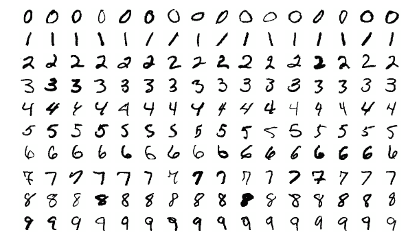

# 初学者的 Keras:建立你的第一个神经网络

> 原文：<https://towardsdatascience.com/keras-for-beginners-building-your-first-neural-network-f21cdf90789e?source=collection_archive---------14----------------------->

## 关于使用 Keras 在 Python 中实现简单神经网络的初学者友好指南。


[Keras](https://keras.io/) 是一个简单易用但功能强大的 Python 深度学习库。在这篇文章中，我们将看到建立一个前馈神经网络并训练它解决 Keras 的一个实际问题是多么容易。

这篇文章是为完全初学 Keras 的人写的，但是假设他有神经网络的基础背景知识。我的[关于神经网络的介绍](https://victorzhou.com/blog/intro-to-neural-networks/)涵盖了这篇文章中你需要知道的一切(以及更多)——如果有必要的话，请先阅读。

我们开始吧！

> *只想要代码？下面是* [*完整源代码*](https://victorzhou.com/blog/keras-neural-network-tutorial/#the-full-code) *。*

# 问题:MNIST 数字分类

我们要解决一个经典的机器学习问题: [MNIST](http://yann.lecun.com/exdb/mnist/) 手写数字分类。很简单:给定一个图像，将其归类为一个数字。



Sample images from the MNIST dataset

MNIST 数据集中的每幅图像都是 28x28，包含一个居中的灰度数字。我们将把每个 28x28 展平成一个 784 维向量，我们将把它作为神经网络的输入。我们的输出将是 10 个可能的类之一:每个数字一个。

# 1.设置

我假设您已经准备好了基本的 Python 安装(您可能已经准备好了)。让我们首先安装一些我们需要的软件包:

```
$ pip install keras tensorflow numpy mnist
```

> *注意:我们需要安装* `*tensorflow*` *，因为我们要在一个*[*TensorFlow*](https://www.tensorflow.org/)*后端上运行 Keras(即 tensor flow 将为 Keras 供电)。*

现在，您应该能够导入这些包并浏览 MNIST 数据集:

# 2.准备数据

如前所述，我们需要将每个图像展平，然后才能将其传递到我们的神经网络中。我们还将从[0，255]到[-0.5，0.5]归一化像素值，以使我们的网络更容易训练(使用较小的居中值通常更好)。

我们准备好开始构建我们的神经网络了！

# 3.构建模型

每个 Keras 模型要么使用代表线性层堆栈的[顺序](https://keras.io/models/sequential/)类构建，要么使用可定制性更强的功能性[模型](https://keras.io/models/model/)类构建。我们将使用更简单的`Sequential`模型，因为我们的网络实际上是层的线性堆叠。

我们从实例化一个`Sequential`模型开始:

`Sequential`构造器接受一个 Keras [层](https://keras.io/layers/about-keras-layers/)的数组。因为我们只是在构建一个标准的前馈网络，所以我们只需要[密集](https://keras.io/layers/core/#dense)层，也就是常规的全连接(密集)网络层。

让我们扔进 3 层`Dense`:

前两层各有 64 个节点，使用 [ReLU](https://en.wikipedia.org/wiki/Rectifier_(neural_networks)) 激活功能。最后一层是一个有 10 个节点的 [Softmax](https://victorzhou.com/blog/softmax/) 输出层，每个类一个节点。

> *如果需要复习，读我的* [*简单 Softmax 解释*](https://victorzhou.com/blog/softmax/) *。*

我们总是需要做的最后一件事是**告诉 Keras 我们的网络的输入将会是什么样子**。我们可以通过给`Sequential`模型中的第一层指定一个`input_shape`来实现:

指定输入形状后，Keras 将自动推断后续图层的输入形状。我们已经完成了模型的定义！我们的情况是这样的:

# 4.编译模型

在开始培训之前，我们需要配置培训流程。在编译步骤中，我们决定 3 个关键因素:

*   **优化器**。我们将坚持一个非常好的默认设置:基于梯度的优化器。Keras 还有许多其他的优化器，你也可以看看。
*   **损失函数**。由于我们使用的是 Softmax 输出层，我们将使用交叉熵损失。Keras 区分了`binary_crossentropy` (2 类)和`categorical_crossentropy` ( > 2 类)，所以我们将使用后者。[查看所有 Keras 损失](https://keras.io/losses/)。
*   一系列**指标**。由于这是一个分类问题，我们将让 Keras 报告**准确性**指标。

这是编译后的样子:

向前！

# 5.训练模型

在 Keras 中训练一个模型实际上只包括调用`fit()`和指定一些参数。有[许多可能的参数](https://keras.io/models/sequential/#fit)，但我们将只手动提供几个:

*   **训练数据**(图像和标签)，分别俗称 X 和 Y。
*   要训练的**历元数**(整个数据集的迭代次数)。
*   训练时使用的**批次大小**(每次梯度更新的样本数)。

看起来是这样的:

然而，这实际上还没起作用——我们忽略了一件事。Keras 希望训练目标是 *10 维向量*，因为在我们的 Softmax 输出层中有 10 个节点，但是我们提供了一个*单个整数来表示每个图像的类*。

方便的是，Keras 有一个实用方法可以解决这个问题:[to _ categorial](https://keras.io/utils/#to_categorical)。相反，它将我们的类整数数组变成了一个由[单热点](https://en.wikipedia.org/wiki/One-hot)向量组成的数组。例如，`2`会变成`[0, 0, 1, 0, 0, 0, 0, 0, 0, 0]`(它是零索引的)。

我们现在可以将所有东西放在一起训练我们的网络:

运行这段代码会得到如下结果:

```
Epoch 1/5
60000/60000 [==============================] - 2s 35us/step - loss: 0.3772 - acc: 0.8859
Epoch 2/5
60000/60000 [==============================] - 2s 31us/step - loss: 0.1928 - acc: 0.9421
Epoch 3/5
60000/60000 [==============================] - 2s 31us/step - loss: 0.1469 - acc: 0.9536
Epoch 4/5
60000/60000 [==============================] - 2s 31us/step - loss: 0.1251 - acc: 0.9605
Epoch 5/5
60000/60000 [==============================] - 2s 31us/step - loss: 0.1079 - acc: 0.9663
```

经过 5 个周期，我们达到了 96.6%的训练准确率。然而，这并没有告诉我们太多——我们可能过度适应了。真正的挑战将是看看我们的模型在我们的测试数据上表现如何。

# 6.测试模型

评估模型非常简单:

跑步带给我们:

```
10000/10000 [==============================] - 0s 15us/step
[0.10821614159140736, 0.965]
```

[evaluate()](https://keras.io/models/sequential/#evaluate) 返回一个数组，该数组包含测试损失，后跟我们指定的任何指标。因此，我们的模型实现了 0.108 的测试损失和 96.5%的测试精度！对你的第一个神经网络来说还不错。

# 7.使用模型

现在我们有了一个工作的、经过训练的模型，让我们将它投入使用。我们要做的第一件事是将它保存到磁盘，这样我们就可以随时将它加载回来:

```
model.save_weights('model.h5')
```

现在，我们可以随时通过重建模型并加载保存的权重来重新加载训练好的模型:

使用训练好的模型进行预测很容易:我们将一个输入数组传递给`predict()`，它返回一个输出数组。请记住，我们网络的输出是 10 个概率(因为 softmax)，所以我们将使用 [np.argmax()](https://docs.scipy.org/doc/numpy/reference/generated/numpy.argmax.html) 将这些转换成实际的数字。

# 8.扩展ˌ扩张

到目前为止，我们所涉及的只是一个简单的介绍——我们还可以做更多的事情来试验和改进这个网络。我在下面列举了几个例子:

## 调谐超参数

一个好的超参数是[亚当](https://keras.io/optimizers/#adam)优化器的学习率。当你增加或减少它的时候会发生什么？

批量大小和历元数呢？

## 网络深度

如果我们删除或添加更多全连接层，会发生什么？这对培训和/或模型的最终表现有什么影响？

## 激活

如果我们使用 ReLU 以外的激活，例如 [sigmoid](https://en.wikipedia.org/wiki/Sigmoid_function) ，会怎么样？

## 拒绝传统社会的人

如果我们尝试添加[下降](https://keras.io/layers/core/#dropout)层，这是众所周知的防止过度拟合？

## 确认

我们还可以在训练期间使用测试数据集进行**验证**。Keras 将在每个时期结束时评估验证集上的模型，并报告损失和我们要求的任何指标。这使我们能够在训练期间监控模型的进度，这对于识别过度拟合甚至支持早期停止是有用的。

# 结论

你已经用 Keras 实现了你的第一个神经网络！我们在 5 个历元后在 MNIST 数据集上取得了 **96.5%** 的测试准确率，对于这样一个简单的网络来说已经不错了。我将在下面再次包含完整的源代码，供您参考。

如果你想了解接近 MNIST 的更先进的技术，我推荐查看我的[卷积神经网络介绍](https://victorzhou.com/blog/intro-to-cnns-part-1/)(CNN)。在这篇文章中，我们看到了如何使用更复杂的网络在 MNIST 上实现更高的准确率。我也推荐我的指南[用 Keras](https://victorzhou.com/blog/keras-cnn-tutorial/) 实现一个 CNN，它类似于这篇文章。

你可能感兴趣的进一步阅读材料包括:

*   Keras 官方[入门](https://keras.io/#getting-started-30-seconds-to-keras)指南。
*   这个[用 Keras](http://www.datastuff.tech/machine-learning/convolutional-neural-networks-an-introduction-tensorflow-eager/) 介绍 CNN。
*   一系列[的例子](https://github.com/keras-team/keras/tree/master/examples)。

感谢阅读这篇文章！完整的源代码如下。

# 完整的代码

*原载于*[*https://victorzhou.com*](https://victorzhou.com/blog/keras-neural-network-tutorial/)*。*