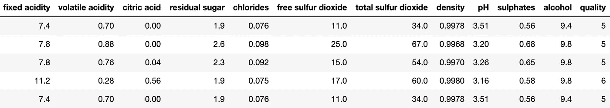
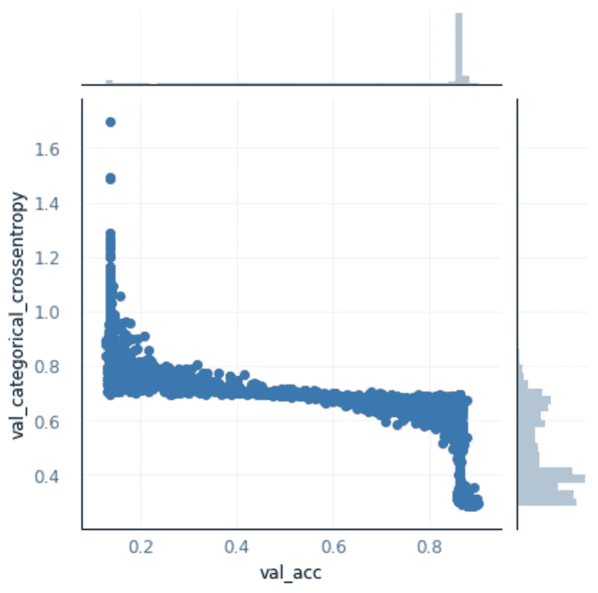
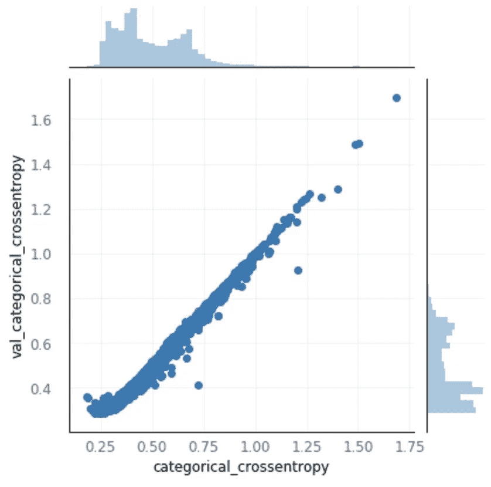
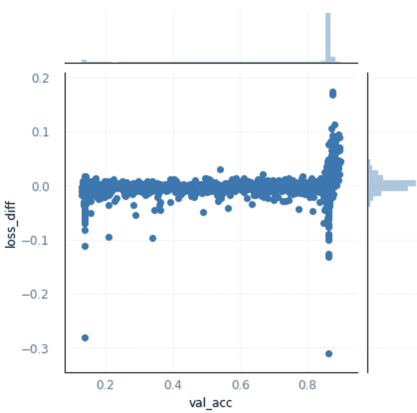
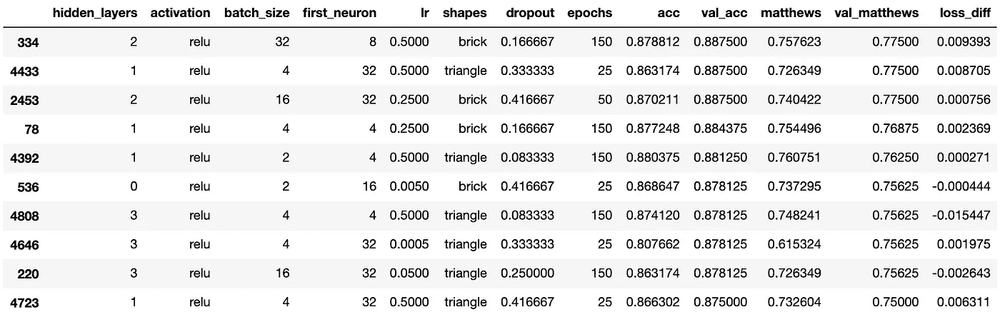
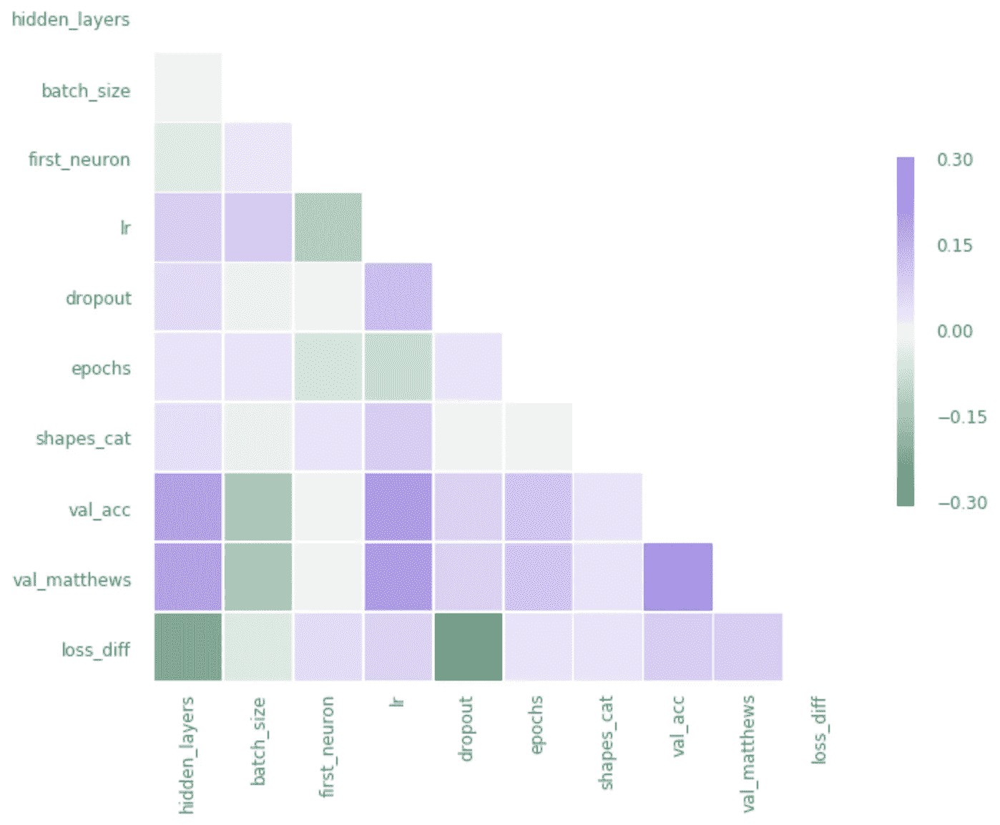

# 云中的 Keras 超参数优化

> 原文：<https://towardsdatascience.com/keras-hyperparameter-optimization-on-aws-cbd494a7ea15?source=collection_archive---------20----------------------->

## 使用 Talos 和 Docker 在云中高效搜索大型参数空间


Photo by [Roberta Sorge](https://unsplash.com/@robertina?utm_source=medium&utm_medium=referral) on [Unsplash](https://unsplash.com?utm_source=medium&utm_medium=referral)

当训练机器学习模型时，将计算卸载到远程服务器通常更方便(也更有必要)。虽然免费服务如 [Google Colab](https://colab.research.google.com/notebooks/welcome.ipynb) 和 [Azure Notebooks](https://notebooks.azure.com/) 对于 Jupyter 笔记本中的初始手动工作来说很棒，但它们不太适合长时间运行的实验，如超参数训练，因为它们在几个小时后会自动关闭。

以 AWS 为例云提供商，最直接的翻译就是在 [Sagemaker](https://aws.amazon.com/sagemaker/) 上运行笔记本。然而，通过在 Docker 容器中设置培训并自己进行部署，可以获得更高的成本效率。在这种类型的环境中开发一个模型还具有可移植性和可再现性的优势(后面会详细介绍)。

在 AWS 中，对于这种类型的作业，有三种主要的 Docker 部署选项:

*   ECS Fargate:抽象出服务器级配置，只需要基本的网络、权限和 CPU/内存要求。
*   ECS EC2:提供精细控制，同时仍允许 ECS 管理群集和整体资源使用情况。
*   EC2:提供完整的端到端配置来运行容器。

为了比较各选项的成本，我们将该地区固定为 US-East-1，并使用 Fargate 的 CPU/内存定价来提供一个实例等效成本($ 0.04048/vCPU/HR+$ 0.004445/GB/HR)。

**实例类型:m5.xlarge (4 个 vCPU / 16 GB)**

*   AWS sage maker = 0.269 美元/小时>>每 3 天 19.37 美元
*   AWS Fargate(等值)= 0.23304 美元/小时>>每 3 天 16.78 美元
*   按需 AWS EC2 = 0.192 美元/小时>>每 3 天 13.82 美元
*   AWS EC2 现货= 0.0827 美元/小时>>每 3 天 5.95 美元

很明显，如果我们能够利用 spot 实例，将会有显著的成本优势，同样的优势也适用于 c5.large 等其他实例类型。 [spot 实例](https://aws.amazon.com/ec2/spot/)的主要限制是容量可以随时回收，但是超参数培训工作非常适合这种情况。

此外，由于 ECS 实际上旨在管理集群，我们将通过采取以下步骤来部署我们自己的 EC2 实例以避免这种开销:

*   设置样板 Docker 容器
*   在容器内部本地开发模型和优化方法
*   为 EC2 准备一个自定义 Docker 容器
*   将容器部署到 EC2 spot 实例，该实例将结果保存到 S3
*   本地下载结果并可视化
*   选择最佳部署模式

*值得注意的是，Sagemaker 还提供了一套 a 服务，用于培训和超参数优化，此处未考虑。*

# 模型概述

对于这个例子，我们将使用来自 Kaggle 的一个简单的[数据集，它展示了各种葡萄酒属性和相关的质量分数。](https://www.kaggle.com/uciml/red-wine-quality-cortez-et-al-2009/downloads/red-wine-quality-cortez-et-al-2009.zip/2)



具有 Tensorflow 后端的 Keras 将是机器学习库的选择，对于超参数优化，我们将选择一个名为 [Talos](https://github.com/autonomio/talos) 的新库，它具有非常易于使用的工作流。有关介绍，请访问他们关于*走向数据科学*的文章:

[](/hyperparameter-optimization-with-keras-b82e6364ca53) [## 基于 Keras 的超参数优化

towardsdatascience.com](/hyperparameter-optimization-with-keras-b82e6364ca53) 

# 环境设置

将本地实验迁移到远程服务器的最简单方法是始终在 Docker 容器内工作，因为这允许您通过 Python 包从操作系统移植环境的精确副本。

作为基础，我们可以在 Python 3 中使用 Tensorflow 的 [Docker 图像。首先导航到您的项目目录，然后运行下面的命令来启动一个 shell 会话。](https://www.tensorflow.org/install/docker)

```
$ docker run -it -p 8888:8888 --rm -v $PWD:/root \
  -w /root tensorflow/tensorflow:1.13.1-py3
```

然后在 Docker shell 中安装所需的最小 Python 库:

```
$ pip install jupyter keras talos
```

*注意:在撰写本文时，PyPi 上可用的 Talos 版本是 v0.4.9。然而，v0.6 很快就会有重大变化，因此使用了这个分支。为此，需要安装* `*apt-get update && apt-get install -y git*` *，然后将分支传递给 pip，而不是* `*talos*` *，例如* `pip install git+https://github.com/autonomio/talos.git@daily-dev`。*我还创建了一个快照，这样这个例子就可以重现了:* `https://github.com/mikepm35/talos.git@v0.6-prerelease`。

然后可以通过下面的命令启动 Jupyter 会话，并在您的本地机器上的`http://localhost:8888/`访问。

```
$ jupyter notebook --ip=0.0.0.0 --no-browser --allow-root
```

通过将容器内的工作目录映射到项目目录，所有文件都将被创建并保存在您的本地机器上。

# 模型设置

## 笔记本配置

这个例子的模式是模型开发在 Jupyter 笔记本中进行，它也可以在“笔记本即服务”平台上运行，比如 Google Colab。然后，它被转换成一个常规的 Python 文件，用于在云中执行长期运行的优化实验。

为了帮助解决这一问题，我们提供了以下元素来正确配置笔记本电脑:

*   定义数据流和实验参数的控制字典。
*   如果在笔记本服务(如 Google Colab)上运行，可选择安装 Python 包的标志。
*   运行无头优化实验时，使用当前系统用户名来避免图形 UI 显示的导入逻辑语句。(注意，还有其他模式可以用来处理 matplotlib 安装，比如将逻辑移入控制字典)。

## 数据准备

假设属性跨越多个数量级，我们将归一化所有的特征列(`X`)。

标签列(`Y`)将基于阈值被编码为两个类别(差质量、好质量)的一个热点。这也遵循来自 Kaggle 的数据的附带描述的指导。

一个值得关注的问题是，这些类别非常不平衡，只有 13.6%的观察结果被标记为“高质量”。在本节中，我们计算了可选合并到训练中的类权重，但是手动实验没有显示性能的改善，因此它被排除在最终模型之外。

## 模型配置

为 Talos 建立一个实验遵循正常的 Keras 序列模型的模式，除了为用于优化的参数添加替换(`params`)。为了允许不同数量的隐藏层，使用了 Talos 函数，而不是直接在我们的函数中构建它们。

优化实验的输入被定义为离散值`[a, b, c]`或范围`(min, max, steps)`的字典。有关可用参数的更多信息，请参见 Talos 文档。

调用`Scan()`时，实际实验开始。这里`fraction_limit`定义了将运行的全网格参数空间的百分比，即所有可能参数组合的 25%将实际运行。这个例子中没有显示 Talos 中定义优化策略的众多选项。

扫描开始后，Talos 将提供要运行的实验总数以及预计完成时间。在我们的例子中，有 5，760 次运行，大约需要 10 个小时。(请注意，随着新运行的执行，时间估计将会更新，这个实验的实际总执行时间是 22 小时)。

实验完成后，我们可以创建一个部署包，其中包含由`val_acc`定义的最佳 Keras 模型。这个 zip 文件和每次运行后生成的 csv 结果将被上传到 S3。

# 部署和培训

模型设置完成后，在 Docker 容器中运行以下命令来保存 Python 依赖项:

```
$ pip freeze > requirements.txt
```

如果您使用 Talos 的单独分支，一定要用 git url 替换`talos==0.6.0`。

## 为部署设置 Docker 容器

为了部署实验，必须开发一个定制的 Docker 映像来重新创建本地环境。这个 docker 文件从同一个基本 Tensorflow 映像开始，复制 Jupyter 笔记本文件、数据和需求，然后安装所有 Python 包。还创建了一个新用户`kerasdeploy`，这是安装适当的 matplotlib 后端的触发器。

由于这是一个无头实验，我们将使用 nbconvert 将笔记本转换成一个常规的 Python 文件，然后在容器启动时立即执行。

```
FROM tensorflow/tensorflow:1.13.1-py3RUN useradd -ms /bin/bash kerasdeployWORKDIR /home/kerasdeployRUN apt-get update && apt-get install -y gitCOPY keras_remote_training.ipynb winequality-red.csv requirements.txt ./RUN pip install -r requirements.txtRUN chown -R kerasdeploy:kerasdeploy ./
USER kerasdeployRUN jupyter nbconvert --to script keras_remote_training.ipynbCMD ["python","-u","keras_remote_training.py"]
```

完成后，构建容器…

```
$ docker build -t keras-remote-training .
```

…然后在本地运行几次，以验证一切正常。

```
$ docker run --name keras-remote-training \
  --rm keras-remote-training:latest
```

## AWS 配置和部署

现在 Docker 映像已经完成，需要设置云环境。在本例中，我们将使用 ECR 作为 Docker 储存库，但是类似的 push/pull 命令也可以用于 Docker hub(或其他)储存库。

导航到 ECR，创建一个新的存储库`keras-remote-training`，并注意 URI。使用这个 URI 标记构建，检索基本的 auth 凭证，然后推送到 ECR。

```
$ docker tag keras-remote-training:latest \
<ecr_id>.dkr.ecr.<region>.amazonaws.com/keras-remote-training:latest$ (aws ecr get-login --no-include-email --region <region>)$ docker push \
<ecr_id>.dkr.ecr.<region>.amazonaws.com/keras-remote-training:latest
```

在 AWS 中，启动“启动实例”向导，并使用以下选项:

*   图片`ami-0f812849f5bc97db5`来自为 ECR/Docker 预建的社区 AMIs
*   实例类型 m5.xlarge(或其他变体)
*   选择“请求 spot 实例”
*   选择允许访问 S3 和 ECR 的 IAM 角色(例如，附加了 AmazonS3FullAccess 和 amazone 2 containerregistyrepoweruser 策略)
*   在“高级选项”下添加一个启动脚本，该脚本将自动提取并运行 Docker 映像。如果需要，这也允许在终止时自动重启。

当实例启动时，优化实验将自动开始执行，并将结果保存到 S3！

当训练停止时(例如，当平均 CPU 利用率下降到< 10%至少五分钟时)，设置 CPU 警报作为代理非常有用。该警报可以发送电子邮件通知，或自动终止实例以减少费用。


Photo by [Andrew Wulf](https://unsplash.com/@andreuuuw?utm_source=medium&utm_medium=referral) on [Unsplash](https://unsplash.com?utm_source=medium&utm_medium=referral)

# 结果

Talos 包含内置的报告功能，但是，为了提供进一步的定制，我们将把结果文件直接加载到 Pandas 数据框架中。因为这些结果在 S3，所以我们将运行本地实例，而不执行 Scan()。

Kaggle 文档提到 AUC 目标值为 0.88，我们将从最佳模型中计算出该值作为第一参考值。结果是 0.89，这是一个好的开始。

为了探索拟合的质量，我们将绘制验证准确性与损失的关系图，以及培训损失与验证损失的关系图。



从上述图表中可以得出两个主要结论:

*   大多数优化实验都是高价值的，如验证准确性上限周围的紧密聚类所示。
*   在有过度拟合趋势的地方产生二次分布。

为了处理实验中的过度拟合，我们将向结果添加一个新参数，该参数表示验证损失和训练损失之间的差异(正值表示过度拟合)。正值表示过度拟合，为后续滤波设置阈值。



使用这个新参数，我们现在可以查看没有过度拟合的最佳结果。尽管我们是按准确度排序的，但我们也将包括作为混淆矩阵代理的[马修斯相关系数](https://en.wikipedia.org/wiki/Matthews_correlation_coefficient)。



正如所料，根据`loss_diff`的测量，压差的增加与过度拟合的减少相关。对准确度和马修斯相关系数影响最大的因素是学习速率和隐藏层，与批量大小和时期的关系较弱。

# 后续步骤

根据所需的微调，这些结果可以直接用于部署模型，或构建更窄的后续实验。

这个例子使用了一个非常小的数据集，所以内存优化的实例不是最好的选择。在价格是 m5.xlarge 一半的 c5.large 中重新运行，对于 0.81 美元的实验，我们可以观察到更好的资源利用率和合理的总成本。

```
$ docker statsCPU %      MEM USAGE / LIMIT     MEM %157.47%    394.4MiB / 3.618GiB   10.64%
```

要查看与本文相关的代码，请访问[https://github.com/mikepm35/KerasRemoteTraining](https://github.com/mikepm35/KerasRemoteTraining)。