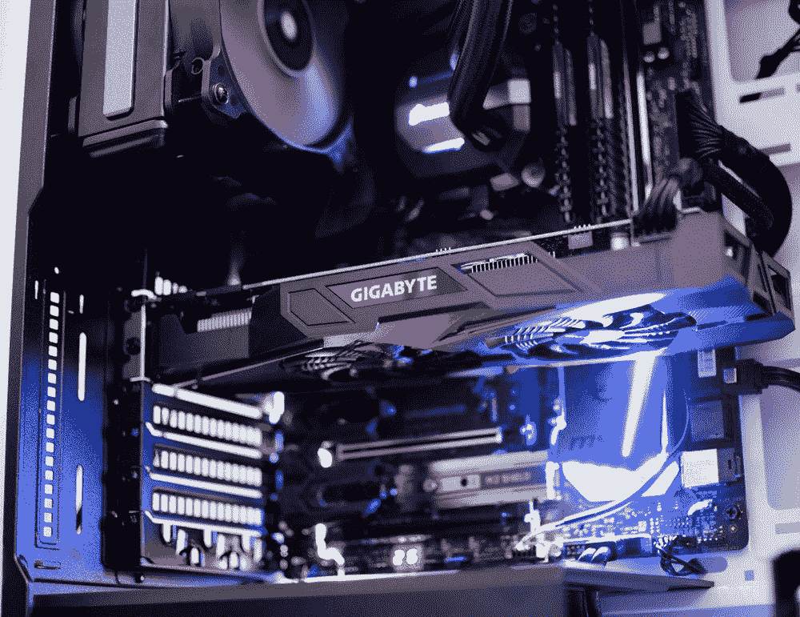

# 深度学习的 Keras vs PyTorch

> 原文：<https://towardsdatascience.com/keras-vs-pytorch-for-deep-learning-a013cb63870d?source=collection_archive---------1----------------------->


> 想获得灵感？快来加入我的 [**超级行情快讯**](https://www.superquotes.co/?utm_source=mediumtech&utm_medium=web&utm_campaign=sharing) 。😎

对于许多科学家、工程师和开发人员来说，TensorFlow 是他们的第一个深度学习框架。TensorFlow 1.0 发布于 2017 年 2 月；至少可以说，它对用户不太友好。

在过去的几年里，两个主要的深度学习库获得了巨大的人气，主要是因为它们比 TensorFlow 更容易使用: **Keras** 和 **PyTorch** 。

本文将涵盖 Keras vs. PyTorch 的 4 个不同方面，以及为什么您会选择一个库而不是另一个库。

## 克拉斯

Keras 本身并不是一个框架，实际上是一个位于其他深度学习框架之上的高级 API。目前它支持 TensorFlow、Theano 和 CNTK。

Keras 的妙处在于好用。这是迄今为止最容易快速启动和运行的框架。定义神经网络是直观的，使用函数式 API 可以将层定义为函数。

## PyTorch

Pyorch 是由脸书人工智能研究小组开发的深度学习框架(类似 TensorFlow)。像 Keras 一样，它也抽象掉了编程深度网络的许多混乱部分。

就高级和低级编码风格而言，Pytorch 介于 Keras 和 TensorFlow 之间。与 Keras 相比，您有更多的灵活性和控制力，但同时您不必进行任何疯狂的声明式编程。

深度学习的实践者整天都在考虑应该使用哪个框架。一般看个人喜好。但是当你做出选择时，你应该记住 Keras 和 Pytorch 的一些方面。


It’s Pytorch!

# (1)用于定义模型的类与函数

为了定义深度学习模型，Keras 提供了函数式 API。使用函数式 API，神经网络被定义为一组连续的函数，一个接一个地应用。例如，功能定义层 1 的输出是功能定义层 2 的输入。

```
img_input = layers.Input(shape=input_shape)
x = layers.Conv2D(64, (3, 3), activation='relu')(img_input)    
x = layers.Conv2D(64, (3, 3), activation='relu')(x)    
x = layers.MaxPooling2D((2, 2), strides=(2, 2))(x)
```

在 Pytorch 中，您将网络设置为一个类，该类扩展了 torch 库中的 torch.nn .模块。与 Keras 类似，Pytorch 为您提供了作为构建块的层，但由于它们位于 Python 类中，因此它们在该类的 __init__()方法中被引用，并由该类的 forward()方法执行。

```
class Net(nn.Module):
    def __init__(self):
        super(Net, self).__init__()
        self.conv1 = nn.Conv2d(3, 64, 3)
        self.conv2 = nn.Conv2d(64, 64, 3)
        self.pool = nn.MaxPool2d(2, 2)
    def forward(self, x):
        x = F.relu(self.conv1(x))
        x = self.pool(F.relu(self.conv2(x)))
        return x
model = Net()
```

因为 Pytorch 让您可以访问 Python 的所有类特性，而不是简单的函数调用，所以定义网络可以更清晰、更优雅。这真的没有太大的坏处，除非你真的觉得尽快编写网络代码对你来说是最重要的，那么 Keras 会更容易使用。

# (2)张量和计算图形与标准数组

Keras API 隐藏了许多不经意间被编码者发现的混乱细节。定义网络层很直观，默认设置通常足以让您入门。

只有在实现一个相当前沿或“奇特”的模型时，才真正需要深入到底层的、本质的张量流。

棘手的部分是，当你真的深入到底层 TensorFlow 代码时，你会得到随之而来的所有具有挑战性的部分！你需要确保所有的矩阵乘法都排成一行。哦，甚至不要想打印出你的层的输出之一，因为你只会得到一个很好的张量定义打印在你的终端上。

Pytorch 在这些方面更宽容一些。您需要知道每一层的输入和输出大小，但是这是比较容易的方面之一，您可以很快掌握。你不必处理构建一个抽象的计算图，你看不到里面的调试。

Pytorch 的另一个优点是可以在 torch 张量和 Numpy 数组之间来回切换。如果您需要实现一些自定义的东西，那么在 TF tensors 和 Numpy 数组之间来回切换可能会很痛苦，需要开发人员对 TensorFlow 会话有很好的理解。

Pytorch 互操作实际上要简单得多。您只需要知道两个操作:一个是将 Torch 张量(一个可变对象)切换到 Numpy，另一个是相反的方向。

当然，如果您从来不需要实现任何花哨的东西，那么 Keras 会做得很好，因为您不会遇到任何 TensorFlow 路障。但如果你这样做了，Pytorch 可能会顺利得多。

# (3)培训模式


Time to train!

在 Keras 训练一个模特超级容易！只需一个简单的`.fit()`动作，你就可以尽情享受旅程了！

```
history = model.fit_generator(
    generator=train_generator,
    epochs=10,
    validation_data=validation_generator)
```

在 Pytorch 中训练模型包括几个步骤:

1.  在每批训练开始时初始化梯度
2.  通过模式运行正向传递；
3.  向后传球
4.  计算损失并更新权重

```
for epoch in range(2):  # loop over the dataset multiple times running_loss = 0.0
    for i, data in enumerate(trainloader, 0):
        # Get the inputs; data is a list of [inputs, labels]
        inputs, labels = data # (1) Initialise gradients
        optimizer.zero_grad() # (2) Forward pass
        outputs = net(inputs)
        loss = criterion(outputs, labels) # (3) Backward
        loss.backward() # (4) Compute the loss and update the weights
        optimizer.step()
```

光是运行培训就有很多步骤！

我想这样你总是能意识到发生了什么。同时，这是完全不必要的，因为这些模型训练步骤对于训练不同的模型基本上保持不变。

# (4)控制 CPU 与 GPU 模式



We need MORE POWER

如果您已经安装了`tensorflow-gpu`，那么在 Keras 中，默认情况下会启用并使用 GPU。然后，如果您希望将某些操作转移到 CPU，您可以使用一行程序来完成。

```
with tf.device('/cpu:0'):
    y = apply_non_max_suppression(x)
```

对于 Pytorch，您必须为每个 torch 张量和 numpy 变量显式启用 GPU。这使代码变得混乱，如果您为了不同的操作在 CPU 和 GPU 之间来回移动，可能会有点容易出错。

例如，要将我们以前的模型转移到 GPU 上运行，我们必须执行以下操作:

```
# Get the GPU device
device **=** torch**.**device("cuda:0" **if** torch**.**cuda**.**is_available() **else** "cpu")# Transfer the network to GPU
net**.**to(device)# Transfer the inputs and labels to GPU
inputs, labels **=** data[0]**.**to(device), data[1]**.**to(device)
```

Keras 的优势在于它的简单性和良好的默认设置

# 选择框架的一般建议

我通常给的建议是从 Keras 开始。

Keras 绝对是最容易使用、理解和快速启动并运行的框架。你不必担心 GPU 的设置，摆弄抽象代码，或一般做任何复杂的事情。你甚至可以做一些事情，比如实现[自定义层和损失函数](/4-awesome-things-you-can-do-with-keras-and-the-code-you-need-to-make-it-happen-9b591286e4e0)，而无需接触 TensorFlow 的任何一行。

如果您开始深入到深层网络的更细粒度的方面，或者正在实现一些非标准的东西，那么 Pytorch 就是您的首选库。在 Keras 上会有一点额外的工作，但不会太多以至于减慢你的速度。您仍然能够快速实现、训练和测试您的网络，同时还能轻松调试！

# 喜欢学习？

在[推特](https://twitter.com/GeorgeSeif94)上关注我，我会在那里发布所有最新最棒的人工智能、技术和科学！也在 [LinkedIn](https://www.linkedin.com/in/georgeseif/) 上和我联系吧！