# 非线性分类中的核函数

> 原文：<https://towardsdatascience.com/kernel-functions-in-non-linear-classification-91a6c9ab14d6?source=collection_archive---------12----------------------->

## 了解内核函数如何将特性映射到更高维度。

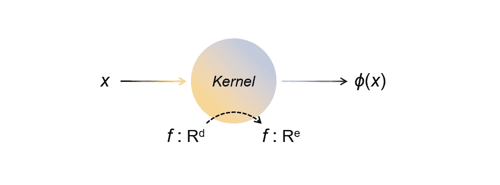

由于数据点在其原始特征空间中是非线性可分的，线性分类器可能无法确定决策边界在哪里。然而，将原始特征空间( *x* ∈ ℝᵈ)映射到更高维的特征空间( *ϕ* ( *x* ) ∈ ℝᵉ，e > d)可以帮助复活线性分类器来正确地完成工作。

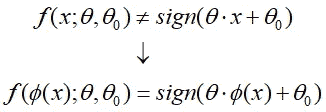

图一。阐释了通过特征映射对数据点进行分类的概念。本来，二维空间中具有特征向量 *x* = [ *x* ₁， *x* ₂]的数据点具有同心圆分布(这里不是严格的数学描述)。不可能使用线性分类器来区分决策边界。

尽管如此，通过结合某种映射函数 *ϕ* ( *x* )，特征向量可以被变换到三维特征空间。具有三维特征向量*ϕ*(*x*)=[*x*₁，*x*₂,(*x*₁+*x*₂]的新数据点现在可以使用线性分类器来确定决策边界超平面。这就是特性映射的力量，它可以让我们用更强的表达能力来处理更复杂的数据分布模式。

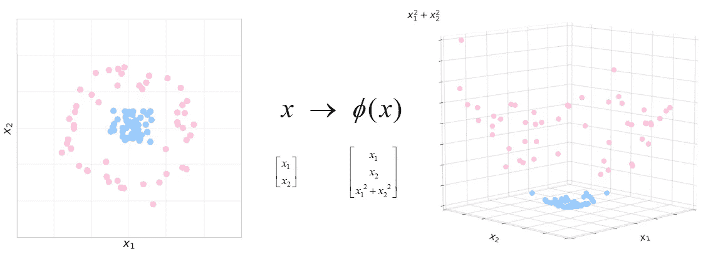

Figure 1\. Mapping data points with 2-D feature vectors into 3-D feature vectors

但是，直接使用 *ϕ* ( *x* )的缺点是

1.  有时很难直接显式构造一个 *ϕ* ( *x* )。
2.  随着特征尺寸的增加，计算能力迅速提高。

但是内核函数可以提供一种有效的方法来解决这个问题。

# 核函数

核函数的思想是在两个特征向量之间取内积，并且计算内积不需要很大的计算量。然后，我们可以在算法中只利用内积的结果。例如，如果我们想让 *ϕ* ( *x* )如下:

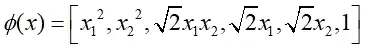

核函数取两个特征向量之间的内积如下，

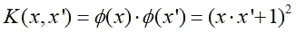

因此，核函数的形式对于我们来说将比在更高的特征维度中直接使用映射函数更容易构造。

# 内核合成规则

有几个内核组合规则可以用来构造更复杂的内核函数。

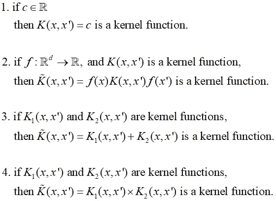

# 径向基核

核函数甚至可以赋予特征向量无限维的能力。一种常见的核函数是径向基核。定义如下。

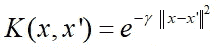

因为指数可以扩展到无穷幂级数，所以径向基核赋予特征映射更多的表现力。下面是径向基核是核函数的证明。

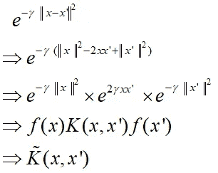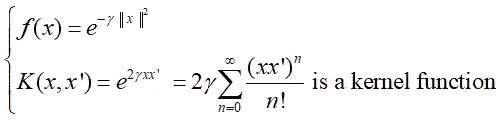

# 核感知器算法

这里回忆一下感知器算法，感知器算法一旦一个数据点被误分类，就更新*θ=θ+*y⁽ʲ*⁾*x*⁽ʲ*⁾。换句话说， *θ* 可以替换地表达如下。**

**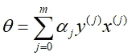**

**其中，α **ⱼ** 是感知器在第 *j* 个数据点上犯的错误数。如果在映射特征空间中，则 *θ* 可以表示如下。**

**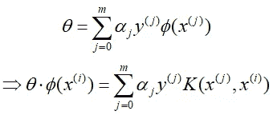**

**利用 *θ的核心形式，*核心感知器算法的伪代码可以描述如下。**

```
***# Kernel Perceptron Algorithm**# initialize* α**ⱼ**
*# totally m data points* for i = 1 .. m do
    αᵢ = 0*# totally T epoches to iterate*
for t = 1 .. T do                     
   * # totally m data points*    
    for i = 1 .. m do
        *# misclassify data points*                 
        if y⁽ⁱ⁾***∑*ⱼ(**α**ⱼ**y⁽ʲ⁾*K*(x⁽ʲ⁾,x⁽ⁱ⁾)**)** ≦ 0     
        then
            αᵢ = αᵢ + 1θ*ϕ*(x⁽ⁱ⁾)= ***∑*ⱼ(**α**ⱼ**y⁽ʲ⁾*K*(x⁽ʲ⁾,x⁽ⁱ⁾)**)****
```

# **内核在运行**

**图二。通过径向基核感知器算法可视化决策边界的更新。注意，由径向基核感知器算法绘制的决策边界可以在 2 个 epoches 内收敛于这种数据分布。径向基核的γ在这里使用 0.3。**

**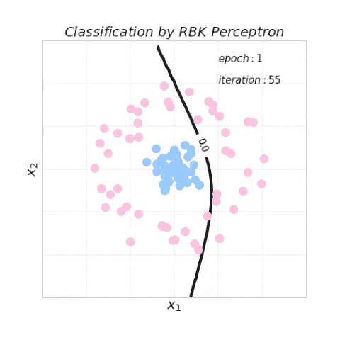**

**Figure 2\. Updating the decision boundaries by the RBK perceptron algorithm. May take time to load.**

# **示例代码**

**在 Jupyter 笔记本上写的感知器算法的样本代码可以在[这里](https://github.com/AnHungTai/Medium-SampleCode/blob/master/Kernel%20Functions%20in%20Nonlinear%20Classification/Visualizing%20Kernel.ipynb)找到。您可以自己处理数据和超参数，看看内核感知器算法的表现如何。**