# 内核回归—示例和代码

> 原文：<https://towardsdatascience.com/kernel-regression-made-easy-to-understand-86caf2d2b844?source=collection_archive---------2----------------------->


Photo by [Markus Spiske](https://unsplash.com/@markusspiske?utm_source=unsplash&utm_medium=referral&utm_content=creditCopyText) on [Unsplash](https://unsplash.com/s/photos/stacking?utm_source=unsplash&utm_medium=referral&utm_content=creditCopyText)

本文讨论了如何利用核函数作为权函数来建立非参数回归模型。在文章的开始，简要讨论了核函数的性质和围绕数据点构建核的步骤。

## 核函数

在非参数统计中，核是满足以下性质的加权函数。

1.  一个核函数必须**对称**。从数学上讲，这种性质可以表示为 K (-u) = K (+u)。核函数的对称性质使其最大值( *max(K(u)* )位于曲线的中间。

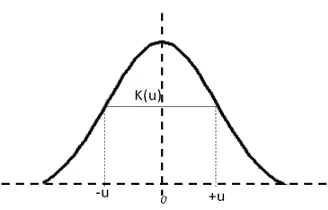

An illustration of Gaussian kernel function

2.函数曲线下的面积必须是**等于 1**。从数学上来说，该属性表示为:


3.核函数**的值不能为负，即**K(u)≥0 for all-<u<∞。

# 核估计

在本文中，高斯核函数用于计算数据点的核。高斯核的等式是:


其中 ***xi*** 为观察数据点。 ***x*** 是计算核函数的值， ***h*** 称为带宽。核回归中的带宽被称为平滑参数，因为它控制输出中的方差和偏差。本文稍后将讨论带宽值对模型预测的影响。

## 例子

假设有六个数据点，每个数据点显示单个学生在某一科目中获得的分数。使用高斯核函数在每个数据点构建核的步骤如下所述。

***【Xi】***= { 65，75，67，79，81，91}其中 ***x1*** = 65，***x2***= 75…****X6***= 91。*

*需要三个输入来构建围绕数据点的核心曲线。*

> *一.观察数据点，*
> 
> **二。**的值 *h* 的值****
> 
> **三。线性间隔的数据点系列，包括需要估计 *K* 值的观察数据点。如: ***Xj*** = {50，51，52 …99}**

**对于给定的**h 值，计算**K 值*【Xj】*值的步骤如下表所示，其中***【Xi】***= 65、****h***= 5.5。表格中的最后一列显示了内核的纵坐标为*= 65。********

******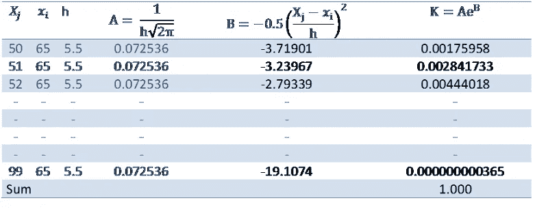******

******下面绘制 ***Xj*** 和 ***K*** 来可视化内核。注意图中的 *x 轴*是 ***Xj*** ，在其上构建内核曲线，在高斯分布的情况下，以***【Xi】***为均值，***【h】***为标准差。******

*****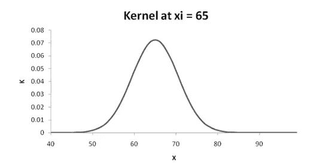*****

*****类似地，在所有六个观察到的数据点，内核值被估计并绘制如下。据观察，***【Xj】***与***【Xi】***相差甚远的 ***K*** 的值接近 0。例如，***Xj****= 99 的内核值对于*= 65 是零。*******

******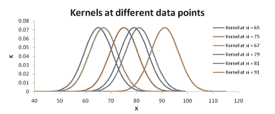******

******Kernels plotted for all **xi********

# ******核回归******

******在本节中，内核值用于从给定的输入导出权重以预测输出。计算权重并最终将其用于预测输出变量所涉及的步骤，预测变量中的 ***y*** ， ***x*** 将在以下章节中详细说明。让我们从一个例子开始，清楚地理解内核回归是如何工作的。******

## *******例子*******

*****在本例中，开发了一个核心回归模型来预测集水区的河流流量。如下图所示，集水面积(平方英里)和河流流量(立方英尺/秒)之间存在非线性关系。在本例中， ***y*** 为河流流量，x 为流域面积。*****

*****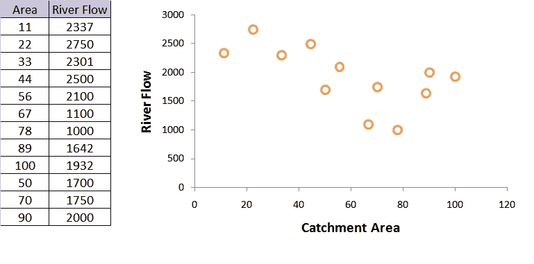*****

*****Example data set to build kernel regression*****

## *****作为加权函数的核*****

*****最初，如前几节所述，使用所有输入的带宽值来估计核。然后用它们来计算重量。在本例中，带宽值 10 用于解释内核回归。然而，带宽值需要优化以适当地适应数据。在不同的 ***x*** 值下绘制的内核如下图所示。*****

> *****重要的是要理解，内核是在所有的 *xi* 值下开发的。内核回归背后的基本计算是针对给定的*预测值 xi，估计所有观察到的 *y* 值的加权和。*权重只不过是内核值，范围在 0 和 1 之间，在给定的 xi 与垂直于 x 轴的线相交(如下图所示)。*****

*****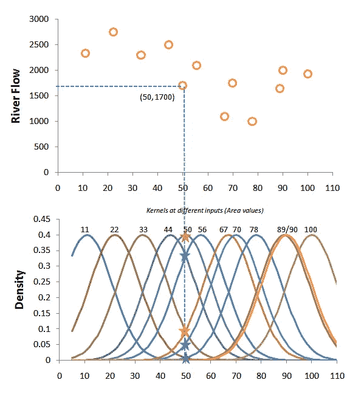*****

*****Scattered plot showing input-output data (above) and kernels at all inputs using a bandwidth of 10 (below)*****

*****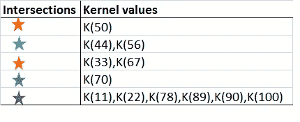*****

*****Intersection of predictor variable, area = 50 with surrounding kernels*****

*****上面的星形标记显示了交叉点及其相应的内核值。内核值在 0 和 1 之间缩放，以将其用作权重。以下等式用于在 0 和 1 之间缩放内核值。*****

*****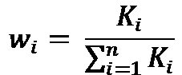*****

*****其中 ***wi*** 为输入的权重***I******n***为数据点总数。 ***x*** = 50 的输出 ***y*** 计算为所有观察到的 ***y*** 值的加权和，如下式所示。*****

*****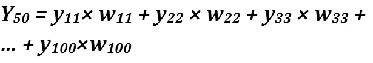*****

*****其中 ***y11*** 是*面积= 11* 的河流流量， ***w11*** 是相应的重量，等式中的其他项也是如此。*****

*****下表显示了从输入 ***x*** = 50 的内核值计算权重所涉及的步骤。表中的最后一列提供了最终输出，即 50 平方英里区域的计算河流流量。*****

*****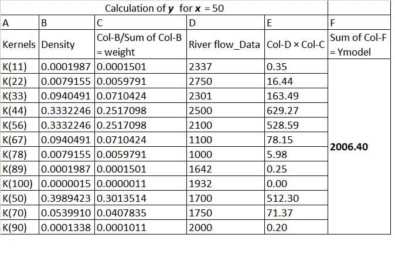*****

*****同样，对于 ***x、*** 的所有值，权重如上表所述进行估算，并用于计算相应的 ***y*** 值。下表和下图显示了不同区域输入的预测河流流量值。*****

*****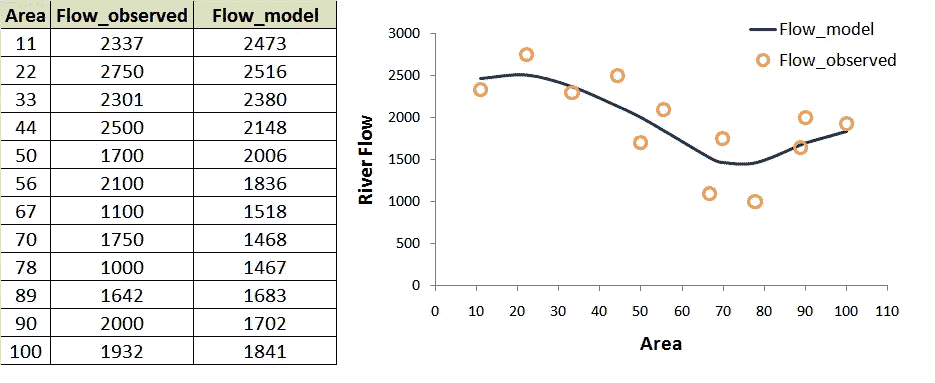*****

*****Computed river flow from kernel regression*****

## *****带宽灵敏度*****

*****以上计算基于带宽值 10。内核带宽对预测的影响很大，如下图所示。*****

*****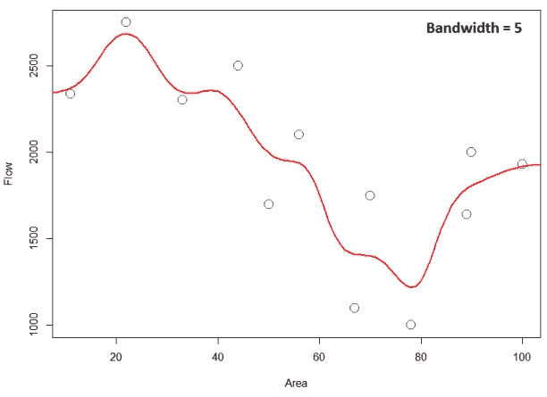*****

*****Kernel regression output for bandwidth value = 5*****

*****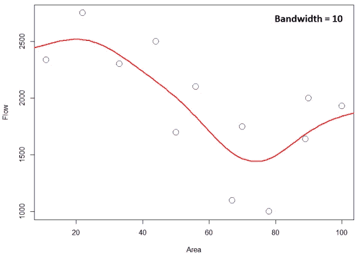*****

*****Kernel regression output for bandwidth value = 10*****

*****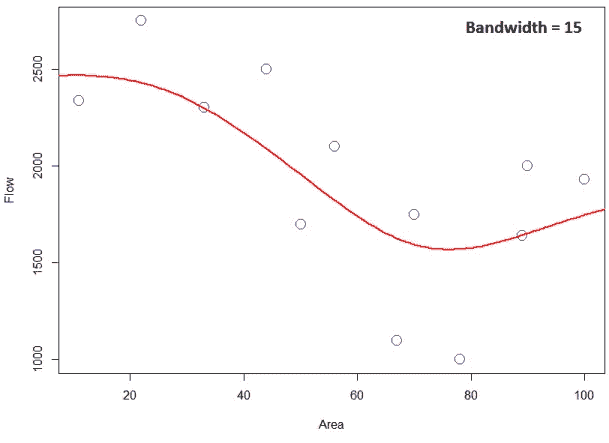*****

*****Kernel regression output for bandwidth value = 15*****

*****在为*预测时，由于较窄的内核对训练数据集中的“***【Xi】***”的*【易】* 赋予较高的权重，因此较小的带宽值过拟合数据。低带宽会在输出中产生大量看起来不真实的变化，而高带宽值会使输出过于平滑，无法揭示输入和输出之间的真实关系。因此，为了达到偏差-方差的平衡，应该在核回归中优化带宽。******

## *****核回归的 r 代码*****

```
*****#Kernel regression
data <- data.frame(Area = c(11,22,33,44,50,56,67,70,78,89,90,100),        RiverFlow = c(2337,2750,2301,2500,1700,2100,1100,1750,1000,1642, 2000,1932))                                 

x <- data$Area
y <- data$RiverFlow#function to calculate Gaussian kernel
gausinKernel <- function(x,b){
  K <- (1/((sqrt(2*pi))))*exp(-0.5 *(x/b)^2)
  return(K)
}b <- 10 #bandwidth
kdeEstimateyX <- seq(5,110,1)
ykernel <- NULL
for(xesti in kdeEstimateyX){
  xx <-  xesti - x
  K <-gausinKernel(xx,b)
  Ksum <- sum(K)
  weight <- K/Ksum
  yk <- sum(weight*y)
  xkyk <- c(xesti,yk)
  ykernel <- rbind(ykernel,xkyk)
}
plot(x,y,xlab = "Area", ylab = "Flow", col = 'blue', cex = 2)
lines(ykernel[,1],ykernel[,2], col = 'red', lwd = 2)*****
```

# *****参考*****

*****R.蒂布拉尼和 l .乏色曼，非参数回归，统计机器学习(2015)——卡耐基梅隆大学讲稿*****