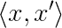
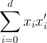
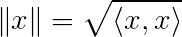
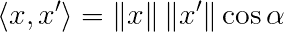
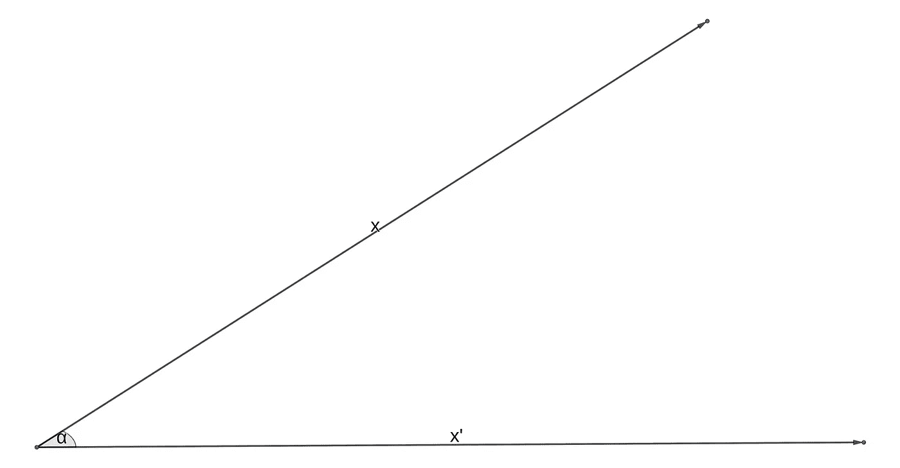
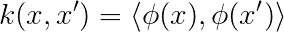
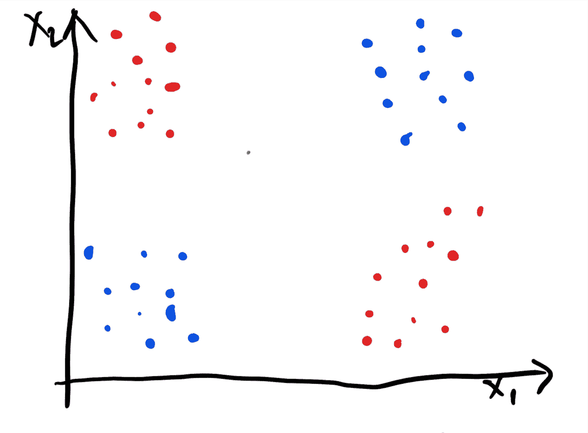
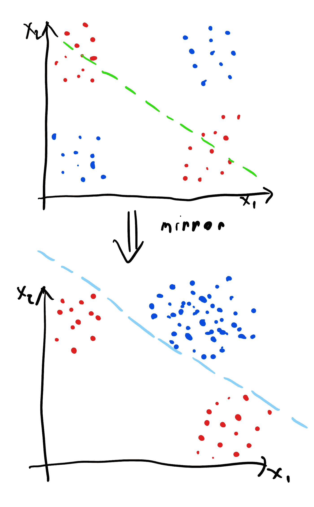

# 机器学习中的核心秘密。一

> 原文：<https://towardsdatascience.com/kernel-secrets-in-machine-learning-2aab4c8a295f?source=collection_archive---------5----------------------->

## 这个帖子不是关于深度学习的。但也可能是无妨的。这就是内核的力量。它们普遍适用于任何机器学习算法。为什么你会问？我将在这篇文章中尝试回答这个问题。

一般在机器学习中，我们要把相似的东西放在相似的地方。这条规则适用于所有的机器学习，无论是监督的、非监督的、分类的还是回归的。问题是，我们如何确切地确定什么是相似的？为了阐明这个问题，我们将从学习内核的基本基础开始，点积。

两个向量之间的点积是一件神奇的事情。我们可以肯定地说，它在某种意义上衡量了相似性。通常，在机器学习文献中，点积表示如下:

表示向量 x 和 x’之间的点积。注意，为了简洁起见，我省略了向量符号的箭头。这个符号是矢量分量乘积之和的简写:

巧合的是，向量的范数是与其自身的点积的平方根，表示为:

这当然不是全部。我们还知道余弦法则，即点积等于向量之间夹角的余弦乘以它们的范数(这很容易通过简单的三角学来证明):

谈论角度和范数的好处是，我们现在可以想象这个点积是什么意思。让我们画出这两个向量，它们之间的夹角为α:

所以如果我们用点积来衡量相似性。什么时候会达到最大值？意味着向量是最相似的。显然，当余弦等于 1 时，会发生这种情况，当角度为 0 度或弧度时会发生这种情况。如果向量各自的范数相同，那么显然我们说的是同一个向量！还不错。让我们把到目前为止学到的东西刻在石头上:

> 点积是向量之间相似性的度量。

现在你有希望理解为什么讨论点积是有用的了。

当然，点积作为相似性的度量，在问题中可能有用，也可能完全无用，这取决于您要解决的问题。因此，我们需要对输入空间进行某种变换，使点积作为相似性的度量变得实际有用。我们用ϕ.来表示这种转变现在，我们可以定义一个**核的含义，**映射空间中的点积:

因此，核的定义非常直接，它是映射空间中相似性的一种度量。事实是，数学家喜欢具体化。对于它们所处理的底层函数和空间，不应该有隐含的假设，因此函数分析的内核背后有相当多的理论，这需要另一篇或几篇文章来讨论。简而言之，我们需要明确说明我们希望ϕ:发挥什么样的作用

> 我们想要一个函数，它从定义域 X 映射到一个点积定义明确的空间，这意味着它是一个很好的相似性度量。

内核可以作为任何可以用点积(或范数)来定义的算法的一般化。使用核作为其主干的算法的最著名的例子是支持向量机和高斯过程，但是也有核用于神经网络的例子。

Photo by [Annie Spratt](https://unsplash.com/@anniespratt?utm_source=medium&utm_medium=referral) on [Unsplash](https://unsplash.com?utm_source=medium&utm_medium=referral)

我们需要内核和映射函数ϕ的另一个原因是输入空间可能没有明确定义的点积。让我们简短地研究一下**文档分析**的例子，我们只是想根据主题得出两个文档之间的相似性，然后对它们进行聚类。在这种情况下，这两个文档之间的点积到底是多少？一种选择是获取文档字符的 ASCII 码，并将它们连接成一个巨大的向量——当然，这不是你在实践中会做的事情，但这是相当值得思考的。很高兴我们现在把文档定义为向量。但是问题仍然在于长度，即不同的文件有不同的长度。但是没什么大不了的，我们可以通过用 EOS 字符将较短的文档填充到一定的长度来解决这个问题。然后我们可以在这个高维空间里计算一个点积。但是，还有一个问题，这个点积的相关性，或者说，这个点积实际上意味着什么。显然，字符的微小变化都会改变点积。即使我们把一个词和它的同义词交换，它也会改变点积。这是您在按主题比较两个文档时想要避免的事情。

那么内核是如何发挥作用的呢？理想情况下，您会希望找到一个映射函数ϕ，该函数将您的输入空间映射到点积具有您想要的含义的特征空间。在文档比较的情况下，对于语义相似的文档，点积较高。换句话说，这种映射应该使分类器的工作更容易，因为数据变得更容易分离。

我们现在可以看看典型的 XOR 例子来理解这个概念。XOR 函数是一个二元函数，看起来像这样:

蓝色点被分类为 0，红色点被分类为 1。我们可以假设这是一个噪声异或，因为集群有一个大的传播。我们马上注意到一件事，数据不是线性可分的。也就是说，我们不能在红点和蓝点之间划一条线，将它们分开。

在这种情况下我们能做什么？我们可以应用一个特定的映射函数，使我们的工作容易得多。具体来说，让我们构造一个映射函数，该函数将对穿过红点簇的线周围的输入空间进行单侧反射。我们将围绕这条线来反映这条线下面的所有点。我们的映射函数会有以下结果:

映射后，我们的数据变得很好地线性分离，所以如果我们有一个模型试图适应一个分离的超平面(例如感知器)，这是一个理想的情况。显然，线性可分性是一件非常好的事情。但是为了建立有效的模型，我们不一定需要线性可分性，这意味着为了建立有效的模型，不是所有的映射函数都需要导致线性可分的数据。

人们经常混淆应用内核和应用映射函数的概念。核函数的输出是一个标量，是两点的相似性或不相似性的度量。映射函数的输出是一个向量，我们基于它来计算相似性。关于内核有趣的事情是，我们有时可以计算原始空间中映射的点积，而不需要显式地映射输入。这允许我们处理无限维映射！这是一件很难理解的事情，所以我将在以后的文章中讨论。

作为结束语，我想推荐 Smola 和 Schoelkopf 的书:[用内核学习](http://agbs.kyb.tuebingen.mpg.de/lwk/)。这本书对核心机器及其理论背景进行了全面的论述。除此之外，请继续关注内核！

Photo by [Eric Nopanen](https://unsplash.com/@rexcuando?utm_source=medium&utm_medium=referral) on [Unsplash](https://unsplash.com?utm_source=medium&utm_medium=referral)

直接相关的文章/推荐阅读:

1.  [关于维度的诅咒](/on-the-curse-of-dimensionality-b91a3a51268)
2.  [机器学习中的内核秘密 Pt。2](/kernel-secrets-in-machine-learning-pt-2-16266c3ac37c)