# 机器学习中的核心秘密。2

> 原文：<https://towardsdatascience.com/kernel-secrets-in-machine-learning-pt-2-16266c3ac37c?source=collection_archive---------21----------------------->

## 想使用内核吗？让我们通过几个众所周知的内核来感受一下吧！

在关于这个主题的第一篇文章[机器学习中的内核秘密](/kernel-secrets-in-machine-learning-2aab4c8a295f)中，我以最基本的方式解释了内核。在继续阅读之前，我建议你快速浏览一下这篇文章，如果你还不知道内核是什么的话。希望你会得出这个结论:

> 核是映射空间中两个向量之间的相似性度量。

很好。现在我们可以检查和讨论一些众所周知的内核，以及我们如何组合内核来产生其他内核。请记住，对于我们将要使用的示例，x 是用于绘图目的的一维向量，我们将 x '的值固定为 2。事不宜迟，让我们开始 kerneling。

## 线性核

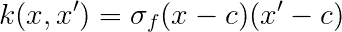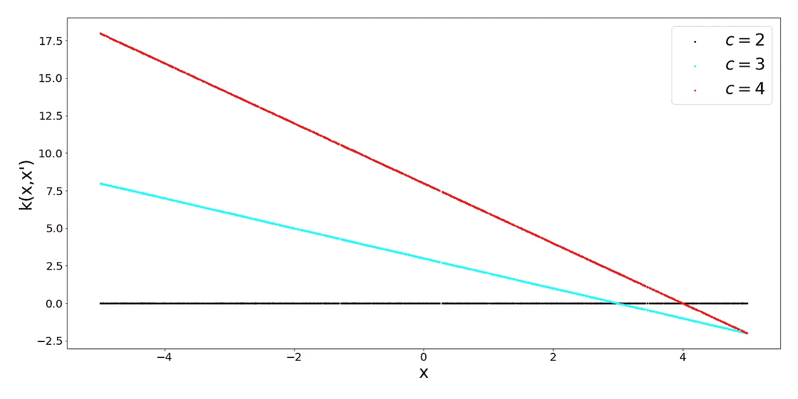

这个核的超参数是 sigma 和 offset 参数 c，直观来看，这个核是什么意思？如果我们取一个特定的 x，和其他所有的 x 比较，我们会得到一条直线。这就是为什么它被称为线性核。固定 x 和改变 x '实际上意味着我们沿着这条线移动。

这个内核的另一个特点是它是不稳定的。这意味着它的值相对于 x 的绝对位置而非相对位置变化。这个内核的另一个好处是，由于它是线性的，所以在优化中计算起来非常有效。

## 多项式核

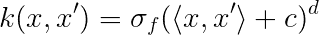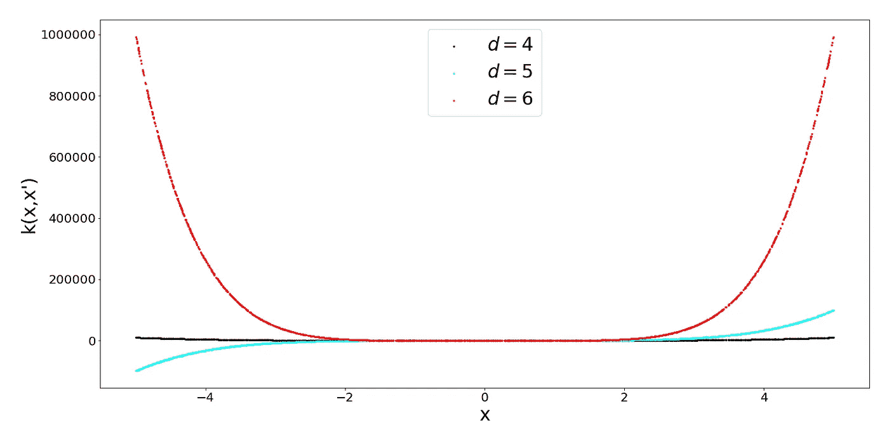

顾名思义，这个内核是一个偏移量为 c 的多项式函数。我认为值得花一点时间来考虑一下导致这个内核的映射函数ϕ，因为如果你记得内核是映射空间中的一个相似性函数(点积)，那么它返回一个标量！二维空间中 2 次多项式核的映射函数如下所示:

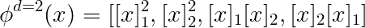

当增加输入维数 d 和多项式的次数时，我们映射到的结果特征空间变得相当大。好的一面是，我们可以计算点积，而不需要进行转换，就像上面的公式中指定的那样。这是内核理论中许多美丽的公式之一。

## **径向基函数核**

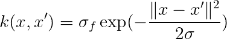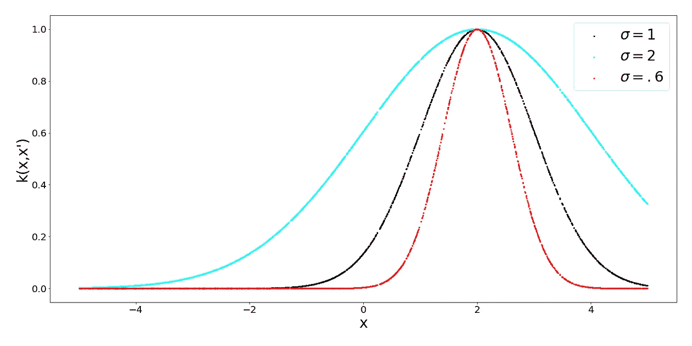

这是一个非常著名并且经常使用的内核。请注意，由于指数中的负指数，指数值的范围是从 0 到 1，这是一个很好的特性，因为我们可以说 1 表示非常相似，或者相同，接近 0 表示完全不同。指数中的σ参数控制内核的灵敏度。对于低σ值，我们预计只有非常接近的点才会相似。对于更大的σ，我们放宽了相似性标准，因为稍微远一点的点会更相似。

但是当然，内核看起来是这样的，因为我们把 X 固定为 0，改变了 X '，逻辑上足够我们想要计算点之间在整个 X 域中的相似性。这暗示了一个平面，实际上，这个平面就是内核的一个例子:

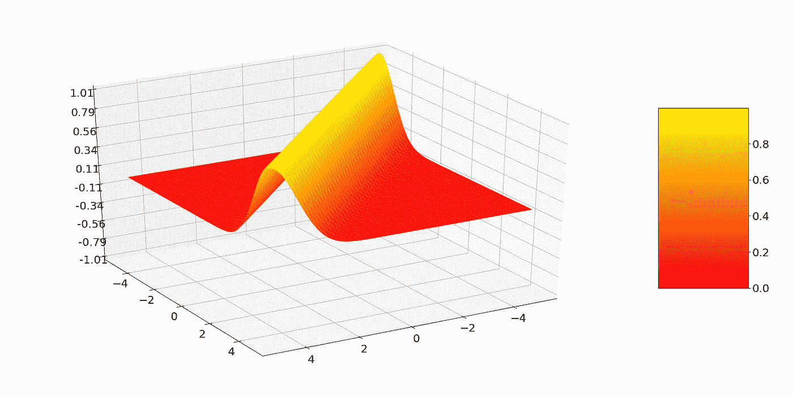

不够令人印象深刻的是，内核的值在对角线上最高，这里 x 和 x '是相同的。

## 周期核

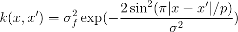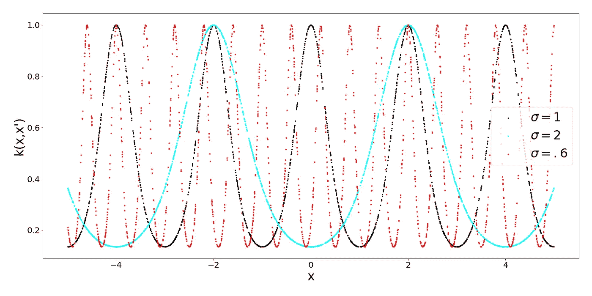

当你想到周期性时，你会不由自主地想到正弦和余弦这样的周期函数。逻辑上，周期核有正弦函数在里面。核的超参数再次是σ，其指定相似性的灵敏度，但是另外，我们有参数 p，其指定正弦函数的周期。这应该完全说得通。此外，请注意径向基核和周期核之间的相似性，两者都被限制为输出 0 和 1 之间的值。

什么时候需要使用周期性内核？这是很符合逻辑的，比如说你想建立一个正弦函数的模型。仅仅从这个函数中取两个距离欧几里德距离较远的点，并不意味着函数值有意义的不同。为了解决这类问题，你需要周期内核。为了完整起见，看看当我们调整周期内核的周期性时会发生什么(没有什么意外):

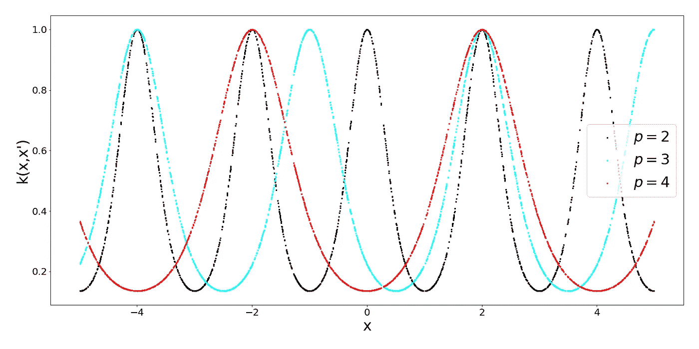

## 局部周期核

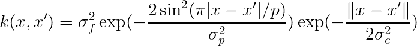

我们基本上只是通过取径向基核，并将其与周期核相乘来得到这个核。我们由此实现的是，所得到的核还随着 x 和 x’之间的距离而改变其值，而不仅仅是随着距离的周期性而改变。这导致了所谓的局部周期性。

只是因为我很好奇，让我们用 3D 绘制这个内核，并得到下面这个漂亮时髦的形状:

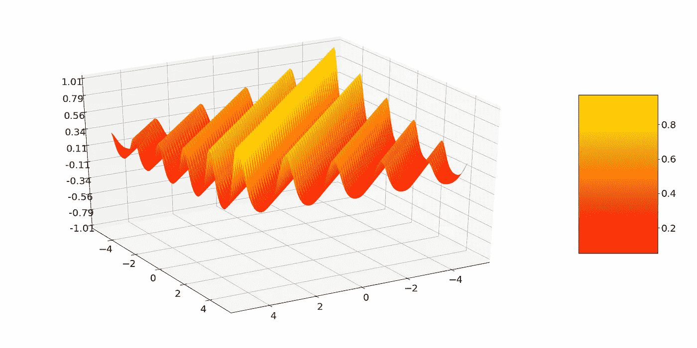

看起来相当酷！

# 构建新内核

现在我们已经看到了一些内核的例子。问题来了，我们需要什么来构造新的内核？内核有两个很好的特性:

1.  添加带有内核的内核会产生一个新的内核。
2.  内核相乘产生一个新的内核

这些允许你基本上不需要做太多的数学运算就能构建出非平凡的内核，这真的很直观。乘法也许可以看作是一种 and 运算，特别是当考虑 0 和 1 之间的核时。因此，我们可以通过将周期核与径向基函数核相结合来得到局部周期核。

这些是让您开始您的内核冒险的几个例子。当然，这仅仅触及了所有有趣内核的表面。为某个问题量身定制内核设计是一项重要的任务。精通它需要一定的经验。此外，机器学习中有一整个领域致力于学习内核函数。

由于算法要求，内核设计也可能很棘手。由于许多基于核的算法涉及到所谓的逆矩阵，我们要求我们的核是正定的，但这是我将在未来讨论的内容。

现在我们知道了一些有用的内核，我们可以更深入地研究希尔伯特空间的理论以及它们与内核的关系，但是这要等到下一篇文章。在此之前，如果你在阅读本文时遇到困难，这里有一些推荐读物:

1.  [机器学习中的内核秘密 Pt。1](/kernel-secrets-in-machine-learning-2aab4c8a295f)
2.  [关于维度的诅咒](/on-the-curse-of-dimensionality-b91a3a51268)
3.  [用内核学习](http://agbs.kyb.tuebingen.mpg.de/lwk/)

干得好！

