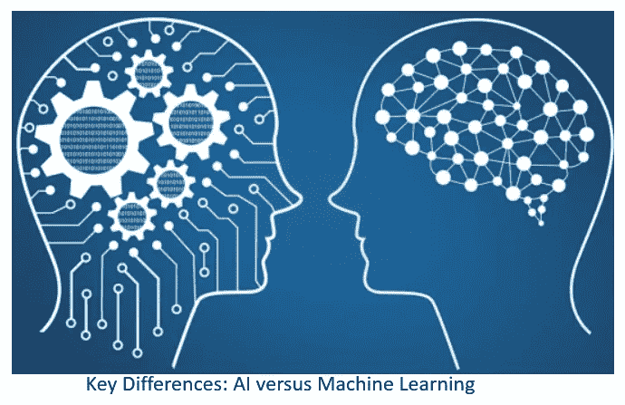
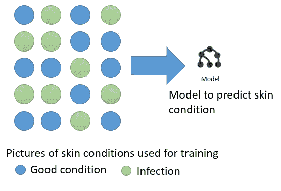
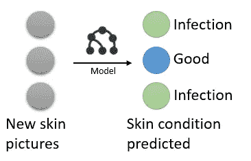
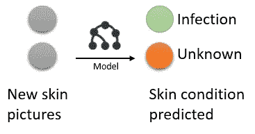
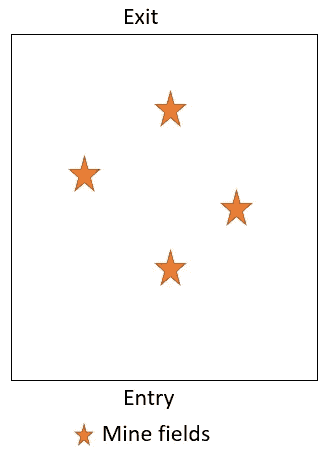
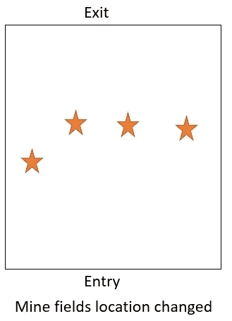
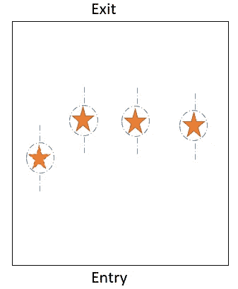

# 人工智能和机器学习的主要区别

> 原文：<https://towardsdatascience.com/key-differences-between-artificial-intelligence-and-machine-learning-fe637cd0deca?source=collection_archive---------5----------------------->

人工智能和机器学习是市场上最流行的两个术语，很多时候可以互换使用。它们已经成为日常生活的一部分，但这并不意味着我们很好地理解它们。在什么是机器学习和什么是人工智能之间存在很多混淆。在大多数公司里；营销忽略了广告和销售的这种区别。

让我们在接下来的几个章节中来看看人工智能和机器学习之间的一些主要区别。

**什么是机器学习**

在机器学习中，算法通过经验获得知识或技能。机器学习依靠大数据集来提醒数据找到共同的模式。

例如，假设你向机器学习程序提供大量皮肤状况的图像，以及这些状况意味着什么。该算法可以挖掘这些图像数据，并在未来帮助分析皮肤状况。该算法检查图像并识别具有相似条件的这些图像之间存在的模式。

当该算法在未来被给予新的皮肤图像(其状况未知)时，它将当前图像中存在的模式与它通过分析所有过去的图片而学习到的模式进行比较，并且能够预测它是哪种皮肤状况。

如果有新的皮肤状况，或者如果皮肤状况的现有模式发生变化，该算法将不能正确预测这些状况。人们必须将所有新数据输入算法，让它学会根据新的皮肤状况进行预测。

同样，如果您向算法提供客户数据集，该数据集既有流失客户的样本，也有未流失客户的样本，它就可以挖掘这些数据，以了解流失客户和未流失客户的模式。如果给出了新的客户信息，它可以将所提供的客户信息中存在的模式与它之前学习的模式进行比较，并且可以预测该客户是否会流失。

> 如果客户行为有任何变化，该算法必须输入捕捉新客户行为的新数据，以便能够准确预测未来。

**什么是人工智能**

另一方面，人工智能通过获取知识和学习如何应用知识来学习。人工智能的目的是增加成功的机会，并找到最优解。人工智能是研究训练计算机去尝试做目前人类能做得更好的事情。人工智能倾向于在适应新场景很重要的情况下使用。

让我们来看一个简单的视频游戏，游戏的目标是使用自动导航汽车穿过雷区，从一边走到另一边。最初，汽车不知道避开地雷的最佳路径是什么。比方说，我们进行模拟运行，以获得关于哪条路径可行、哪条路径不可行的大量数据。这是可以提供给机器学习的数据，因此它可以从过去的驾驶经验中学习，并使用这些数据来安全地驾驶汽车。

让我们把问题复杂化。假设地雷的位置被移动了。机器学习算法将不再有效。机器学习不知道有地雷存在。它所知道的是从最初提供的数据中提取的路径中存在什么模式，并且这是它将继续引导的相同路径，除非提供新的数据供它学习。

另一方面，人工智能将对这些数据做的是分析这些路径为什么会改变，并编纂规则以识别那些(危险)点，以及如何通过留下可见的痕迹来避免它们。它学习知识并应用它们，就像大脑如何工作一样。当地雷被改变时，AI 将开始寻找那些危险点，并通过遵循新的路径慢慢开始避开它们，就像人类大脑如何学习和适应一样。

**总结**

总之，机器学习使用经验来寻找它所学习的模式。人工智能利用经验来获取知识/技能，以及如何将这些知识应用到新的环境中。

AI 和 ML 都可以有有价值的商业应用。但是在许多公司中，ML 已经被更多的采用来解决关键的商业问题。