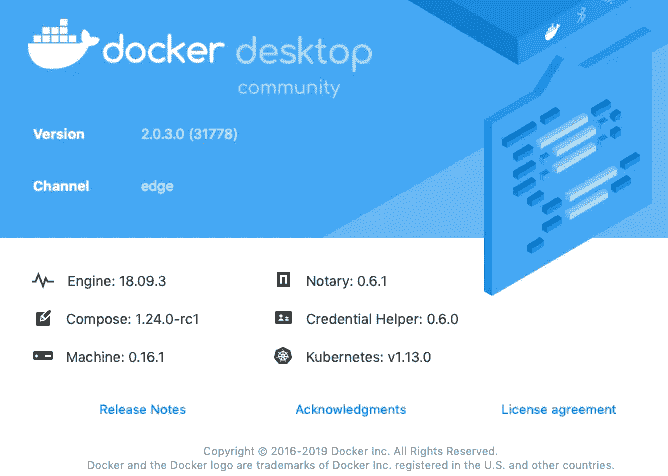
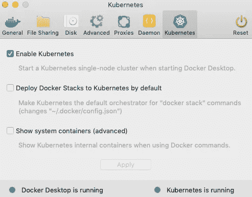
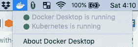
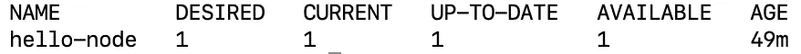
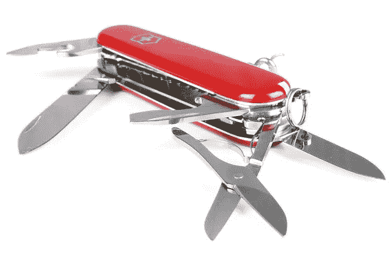

# Kubernetes 键盘命令

> 原文：<https://towardsdatascience.com/key-kubernetes-commands-741fe61fde8?source=collection_archive---------8----------------------->

## 使用 K8s 启动并运行

Kubernetes 是部署和管理大型应用程序的首要技术。在本文中，我们将在您的本地机器上启动并运行 K8s。然后您将部署您的第一个应用程序。最后，您将看到需要了解的 K8s 命令。

如果你是 Kubernetes 的新手，可以看看我的[上一篇文章](/key-kubernetes-concepts-62939f4bc08e?source=friends_link&sk=d46386ce56c00701dbf41aa8d308a14d)来学习基本的 K8s 概念。

我们起航吧！⛵️


Lots of containers on a ship.

# **本地运行 K8s**

直到最近， [Minikube](https://kubernetes.io/docs/setup/minikube/) 还是创建本地单节点 Kubernetes 集群的主要手段。它可以在 Mac、Windows 和 Linux 上运行。Minikube 在一个虚拟环境中运行，带有许多不同虚拟环境的驱动程序。它还有一个扩展的 API。然而，当我将 Minikube 与 VirtualBox 配合使用时，我发现它速度很慢，而且漏洞百出。

如果你是在 Mac 或 Windows 机器上本地玩 K8s，我推荐你使用 Docker 桌面自带的 K8s 版本。它使用 HyperKit 作为它的虚拟环境。我发现这是一股新鲜空气。🌷

如果你在本地使用装有 K8s 的 Linux 机器，请查看一下 [MicroK8s](https://microk8s.io/) 。它是轻量级的，使用一个*快照*而不是虚拟环境。

本文我运行的是 Docker Desktop CE 的 K8s v1.13.0，2019 年 4 月 *Edge* 版本。



要在 Mac 上安装并启动 K8s，首先在这里下载带有 K8s 的 Docker Desktop[。](https://www.docker.com/products/docker-desktop)

安装完成后，进入你的应用程序并启动 Docker。从屏幕顶部的 Docker *图标中选择 *Preferences* 来安装并启动 K8s。*


选择 *Kubernetes* 选项卡并勾选 *Enable Kubernetes* 复选框。



同意安装 Kubernetes。可能需要一两分钟才能启动。点击 Docker 下拉菜单，您应该会看到 *Kubernetes 正在启动*，最后 *Kubernetes 正在运行*。



如果你看到两个绿色的圆圈，那么你就准备好了！如果没有看到两个绿圈，Google 和 [Stack Overflow](https://stackoverflow.com/) 是一个开发者最好的朋友。😄

# 你的第一个 K8s 应用

让我们做一个 *hello world* 部署，它将为 node.js 应用程序拉一个 Docker 映像。我们的应用程序将在浏览器中显示 *Hello World* 。在生产中，你会以不同的方式做事。这个练习是让你开始练习的第一步。👣

在 K8s 运行的情况下，在终端中输入以下命令:

`kubectl create deployment hello-node --image=gcr.io/hello-minikube-zero-install/hello-node`

我们使用`kubectl` API 来创建一个名为 *hello-node* 的部署，它使用存储在 [Google 容器注册表](https://console.cloud.google.com/gcr/images/hello-minikube-zero-install/GLOBAL/hello-node?gcrImageListsize=30)中的 Docker 映像。我们正在使用官方 Kubernetes 的 Docker 容器。

以下是 Dockerfile 文件的内容:

```
FROM node:6.14.2
EXPOSE 8080
COPY server.js .
CMD node server.js
```

我们使用的是官方的 node.js 镜像，复制 *server.js 的内容，*公开端口 8080，用 node 运行 *server.js* 程序。关于 Docker 文件的更多信息，请点击这里查看我的文章[。](/learn-enough-docker-to-be-useful-b0b44222eef5)

下面是 *server.js* app 代码:

```
**var http = require('http');

var handleRequest = function(request, response) {
  console.log('Received request for URL: ' + request.url);
  response.writeHead(200);
  response.end('Hello World!');
};
var www = http.createServer(handleRequest);
www.listen(8080);**
```

这段代码将创建一个监听端口 8080 的服务器。当服务器收到请求时，它会向控制台写入一条有用的消息，并返回“Hello World！”。

在运行了 *kubectl create* 命令之后，您应该会在终端中看到一条消息，说明您的部署已经创建好了。不过，你的应用还不能马上投入使用。K8s 需要提取 Docker 图像并旋转您的容器。

您可以通过`kubectl get all`查看所有 K8s 资源的状态。提取图像并旋转容器需要几分钟的时间，所以您可能需要输入这个命令几次。你可以到幕后高峰，看看 K8s 在用`kubectl get events`做什么。

当你看到 *1* Pod 显示*可用*时，你就可以开始了。



为了使 Pod 能够被 K8s 集群之外的世界访问，您需要将 Pod 公开为服务。使用命令`kubectl expose deployment hello-node --type=LoadBalancer --port=8080`创建服务。

您指定了群集的名称、服务的类型以及它要使用的端口。不是所有的服务类型都创建一个可以从外界访问的 IP，但是负载平衡器可以。

您应该能够通过在 shell 中输入`kubectl get services`看到服务已经创建。

假设您正在本地运行 K8s，将您的浏览器导航到 [http://localhost:8080/](http://localhost:8080/) ，您应该会看到消息“Hello World！”。👍


Hello World!

您可以在 YAML 文件中指定它们，而不是通过命令行创建和指定整个部署和服务。使用文件有几个优点，包括可重用性和文档化。我计划在以后的文章中深入讨论 YAML 规范文件，所以请关注 [me](https://medium.com/@jeffhale) 以确保您不会错过它们。

现在让我们来看看流行的 K8s 命令。

# 库贝特尔


Cubes

[*ku bectl*](https://kubernetes.io/docs/reference/kubectl/overview/)*——读作*立方体控制、立方体切割*——[或其他多种方式](https://medium.com/diary-of-an-sre/how-do-you-really-pronounce-kubectl-4f58f76090e5)——是 K8s 的命令行工具。它是这样工作的:*

*   *一个 *kubectl* 命令执行一个动作，如 *get* 、 *create* 或 *describe。**
*   *该操作在资源上执行，如部署、状态集或服务。*
*   **kubectl* 命令遵循以下格式:*

*`kubectl an_action a_resource a_resource_name --flags`*

*在许多情况下，名称和标志是可选的。*

**

*Flags*

*例如，要获得关于所有现有 pod 的信息，您可以运行这个常见命令:`kubectl get pods`。*

*提示:如果您想避免键入 *kubectl* a bajilllion 次，那么创建一个 Bash 别名。有了`alias k='kubectl'`，你可以只输入`k`而不是`kubectl`。我在本文中展示了如何在 Mac 上创建 Bash 别名。*

*事不宜迟，下面是最常见的 K8s 资源及其快捷方式。*

# *11 大 kubectl 资源*

*你可以写出完整的术语或捷径。*

*`pods, po
nodes, no
deployments, deploy
replicasets, rs
daemonsets, ds
statefulsets, sts
jobs
cronjobs, cj
services, svc
persistentvolumes, pv
persistentvolumeclaims, pvc`*

*如果你对这些资源不清楚，可以看看我之前关于 K8s 概念的文章。另外两个需要了解的术语是*所有*和*事件*。*

*不出所料，`all`用来指代所有现有的资源。`kubectl get all`显示了有关运行 pod、服务、部署和复制集的基本信息。这个命令非常方便。😄*

*同样，`kubectl get events`显示事件的历史。就像是 K8s 级别的日志而不是容器级别的。*

*如果你想看更多的 kubectl 资源，请点击这里查看官方文档。现在，让我们看看应用于我们的资源的行动。*

# *7 大 kubectl 行动*

*`help` —获取帮助
`get` —显示关于一个或多个资源的信息
`describe` —显示关于一个或多个资源的详细信息
`logs` —显示容器的日志
`exec` —进入容器中正在运行的进程
`apply` —创建或更改资源
`delete` —删除一个或多个资源*

*让我们简单地看一下每个命令。*

## ***求助***

*在命令后键入`--help`以获取该命令的帮助。比如`kubectl get pods --help`。*

## ***得到***

*`kubectl get all`显示了有关运行 pod、服务、部署和副本集的基本信息。这是检查事物状态的常用命令。您可以对单个对象使用`get`并添加`--watch`标志来观察实时更新。*

## ***形容***

*`kubectl describe all`显示了与您的集群相关的几乎所有内容的大量详细信息。您也可以对单个对象使用`describe`。调试的时候很有帮助。*

## ***日志***

*`logs`需要一个 Pod 名称。我的“hello world”应用程序使用命令`kubectl logs hello-node-7f5b6bd6b8-gr7m7`显示了我的 Pod 的日志。当多个容器在一个容器中时，使用标志`-c my-container`指定一个容器。使用`--previous`标志获取不再运行的容器的信息。*

**

*Wish my logs looked like this.*

## ***执行***

*`exec`帮助你调试一个容器进程。它允许您通过一个带有`-it`的伪终端在容器内执行一个流程。例如，要在 *my_pod* 中输入容器并运行 Bash，输入`kubectl exec -it my_pod bash`。*

## ***应用***

*将`apply`与 YAML 或 JSON 文件一起使用是创建或更改资源的推荐方式。如果一个资源不存在，`apply`将创建它。如果它确实存在，`apply`会改变它。`apply`可以向适用的资源添加服务，或者通过添加 pod 来自动横向扩展部署。*

*注意，您可以使用`create`进行部署，使用`expose`进行服务——这就是我们在上面所做的。然而，使用带有`apply`的 YAML 文件对于文档和重用来说是一个更好的选择。我们将在以后的文章中介绍这种方法。在这里查看关于创建资源的最佳实践[的讨论。](https://medium.com/google-cloud/kubernetes-best-practices-8d5cd03446e2)*

*`apply`是您创建和更新资源的瑞士军刀。*

**

*SwissArmy knife*

## ***删除***

*`kubectl delete pod my_pod`删除名为 *my_pod 的 Pod。**

*要删除相同类型的所有资源，请传递`--all`标志。例如，您可以用`kubectl delete rs --all`删除所有的副本集。请注意，如果您尝试这样做，除非您先删除部署，否则副本集将会重新启动。😄*

*现在您已经看到了关键的 K8s 命令。当你成为一名库伯内特 n̵i̵n̵j̵a̵和平战士，你会获得其他人。可以在这里[找到 *kubectl* 动作的完整列表。](https://kubernetes.io/docs/reference/generated/kubectl/kubectl-commands)*

# *概述*

*要记住的命令。*

## ***带快捷方式的前 11 项资源***

*`pods, po
nodes, no
deployments, deploy
replicasets, rs
daemonsets, ds
statefulsets, sts
jobs
cronjobs, cj
services, svc
persistentvolumes, pv
persistentvolumeclaims, pvc`*

## ***前 7 项行动***

*`--help` —获取关于资源的帮助
`get` —显示关于一个或多个资源的信息。
`describe` —显示一个或多个资源的详细信息。
`logs` —显示容器的日志。
`exec` —进入容器中正在运行的进程。
`apply` —创建或更改资源。
`delete` —删除一个或多个资源。*

*如果你想更深入地了解清单，看看这张[更长的备忘单](https://cheatsheet.dennyzhang.com/cheatsheet-kubernetes-A4)。*

*当你探索 K8s 的时候，一定要花一些时间和官方的 [Kubernetes docs](https://kubernetes.io/docs) 在一起。它们非常详细，一开始可能会让人不知所措，但它们写得非常好。🎉*

# *包装*

**

*That’s a wrap.*

*我希望这篇文章对你有用。您看到了如何设置 K8s 和运行您的第一个 K8s 应用程序。然后，您了解了如何使用常见命令检查、创建和删除 K8 资源。如果你觉得这篇文章有帮助，请在你最喜欢的社交媒体渠道上分享，这样其他人也可以找到它。👍*

*我在工作中有未来的 K8s 文章。跟随 [me](https://medium.com/@jeffhale) 确保你不会错过它们。😃*

*我撰写关于数据科学、云计算和 DevOps 的文章。如果你对这些感兴趣，可以在这里查看我的其他文章。*

*[](https://dataawesome.com)*

*`kubectl`开！🚀*