# Kubernetes 的关键概念

> 原文：<https://towardsdatascience.com/key-kubernetes-concepts-62939f4bc08e?source=collection_archive---------3----------------------->

云计算、容器化和容器编排是 DevOps 中最重要的趋势。无论您是数据科学家、软件开发人员还是产品经理，了解 Docker 和 Kubernetes 的基础知识都是有益的。这两种技术都有助于你与其他人合作，部署你的项目，并增加你对雇主的价值。

在本文中，我们将介绍 Kubernetes 的基本概念。有很多 Kubernetes 的术语，这可能会使它变得令人生畏。我会帮你做一个心智模型来加速你对技术的理解。

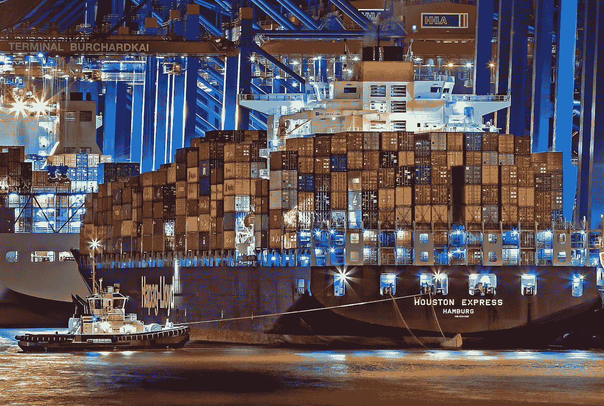

Orchestrating the movement of shipping containers

如果你首先了解 Docker 概念，Kubernetes 会更有意义。查看我的码头指南，学习基本原理。

 [## 学习足够的码头工人是有用的

### 第 1 部分:概念景观

towardsdatascience.com](/learn-enough-docker-to-be-useful-b7ba70caeb4b) 

然后回到这里学习如何编排这些 Docker 容器。

# Kuberwhat？

Kubernetes 是一个开源平台，用于管理生产中的容器化应用。Kubernetes 简称 K8s。展望未来，我将主要使用术语 *K8s* ，因为谁不喜欢效率呢？😃

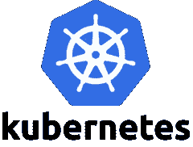

K8s 火爆。正如你在下面的图表中看到的，谷歌对它的搜索在过去的五年中增长迅速。

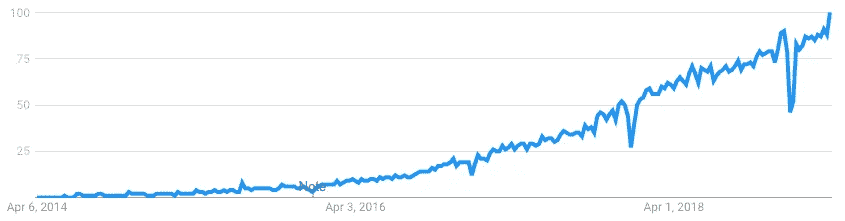

Worldwide search interest for *kubernetes*

K8s 为什么这么抢手？Kubernetes 使您更容易自动扩展应用程序，减少停机时间，并提高安全性。无需再编写脚本来检查、重启和更改 Docker 容器的数量。取而代之的是，你告诉 K8s 你想要的集装箱数量，它会为你完成工作。K8s 甚至可以根据使用的资源自动缩放容器。

Kubernetes 是所有关于抽象的复杂性。它提供了与应用程序开发环境接口的清晰要点。

K8s 对于一个每天只有少量访问者的基本静态网站来说没有太大意义。它的用例是用于可能需要快速伸缩的大型应用程序。

对于大型应用程序，您可以使用 K8s 来充分利用您的计算和存储资源。当与云提供商配对时，K8s 可以为您省钱。💰无论您在哪里运行 K8s，它都应该可以帮助您节省时间并减少 DevOps 的麻烦。

Docker 有一个名为[的竞争产品 Docker Swarm](https://docs.docker.com/engine/swarm/) ，它编排容器。但是，它没有 K8s 那样的功能和市场份额。虽然你可能认为 Docker 在 K8s 有自己的产品时不会很好地与 K8s 配合，但两者配合得非常好。我强烈建议你使用 K8s 来编排你的容器。

Playing nicely

保持许多 K8s 抽象的直线可能是棘手的。我将解释关键部分是如何组合在一起的，这样您就可以理解这个强大的平台了。让我们来探讨 K8s 的关键概念以及它们之间的关系。

首先，我们将看看六个抽象层和组成它们的部分。然后我们将看看其他七个关键的 K8s API 对象。

# K8s 的六层

让我们假设你有一个持续运行的应用，不需要存储状态。

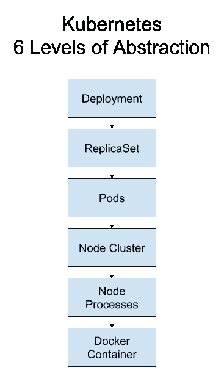

Kubernetes abstractions for a Deployment. © Jeff Hale 2019

以下是 K8s 概念的六层，从最高层的抽象开始。

1.  部署
2.  复制集
3.  豆荚
4.  节点集群
5.  节点流程
6.  码头集装箱

部署创建和管理复制集，复制集创建和管理 pod，pod 运行在节点上，节点上有容器运行时，运行您放在 Docker 映像中的应用程序代码。听起来像爱尔兰民歌“[拉特林沼泽](https://en.wikipedia.org/wiki/The_Rattlin%27_Bog)”。😄

这是一个分解了工作节点流程的图表。让我们挖一点。

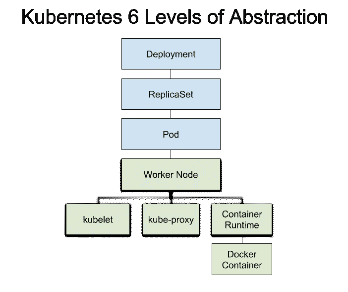

Detailed Kubernetes abstraction Deployment levels. © Jeff Hale 2019

蓝色阴影的层次是更高层次的 K8s 抽象。绿色级别表示您应该知道但不能接触的节点和节点子流程。

请注意，您的 K8s 实例通常会有多个可以在单个节点上运行的 pod。

Docker 容器包含您的应用程序代码。

***语法插曲* * *

根据 K8s 自己的[风格指南](https://kubernetes.io/docs/contribute/style/style-guide/)，API 对象如 *Pods* 的大写应该遵循“实际对象名中使用的相同的大写和小写字母”然而，在文档中经常没有遵循这一准则——API 对象的大写或小写似乎是随机的。

我将遵循我的 K8s 文章和大写错误中的风格指南声明的政策。

* * *语法插曲结束。😄***

让我们从最高的抽象层次开始，分别看一下这六个层次。

# 部署

如果你想创建一个持续运行的无状态应用，比如 HTTP 服务器，你需要一个部署。部署允许您在不停机的情况下更新正在运行的应用程序。部署还指定了一个当吊舱死亡时重启的策略。

您可以从命令行或配置文件创建部署。我将在以后的文章中向您展示这两种方法，所以请跟随 [me](https://medium.com/@jeffhale) 以确保您不会错过它们。😄

# 复制集

部署会创建一个副本集，确保您的应用程序具有所需数量的 pod。复制集将根据您在部署中指定的触发器创建和缩放窗格。

*复制控制器*执行与复制集相同的功能，但是复制控制器是老式的。复制集是 2019 年管理复制 pod 的智能方式。

# 豆荚

[*Pod*](https://kubernetes.io/docs/concepts/workloads/pods/pod-overview/#pods-and-controllers) 是 Kubernetes 的基本构建模块。一个 Pod 包含一组一个或多个容器。通常，每个 Pod 有一个容器。

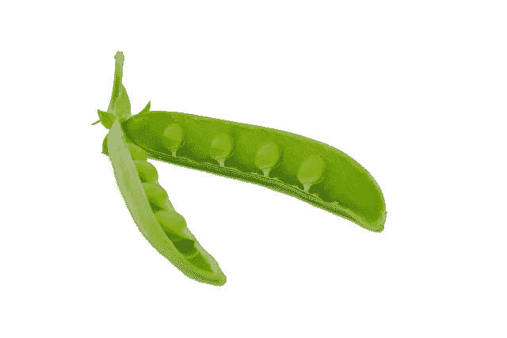

Pod

pod 处理容器的容量、机密和配置。

豆荚是短暂的。它们在死亡时会自动重启。

当应用程序被 ReplicationSet 水平缩放时，窗格被复制。每个 Pod 将运行相同的容器代码。

豆荚生活在工人节点上。

# 集群级别

## 串

一个 K8s 集群由一个 C *集群主节点*和*工作节点组成。*

Star Cluster. Credit: [NASA, ESA and the Hubble Heritage (STScI/AURA)-ESA/Hubble Collaboration](https://www.spacetelescope.org/images/heic0715a/)

下面是一个集群的示意图。该图强调了如何在一个 Worker 节点上运行多个 Pods，以及如何由一个 Master 管理多个 Worker 节点。

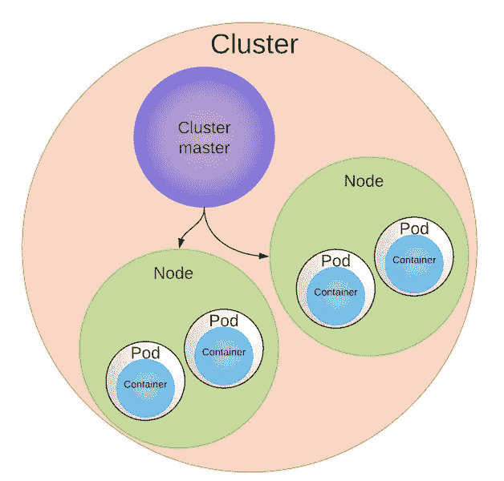

Kubernetes Nodes, Pods, & Containers © Jeff Hale 2019

## 工作节点

一个 [*职工节点*](https://kubernetes.io/docs/concepts/architecture/nodes/) 就是也简称*节点*简称*。*节点是机器的抽象，可以是物理机，也可以是虚拟机。把一个节点想象成一台计算机服务器。

一个或多个 pod 在单个工作节点上运行。

Pod 从不在两个节点之间拆分，它的内容总是位于同一节点上并一起计划。

谁在告诉工人节点做什么？大师。

## 集群主机

[*群主*](https://cloud.google.com/kubernetes-engine/docs/concepts/cluster-architecture#master) 有着多得严重可笑的别名。它也被称为*主节点、Kubernetes 主节点、集群控制平面、*控制平面、*和*主节点。不管你叫它什么，它都指挥工人节点。主设备做出调度决策、响应事件、实施更改并监控集群。

工作节点和主节点都有子流程组件。

# 节点流程

## 主组件

主要组件是 *API* *服务器(*又名 *kube-apiserver)* 、 *etcd* 、S *调度器*(又名*kube-调度器)、kube-控制器-管理器和云控制器管理器*。**为了完整起见，我于 2019 年 4 月 10 日添加了控制者-管理者* *

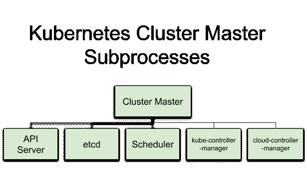

Cluster Master subprocesses

让我们简单看一下每一个。

***API 服务器*** —公开 K8s API。这是 Kubernetes 控制的前端。(又名。kube-apiserver)认为*枢纽*。
***etcd*** —集群状态数据的分布式键值存储。思考*集群信息*。
***调度器*** —选择新窗格的节点。好导[这里](https://medium.com/@dominik.tornow/the-kubernetes-scheduler-cd429abac02f)。(又名 kube-scheduler)想想*匹配器*。
***kube-controller-manager***—运行控制器来处理集群后台任务的进程。想想*集群控制器*。
***云控制器管理器*** *—* 运行与云提供商交互的控制器。想*云接口*。

## 工作节点组件

Worker 节点的[组件](https://kubernetes.io/docs/concepts/overview/components/#node-components)是 *kubelet* 、 *kube-proxy* 和*容器运行时*。

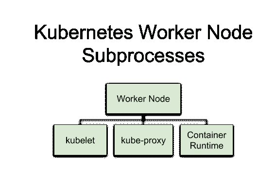

Worker Node subprocesses

*—负责工人节点上的一切。它与主服务器的 API 服务器通信。想*脑*为工节点。
[***kube-proxy***](https://kubernetes.io/docs/reference/command-line-tools-reference/kube-proxy/)—将连接路由到正确的 pod。还跨服务单元执行负载平衡。想想*交警*。
***容器运行时*** —下载图像并运行容器。例如，Docker 是一个容器运行时。想*码头工人*。*

*让我们深入到最后一个层次，看看那些容器运行时运行的是什么。😄*

# *码头集装箱水平*

*如果你想用 K8s 运行你的应用，你的应用需要在某种容器中。Docker 是目前最常见的容器平台。我们假设你正在使用它。*

*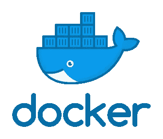*

*在创建部署时，您将指定 pod 应该使用哪个 Docker 映像。容器运行时将下载映像并创建容器。*

*K8s 不直接创建容器。它创造了容纳容器的容器。Pod 中的容器共享任何已配置的资源，例如卷存储。*

*有五个管理和运行 pod 的高级 K8s API 资源:*部署、StatefulSets、DaemonSets、Jobs、*和 *CronJobs* 。这些对象负责管理和运行创建和运行容器的窗格。让我们看看这些创建和管理连续流程的控制器*

# *副本集、状态集和守护集*

*如你所见，一个复制集创建并管理 pod。如果一个 Pod 由于一个节点故障而关闭，复制集可以自动替换另一个节点上的 Pod。通常应该通过部署创建副本集，而不是直接创建，因为使用部署更新应用程序更容易。*

*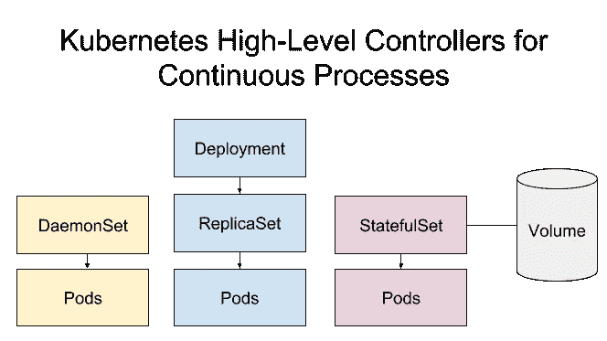*

*A Volume can be attached to a ReplicaSet or a StatefulSet. © Jeff Hale 2019*

*有时候你的程序需要保存状态信息。你可以把状态想象成你的用户与你的应用程序交互的当前状态。所以在一个视频游戏中，它是用户角色在某个时间点的所有独特方面。*

*例如，最初的[超级马里奥兄弟](https://en.wikipedia.org/wiki/Super_Mario#Super_Mario_Bros.)游戏中的状态将包括用户游戏的每个相关方面:什么级别，该级别中的什么位置，大还是小，火球还是没有火球，多少硬币，多少点数，以及多少条生命。*

**

*当你的应用程序有你需要跟踪的状态时，你会怎么做？使用 StatefulSet。*

## *状态集*

*像 ReplicaSet 一样，*[*stateful set*](https://kubernetes.io/docs/concepts/workloads/controllers/statefulset/)*根据容器规范管理一组 pod 的部署和伸缩。与部署不同，StatefulSet 的 pod 不可互换。每个 Pod 都有一个唯一的、持久的标识符，控制器在任何重新调度中都维护该标识符。StatefulSets 适用于持久的、有状态的后端，如数据库。***

***Pod 的状态信息保存在与 StatefulSet 相关联的卷中。我们稍后将讨论体积。***

## ***达蒙塞特***

***[*DaemonSets*](https://kubernetes.io/docs/concepts/workloads/controllers/daemonset/) 为连续过程。每个节点运行一个 Pod。添加到群集的每个新节点都会自动获得一个由 DaemonSet 启动的 Pod。DaemonSets 对于正在进行的后台任务(如监控和日志收集)非常有用。***

**StatefulSets 和 DaemonSets 不受部署控制。尽管它们与副本集处于同一抽象级别，但在当前的 API 中，它们并没有更高的抽象级别。**

**现在我们来看看乔布斯和 CronJobs。**

# **乔布斯和克朗乔布斯**

## **职位**

**一个 [*任务*](https://kubernetes.io/docs/concepts/workloads/controllers/jobs-run-to-completion/) 是运行批处理的 pod 的主管。作业创建 Pod，并通过跟踪成功完成 Pod 的数量来确保它们执行任务。与复制集不同，一旦容器内的进程成功完成，容器不会重新启动。当您想要运行一次流程时，请使用作业。**

## **克朗乔布**

**如果您想要在定期、指定的时间(例如每小时、每天或每月)运行作业，请创建一个 [*CronJob*](https://kubernetes.io/docs/concepts/workloads/controllers/cron-jobs/) *。*cron Job 类似于一个作业，但被安排在固定的时间间隔或设定的时间重复。**

****

**Time**

**您通常需要创建一个服务来提供对临时 pod 的一致访问。**

# **服务**

**K8s [*服务*](https://kubernetes.io/docs/concepts/services-networking/service/) 为一组 pod 创建单个接入点。服务提供一致的 IP 地址和端口来访问底层 pod。外部用户和内部 pod 都使用服务与其他 pod 通信。**

**服务有多种形式。与 K8s 联网是一个值得自己指导的话题。幸运的是，这里有一本由 Sandeep Dinesh 写的好书。**

**现在，让我们看看用卷和持久卷存储数据。**

# **卷、持久卷和持久卷声明**

## **卷**

**一个 [*卷*](https://kubernetes.io/docs/concepts/storage/volumes/) 是一个可以容纳数据的目录。卷是 Pod 的一个组件，并不独立于它。在 Pod 规格中创建一个卷。不能单独删除卷。**

**一个卷可供 Pod 中的所有容器访问。您想要访问卷的每个容器必须单独装载它。**

**K8s 卷比任何单个容器都长寿，但是当封装容器死亡时，该卷也会死亡。但是，某些卷类型的文件会继续存在于本地或云存储中，即使在卷消失后也是如此。**

****

**Volumes**

**K8s 卷比 Docker 卷具有更多功能。卷可以提供对本地磁盘存储、内存存储或云存储的访问。一个 Pod 可以同时使用它们的组合。**

**K8s 卷类型包括空目录、工作节点的文件系统和特定于云提供商的存储。例如，awsElasticBlockStore 和 gcePersistentDisk 是用于长期存储的特定于提供程序的选项。点击查看更多文档[。](https://kubernetes.io/docs/concepts/storage/volumes/)**

## **持久卷和持久卷声明**

**为了帮助抽象出基础设施细节，K8s 开发了 [*持久卷*](https://kubernetes.io/docs/concepts/storage/persistent-volumes/) 和*持久卷声明*。不幸的是，这些名称有点误导，因为普通卷也可以有持久存储。**

**与单独使用卷相比，PersisententVolumes (PV)和 PersisentVolumeClaims (PVC)增加了复杂性。但是，PV 对于管理大型项目的存储资源非常有用。**

**使用 PVs，K8s 用户最终仍然会使用一个卷，但是首先需要两步。**

1.  **持久卷由群集管理员提供(或动态提供)。**
2.  **需要存储 Pod 的单个集群用户创建了一个 *PersistentVolumeClaim* 清单。它指定了他们需要多少和什么类型的存储。K8s 然后找到并保留所需的存储。**

**然后，用户创建一个包含使用 PVC 的卷的 Pod。**

**持久卷具有独立于任何 Pod 的生命周期。事实上，Pod 甚至不知道 PV，只知道 PVC。**

**PVC 消耗 PV 资源，类似于 pod 消耗节点资源的方式。狂野！**

****

**Wild**

# **包装**

**我希望这篇 K8s 概念的介绍对您有所帮助。如果你有，请在你最喜欢的社交媒体上分享，这样其他人也可以找到它。👍**

**让我们回顾一下我们见过的 K8s 概念。以下是部署的六个抽象级别:**

*   ****部署**:管理副本集。用于持久、无状态的应用程序(例如 HTTP 服务器)。**
*   ****复制集** *:* 创建并管理 pod。**
*   ****Pod***:*K8s 的基本单位。**
*   ****节点集群**:工作节点+集群主节点。
    - **工人** **节点**:用于 pod 的机器。
    - **集群主** *:* 指挥工作节点。**
*   ****节点进程**
    Master 子组件:
    - **API 服务器** : hub。
    - **etcd** :集群信息。
    - **调度器**:匹配器。
    -**kube-controller-manager*:***集群控制器。
    - **云-控制器-管理器:**云接口。
    工作者节点子组件:
    - **kubelet** :工作者节点大脑。
    - **kube-proxy** :交警。
    - **容器-运行时** : Docker。**
*   ****Docker 容器:**app 代码所在的地方。**

**下面是需要了解的 7 个额外的高级 K8s API 对象:**

*   ****StatefulSet** :类似于有状态进程的复制集。想好*状态*。**
*   ****DaemonSet:** 每个节点一个自动 Pod。想*班长*。**
*   ****作业**:运行容器直至完成。想*批*。**
*   ****CronJob:** 重复作业。想*时间*。**
*   ****服务**:吊舱的接入点。想*接入点*。**
*   ****卷**:保存数据。想想*盘。***
*   ****PersistentVolume，PersistentVolumeClaim:** 分配存储的系统。认为*存储索赔*。**

**把你的头缠在 K8s 上需要理解很多抽象的概念。不要期望你第一次就能记住它们。查看下面的一些资源来建立你的心智模型。**

## **资源**

**以下是巩固你所学内容的资源。**

*   **这里有一幅来自谷歌的很好的漫画，介绍了一些关键概念。**
*   **[Daniel Sanche](https://medium.com/google-cloud/kubernetes-101-pods-nodes-containers-and-clusters-c1509e409e16)对关键 K8s 概念的另一个很好的概述。**
*   **看看奈杰尔·波尔顿的《库伯内特的书》——现在在 v3。Kindle Book 最后一次更新是在 2018 年 11 月。**

**还有，关注[我](https://medium.com/@jeffhale)确保你不会错过我以后在 K8s 上的文章。在[的下一篇文章](/key-kubernetes-commands-741fe61fde8?source=friends_link&sk=42b902d4c337496eb2d5cf40f21e51c6)中，我将向您介绍如何设置和运行您的第一个 K8s 部署，并介绍关键的 K8s 命令。**

**我写关于 [Python](https://memorablepython.com) 、 [SQL](https://memorablesql.com) 、 [Docker](https://memorabledocker.com) 和数据科学的文章。查看我的文章[这里](https://medium.com/@jeffhale)如果你对这些感兴趣，请关注我。😄**

****

**开心 K8ing！**