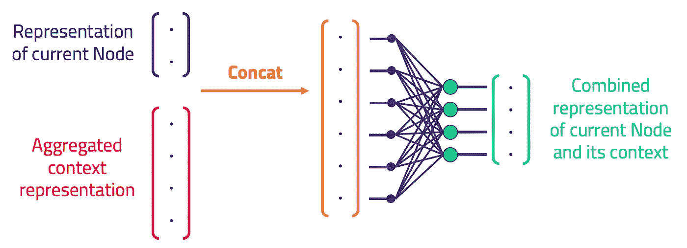

# KGCNs:基于 TensorFlow 的知识图机器学习

> 原文：<https://towardsdatascience.com/kgcns-machine-learning-over-knowledge-graphs-with-tensorflow-a1d3328b8f02?source=collection_archive---------9----------------------->

这个项目引入了一个新颖的模型:*知识图卷积网络* (KGCN)，可以在 Apache 许可下从[的 GitHub repo](https://github.com/graknlabs/kglib/tree/master/kglib/kgcn) 免费使用。它是用 Python 编写的，可以通过 PyPi 的 pip [安装。](https://pypi.org/project/grakn-kglib/)

这项工作[的主要思想是使用](https://blog.grakn.ai/knowledge-graph-convolutional-networks-machine-learning-over-reasoned-knowledge-9eb5ce5e0f68) [TypeDB](https://github.com/vaticle/typedb) 作为知识图，在知识图、自动逻辑推理和机器学习之间建立一座桥梁。

## 摘要

通过监督学习，KGCN 可用于创建任何标记的 TypeDB [事物](https://dev.grakn.ai/docs/concept-api/overview)集合的矢量表示*嵌入*。

1.  KGCN 可以被直接训练用于存储在 TypeDB 中的事物的分类或回归。
2.  未来的工作将包括通过无监督学习构建嵌入。

# 它是用来做什么的？

通常，数据不太适合表格格式。在知识图中存储复杂和相互关联的数据有很多好处，尤其是每个数据点的上下文可以完整地存储。

然而，许多现有的机器学习技术依赖于每个示例的*输入向量的存在。创建这样一个向量来表示知识图中的一个节点是很重要的。*

为了利用机器学习中现有的想法、工具和管道的财富，我们需要一种构建这些向量的方法。通过这种方式，我们可以利用知识图中的上下文信息进行机器学习。

这是 KGCN 能做到的。给定知识图中的一个示例节点，它可以检查该示例、其*上下文*附近的节点。基于这个上下文，它可以确定一个向量表示，例如一个嵌入了的*。*

KGCN 适合完成两种广泛的学习任务

1.  **从知识图进行监督学习以进行预测，例如多类分类(已实施)、回归、链接预测**
2.  **知识图嵌入的无监督创建，例如用于聚类和节点比较任务**

为了构建一个*有用的*表示，KGCN 需要进行一些学习。为此，它需要一个函数来优化。回顾我们可以执行的广泛任务，我们有不同的案例来配置学习:

1.  在受监督的情况下，我们可以针对我们想要执行的确切任务进行优化。在这种情况下，嵌入是学习管道中的过渡张量
2.  为了构建无监督嵌入作为输出，我们优化以最小化图中的一些相似性度量

# 方法学

这个项目背后的意识形态在[这里](https://blog.grakn.ai/knowledge-graph-convolutional-networks-machine-learning-over-reasoned-knowledge-9eb5ce5e0f68)描述，还有一个[的演示视频](https://youtu.be/Jx_Twc75ka0?t=368)。实现的原理基于来自斯坦福 SNAP 小组的 GraphSAGE，经过大量修改后可用于知识图。KGCN 从存储在*类型超图*、**类型数据库**中的上下文数据中学习，而不是处理典型的属性图。此外，它还从 TypeDB 的*自动逻辑推理器*推导出的事实中学习。从这一点开始，假设对 [TypeDB 的文档](https://docs.vaticle.com/)有所了解。

现在，我们介绍关键组件及其交互方式。

# KGCN

KGCN 负责导出一组事物的嵌入(从而直接学习对它们进行分类)。我们从查询 TypeDB 开始，以找到一组带标签的示例。接下来，我们收集关于每个例子的上下文的数据。我们通过递归地考虑它们的邻居，以及它们邻居的邻居，直到 *K* 跳远，来做到这一点。

我们从 TypeDB(上图)中检索关于这个邻域的数据。该信息包括所遇到的每个相邻事物的*类型层次*、*角色*和*属性值*，以及任何推断的邻居(上面用虚线表示)。这些数据被编译成数组，由神经网络接收。

通过操作聚合和组合，为一个事物建立一个单一的矢量表示。这个过程可以递归链接到相邻事物的 K 跳。这为感兴趣的事物构建了一个表示，其中包含从广泛的上下文中提取的信息。

在监督学习中，这些嵌入被直接优化以执行手边的任务。对于多类分类，这是通过将嵌入传递到单个后续密集层并通过 softmax 交叉熵确定损失(针对示例事物的标签)来实现的；然后，优化以尽量减少损失。

一个 KGCN 对象集合了许多子组件，一个上下文构建器、邻居发现器、编码器和嵌入器。

输入管道组件不太有趣，所以我们将跳到有趣的部分。你可以在 [KGCN 的自述](https://github.com/vaticle/kglib/tree/master/kglib/kgcn)中读到其余的内容。

## 嵌入器

为了创建嵌入，我们在 TensorFlow 中构建了一个网络，该网络连续聚合和组合来自 K 跳的特征，直到保留一个“摘要”表示，即嵌入(如下图所示)。

为了创建流水线，嵌入器链聚合并组合所考虑的邻居的 K 跳操作。例如，对于 2 跳的情况，这意味着聚合-组合-聚合-组合。

上图显示了在监督分类的情况下这种链接是如何工作的。

嵌入器负责链接子组件聚合器和组合器，如下所述。

## 集合商

一个*聚合器*(如下图)接受一个事物邻居的子样本的向量表示。它产生一个代表所有这些输入的向量。它必须以一种顺序不可知的方式做到这一点，因为邻居是无序的。为了实现这一点，我们使用一个密集连接的层，以及 *maxpool* 输出(maxpool 是顺序不可知的)。

## 组合器

一旦我们将一个事物的邻居聚合成一个单一的向量表示，我们需要将它与该事物本身的向量表示结合起来。一个*组合器*通过连接两个向量来实现这一点，并使用单个密集连接的层来降低维度。

# 监督 KGCN 分类器

受监督的 KGCN 分类器负责编排实际的学习。它包含一个 KGCN 实例，对于任何使用 KGCN 的学习者，它提供:

*   **训练/评估/预测的方法**
*   从嵌入张量到预测的管道
*   **接受预测和标签的损失函数**
*   乐观主义者
*   反向传播训练循环

必须是提供这些行为的类，因为 KGCN 不与任何特定的学习任务相关联。因此，这门课提供了监督学习框架所需的所有专业知识。

下面是一个稍微简化的程序流程的 UML 活动图。

# 使用 KGCNs 构建

要开始使用 KGCNs 进行构建，请查看自述文件的[快速入门](https://github.com/graknlabs/kglib/tree/master/kglib/kgcn#quickstart)，确保您具备所有要求，并遵循示例[用法](https://github.com/graknlabs/kglib/tree/master/kglib/kgcn#usage)说明，重申如下:

这将帮助您为自己的知识图构建一个多类分类器！存储库中还有一个例子，其中有真实的数据，可以填补模板使用中遗漏的任何空白。

如果您喜欢我们正在做的事情，并且您使用 KGCNs 或对其感兴趣，您可以做几件事情:

*   提交[问题](https://github.com/graknlabs/kglib/issues)以解决您在安装或使用 KGCNs 时遇到的任何问题
*   如果你愿意帮助我们提升这部作品的知名度，就开始回购吧:)
*   在 [Vaticle Discord channel](https://discord.com/invite/vaticle) 上提出问题、提出想法或与我们对话

这篇文章是为[第三个 kglib 预发布](https://github.com/graknlabs/kglib/releases/tag/v0.1a3)而写的，使用了 TypeDB commit `20750ca0a46b4bc252ad81edccdfd8d8b7c46caa`，随后可能会与回购不一致。查看那里的最新消息！