# 旧金山社区中的数据聚类

> 原文：<https://towardsdatascience.com/kickstart-your-first-clustering-project-in-san-francisco-neighborhoods-e258e659440c?source=collection_archive---------12----------------------->

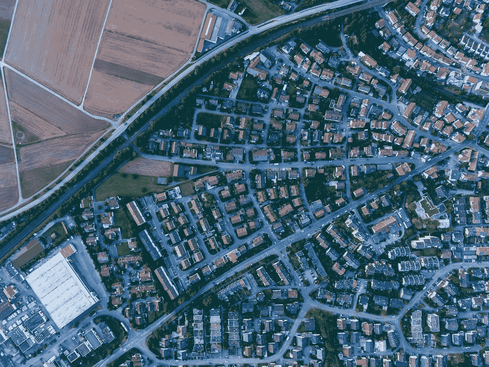

在这个项目中，我们将使用 **Foursquare API** 来探索旧金山的街区，获取每个街区中最常见的场地类别，使用 ***k* -means** 聚类算法来查找相似的街区，使用**follow**库来可视化旧金山的街区及其新兴的集群。

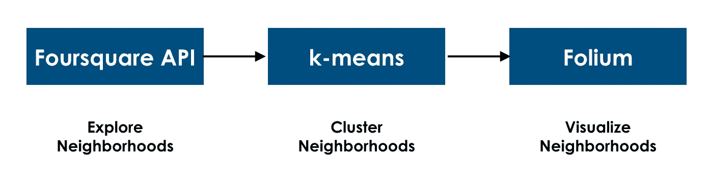

Project Flow

这是我们在这个项目结束时得到的聚类图:

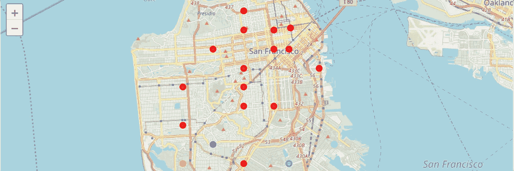

这篇文章的灵感来自 Coursera 上的[应用数据科学顶点](https://www.coursera.org/learn/applied-data-science-capstone/)课程。

# 先决条件:注册 Foursquare 开发者账户

[**Foursquare**](https://foursquare.com/) 是一家建立了海量位置数据数据集的科技公司。通过与 Foursquare 数据库通信并调用它的 API，我们可以检索给定位置周围特定类型的场所或商店。

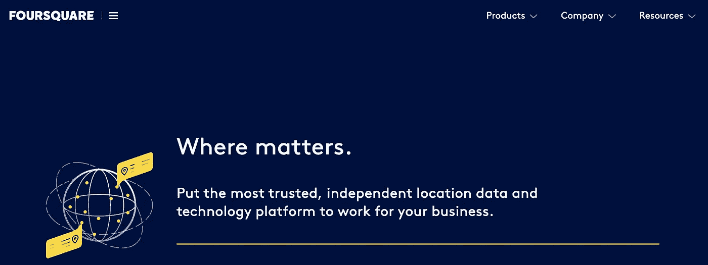

这个项目一个免费账户就够了。创建完帐户后，单击创建新应用程序。标记您的客户端 ID 和客户端密码以备后用。

# 第一步:从网站上搜集邮编和邻居

导入库:

我们抓取下面的页面，[http://www.healthysf.org/bdi/outcomes/zipmap.htm](http://www.healthysf.org/bdi/outcomes/zipmap.htm)，以便获得邮政编码表中的数据，并将数据转换成*熊猫*数据帧。

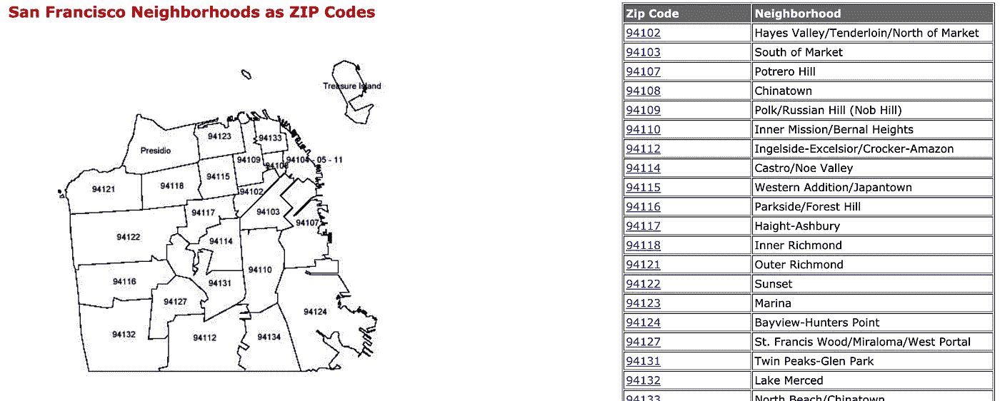

我们删除了不必要的列和行，并将数据分配给新的数据帧`sf_data`。

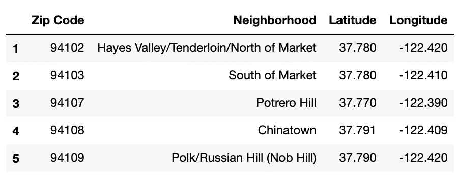

sf_data.head()

我们的数据帧中有 21 行。

# 步骤 2:将地址转换成纬度和经度

为了利用 Foursquare 位置数据，我们需要获得每个邻域的纬度和经度坐标。

我们将使用`uszipcode`，这是一个在 Python 中易于使用的 zipcode 数据库。

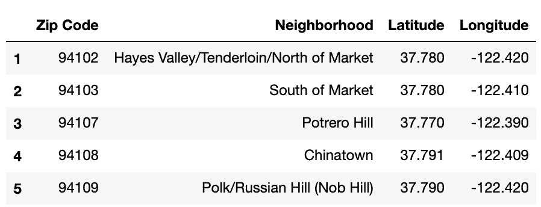

# 第三步:探索旧金山的街区

## 1.创建一张旧金山地图，在上面叠加街区。

使用`geopy`库获得三藩市的纬度和经度值。

旧金山的地理坐标是 37.7792808，-122.4192363。

然后我们使用`folium`库来绘制地图。 [**叶子**](https://python-visualization.github.io/folium/) 既可以将数据绑定到地图上，也可以将丰富的矢量/光栅/HTML 可视化作为标记在地图上传递。

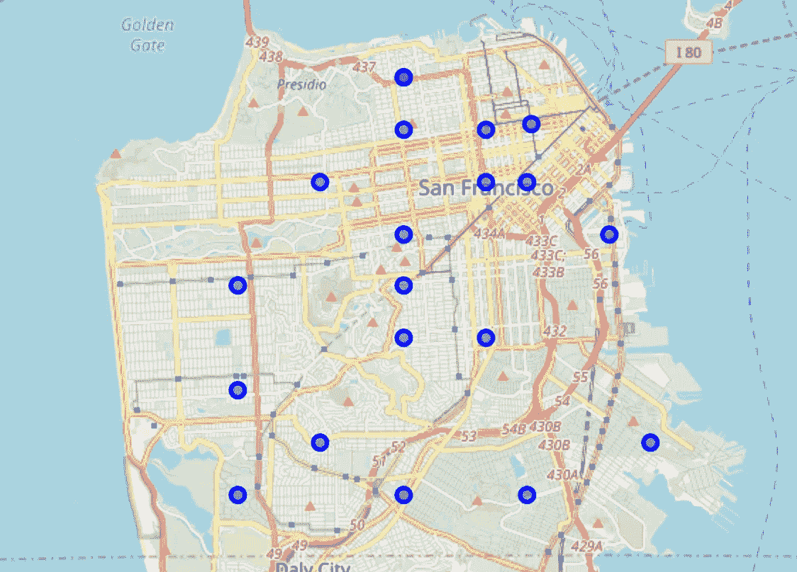

Map of San Francisco with neighborhoods

你可以在这里找到其他更漂亮的 Matplotlib 颜色调色板。

接下来，我们将开始利用 Foursquare API 来探索社区并对其进行细分。

## 2.定义 Foursquare 凭证和版本

## **3。获取 500 米范围内每个社区排名前 100 的场馆。**

对每个邻域运行上面的`getNearbyVenues`函数，并创建一个名为`sf_venues`的新数据帧。

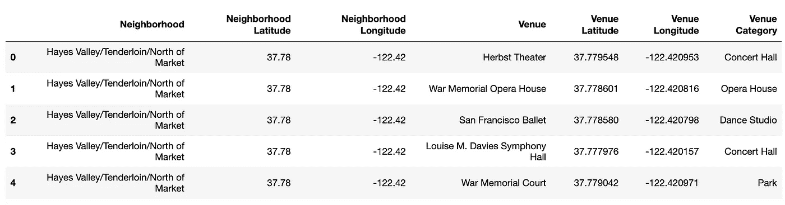

sf_venues

1084 个场地被 Foursquare 退回。

让我们检查一下每个街区返回了多少个场地:

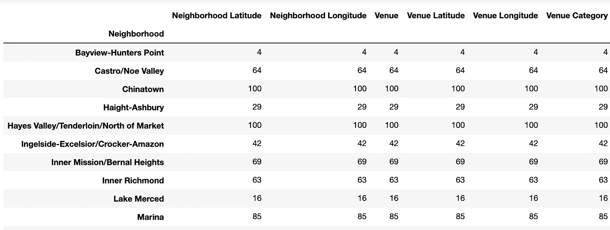

让我们看看有多少独特的类别可以从所有返回的场馆策划。

共有 214 个独特的类别。

# 第四步:分析每个邻居

我们首先将`Venue Category`变量转换成虚拟变量。

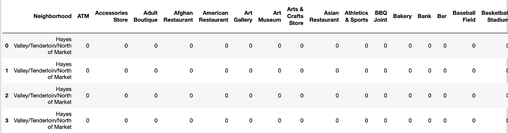

sf_onehot

根据邻近区域和每个场地类别出现频率的平均值对行进行分组。

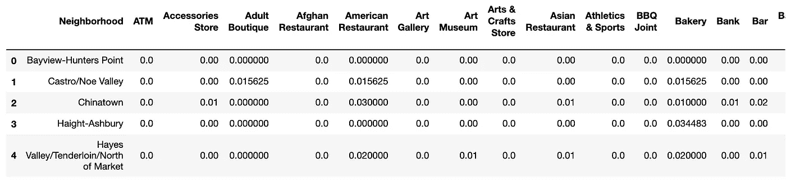

创建一个新的数据框架`return_most_common_venues`并显示每个街区的前 10 个场馆。

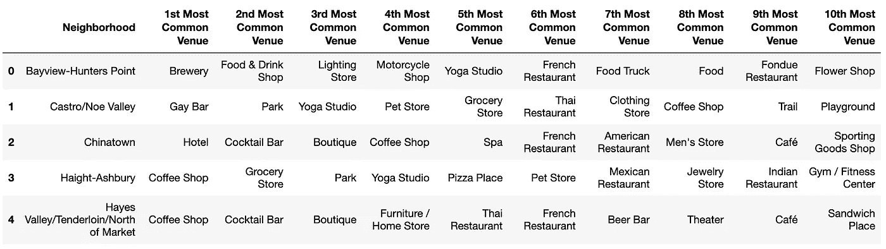

# 第五步:聚集邻居

如果您需要从未标记的数据中快速发现见解，那么`k-means`尤其有用。

运行 k-means 将邻域聚类为 5 个聚类。k-means 会把我们的邻居分成 5 组。就数据集中包含的要素而言，每个聚类中的邻域彼此相似。

KMeans 内部参数的简要汇报:

1.`random_state` : KMeans 是随机的(即使使用相同的输入值运行该函数，结果也可能不同)。为了使结果可重复，可以指定一个 int 来确定随机性。

2.`KMeans.fit()`:用特征矩阵拟合 KMeans 模型。

将原始的`sf_data`数据帧与聚集的`neighborhoods_venues_sorted`数据帧合并。

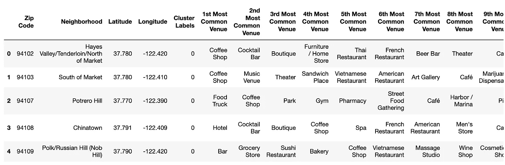

sf_merged

最后，让我们来看一看产生的集群:

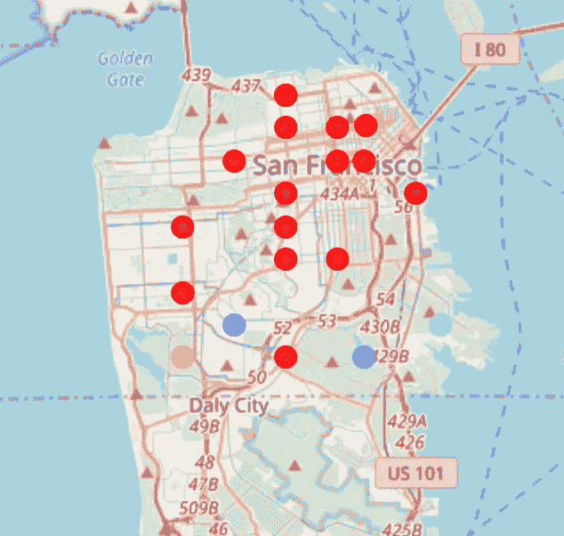

# 步骤 6:检查集群

现在，我们可以检查每个集群，并确定区分每个集群的不同场馆类别。

**集群 1**

聚类 1 中有 16 个邻域。我们可以很容易地注意到，集群 1 中的大多数社区在他们的前 10 个场馆中都有`Coffee Shop`。

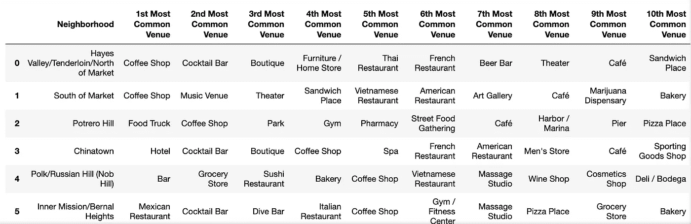

**集群 2**

簇 2 中只有 1 个邻域。

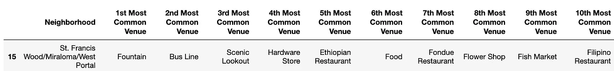

**集群 3**

簇 3 中只有 1 个邻域。

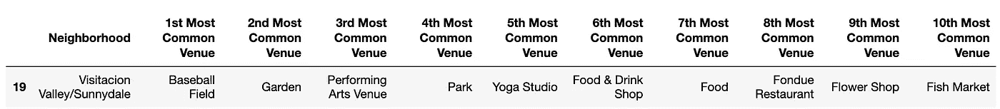

**集群 4**

簇 4 中只有 1 个邻域。

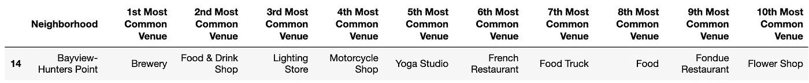

**集群 5**

聚类 5 中有 1 个邻域。

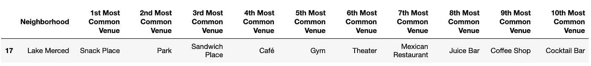

# 结论

因为旧金山只有几个街区，我们无法真正获得有见地的集群。然而，你可以尝试使用更大城市的数据集:[多伦多](https://en.wikipedia.org/wiki/List_of_postal_codes_of_Canada:_M)，[纽约](https://cocl.us/new_york_dataset)。

# 参考

1.  [应用数据科学顶点](https://www.coursera.org/learn/applied-data-science-capstone/)
2.  [uszipcode](https://pypi.org/project/uszipcode/)
3.  [k-means](https://scikit-learn.org/stable/modules/clustering.html#k-means)
4.  [术语“随机状态”在 KMeans](https://stackoverflow.com/a/46108862/8078036) 中是什么意思
5.  [叶子](https://python-visualization.github.io/folium/)