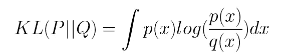
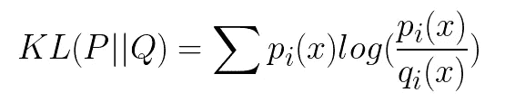
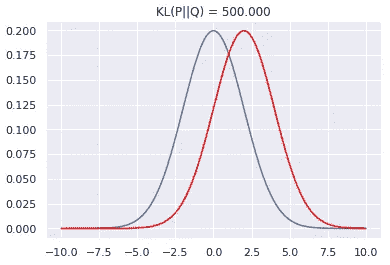
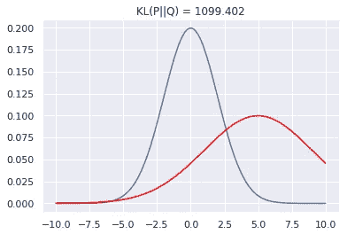
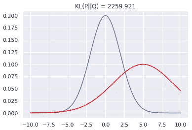
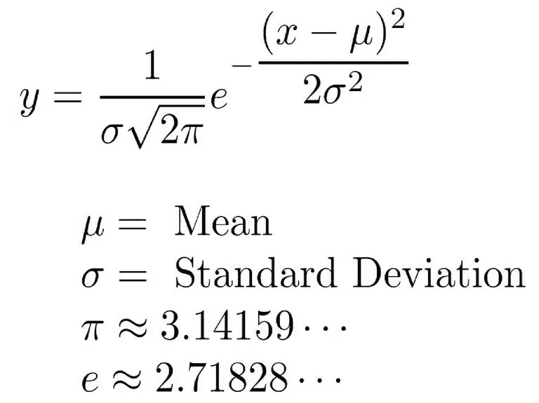
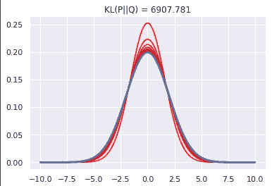
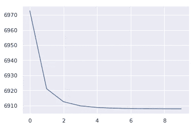

# KL Divergence Python 示例

> 原文：<https://towardsdatascience.com/kl-divergence-python-example-b87069e4b810?source=collection_archive---------1----------------------->


Photo by [Immo Wegmann](https://unsplash.com/@macroman?utm_source=medium&utm_medium=referral) on [Unsplash](https://unsplash.com?utm_source=medium&utm_medium=referral)

随着您作为数据科学家的职业生涯的进展，您将不可避免地遇到 kull back-lei bler(KL)分歧。我们可以把 KL 散度看作距离度量(尽管它是不对称的),它量化了两个概率分布之间的差异。这很有用的一个常见场景是当我们处理一个复杂的发行版时。与直接使用分布相比，我们可以使用另一种具有众所周知特性的分布(即正态分布)来更好地描述数据，从而使我们的生活更加轻松。换句话说，我们可以使用 KL 散度来判断是泊松分布还是正态分布更适合逼近数据。KL 散度也是[高斯混合模型](/gaussian-mixture-models-d13a5e915c8e)和 [t-SNE](/t-sne-python-example-1ded9953f26) 的关键组成部分。

对于**连续随机变量**的分布 P 和 Q，Kullback-Leibler 散度被计算为积分。



另一方面，如果 P 和 Q 表示离散随机变量的概率分布，则 Kullback-Leibler 散度被计算为总和。



# Python 代码

首先，我们导入以下库。

```
import numpy as np
from scipy.stats import norm
from matplotlib import pyplot as plt
import tensorflow as tf
import seaborn as sns
sns.set()
```

接下来，我们定义一个函数来计算两个概率分布的 KL 散度。我们需要确保不包含任何等于 0 的概率，因为 0 的对数是负无穷大。


[https://en.wikipedia.org/wiki/Binary_logarithm](https://en.wikipedia.org/wiki/Binary_logarithm)

```
def kl_divergence(p, q):
    return np.sum(np.where(p != 0, p * np.log(p / q), 0))
```

均值为 0 且标准差为 2 的正态分布与均值为 2 且标准差为 2 的另一分布之间的 KL 散度等于 500。

```
x = np.arange(-10, 10, 0.001)
p = norm.pdf(x, 0, 2)
q = norm.pdf(x, 2, 2)plt.title('KL(P||Q) = %1.3f' % kl_divergence(p, q))
plt.plot(x, p)
plt.plot(x, q, c='red')
```



如果我们测量初始概率分布和另一个平均值为 5、标准差为 4 的分布之间的 KL 散度，我们预计 KL 散度将高于上一个示例。

```
q = norm.pdf(x, 5, 4)plt.title('KL(P||Q) = %1.3f' % kl_divergence(p, q))
plt.plot(x, p)
plt.plot(x, q, c='red')
```



值得注意的是，KL 散度是不对称的。换句话说，如果我们把 P 换成 Q，反之亦然，我们会得到不同的结果。

```
q = norm.pdf(x, 5, 4)plt.title('KL(P||Q) = %1.3f' % kl_divergence(q, p))
plt.plot(x, p)
plt.plot(x, q, c='red')
```



KL 散度越低，两个分布就越接近。因此，在 t-SNE 和高斯混合模型的情况下，我们可以通过最小化一个分布相对于另一个分布的 KL 散度来估计该分布的高斯参数。

## 最小化 KL 散度

让我们看看如何利用梯度下降来最小化两个概率分布之间的 KL 散度。首先，我们创建一个具有已知均值(0)和方差(2)的概率分布。然后，我们用随机参数创建另一个分布。

```
x = np.arange(-10, 10, 0.001)
p_pdf = norm.pdf(x, 0, 2).reshape(1, -1)
np.random.seed(0)
random_mean = np.random.randint(10, size=1)
random_sigma = np.random.randint(10, size=1)
random_pdf = norm.pdf(x, random_mean, random_sigma).reshape(1, -1)
```

假设我们使用梯度下降，我们需要为超参数(即步长、迭代次数)选择值。

```
learning_rate = 0.001
epochs = 100
```

就像`numpy`一样，在`tensorflow`中我们需要为变量分配内存。对于变量`q`，我们使用给定 mu 和 sigma 的正态分布方程，只是我们排除了指数之前的部分，因为我们正在归一化结果。



```
p = tf.placeholder(tf.float64, shape=pdf.shape)
mu = tf.Variable(np.zeros(1))
sigma = tf.Variable(np.eye(1))
normal = tf.exp(-tf.square(x - mu) / (2 * sigma))
q = normal / tf.reduce_sum(normal)
```

就像之前一样，我们定义一个函数来计算 KL 散度，它排除了概率等于零的情况。

```
kl_divergence = tf.reduce_sum(
    tf.where(p == 0, tf.zeros(pdf.shape, tf.float64), p * tf.log(p / q))
)
```

接下来，我们初始化`GradientDescentOptimizer`类的一个实例，并使用 KL divergence 函数作为参数调用`minimize`方法。

```
optimizer = tf.train.GradientDescentOptimizer(learning_rate).minimize(kl_divergence)
```

只有在运行`tf.global_variables_initializer()`之后，变量才会保持我们声明它们时设置的值(即`tf.zeros`)。

```
init = tf.global_variables_initializer()
```

tensorflow 中的所有操作都必须在一个会话中完成。在前面的代码块中，我们使用梯度下降来最小化 KL 散度。

```
with tf.Session() as sess:
    sess.run(init)

    history = []
    means = []
    variances = []

    for i in range(epochs):
        sess.run(optimizer, { p: pdf })

        if i % 10 == 0:
            history.append(sess.run(kl_divergence, { p: pdf }))
            means.append(sess.run(mu)[0])
            variances.append(sess.run(sigma)[0][0])

    for mean, variance in zip(means, variances):
        q_pdf = norm.pdf(x, mean, np.sqrt(variance))
        plt.plot(x, q_pdf.reshape(-1, 1), c='red')plt.title('KL(P||Q) = %1.3f' % history[-1])
    plt.plot(x, p_pdf.reshape(-1, 1), linewidth=3)
    plt.show()

    plt.plot(history)
    plt.show()

    sess.close()
```

然后，我们绘制不同时间点的概率分布和 KL 散度。

