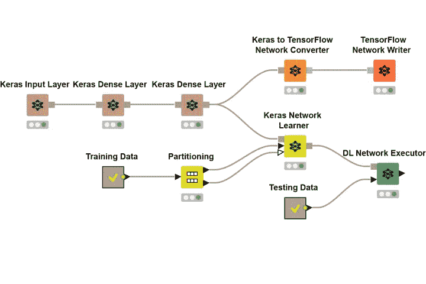
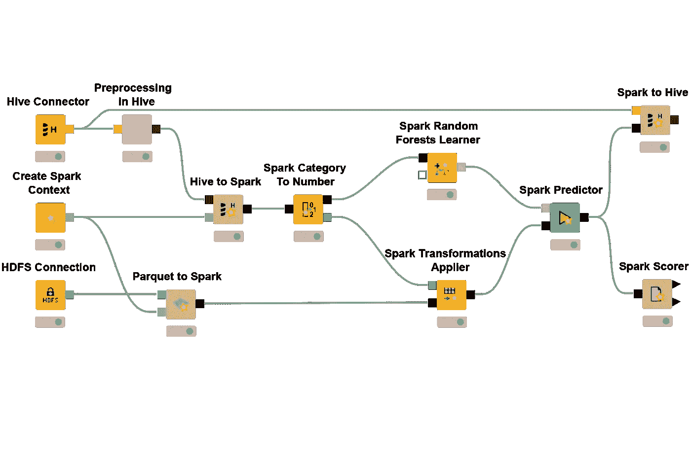

# KNIME 分析平台是机器学习和统计的“杀手级应用”

> 原文：<https://towardsdatascience.com/knime-desktop-the-killer-app-for-machine-learning-cb07dbef1375?source=collection_archive---------11----------------------->

## 数据科学|机器学习|数据可视化

## 一个免费、简单、开源的数据工具？是的，请！

> **免责声明:**
> 
> 我现在在 KNIME 工作，是一名数据科学家/数据工程师！大约在我申请 KNIME 的一年前，我写了这篇文章。这篇文章的标题和内容是(现在仍然是)我的个人观点。
> 
> 史蒂文·波特

如果您以任何身份处理数据，请继续并帮自己一个忙:在此[下载 KNIME 分析平台。](https://www.knime.com/downloads/download-knime)

More data science, less slamming of the mouse and keyboard.

# 什么是 KNIME 分析平台？

KNIME Analytics Platform 是我迄今为止发现的最强大、最全面的拖放分析、机器学习、统计和 ETL 免费平台。既没有付费墙也没有锁定功能的事实意味着进入的障碍是不存在的。

所有主要提供商都可以使用数据源连接器(内部和云上),从而可以轻松地在不同环境之间移动数据。SQL Server 到 Azure？没问题。谷歌床单到亚马逊红移？当然，为什么不呢？应用机器学习算法并过滤/转换结果如何？你被保护了。

Big data? Small data? Doesn’t matter too much provided that your computer has a solid CPU and 16+ GB RAM.

同样值得一提的是，该社区非常活跃。KNIME 的开发人员和产品负责人是一个很好的合作伙伴，论坛非常活跃。

我可以深入快速入门教程或展示一些更高级的功能，但老实说，它使用起来非常直观。文档直接集成到桌面客户端，用户界面非常简单，UX 很好地融合了复杂性/可定制性(如果需要)和用户友好性。

# 我可以用 KNIME 分析平台做什么？

KNIME 分析平台非常适合以下情况:

*   ETL 过程(将数据从这里移动到那里并清理)
*   机器学习
*   深度学习
*   自然语言处理
*   API 集成
*   交互式视觉分析(某种程度上是测试版功能)

# 有什么条件？

KNIME 分析平台是 100%免费的。在 knime.com 的[可以很容易地获得文档，并且有很多对平台的免费扩展。只要你是每次程序运行时点击“Go”的那个人，你就不用付一分钱。永远不会。这就是使用植根于学术界的软件包的好处。](http://knime.com)

如果您想安排工作流，KNIME Server 是一个高级产品，它允许在其他特性中安排进程。基本层 KNIME Server Small 在 AWS 上的价格大约是每小时 1.67 美元。如果您在 EC2 实例上托管 KNIME 服务器，并安排一个 [cron 作业](https://docs.aws.amazon.com/AmazonECS/latest/developerguide/scheduled_tasks.html)来打开和关闭实例，这是一个 ***非常*** 划算的选择。

KNIME 服务器的更高层允许使用 [REST API](https://www.knime.com/blog/the-knime-server-rest-api) 和 [WebPortal](https://www.knime.com/knime-software/knime-webportal) 。这些功能允许您自动部署工作流，从另一个服务远程执行工作流，并为用户创建一个交互式中心。自动化工作流的能力使 KNIME Server Medium 成为一个有吸引力的选择。如果您购买了带有 BYOL 选项的最高层(KNIME Server Large ),那么您就可以使用同一个许可证来托管服务器的多个实例。

# 我如何学习 KNIME 分析平台？

他们的学习页面是[这里是](https://www.knime.com/resources)，但是如果你精通数据，那么只需下载该平台并尝试一两件事。只要将一些数据加载到应用程序中，剩下的就很直观了，可以从应用程序中访问文档。将节点从“节点资源管理器”拖到视图上。有一个搜索栏…尝试搜索“Excel”并从那里开始。